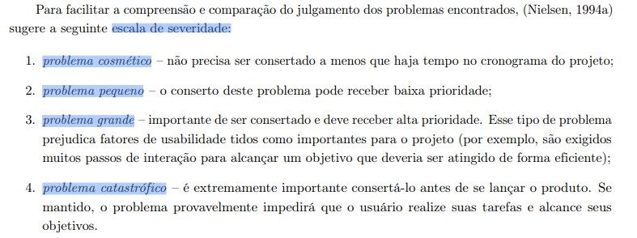

# Relato dos Resultados: Acesso ao resultado de imagem com visualizador DICOM

## Tabela de contribuição
| Artefato(s) | Autor(es) |
| --- | --- |
| Relato dos Resultados: Acesso ao resultado de imagem com visualizador DICOM | [Philipe Amancio](https://github.com/Phill-Chill) |

---

## 1. Introdução

Este documento apresenta os resultados da avaliação conceitual referente à tarefa de **Acesso ao resultado de imagem com visualizador DICOM**. A validação foi conduzida pelo avaliador **Philipe** com o objetivo de verificar se os artefatos construídos (Análise de Tarefas, Cenários e Storyboards) refletem adequadamente o modelo mental e o fluxo real executado pelos usuários.

O escopo desta avaliação focou no cenário em que o usuário (representado pela persona do paciente proativo), após receber a notificação de resultados, acessa o portal do Sabin. O fluxo validado abrange a tentativa inicial de ler o laudo em PDF, a transição para o visualizador de imagens DICOM web e a utilização intuitiva de ferramentas de manipulação de imagem (como *Contraste* e *Zoom*) para compreender visualmente o laudo antes da consulta de retorno.

### 1.1 Entrevista
A seguir está a gravação da entrevista:

  <iframe width="560" height="315" src="https://www.youtube.com/embed/8siYAwGelU0" title="Gravação da Entrevista" frameborder="0" allow="accelerometer; autoplay; clipboard-write; encrypted-media; gyroscope; picture-in-picture" allowfullscreen></iframe>

---

## 2. Tarefas Executadas e Sumário dos Dados

### 2.1. Tarefas Avaliadas
A **Tabela 1** detalha a decomposição do objetivo principal da avaliação em tarefas menores. Esses passos representam as ações sequenciais modeladas pela equipe para serem validadas com o usuário:

Tabela 1 - Decomposição do objetivo em tarefas

| ID | Tarefa Mapeada |
|----|---------|
| T1 | Acessar o portal do Sabin de resultados |
| T2 | Localizar e abrir o laudo textual em PDF |
| T3 | Abrir o visualizador de imagens DICOM integrado ao portal |
| T4 | Aplicar o recurso de "Contraste" para diferenciar tecidos/ossos |
| T5 | Utilizar a ferramenta de "Zoom" na região indicada pelo laudo |
| T6 | Uso da ferramenta de medição na região indicada |
| T7 | Encerrar a visualização e fechar o sistema |

### 2.2. Sumário Quantitativo dos Dados
A **Tabela 2** apresenta o sumário quantitativo dos dados consolidados a partir das sessões de avaliação. Essas métricas fornecem uma visão objetiva sobre a precisão dos modelos construídos, quantificando divergências, sugestões de adição e níveis de concordância:

Tabela 2 - Sumário da Validação dos Artefatos

| Métrica | Resultado |
|----------|-----------|
| Número de participantes | 1 |
| Passos sugeridos pelos usuários não previstos no modelo | 0|
| Tarefas mapeadas consideradas irreais/desnecessárias pelos usuários | 0 |
| Inconsistências apontadas no Storyboard/Cenário | 0 |
| Comentários relevantes registrados | 1 |

### 2.3. Divergências e Inconsistências Observadas
A **Tabela 3** detalha os pontos em que o fluxo desenhado pela equipe divergiu da realidade do usuário. As inconsistências estão mapeadas de acordo com o momento da narrativa ou da árvore de tarefas em que ocorreram:

Tabela 3 - Inconsistências encontradas por tarefa/momento

| Não foram ressaltadas divergências ou inconsistências pela entrevistada|
| --- |

### 2.4. Comentários Relevantes dos Participantes
A **Tabela 4** reúne as citações diretas e os comentários mais expressivos feitos pelos participantes durante a validação. Esses relatos complementam as métricas, evidenciando como o usuário realmente pensa em comparação a como o sistema foi idealizado:

Tabela 4 - Comentário do entrevistado

| Participante | Comentários |
|-------------|------------|
| Juliana | "Fazer uma tradução da linguagem médica" e "Utilizar IA para auxilio da interpretação do laudo é uma solução interessante, mas através de modelos especializados"|

---

## 3. Relato da Interpretação e Análise dos Dados

Nesta seção são apresentados os resultados obtidos durante a avaliação conceitual e sua relação com os objetivos definidos no planejamento.

### 3.1. Análise das Perguntas Exploratórias

| Pergunta Exploratória | Evidências Observadas na Entrevista | Conclusão |
|----------------------|----------------------|------------|
| **Fase A: Perfil e Aquecimento** | | |
| Qual é o seu nome, idade e profissão? | Juliana, 20 anos e estudante | Respondida |
| Como você avalia a sua facilidade no uso de tecnologia, sites e aplicativos de saúde no seu dia a dia? | Acima do esperado | Respondida |
| Quando você faz um exame, você costuma acessar o portal do laboratório para ver o resultado antes de voltar ao médico, ou prefere esperar a consulta? | Prefere consultar antes da consulta | Respondida |
| **Fase B: Validação do Cenário** | | |
| Ao ler a descrição em texto deste cenário, a situação descrita retrata a realidade da sua rotina? | Sim | Respondida |
| O cenário cita o uso de Inteligência Artificial para ajudar a "traduzir" o laudo. Esse novo comportamento de usar a IA incentiva você a acessar suas próprias imagens e resultados antes de falar com o médico? | Sim | Respondida|
| **Fase C: Validação do Storyboard** | | |
| Ao observar esta história em quadrinhos que ilustra o paciente acessando e tentando entender a imagem do exame, ela reflete o que você faria na prática? | Sim | Respondida |
| A forma como o personagem interage com o portal para baixar ou salvar a imagem para levar na próxima consulta condiz com a sua expectativa? | Prefere acessar o exame na consulta, ao invés de baixar ou salvar | Respondida  |
| **Fase D: Validação de HTA** | | |
| Analisando o passo a passo que desenhamos para "Acessar a Imagem do Exame", essa sequência lógica parece natural para você como paciente? | **Não respondida por falta da representação em diagrama** |  Não respondida |
| Há alguma etapa, como "instalar plugin" ou "ajustar configurações avançadas", que você acharia muito complicada ou desnecessária para o seu uso? | **Não respondida por falta da representação em diagrama** |  Não respondida |
| Você sente falta de algum passo essencial? | **Não respondida por falta da representação em diagrama** |  Não respondida |
| **Fase E: Validação de CTT** | | |
| Neste diagrama, indicamos que você pode alternar entre "Ler o Laudo (texto)" e "Visualizar a Imagem" a qualquer momento. Na prática, você costuma ler o laudo primeiro para tentar entender, ou vai direto olhar a imagem? | Ler primeiro o laudo | Respondida |
| Mapeamos que ferramentas como "Dar zoom" e "Ajustar Contraste" estão disponíveis. Como paciente, você usaria essas ferramentas por curiosidade, ou acha que elas deveriam ficar escondidas apenas para o médico usar? | Deveria também estar disponível para os pacientes | Respondida |
| Ao terminar de ver a imagem, nós colocamos a ação de simplesmente "Fechar". Você sentiria a necessidade de um aviso confirmando que "O arquivo já está salvo no seu histórico"? | Sim | Respondida |

### 3.2. Principais Achados

#### Aspectos Positivos (Validados)
* O cenário de acessar o exame antes da consulta reflete fielmente a realidade da paciente.
* A paciente concorda com a disponibilização de ferramentas avançadas (como zoom e contraste) para leigos curiosos.

#### Divergências Encontradas (Refutações)
* Mesmo com o uso de IA para facilitar o entendimento, a entrevistada relatou que não utilizaria a visualização de imagem interativa de forma profunda.

#### Novos Descobrimentos (Omissões)
* **Não foram ressaltados omissões**

### 3.3. Considerações Gerais
A avaliação demonstrou que o modelo de disponibilizar o laudo e ferramentas interativas é válido, mas traz um ponto de atenção: a utilização de modelos gerais de IA para auxiliar no entendimento da enfermidade pode gerar ansiedade. Isso torna necessário repensar o sistema para incluir modelos especializados que garantam interpretações do laudo com orientações assertivas e seguras para o paciente.

---

## 4. Lista de Problemas de Modelagem Encontrados

| ID | Descrição da Inconsistência | Artefato Afetado | Frequência | Severidade | Impacto na Modelagem | Possível Causa | Prioridade |
|----|----------------------|------------------------|------------|------------|----------------------------------|----------------|------------|
| P01 | O uso de IA de forma genérica gera ansiedade na paciente | Cenário e Storyboard | 1 participante | Grande | Quebra a confiança e piora a experiência emocional do paciente | Uso de IA sem delimitação de escopo no roteiro | Alta |
| P02 | Impossibilidade de validar o fluxo hierárquico | Diagrama HTA | 1 participante | Grande | Artefato HTA não validado empiricamente | Material não apresentado à entrevistada | Alta |

### 4.1. Critérios de Severidade (Adaptados para Validação de Artefatos)
Os problemas encontrados nos modelos foram classificados adaptando a escala de severidade para o contexto de validação conceitual (BARBOSA; SILVA, 2021, p. 284).[PRINT] 

* **Cosmético:** Erro de digitação, falha visual no storyboard ou nomenclatura estranha que não invalida o fluxo.
* **Pequeno:** Omissão de um detalhe menor ou passo opcional na árvore de tarefas.
* **Grande:** Omissão de um passo fundamental, ordem incorreta de execução, ou cenário que reflete mal o contexto de uso real.
* **Catastrófico:** O diagrama ou narrativa não representa em absolutamente nada a forma como o usuário realiza a tarefa na vida real. Artefato inválido.

### 4.2. Priorização das Correções
Com base na severidade e no impacto na modelagem, as ações de correção foram priorizadas da seguinte forma:

1. **Prioridade Alta (P01):** Restringir o escopo da IA no Cenário e Storyboard. Essa correção é urgente, pois a IA genérica afeta diretamente a segurança e a experiência emocional da paciente.
2. **Prioridade Alta (P02):** Apresentar e validar o diagrama HTA. Essa lacuna metodológica impede atestar se a decomposição hierárquica das tarefas bate com o modelo mental do usuário.
---

## 5. Planejamento para o Refinamento dos Artefatos

Nesta seção são apresentadas as propostas de correção e atualização dos documentos conceituais (Análise de Tarefas, Cenários e Storyboards) com base nas validações feitas pelos usuários (BARBOSA; SILVA, 2021, p. 279).[PRINT] 

### 5.1. Recomendações de Ajuste

| Inconsistência Relacionada | Refinamento Proposto | Justificativa |
|---------------------|---------------------|--------------|
| P01 |Especificar o uso de um modelo de IA especializado em educação em saúde, **integrado ao visualizador DICOM**. A IA deve atuar como um guia na imagem, focando exclusivamente em explicar o problema de forma conceitual e visual, bloqueando qualquer interpretação de autodiagnóstico. | A usuária relatou que a interpretação livre pela IA pode gerar ansiedade. A orientação deve ser visual (usando o DICOM) e focada no entendimento anatômico, e não em conclusões clínicas. |
| P02 | Reagendar uma validação assíncrona ou considerar a lógica do CTT como base para a prototipação. | O diagrama HTA não pôde ser validado na sessão por falta de material visual. |

### 5.2. Ajustes nos Modelos de Tarefas
A seguinte alteração deverá ser aplicada ao diagrama conceitual:

* **Ajuste no diagrama HTA proposto:** Desenvolver e enviar a representação visual do HTA para validação assíncrona com a usuária, visando preencher a lacuna metodológica do problema P02.

### 5.3. Ajustes nos Cenários e Storyboards
Descrever melhorias para tornar as narrativas mais coerentes com o contexto, motivação e reações reais observadas nas entrevistas.

* **Melhoria no Cenário:** Refatorar a narrativa para deixar claro que o sistema utiliza uma IA educacional que orienta a navegação no visualizador DICOM. A IA deve, por exemplo, destacar a área do tendão na imagem de forma didática quando o laudo for lido, guiando o paciente visualmente sem emitir nenhum tipo de conclusão clínica.

### 5.4. Priorização das Refatorações

| Prioridade | Artefato a ser Atualizado | Problema Relacionado |
|------------|-------------------|---------------------|
| Alta | Reescrever a narrativa do Cenário e as falas do Storyboard para refletir o modelo de IA especializado guiando o usuário dentro do visualizador DICOM. | P01 |

### 5.5. Considerações Finais
Os resultados obtidos demonstram o nível de fidelidade dos artefatos construídos em relação ao fluxo real executado pela usuária. A validação confirmou que o fluxo principal está correto. As correções propostas focam em ajustar a narrativa de uso da Inteligência Artificial, garantindo uma abordagem educacional e segura antes que a equipe avance para as fases de prototipação.

---

## Referência Bibliográfica
> BARBOSA, S. D. J. et al. Interação Humano-Computador e Experiência do Usuário. 1. ed. Rio de Janeiro: Autopublicação, 2021.

---

## Histórico de Versão

| Versão | Data | Descrição | Autores | Data Revisão | Descrição Revisão | Revisores |
| :---: | :---: | :--- | :--- | :---: | :--- | :--- |
| 1.0 | 30/05/2026 | Elaboração do relato sobre Visualizador de imagem DICOM | Philipe | - | Revisão do relato | - |