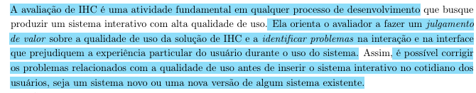
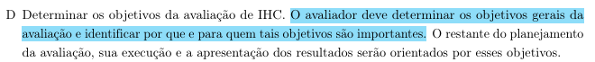
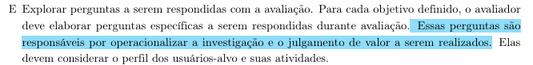
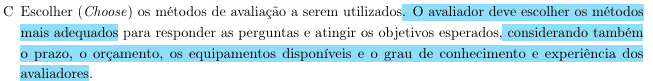
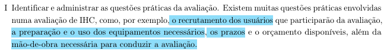

## Rastreabilidade
|Artefato(s) | Autore(s)|
| --- | --- |
| Página de Planejamento da Avaliação da Análise de Tarefas | Philipe |
| [Planejamento: Acesso ao resultado de imagem com visualizador DICOM](PlanejamentosAvalGrupo/PlanejamentoPhilipe.md) | Philipe |
| [Planejamento: Agendamento de exames com dúvidas críticas de preparo](PlanejamentosAvalGrupo/PlanajamentoMaria.md) | Maria Laura |
| [Planejamento: Cadastro de exame laboratorial com informação incompleta](PlanejamentosAvalGrupo/PlanejamentoHugo.md) | Hugo |
| [Planejamento: Acompanhamento de resultados e download de laudos](PlanejamentosAvalGrupo/PlanejamentoIngrid.md) | Ingrid |

# Introdução
A análise de Tarefas é um passo crucial para compreender como os usuários organizam e executam suas atividades no mundo real. Este documento detalha o planejamento da avaliação dos diagramas e especificações produzidos na etapa de Análise de Tarefas do Portal Sabin, artefatos estes que representam os fluxos e as ações necessárias para o usuário atingir seus objetivos no sistema. O propósito primordial de avaliar este escopo é validar se os modelos de tarefas criados pela equipe — como os diagramas HTA (Análise Hierárquica de Tarefas) — correspondem à realidade, ao contexto e ao modelo mental dos usuários. Com isso, busca-se identificar passos ausentes, fluxos incorretos ou gargalos na interação precocemente, ainda na fase do modelo conceitual (BARBOSA; SILVA, 2021, p. 275)[PRINT] .

 Para conduzir essa etapa, a equipe optou por adotar o método de investigação, especificamente por meio da condução de **Entrevistas**. Essa escolha metodológica justifica-se por permitir uma exploração aprofundada das opiniões, rotinas e expectativas dos participantes, validando os fluxos desenhados de forma direta e garantindo que o sistema seja moldado pelas reais necessidades do público-alvo.

# Metodologia

O planejamento da avaliação será estruturado com base no framework DECIDE, que define o processo de uma avaliação de IHC se baseando nos seguintes passos:

- **D:** determinar os objetivos da avaliação.
- **E:** explorar perguntas a serem respondidas com a avaliação.
- **C:** (choose) escolher os métodos de avaliação.
- **I:** identificar e gerir as questões práticas da avaliação.
- **D:** decidir como lidar com as questões éticas.
- **E:** (evaluate) avaliar, interpretar e apresentar os resultados.

---

## D - Objetivo da Avaliação

O objetivo desta avaliação é validar a **apropriação de tecnologia pelos usuários**, e identificar eventuais **problemas na interação e na interface** na fase do modelo conceitual (BARBOSA; SILVA, 2021, p. 294)[PRINT] . Dessa forma, buscaremos validar se os artefatos produzidos na Análise de Tarefas correspondem ao contexto e às necessidades dos usuários.

## E - Perguntas Exploratórias

Essas perguntas são responsáveis por operacionalizar a investigação e o julgamento de valor a serem realizados (BARBOSA; SILVA, 2021, p. 294)[PRINT] . Elas devem considerar o perfil dos usuários-alvo e suas atividades.

## C - Escolha do Método

Para atestar se a Análise de Tarefas reflete a realidade do usuário, nossa equipe optou pela técnica de **Entrevista**(BARBOSA; SILVA, 2021, p. 294)[PRINT] . Esse método investigativo servirá como ferramenta de validação com o entrevistado, permitindo capturar suas expectativas, opiniões e padrões de comportamento. Com esse formato, asseguramos que a validação do artefato seja guiada por evidências reais do usuário.

---

## I - Identificar as Questões Práticas 

Nesta etapa do framework DECIDE, são definidos os procedimentos organizacionais e os recursos necessários para a execução da avaliação (BARBOSA; SILVA, 2021, p. 294)[PRINT] . Para esta etapa, os participantes serão selecionados com base nas características descritas no [Perfil de Usuário](../../../requisitos/perfilDeUsuario.md) elaboradas para o projeto.

As entrevistas serão realizadas na modalidade **presencial**. Serão utilizados os artefatos da Análise de Tarefas (impressos ou exibidos em um Notebook/Tablet), papel e caneta para anotações, além de equipamento de vídeo. Durante as sessões, a equipe poderá assumir as seguintes responsabilidades funcionais:

* **Avaliador/Condutor:** Responsável por apresentar os materiais, orientar o participante e seguir o roteiro da entrevista lado a lado com o usuário.
* **Anotador:** Responsável por documentar comentários, dificuldades e comportamentos observados. É dever crítico do avaliador/anotador **listar todos os problemas encontrados no fluxo lógico e priorizar a correção dos problemas não resolvidos**.
* **Cinegrafista:** Responsável por gravar toda a entrevista, documentando a sessão mediante consentimento explícito.

Por fim, antes de iniciar as sessões oficiais, será conduzido um **Teste Piloto** para verificar se o roteiro, o vocabulário, o tempo estimado e os equipamentos estão adequados para a avaliação real. Fica estabelecido que **o resultado do teste piloto NÃO será apresentado no relatório final de resultados da avaliação**.

As entrevistas oficiais seguirão o cronograma abaixo:

| Responsável pela Sessão | Participante | Data | Horário | Local de Realização |
| :--- | :--- | :--- | :--- | :--- |
| [Hugo Freitas Silva](https://github.com/HugoFreitass) | Pedro Henrique Ferreira Xavier | 26/05/2026| 12:10 - 12:40 | UnB - FCTE (sala s9) |
| [Maria Laura Regis](https://github.com/Maria-Laura-Regis)  | Alessandra Peloso | 23/05/2026 | 12:00 - 12:40 | Sudoeste |

Os planejamento das avaliações das análises das tarefas estão abaixo:

| Responsável pela Sessão | Planejamento da avaliação da análise da tarefa |
| :--- | :--- |
| [Philipe Amancio](https://github.com/Phill-Chill) | [Acesso ao resultado de imagem com visualizador DICOM](../AnaliseDeTarefas/PlanejamentosAvalGrupo/PlanejamentoPhilipe.md)| 
| [Maria Laura Regis](https://github.com/Maria-Laura-Regis) | [Agendamento de exames com dúvidas críticas de preparo](../AnaliseDeTarefas/PlanejamentosAvalGrupo/PlanajamentoMaria.md) |
| [Hugo Freitas Silva](https://github.com/HugoFreitass) | [Cadastro de exame laboratorial com informação incompleta no sistema](../AnaliseDeTarefas/PlanejamentosAvalGrupo/PlanejamentoHugo.md)|
| Nathan | - |
| [Ingrid Alves](https://github.com/alvesingrid)| [Acompanhamento de resultados e download de laudos durante o pré-natal](../AnaliseDeTarefas/PlanejamentosAvalGrupo/PlanejamentoIngrid.md) |

---

## D - Questões Éticas

Antes da realização das atividades, os participantes deverão concordar com o [Termo de Consentimento](../../../requisitos/Aspectoseticos.md) elaborado na seção de Aspectos Éticos. Asseguramos formalmente que **os participantes da avaliação serão respeitados e não podem ser prejudicados direta ou indiretamente, nem durante os experimentos, nem após a divulgação dos resultados da avaliação** (BARBOSA; SILVA, 2021, p. 294)[PRINT] . Todo o procedimento preservará o anonimato e a privacidade dos dados coletados.

## E - Avaliar, Interpretar e Apresentar os Resultados

Após a coleta, os dados serão interpretados para identificar quebras de expectativa, falhas de usabilidade e dificuldades de interação (BARBOSA; SILVA, 2021, p. 294)[PRINT] . 

Para garantir a padronização, a **estrutura do relatório do resultado da avaliação** deverá conter:
1. Os objetivos da avaliação;
2. Uma breve descrição do método utilizado na avaliação;
3. O número e o perfil de avaliadores e dos participantes;
4. As tarefas executadas pelos participantes;
5. Uma lista detalhada dos problemas encontrados (priorizando a correção);
6. O feedback geral dos usuários.

## Referências Bibliográficas

* **BARBOSA, S. D. J.; SILVA, B. S. (2011).** *Interação Humano-Computador*. Rio de Janeiro: Elsevier.

## Histórico de Versão

| Versão | Data | Descrição | Autores | Data Revisão | Descrição Revisão | Revisores |
| :---: | :---: | :--- | :--- | :---: | :--- | :--- |
| 1.0 | 19/05/2026 | Criação do documento | [Philipe Amancio](https://github.com/Phill-Chill) | 19/05/2026 | Revisão da estrutura inicial e adequação ao framework DECIDE | [Hugo Freitas Silva](https://github.com/HugoFreitass) e [Maria Laura Regis](https://github.com/Maria-Laura-Regis) |