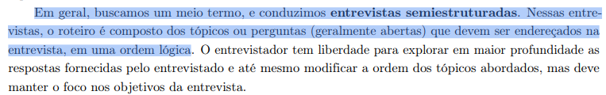

## Tabela de Contribuição

|Artefato(s) | Autore(s)|
| --- | --- |
| Página de Planejamento da Avaliação do Storyboard | [Hugo Freitas Silva](https://github.com/HugoFreitass) |

# Introdução

Este documento apresenta o planejamento da avaliação do storyboard desenvolvido para representar a interação dos usuários com o sistema proposto. A avaliação tem como objetivo verificar se o storyboard comunica de forma clara e coerente os cenários de uso, as ações dos usuários e o contexto das atividades retratadas, além de identificar possíveis problemas de compreensão, inconsistências ou oportunidades de melhoria antes das etapas posteriores do projeto. Dessa maneira, busca-se garantir que o storyboard cumpra seu papel como artefato de comunicação e validação dos requisitos e das soluções propostas para os usuários do sistema.

# Metodologia

Para estruturar esse planejamento, será utilizado o framework DECIDE, amplamente empregado em avaliações de Interação Humano-Computador (IHC), que orienta a definição dos objetivos da avaliação, das questões a serem investigadas, dos métodos a serem empregados, dos aspectos práticos e éticos envolvidos, bem como da forma de análise e apresentação dos resultados (BARBOSA; SILVA, 2021, p. 280).[PRINT]  

Oframework DECIDE define o processo de uma avaliação de IHC se baseando nos seguintes passos:

- **D:** determinar os objetivos da avaliação.
- **E:** explorar perguntas a serem respondidas com a avaliação.
- **C:** (choose) escolher os métodos de avaliação.
- **I:** identificar e gerir as questões práticas da avaliação.
- **D:** decidir como lidar com as questões éticas.
- **E:** (evaluate) avaliar, interpretar e apresentar os resultados.

---

## D - Objetivo da Avaliação

O objetivo desta avaliação é validar a **apropriação de tecnologia pelos usuários**, além de identificar possíveis **problemas de no fluxo da tarefa representada,** ainda na fase do modelo conceitual.  

A avaliação buscará verificar se o Storyboard representa corretamente:

- o contexto real de uso;
- as necessidades e expectativas dos usuários;
- o fluxo de execução das tarefas;
- as dificuldades encontradas durante a interação;
- a clareza das informações apresentadas.

Além disso, pretende-se identificar se os usuários conseguem compreender intuitivamente as ações necessárias para atingir seus objetivos ao longo do fluxo representado no Storyboard.

---

## E - Perguntas Exploratórias

Essas perguntas são responsáveis por operacionalizar a investigação e o julgamento de valor a serem realizados. Elas consideram o perfil dos usuários-alvo e suas atividades no sistema.

### Perguntas do Roteiro da Entrevista

1. O fluxo apresentado no Storyboard parece compatível com a forma como você realizaria essa atividade no mundo real?
2. Em algum momento do fluxo você ficou confuso sobre o que deveria fazer?
3. As informações apresentadas nos desenhos foram suficientes para entender as ações disponíveis?
4. Houve alguma etapa que pareceu desnecessária ou excessivamente complicada?
5. Os termos utilizados no Storyboard são claros e compreensíveis?
6. Existe alguma etapa que você faria de maneira diferente?
7. O fluxo apresentado transmite segurança e confiança para realizar a tarefa?
8. Você acredita que conseguiria concluir essa atividade sozinho utilizando o sistema?
9. Qual foi a principal dificuldade encontrada durante a visualização do Storyboard?
10. O que mais chamou sua atenção de forma positiva no fluxo apresentado?
11. Há alguma funcionalidade ou informação que você acredita estar faltando?
12. O Storyboard representa adequadamente suas necessidades e expectativas?
13. Você teria alguma sugestão para melhorar a experiência apresentada?

---

## C - Escolha do Método

### Estratégia de Investigação: A Entrevista

Para validar o Storyboard, a equipe optou pela técnica de **Entrevista**. Esse método investigativo permitirá compreender como os usuários interpretam os fluxos apresentados, além de identificar dificuldades, ambiguidades e inconsistências no modelo conceitual.

A entrevista será conduzida de forma **semiestruturada**, permitindo que os participantes expressem livremente suas opiniões, experiências e expectativas durante a análise do Storyboard. Dessa forma, asseguramos que a validação do artefato seja baseada em evidências reais do usuário(BARBOSA; SILVA, 2021, p. 145).[PRINT] 

---

## I - Identificar as Questões Práticas 

Nesta etapa do framework DECIDE, são definidos os procedimentos organizacionais e os recursos necessários para a execução da avaliação (BARBOSA; SILVA, 2021, p. 294)[PRINT] . Para esta etapa, os participantes serão selecionados com base nas características descritas no [Perfil de Usuário](../../../requisitos/perfilDeUsuario.md) elaboradas para o projeto.

As entrevistas serão realizadas na modalidade **presencial**. Serão utilizados os [Storyboards](../../../AvaliacaoDesenvolvimento/Nivel01/Storyboard/Storyboard.md) (impressos ou exibidos em um Notebook/Tablet), papel e caneta para anotações, além de equipamento de vídeo. Durante as sessões, a equipe assumirá as seguintes responsabilidades funcionais:

### Avaliadores

| Avaliador | Papel |
|------------|---------|
| [Hugo Freitas Silva](https://github.com/HugoFreitass) | Condutor da entrevista |
| [Maria Laura Regis](https://github.com/Maria-Laura-Regis) | Observador e responsável pelos registros |
| [Philipe Amancio](https://github.com/Phill-Chill) | Consolidação e análise dos resultados |

Por fim, antes de iniciar as sessões oficiais, será conduzido um **Teste Piloto**, para verificar se o roteiro, o vocabulário, o tempo estimado e os equipamentos estão adequados para a avaliação real. Fica estabelecido que **o resultado do teste piloto NÃO será apresentado no relatório final de resultados da avaliação**.

### Teste piloto: Segunda-Feira, dia 25/05/2026

As entrevistas oficiais seguirão o cronograma abaixo:

| Responsável pela Sessão | Participante | Data | Horário | Local de Realização |
| :--- | :--- | :--- | :--- | :--- |
| [Hugo Freitas Silva](https://github.com/HugoFreitass) | Pedro Henrique Ferreira Xavier | 26/05/2026| 12:10 - 12:40 | UnB - FCTE (sala s9) |
| [Maria Laura Regis](https://github.com/Maria-Laura-Regis)  | Alessandra Peloso | 27/05/2026 | 12:00 - 12:40 | Sudoeste |

#### 1. Escopo e Correlação dos Artefatos
Vale ressaltar que a **quantidade de storyboards avaliados será igual à quantidade de integrantes do grupo**. Além disso, garantimos a rastreabilidade do projeto: **cada Storyboard estará diretamente relacionado às tarefas previamente definidas na [Análise de Tarefas](../../../requisitos/analisedetarefa.md)**.

#### 2. Definição dos Participantes
Os participantes serão selecionados com base nas características descritas no Perfil de Usuário e nas Personas elaboradas para o projeto.  

Os participantes deverão possuir familiaridade mínima com o contexto do sistema avaliado, permitindo que suas observações representem situações reais de uso.

#### 3. Organização das Sessões
Será responsabilidade da equipe registrar:

- dificuldades recorrentes;
- pontos de confusão;
- sugestões de melhoria;
- problemas de usabilidade identificados;
- inconsistências entre o fluxo esperado e a percepção do usuário.

#### 4. Recursos e Condições de Execução
As entrevistas serão realizadas de forma **presencial**, em ambiente confortável e livre de interrupções.

* **Modalidade:** Presencial.
* **Ferramentas e Equipamentos Utilizados:**  
  - Storyboards impressos ou exibidos em Notebook/Tablet;  
  - Smartphone ou gravador de voz para registrar a sessão (mediante consentimento);  
  - Papel e caneta para anotações;  
  - Cronômetro para controle do tempo da entrevista.

#### 5. Planejamento das Sessões e Teste Piloto
Antes da realização das sessões oficiais, será conduzido um **Teste Piloto**.  

O objetivo do teste piloto é verificar:

- clareza do roteiro de entrevista;
- adequação do vocabulário utilizado;
- tempo médio da sessão;
- funcionamento dos equipamentos;
- compreensão do Storyboard pelos participantes.

Fica estabelecido que **os dados obtidos no teste piloto não serão incluídos no relatório final da avaliação**.

---

## D - Questões Éticas

Antes da realização das entrevistas, os participantes deverão concordar com o [Termo de Consentimento Livre e Esclarecido (TCLE)](../../../requisitos/Aspectoseticos.md).

A equipe assegura que:

- a participação será voluntária;
- os participantes poderão desistir a qualquer momento;
- os dados coletados serão utilizados exclusivamente para fins acadêmicos;
- a identidade e a privacidade dos participantes serão preservadas;
- nenhum participante sofrerá prejuízo direto ou indireto em decorrência da avaliação.

Além disso, todas as gravações e anotações serão armazenadas de forma segura e acessadas apenas pela equipe responsável pela avaliação.

---

## E - Avaliar, Interpretar e Apresentar os Resultados

Após a realização das entrevistas, os dados coletados serão analisados de forma qualitativa, buscando identificar padrões de comportamento, dificuldades recorrentes, pontos de confusão e oportunidades de melhoria no Storyboard. Os resultados serão interpretados à luz dos objetivos definidos neste planejamento e apresentados em um relatório específico, contendo as evidências obtidas, as análises realizadas e as recomendações decorrentes da avaliação. A estrutura do relato foi definida detalhadamente e pode ser encontrada neste documento: 

### Link para o planejamento do relato dos resultados:
[Planejamento do Relato dos Resultados do Storyboard](PlanejamentoDosResultados.md)

## Referências Bibliográficas

> BARBOSA, S. D. J. et al. Interação Humano-Computador e Experiência do Usuário. 1. ed. Rio de Janeiro: Autopublicação, 2021.

## Histórico de Versão

| Versão | Data | Descrição | Autores | Data Revisão | Descrição Revisão | Revisores |
| :---: | :---: | :--- | :--- | :---: | :--- | :--- |
| 1.0 | 19/05/2026 | Criação do documento | [Hugo Freitas Silva](https://github.com/HugoFreitass) | 19/05/2026 | Revisão da estrutura inicial e adequação ao framework DECIDE |  [Philipe Amancio](https://github.com/Phill-Chill) e [Maria Laura Regis](https://github.com/Maria-Laura-Regis) |
| 1.1 | 23/05/2026 | Revisão de objetivos, links e adição de referências | [Hugo Freitas Silva](https://github.com/HugoFreitass) | 24/05/2026 | - |  [Philipe Amancio](https://github.com/Phill-Chill) |