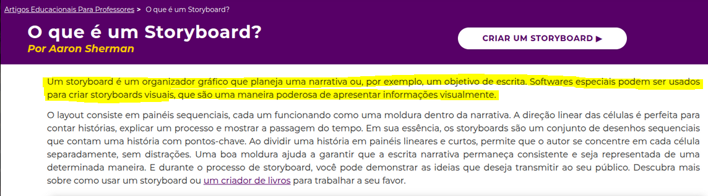
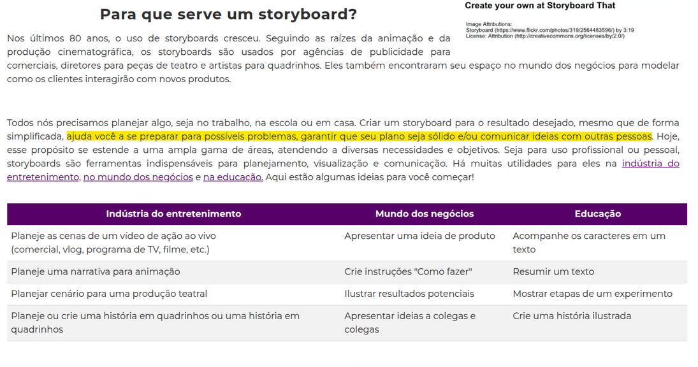
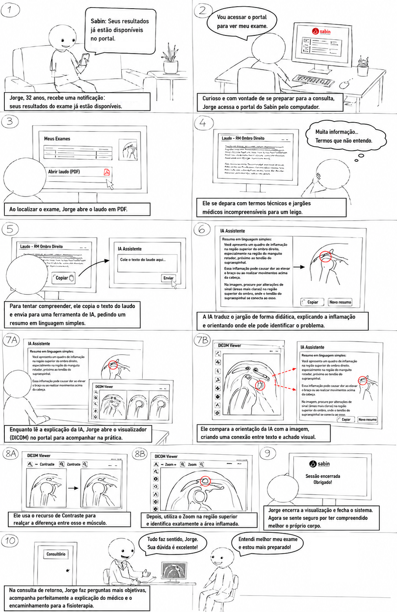

# Storyboards do Projeto

## Tabela de contribuição

| Artefato(s) | Autor(es) |
| --- | --- |
| Página de Storyboards da Equipe | [Maria Laura Regis](https://github.com/Maria-Laura-Regis) |
| Primeiro Storyboard | [Maria Laura Regis](https://github.com/Maria-Laura-Regis) |
| Segundo Storyboard | [Hugo Freitas Silva](https://github.com/HugoFreitass) |
| Terceiro Storyboard | [Philipe Amancio](https://github.com/Phill-Chill) |
| Quarto Storyboard | [Ingrid Alves](https://github.com/alvesingrid) |

---

## 1. Introdução

Um **storyboard** é uma representação visual que ilustra uma narrativa, um processo ou um cenário de uso. Segundo Sherman (StoryboardThat, 2023)[PRINT], o layout consiste em painéis sequenciais, cada um funcionando como uma moldura dentro da narrativa. Essa estrutura permite visualizar o fluxo de interação, identificar possíveis problemas antecipadamente e garantir que a proposta seja comunicada de forma consistente aos demais membros da equipe e stakeholders.

Para a avaliação e o reprojeto do Portal Sabin, os storyboards foram fundamentais para modelar como os usuários interagem com as funcionalidades existentes, permitindo validar percepções e fluxos antes da transição para protótipos de alta fidelidade.

### Posicionamento no Ciclo de Vida de Mayhew

No **Ciclo de Vida de Mayhew** (BARBOSA; SILVA, 2021, p. 110)[PRINT], o desenvolvimento de sistemas interativos é organizado em três grandes fases: **Análise de Requisitos**, **Design, Avaliação e Desenvolvimento**, e **Instalação**. Os Storyboards e a Avaliação de Análise de Tarefas integram o **Nível 1** da fase de **Design, Avaliação e Desenvolvimento**, conforme ilustrado abaixo:

| Fase Mayhew | Nível | Artefato desta seção |
|------------|-------|----------------------|
| Design, Avaliação e Desenvolvimento | **Nível 1** — Modelo conceitual e avaliação de alternativas de design | Storyboards, Análise de Tarefas, Cenários |
| Design, Avaliação e Desenvolvimento | Nível 2 | Protótipo de Papel |
| Design, Avaliação e Desenvolvimento | Nível 3 | Protótipo de Alta Fidelidade |

Neste nível, o objetivo é **validar o modelo conceitual** do sistema junto aos usuários — verificando se as narrativas, fluxos e estrutura de tarefas mapeados pela equipe correspondem ao modelo mental e às necessidades reais dos participantes. Os problemas identificados nesta etapa orientam o redesign dos fluxos antes que qualquer tela seja prototipada, reduzindo retrabalho nas etapas seguintes.

## 2. Para que serve um Storyboard?

O uso de storyboards vai muito além da produção cinematográfica. De acordo com o (StoryboardThat, 2023)[PRINT], eles são ferramentas indispensáveis para planejamento, visualização e comunicação. Eles servem para:

* **Modelar a interação:** Mostrar como os clientes ou usuários interagem com produtos existentes ou propostos.
* **Planejar fluxos:** Criar instruções do tipo "como fazer" (passo a passo).
* **Identificar riscos:** Preparar a equipe para possíveis problemas antes da implementação, tornando o plano mais sólido.
* **Comunicação:** Ilustrar resultados potenciais para colegas e clientes.

---

## 3. Storyboards da Equipe

Nesta seção, apresentamos os storyboards desenvolvidos pela equipe para o Portal Sabin. Eles representam os fluxos de tarefas essenciais, conforme modelado em nossos diagramas de Análise de Tarefas.

### 3.1. Primeiro Storyboard

> Elaborado por: [Maria Laura Regis](https://github.com/Maria-Laura-Regis)

Este storyboard ilustra o **Cenário 02 — Pré-agendamento de exames com dúvidas críticas de preparo**, tendo como persona central **Márcia**, servidora pública de 55 anos que centraliza a rotina médica de toda a família. A narrativa representa a jornada de Márcia ao tentar agendar exames de sangue para ela e para o marido pelo portal do Sabin, deparando-se com informações genéricas de preparo que não respondem à sua dúvida específica sobre o uso de medicação contínua para hipertensão. Conforme ilustrado na Figura 1, o fluxo evidencia os pontos de fricção que levam a persona a abandonar o fluxo automatizado e recorrer ao atendimento humano via WhatsApp.

**Figura 1 — Pré-agendamento de Exames com Dúvidas Críticas de Preparo**

>Fonte: Autoria própria.

---

### 3.2. Segundo Storyboard

> Elaborado por: [Hugo Freitas Silva](https://github.com/HugoFreitass)

Este storyboard também ilustra o **Cenário 02 — Pré-agendamento de exames com dúvidas críticas de preparo**, sob a perspectiva da persona **Márcia**. A narrativa representa a mesma jornada de agendamento, com foco nos pontos de atrito gerados pela ausência de orientações claras e personalizadas sobre preparo, reforçando os problemas identificados no fluxo automatizado do portal. Conforme ilustrado na Figura 2, o storyboard complementa a visão do Cenário 02 ao destacar aspectos da experiência que motivam o abandono do canal digital.

**Figura 2 — Pré-agendamento de Exames com Dúvidas Críticas de Preparo**

>Fonte: Autoria própria.

---

### 3.3. Terceiro Storyboard

> Elaborado por: [Philipe Amâncio](https://github.com/Phill-Chill)

Este storyboard narra a experiência de Jorge ao receber uma notificação informando que seus resultados estão disponíveis no portal do Sabin. A história começa com a motivação de Jorge para se preparar para a consulta de retorno e a barreira inicial que ele encontra: um laudo médico repleto de termos técnicos incompreensíveis.

A narrativa ilustra a solução de Jorge para essa frustração: o uso de Inteligência Artificial para traduzir o jargão para uma linguagem simples. Em seguida, o storyboard foca na interação de Jorge com as ferramentas digitais do portal do Sabin. Motivado pela explicação da IA, ele utiliza o visualizador de imagens DICOM e aplica, de forma intuitiva, as ferramentas de Contraste e Zoom para identificar visualmente a inflamação em seu ombro.

O storyboard encerra na consulta de retorno, demonstrando o resultado desejado: Jorge comparece seguro, com dúvidas objetivas e preparado para compreender perfeitamente o diagnóstico e o plano de tratamento do seu médico

**Figura 3 — Acesso ao Resultado de Imagem com Visualizador DICOM**

>Fonte: Autoria própria.

---

### 3.4. Quarto Storyboard

> Elaborado por: [Ingrid Alves](https://github.com/alvesingrid)

Este storyboard ilustra o **Cenário 04 — Acompanhamento de resultados e download de laudos durante o pré-natal**, tendo como persona central **Camila**, professora de 29 anos grávida de 24 semanas. A narrativa representa a jornada de Camila ao tentar acessar, no intervalo de suas aulas, o resultado urgente de sua Curva Glicêmica e enviá-lo à obstetra. Conforme ilustrado na Figura 4, o fluxo evidencia como a fragmentação dos arquivos de resultado — que exige o download de três PDFs separados para um único exame seriado — gera atrito e carga de trabalho desnecessária, mesmo que a tarefa principal seja concluída com sucesso.

**Figura 4 — Acompanhamento de Resultados e Download de Laudos durante o Pré-natal**

>Fonte: Autoria própria.

---

## Referências Bibliográficas

* **STORYBOARDTHAT.** *O que é um Storyboard?* Por Aaron Sherman. Disponível em: <https://www.storyboardthat.com/pt/articles/e/o-que-%C3%A9-um-storyboard>. Acesso em: 19 mai. 2026.

---

## Histórico de Versão

| Versão | Data | Descrição | Autores | Data Revisão | Descrição Revisão | Revisores |
| :---: | :---: | :--- | :--- | :---: | :--- | :--- |
| 1.0 | 18/05/2026 | Criação do documento | [Maria Laura Regis](https://github.com/Maria-Laura-Regis) | 18/05/2026 | Revisão da estrutura inicial e do conteúdo + adição das imagens | [Hugo Freitas Silva](https://github.com/HugoFreitass) |
| 1.1 | 23/05/2026 | Correções conceituais, padronização ABNT das figuras e vinculação dos storyboards aos cenários e personas do projeto | [Maria Laura Regis](https://github.com/Maria-Laura-Regis) | 23/04 | | |
| 1.2 | 23/06/2026 | Adição do posicionamento no Ciclo de Vida de Mayhew na seção de Introdução | [Ingrid Alves](https://github.com/alvesingrid) | - | - | - |