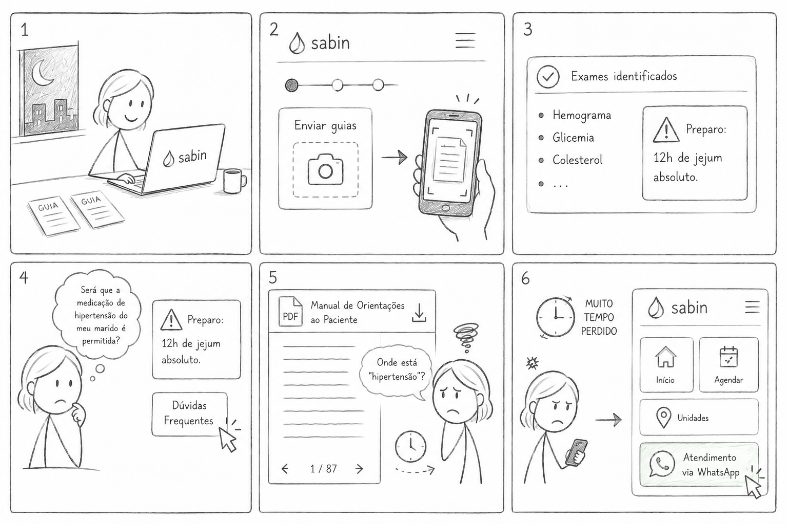
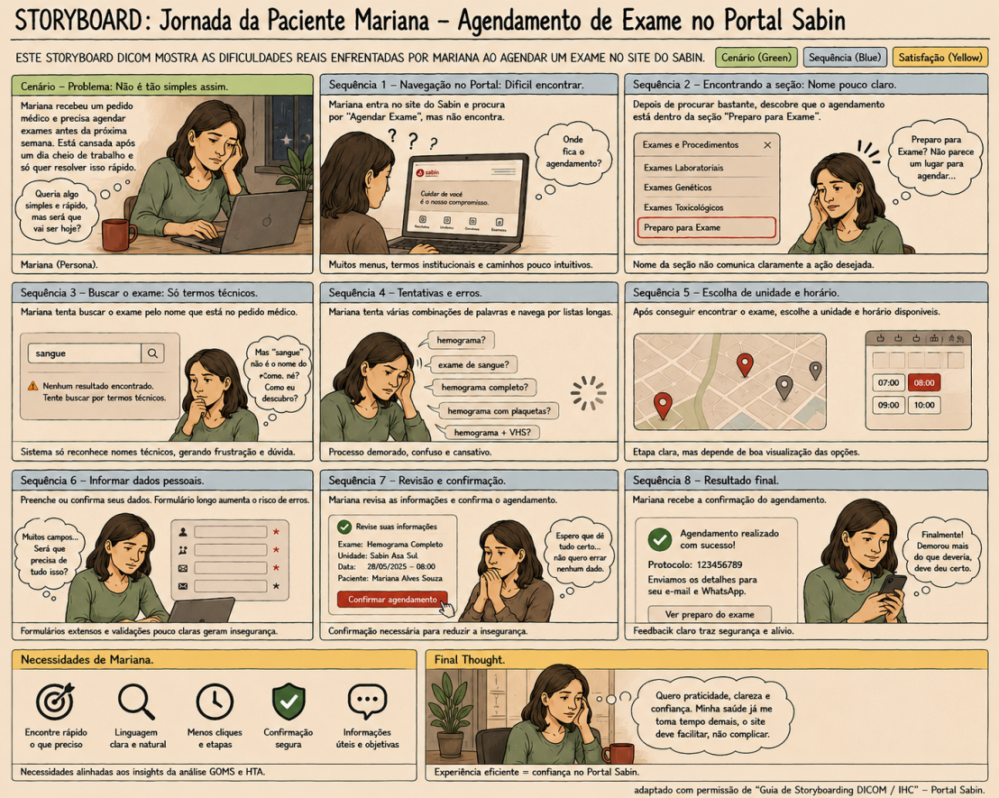
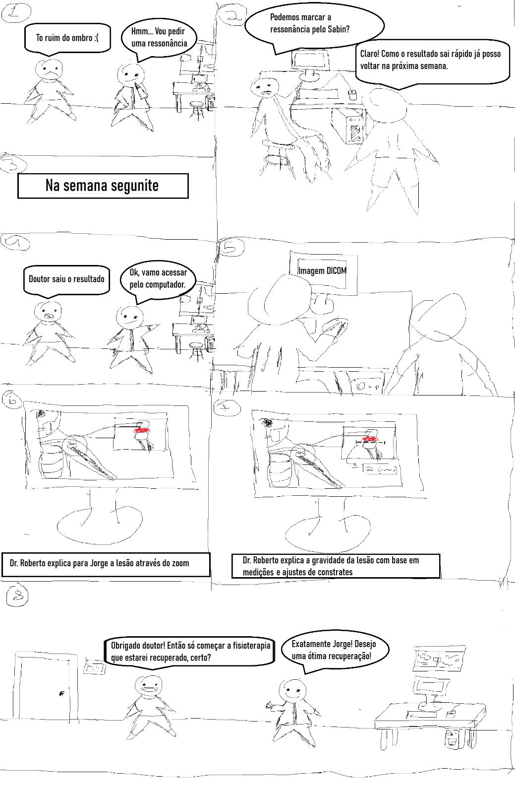
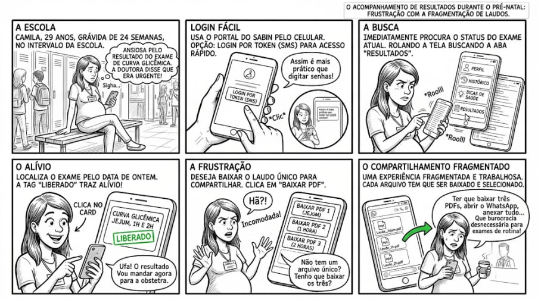

# Storyboards do Projeto

## Rastreabilidade
|Artefato(s) | Autore(s)|
| --- | --- |
| Página de Storyboards da Equipe | [Maria Laura Regis](https://github.com/Maria-Laura-Regis) |
| Primeiro Storyboard | [Maria Laura Regis](https://github.com/Maria-Laura-Regis) |
| Segundo Storyboard | [Hugo Freitas Silva](https://github.com/HugoFreitass) |
| Terceiro Storyboard | [Philipe Amancio](https://github.com/Phill-Chill) |
| Quarto Storyboard  | [Ingrid Alves](https://github.com/alvesingrid) |

## 1. Introdução
Um **storyboard** é um organizador gráfico que planeja uma narrativa, um processo ou uma ideia de escrita. Segundo Sherman  (StoryboardThat, 2023)[PRINT] , o layout consiste em painéis sequenciais, cada um funcionando como uma moldura dentro da narrativa. Essa estrutura permite visualizar o fluxo de interação, identificar possíveis problemas antecipadamente e garantir que a proposta seja comunicada de forma consistente aos demais membros da equipe e stakeholders.

Para o desenvolvimento do Portal Sabin, os storyboards foram fundamentais para modelar como os usuários interagem com as novas funcionalidades, permitindo validar o fluxo antes da transição para protótipos de alta fidelidade.

## 2. Para que serve um Storyboard?
O uso de storyboards vai muito além da produção cinematográfica. De acordo com o (StoryboardThat, 2023)[PRINT] , eles são ferramentas indispensáveis para planejamento, visualização e comunicação. Eles servem para:

* **Modelar a interação:** Mostrar como os clientes ou usuários interagem com novos produtos.
* **Planejar fluxos:** Criar instruções do tipo "Como fazer" (passo a passo).
* **Identificar riscos:** Preparar a equipe para possíveis problemas antes da implementação, tornando o plano mais sólido.
* **Comunicação:** Ilustrar resultados potenciais para colegas e clientes.

---

## 3. Storyboards da Equipe
Nesta seção, apresentamos os storyboards desenvolvidos pela equipe para o Portal Sabin. Eles representam os fluxos de tarefas essenciais, conforme modelado na nossa Análise Hierárquica de Tarefas (HTA).

### 3.1. [Primeiro storyboard]
>Elaborada por: Maria Laura Regis
O Storyboard representa o fluxo do Ctt 1.1 (tarefa de agendamento de exames com dúvidas críticas de preparo).

### 3.2. [Segundo storyboard]
>Elaborada por: Hugo Freitas Silva
O Storyboard representa o fluxo da tarefa de agendamento de exames com dúvidas críticas de preparo

### 3.3. [Terceiro storyboard]
>Elaborada por: Philipe Amâncio
O Storyboard representa o fluxo da tarefa de ccesso ao resultado de imagem com visualizador DICOM

### 3.4. [Quarto storyboard]
>Elaborada por: Ingrid Alves
O Storyboard representa o fluxo da tarefa de acompanhamento de resultados e download de laudos durante o pré-natal

---

## Referências Bibliográficas

* **STORYBOARDTHAT.** *O que é um Storyboard?* Por Aaron Sherman. Disponível em: <https://www.storyboardthat.com/pt/articles/e/o-que-%C3%A9-um-storyboard>. Acesso em: 19 mai. 2026.

---
## Histórico de Versão
| Versão | Data | Descrição | Autores | Data Revisão | Descrição Revisão | Revisores |
| :---: | :---: | :--- | :--- | :---: | :--- | :--- |
| 1.0 | 18/05/2026 | Criação do documento | [Maria Laura Regis](https://github.com/Maria-Laura-Regis) | 1/05/2026 | Revisão da estrutura inicial e do conteúdo + adição das imagens | [Hugo Freitas Silva](https://github.com/HugoFreitass) |

