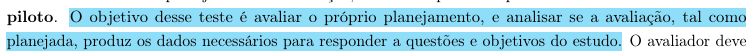

# Planejamento da avaliação do Protótipo de Papel

## Tabela de Contribuição

| Artefato(s) | Autor(es) |
| --- | --- |
| Página de Planejamento da Avaliação do Protótipo de Papel | [Ingrid Alves](https://github.com/alvesingrid) |

## Introdução

Este documento apresenta o planejamento da avaliação do Protótipo de Papel desenvolvido para o Portal Sabin. A avaliação tem como objetivo verificar se as soluções de design representadas no protótipo de baixa fidelidade atendem às necessidades e expectativas dos usuários, além de identificar problemas de usabilidade, inconsistências de navegação e oportunidades de melhoria antes da elaboração do protótipo de alta fidelidade (BARBOSA; SILVA, 2021, p. 358)[PRINT] .

Para conduzir essa etapa, a equipe adotou o método de **Avaliação por Observação**, especificamente por meio da técnica de **Teste de Usabilidade com Protótipo de Papel**.

## Metodologia

O planejamento da avaliação será estruturado com base no framework DECIDE:

- **D:** determinar os objetivos da avaliação.
- **E:** explorar perguntas a serem respondidas com a avaliação.
- **C:** (choose) escolher os métodos de avaliação.
- **I:** identificar e gerir as questões práticas da avaliação.
- **D:** decidir como lidar com as questões éticas.
- **E:** (evaluate) avaliar, interpretar e apresentar os resultados.

---

## D - Objetivo da Avaliação

O objetivo desta avaliação é identificar **problemas de usabilidade** nas soluções propostas pelo Protótipo de Papel, verificando se as telas e fluxos de navegação permitem que os usuários concluam suas tarefas de forma eficaz, eficiente e satisfatória (BARBOSA; SILVA, 2021, p. 294)[PRINT] . Especificamente, a avaliação buscará:

- Verificar se os fluxos de navegação do protótipo são intuitivos e correspondem ao modelo mental dos usuários;
- Identificar telas, elementos ou rótulos que causem confusão ou hesitação;
- Avaliar se as soluções propostas resolvem os problemas identificados na Análise de Tarefas e no Storyboard;
- Coletar sugestões de melhoria diretamente dos usuários.

## E - Perguntas Exploratórias

Essas perguntas operacionalizam a investigação e o julgamento de valor a serem realizados (BARBOSA; SILVA, 2021, p. 294)[PRINT] .

1. O usuário conseguiu concluir a tarefa proposta sem auxílio do avaliador?
2. Em quais momentos o usuário demonstrou hesitação ou confusão?
3. Os rótulos, botões e elementos de navegação foram compreendidos intuitivamente?
4. O fluxo de telas corresponde à sequência esperada pelo usuário para realizar a tarefa?
5. Houve alguma etapa que o usuário tentou realizar de forma diferente da prevista no protótipo?
6. O usuário conseguiu identificar onde estava no sistema a qualquer momento da navegação?
7. Alguma informação necessária para a conclusão da tarefa estava ausente ou difícil de encontrar?
8. O usuário expressou satisfação ou frustração em algum momento específico?
9. Há alguma funcionalidade que o usuário esperava encontrar e não estava presente no protótipo?
10. O usuário conseguiu recuperar-se de eventuais erros de navegação sem auxílio?

## C - Escolha do Método

Para avaliar o Protótipo de Papel, a equipe optou pela técnica de **Avaliação por Observação** com **Teste de Usabilidade** (BARBOSA; SILVA, 2021, p. 294)[PRINT] . Nessa técnica, o avaliador assume o papel de "computador humano" (*human computer*), manipulando as telas do protótipo conforme as ações do participante.

Essa abordagem foi escolhida por permitir:

- **Observação direta** das dificuldades de interação sem influenciar as ações do usuário;
- **Feedback imediato** sobre problemas de navegação e rótulos;
- **Custo-benefício**: alta geração de insights com baixo investimento de tempo e recursos;
- **Iteração rápida**: os problemas identificados podem ser corrigidos no protótipo antes da próxima sessão.

---

## I - Identificar as Questões Práticas

Nesta etapa do framework DECIDE, são definidos os procedimentos organizacionais e os recursos necessários para a execução da avaliação (BARBOSA; SILVA, 2021, p. 294)[PRINT] . Os participantes serão selecionados com base nas características descritas no [Perfil de Usuário](../../../requisitos/perfilDeUsuario.md).

As sessões serão realizadas na modalidade **presencial**. Serão utilizados os protótipos de papel, papel e caneta para anotações, e equipamento de vídeo. Durante as sessões, a equipe assumirá as seguintes responsabilidades:

* **Avaliador/Facilitador:** Responsável por apresentar a tarefa ao participante, simular o comportamento do sistema (*human computer*) trocando as telas do protótipo conforme as ações do usuário.
* **Anotador:** Responsável por documentar os erros, momentos de hesitação e dificuldades observadas.
* **Cinegrafista:** Responsável por gravar a sessão mediante consentimento explícito do participante.

Antes das sessões oficiais, será conduzido um **Teste Piloto**. O resultado do teste piloto **não será incluído no relatório final de resultados**.

### Teste Piloto

O teste piloto tem como objetivo verificar se o planejamento da avaliação está adequado, garantindo que o roteiro de tarefas, o ambiente, os materiais (protótipo de papel, termo de consentimento e roteiro de perguntas) e os equipamentos de gravação funcionem corretamente antes da execução das sessões com os participantes reais (BARBOSA; SILVA, 2021, p. 276).[PRINT] .

#### Objetivos do Teste Piloto

- Verificar se o roteiro de tarefas é claro e executável dentro do tempo previsto;
- Confirmar que o avaliador (papel de *human computer*) consegue simular o sistema de forma fluida;
- Identificar possíveis problemas no ambiente, nos materiais ou nos equipamentos de gravação;
- Calibrar o papel do anotador para garantir que as observações relevantes sejam registradas corretamente;
- Validar se o protótipo de papel possui todas as telas necessárias para a execução das tarefas previstas.

#### Metodologia do Teste Piloto

O teste piloto seguirá o mesmo procedimento das sessões oficiais, porém será conduzido com **um integrante da própria equipe** no papel de participante simulado. O avaliador desempenhará o papel de *human computer* e o anotador registrará as observações. Eventuais problemas identificados serão corrigidos antes das sessões reais.

#### Cronograma do Teste Piloto

 Tabela TP - Cronograma do Teste Piloto 

| Avaliador | Membro da equipe em papel de entrevistado | Data | Horário | Local |
| :--- | :--- | :--- | :--- | :--- |
| [Hugo Freitas Silva](https://github.com/HugoFreitass) |[Philipe Amancio](https://github.com/Phill-Chill)| 02/06/2026 | 12:40 - 13:00 | FCTE - Campus UnB Gama |

>Fonte: autoria própria

#### Gravação do Teste Piloto

  <iframe width="560" height="315" src="https://www.youtube.com/embed/sxQ42T0tc1E " title="Teste Piloto - Protótipo de Papel" frameborder="0" allow="accelerometer; autoplay; clipboard-write; encrypted-media; gyroscope; picture-in-picture" allowfullscreen></iframe>

**Cronograma de Sessões**:  
O cronograma das sessões está detalhado na **Tabela I**:

  Tabela I - Cronograma de Sessões 

| Responsável pela Sessão | Participante | Data | Horário | Local de Realização |
| :--- | :--- | :--- | :--- | :--- |
| [Ingrid Alves](https://github.com/alvesingrid) | - | - | - | - |
| [Hugo Freitas Silva](https://github.com/HugoFreitass) | Eduardo Lobo | 02/06/2026 | 13:00 - 13:10 | FCTE - Campus UnB Gama |
| [Maria Laura Regis](https://github.com/Maria-Laura-Regis) | - | - | - | -|
| [Philipe Amancio](https://github.com/Phill-Chill) | Eduardo Lobo  |  02/06/2026 | 13:20 - 13:30 | FCTE - Campus UnB Gama |
| [Nathan]() | - | - | - | - |

>Fonte: autoria própria

---

## D - Questões Éticas

Antes da realização das atividades, os participantes deverão concordar com o [Termo de Consentimento](../../../requisitos/Aspectoseticos.md). Asseguramos que **os participantes da avaliação serão respeitados e não podem ser prejudicados direta ou indiretamente, nem durante os experimentos, nem após a divulgação dos resultados** (BARBOSA; SILVA, 2021, p. 294)[PRINT] . Todo o procedimento preservará o anonimato e a privacidade dos dados coletados.

## E - Avaliar, Interpretar e Apresentar os Resultados

Após a coleta, os dados serão interpretados para identificar problemas de usabilidade, dificuldades de navegação e oportunidades de melhoria no protótipo (BARBOSA; SILVA, 2021, p. 294)[PRINT] .

Para garantir a padronização, a **estrutura do relatório do resultado da avaliação** deverá conter os seguintes tópicos, os quais serão melhor abordados no [planejamento do resultado](PlanejamentoDosResultados.md):

1. Os objetivos e o escopo da avaliação;
2. O método de avaliação empregado;
3. O número e o perfil dos avaliadores e dos participantes;
4. Um sumário dos dados coletados (tarefas executadas, erros, hesitações);
5. A interpretação e análise dos dados;
6. Uma lista detalhada dos problemas encontrados;
7. O planejamento para o reprojeto do protótipo.

## Agradecimentos à IA

Gostaríamos de registrar nossos agradecimentos ao modelo de Inteligência Artificial Generativa Gemini, desenvolvido pelo Google, pelo auxílio na estruturação, revisão gramatical e padronização da formatação em Markdown dos artefatos deste projeto. A ferramenta foi utilizada estritamente como suporte técnico e operacional para refinar a apresentação da documentação. Ressaltamos que todo o planejamento, execução das metodologias, análise crítica de dados e tomadas de decisão descritas neste documento são de autoria e responsabilidade exclusiva dos membros da equipe.

## Referências Bibliográficas

> BARBOSA, S. D. J. et al. Interação Humano-Computador e Experiência do Usuário. 1. ed. Rio de Janeiro: Autopublicação, 2021.

## Histórico de Versão

| Versão | Data | Descrição | Autores | Data Revisão | Descrição Revisão | Revisores |
| :---: | :---: | :--- | :--- | :---: | :--- | :--- |
| 1.0 | 29/05/2026 | Criação do documento | [Ingrid Alves](https://github.com/alvesingrid) | 29/05/2026 | Revisão de estrutura e embasamento teórico | [Hugo Freitas Silva](https://github.com/HugoFreitass) |
| 1.1 | 16/06/2026 | Ajustes de caminhos quebrados| [Nathan Pontes Romão](https://github.com/nathanpromao) | - |  |  |
