# Protótipo de Papel

## Tabela de Contribuição

| Artefato(s) | Autor(es) |
| --- | --- |
| Página de Protótipo de Papel | [Ingrid Alves](https://github.com/alvesingrid) |
| [Protótipo de Papel — Acompanhamento de Resultados e Download de Laudos](#41-tarefa-1-acompanhamento-de-resultados-e-download-de-laudos) | [Ingrid Alves](https://github.com/alvesingrid) |
| [Protótipo de Papel — Cadastro de Exame Laboratorial](#42-tarefa-2-cadastro-de-exame-laboratorial) | [Hugo Freitas Silva](https://github.com/HugoFreitass) |
| [Protótipo de Papel — Acesso ao Resultado de Imagem com Visualizador DICOM](#43-tarefa-3-acesso-ao-resultado-de-imagem-com-visualizador-dicom) | [Philipe Amancio](https://github.com/Phill-Chill) |
| [Protótipo de Papel — Agendamento de Exames com Dúvidas Críticas de Preparo](#44-tarefa-4-agendamento-de-exames-com-duvidas-criticas-de-preparo) | [Maria Laura Regis](https://github.com/Maria-Laura-Regis) |
| [Protótipo de Papel — [Tarefa do Nathan]](#45-tarefa-5-tarefa-do-nathan) | [Nathan]() |

---

## 1. Introdução

O **Protótipo de Papel** é uma técnica de prototipação de baixa fidelidade amplamente utilizada nas etapas iniciais do design de interfaces. Segundo Snyder (2003), prototipagem em papel consiste na criação de representações físicas, desenhadas à mão ou impressas, que simulam a interface de um sistema sem a necessidade de implementação computacional. Esse método permite que a equipe de design teste fluxos de interação, identifique problemas de usabilidade e valide soluções de forma rápida e com baixo custo, ainda na fase de modelagem conceitual.

Para o Portal Sabin, os protótipos de papel foram elaborados com base nas tarefas definidas na [Análise de Tarefas](../../../requisitos/analisedetarefa.md) e nos cenários construídos para as [Personas](../../../requisitos/persona.md) do projeto. O objetivo é representar as principais funcionalidades do sistema e apoiar a avaliação com usuários reais antes da elaboração do protótipo de alta fidelidade.

### Posicionamento no Ciclo de Vida de Mayhew

No **Ciclo de Vida de Mayhew** (BARBOSA; SILVA, 2021, p. 110)[PRINT], o desenvolvimento de sistemas interativos é organizado em três grandes fases: **Análise de Requisitos**, **Design, Avaliação e Desenvolvimento**, e **Instalação**. O Protótipo de Papel integra o **Nível 2** da fase de **Design, Avaliação e Desenvolvimento**, conforme apresentado abaixo. Para mais detalhes sobre como o grupo adotou esse ciclo de vida, consulte a [página de Processo de Design](../../../planejamento/processoDesign.md).

| Fase Mayhew | Nível | Artefato desta seção |
|------------|-------|----------------------|
| Design, Avaliação e Desenvolvimento | Nível 1 | Storyboards, Análise de Tarefas, Cenários |
| Design, Avaliação e Desenvolvimento | **Nível 2** — Padrões de tela e prototipação de baixa fidelidade | Protótipo de Papel |
| Design, Avaliação e Desenvolvimento | Nível 3 | Protótipo de Alta Fidelidade |

Neste nível, o protótipo de papel serve como ponte entre as conclusões da avaliação do modelo conceitual (Nível 1) e a construção do protótipo interativo de alta fidelidade (Nível 3). Os problemas de usabilidade identificados durante as sessões de avaliação com usuários reais orientam diretamente as melhorias de design aplicadas nos protótipos de alta fidelidade.

## 2. Por que usar o Protótipo de Papel?

O protótipo de papel é especialmente adequado neste momento do projeto porque:

- **Velocidade:** permite criar e modificar representações de interface em minutos;
- **Baixo custo:** não exige ferramentas de software especializadas;
- **Foco no fluxo:** direciona a atenção para a lógica de navegação e a estrutura da informação, sem distrações estéticas;
- **Participação do usuário:** facilita a interação direta com participantes durante as sessões de avaliação, tornando o teste de usabilidade mais natural e acessível.

---

## 3. Tarefas Representadas

Os protótipos de papel desenvolvidos pela equipe representam os seguintes fluxos de tarefas, alinhados com os [Cenários](../../../requisitos/cenario.md) do projeto:

| ID | Tarefa | Responsável |
|----|--------|-------------|
| T1 | Acompanhamento de resultados e download de laudos durante o pré-natal | [Ingrid Alves](https://github.com/alvesingrid) |
| T2 | Cadastro de exame laboratorial com informação incompleta no sistema | [Hugo Freitas Silva](https://github.com/HugoFreitass) |
| T3 | Acesso ao resultado de imagem com visualizador DICOM | [Philipe Amancio](https://github.com/Phill-Chill) |
| T4 | Agendamento de exames com dúvidas críticas de preparo | [Maria Laura Regis](https://github.com/Maria-Laura-Regis) |
| T5 | [Tarefa do Nathan] | [Nathan]() |

---

## 4. Protótipos de Papel da Equipe

### 4.1. Tarefa 1 — Acompanhamento de Resultados e Download de Laudos 

> Elaborado por: [Ingrid Alves](https://github.com/alvesingrid)

Este protótipo representa o fluxo da persona **Camila**, professora de 29 anos grávida de 24 semanas, ao acessar o resultado de sua Curva Glicêmica e enviá-lo à obstetra pelo portal do Sabin. O protótipo mapeia as telas de login, listagem de resultados, seleção de exame, visualização de laudo e download de PDF.

**Figura 1 — Protótipo de Papel: Acompanhamento de Resultados e Download de Laudos — Etapa 1**

Imagem 1 - Tela de login no Portal Sabin

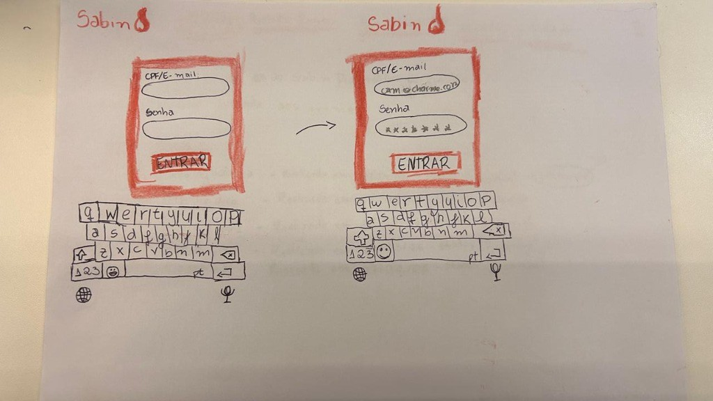

Fonte: autoria própria.

 

**Figura 2 — Protótipo de Papel: Acompanhamento de Resultados e Download de Laudos — Etapa 2**

Imagem 2 - Listagem de resultados recentes

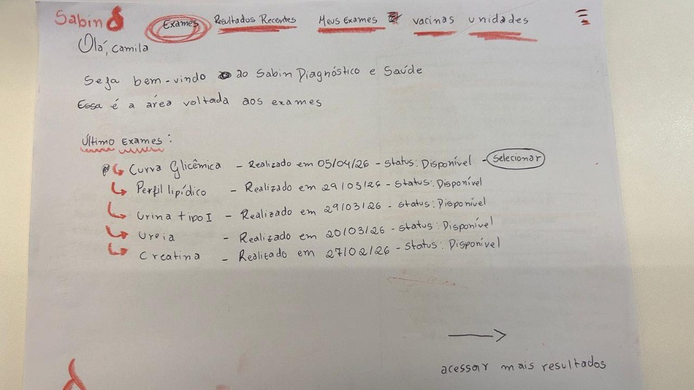

Fonte: autoria própria.

 

**Figura 3 — Protótipo de Papel: Acompanhamento de Resultados e Download de Laudos — Etapa 3**

Imagem 3 - Detalhes do exame (Curva Glicêmica)

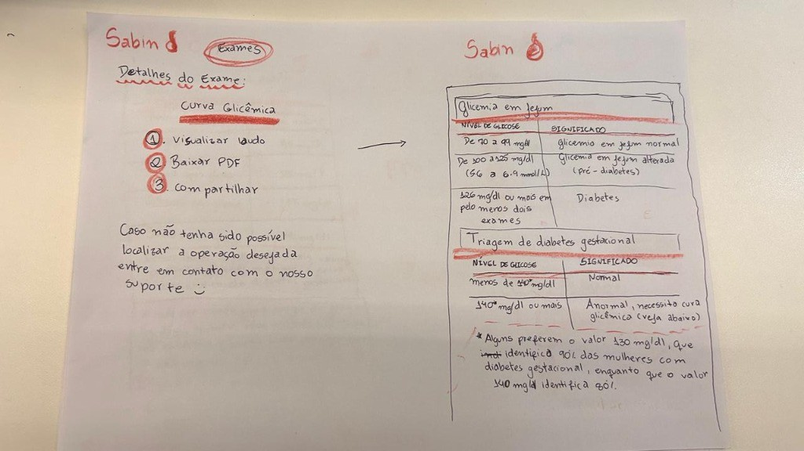

Fonte: autoria própria.

 

**Figura 4 — Protótipo de Papel: Acompanhamento de Resultados e Download de Laudos — Etapa 4**

Imagem 4 - Download e compartilhamento do laudo

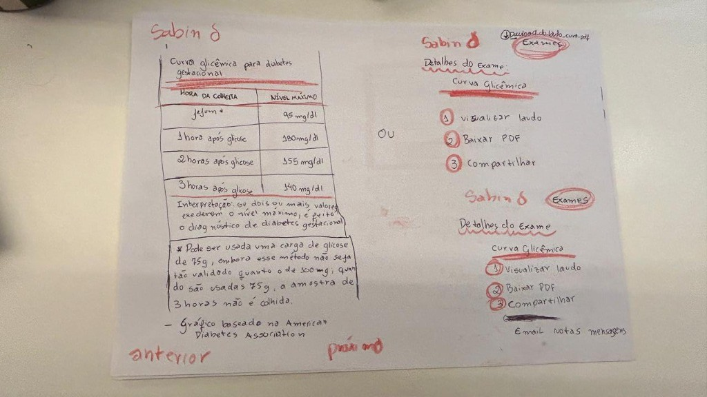

Fonte: autoria própria.

---

### 4.2. Tarefa 2 — Cadastro de Exame Laboratorial

> Elaborado por: [Hugo Freitas Silva](https://github.com/HugoFreitass)

Este protótipo representa o fluxo de agendamento de um exame laboratorial no sistema do Portal Sabin, avaliando qual o fluxo do usuário durante a execução desta atividade.

Imagem 5 - Agendamento de Exame Etapa 1

Fonte: autoria própria.

 

Imagem 6 - Agendamento de Exame Etapa 2

Fonte: autoria própria.

 

Imagem 7 - Agendamento de Exame Etapa 3

Fonte: autoria própria.

 

Imagem 8 - Agendamento de Exame Etapa 4

Fonte: autoria própria.

 

Imagem 9 - Agendamento de Exame Etapa 5

Fonte: autoria própria.

 

Imagem 10 - Agendamento de Exame Etapa 6

Fonte: autoria própria.

 

Imagem 11 - Agendamento de Exame Etapa 7

Fonte: autoria própria.

 

Imagem 12 - Agendamento de Exame Etapa 8

Fonte: autoria própria.

 

Imagem 13 - Agendamento de Exame Etapa 9

Fonte: autoria própria.

 

Imagem 14 - Agendamento de Exame Etapa 10

Fonte: autoria própria.

 

Imagem 15 - Agendamento de Exame Etapa 11

Fonte: autoria própria.

 

Imagem 16 - Agendamento de Exame Etapa 12

Fonte: autoria própria.

 

---

### 4.3. Tarefa 3 — Acesso ao Resultado de Imagem com Visualizador DICOM

> Elaborado por: [Philipe Amancio](https://github.com/Phill-Chill)

Este protótipo representado na **Figura 3** foca na experiência direta dentro do visualizador de imagens DICOM do Portal Sabin. O fluxo tem início já na interface de visualização, mapeando a utilização manual das ferramentas de zoom e ajuste de profundidade. O diferencial é o apoio de um modelo de Inteligência Artificial educacional integrado, que orienta o paciente no entendimento anatômico da imagem de forma visual, didática e segura, sem emitir diagnósticos clínicos.

**Figura 3 — Protótipo de Papel: Acesso ao Resultado de Imagem com Visualizador DICOM**

Imagem 17 - Visualizador DICOM com pronfundidade superficial Etapa 1

> Fonte: Autoria própria.

Imagem 18 - Visualizador DICOM com pronfundidade máxima Etapa 2

> Fonte: Autoria própria.

Imagem 19 - Visualizador DICOM com zoom no ombro direito e pronfundidade superficial Etapa 3

> Fonte: Autoria própria.

Imagem 20 - Visualizador DICOM com zoom no ombro direito e pronfundidade intermediária Etapa 4

> Fonte: Autoria própria.

Imagem 21 - Visualizador DICOM com zoom no ombro direito e pronfundidade máxima Etapa 5

> Fonte: Autoria própria.

---

### 4.4. Tarefa 4 — Pré-Agendamento de Exames com Dúvidas Críticas de Preparo

> Elaborado por: [Maria Laura Regis](https://github.com/Maria-Laura-Regis)

Este protótipo representa o fluxo de agendamento de exames de sangue pelo Portal Sabin, tendo como persona central **Márcia**, servidora pública de 55 anos. O protótipo mapeia as telas de busca de exame, seleção de unidade, escolha de horário e verificação das instruções de preparo.
**Figura 4 — Protótipo de Papel: Pré-Agendamento de Exames com Dúvidas Críticas de Preparo**

Imagem 22 - Pré-Agendamento de Exame Etapa 1

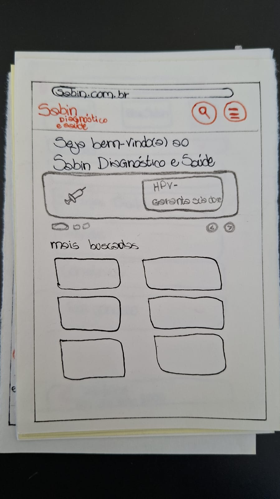

Fonte: autoria própria.

 

Imagem 23 - Pré-Agendamento de Exame Etapa 2

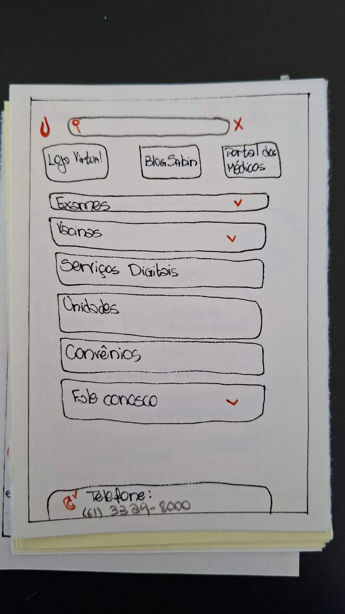

Fonte: autoria própria.

 

Imagem 24 - Pré-Agendamento de Exame Etapa 3

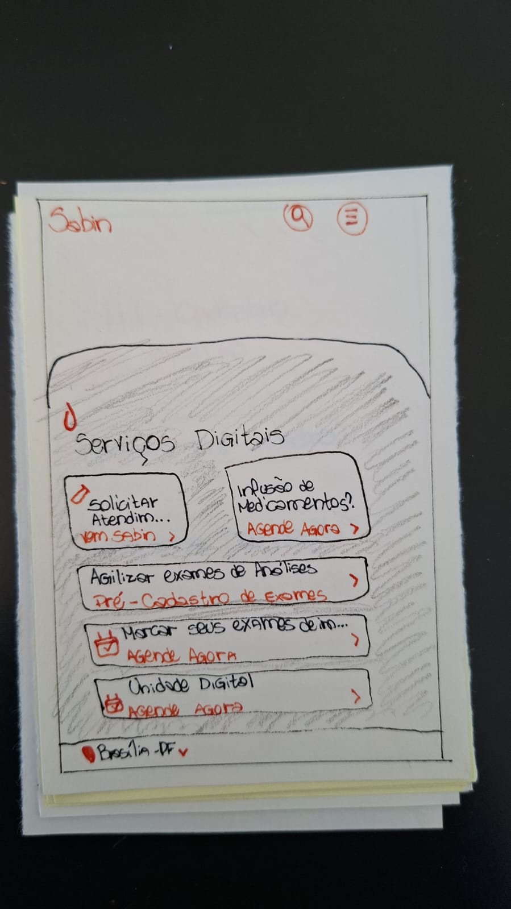

Fonte: autoria própria.

 

Imagem 25 - Pré-Agendamento de Exame Etapa 4

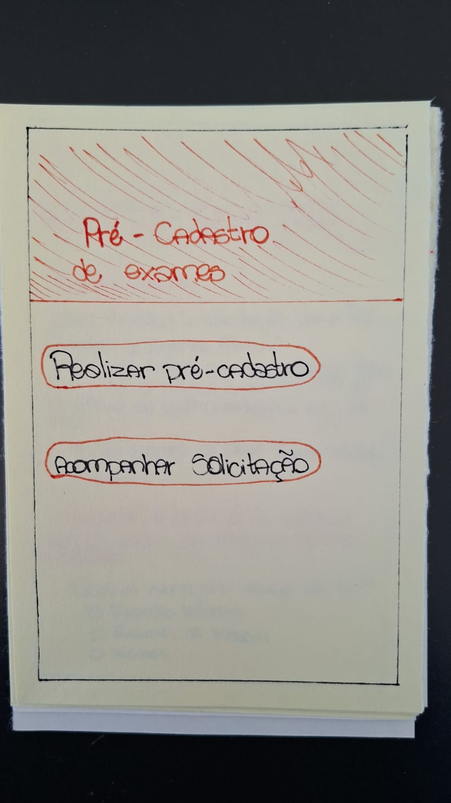

Fonte: autoria própria.

 

Imagem 26 - Pré-Agendamento de Exame Etapa 5

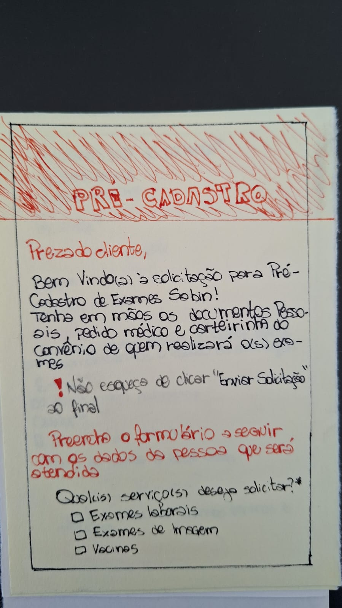

Fonte: autoria própria.

 

Imagem 27 - Pré-Agendamento de Exame Etapa 6

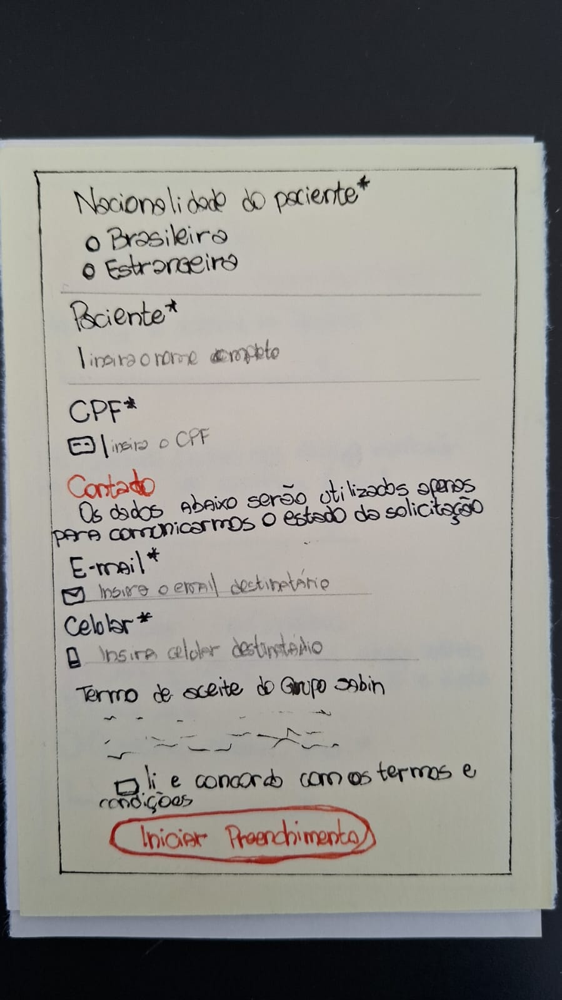

Fonte: autoria própria.

 

Imagem 28 - Pré-Agendamento de Exame Etapa 7

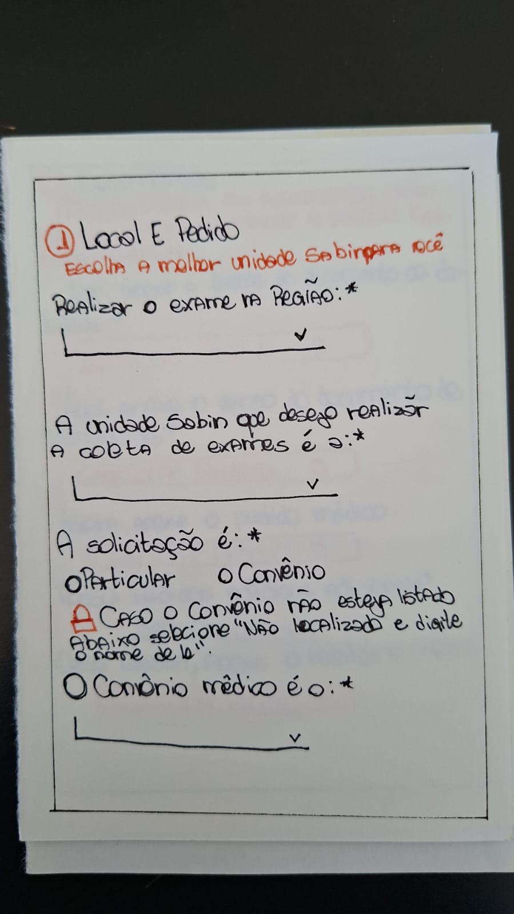

Fonte: autoria própria.

 

Imagem 29 - Pré-Agendamento de Exame Etapa 8

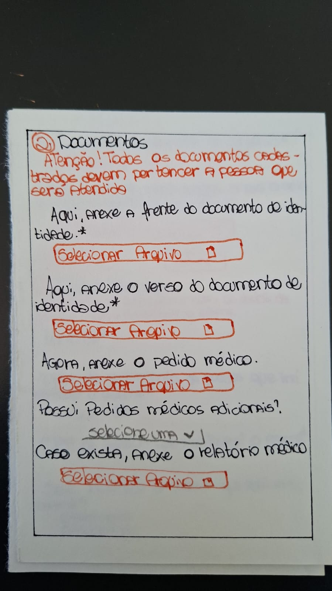

Fonte: autoria própria.

 

Imagem 30 - Pré-Agendamento de Exame Etapa 9

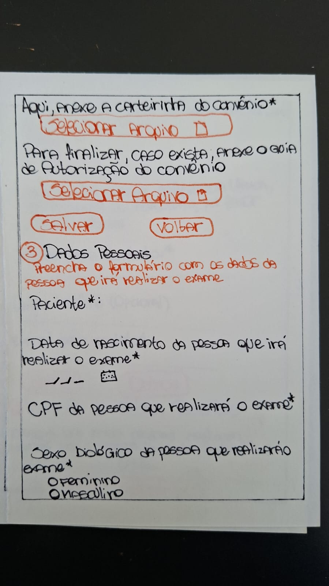

Fonte: autoria própria.

 

Imagem 31 - Pré-Agendamento de Exame Etapa 10

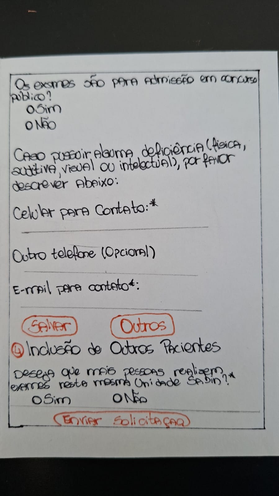

Fonte: autoria própria.

 

Imagem 32 - Pré-Agendamento de Exame Etapa 11

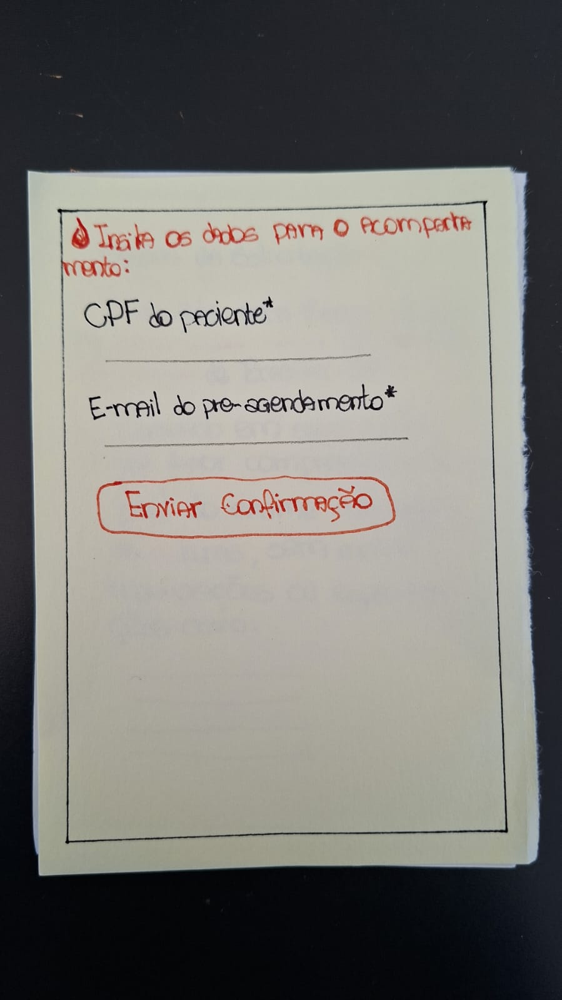

Fonte: autoria própria.

 

Imagem 33 - Pré-Agendamento de Exame Etapa 12

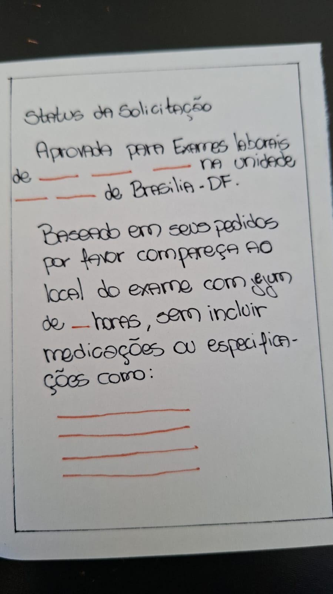

Fonte: autoria própria.

 

> Fonte: Autoria própria.

---

### 4.5. Tarefa 5 — [Tarefa do Nathan]

> Elaborado por: [Nathan]()

> [INSERIR DESCRIÇÃO DO PROTÓTIPO]

**Figura 5 — Protótipo de Papel: [Tarefa do Nathan]**

> [INSERIR IMAGEM DO PROTÓTIPO DE PAPEL — TAREFA 5]

> Fonte: Autoria própria.

---

## Agradecimentos à IA

Gostaríamos de registrar nossos agradecimentos ao modelo de Inteligência Artificial Generativa Gemini, desenvolvido pelo Google, pelo auxílio na estruturação, revisão gramatical e padronização da formatação em Markdown dos artefatos deste projeto. A ferramenta foi utilizada estritamente como suporte técnico e operacional para refinar a apresentação da documentação. Ressaltamos que todo o planejamento, execução das metodologias, análise crítica de dados e tomadas de decisão descritas neste documento são de autoria e responsabilidade exclusiva dos membros da equipe.

---

## Referências Bibliográficas

> SNYDER, C. **Paper Prototyping: The Fast and Easy Way to Design and Refine User Interfaces.** San Francisco: Morgan Kaufmann, 2003.

> BARBOSA, S. D. J. et al. **Interação Humano-Computador e Experiência do Usuário.** 1. ed. Rio de Janeiro: Autopublicação, 2021.

---

## Histórico de Versão

| Versão | Data | Descrição | Autores | Data Revisão | Descrição Revisão | Revisores |
| :---: | :---: | :--- | :--- | :---: | :--- | :--- |
| 1.0 | 29/05/2026 | Criação do documento | [Ingrid Alves](https://github.com/alvesingrid) |29/05/2026 | Revisão de estrutura | [Hugo Freitas Silva](https://github.com/HugoFreitass) |
| 2.0 | 02/06/2026 | Adição do hiperlink dos protótipos de papel de todas as tarefas | [Ingrid Alves](https://github.com/alvesingrid) | 02/06/2026 | Verificação dos links | [Hugo Freitas Silva](https://github.com/HugoFreitass) |
| 2.1 | 16/06/2026 | Enumeração das imagens do artefato| [Nathan Pontes Romão](https://github.com/nathanpromao) | 16/06/2026 | Conferindo numeração  | [Hugo Freitas Silva](https://github.com/HugoFreitass) |
| 2.1 | 16/06/2026 | Ajuste na descrição da tarefa de agendamento de exame | [Hugo Freitas Silva](https://github.com/HugoFreitass) | 16/06/2026 | Verificação do novo fluxo | [Philipe Amancio](https://github.com/Phill-Chill)|
| 2.2 | 23/06/2026 | Adição do posicionamento no Ciclo de Vida de Mayhew na seção de Introdução | [Ingrid Alves](https://github.com/alvesingrid) | - | - | - |

