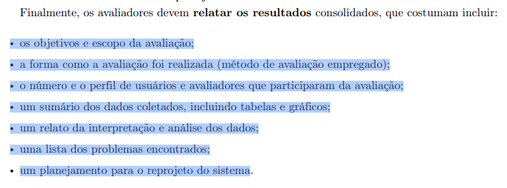
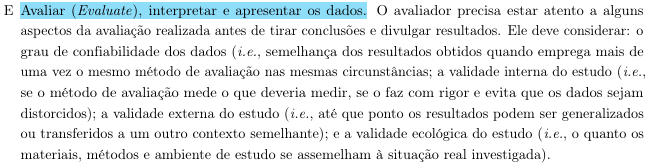
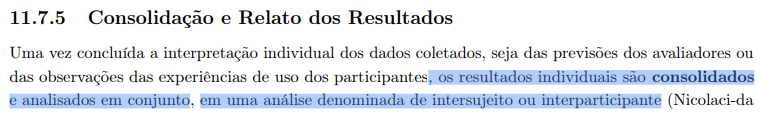
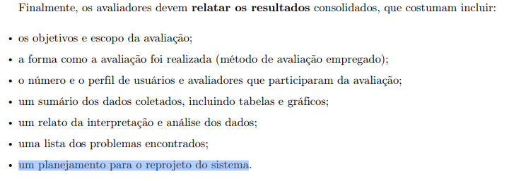

# Relato dos Resultados — Protótipo de Papel: Visualizador de imagem DICOM

## Tabela de Contribuição

| Artefato(s) | Autor(es) |
| --- | --- |
| Relato dos resultados da avaliação do protótipo de papel sobre a tarefa de Visualizador de imagem DICOM |[Philipe Amancio](https://github.com/Phill-Chill) |

---

## 1. Introdução

Este documento tem como objetivo relatar os resultados da avaliação do Protótipo de Papel do Portal Sabin. O intuito é garantir que, após a coleta empírica de dados por meio do **Teste de Usabilidade** com **Protótipo de Papel**, todos os avaliadores da equipe sigam a mesma metodologia de consolidação e interpretação dos dados obtidos nas sessões (BARBOSA; SILVA, 2021, p. 279).[PRINT] .

Este artefato corresponde à etapa **"E": Avaliar (Evaluate), interpretar e apresentar os dados** do framework DECIDE (BARBOSA; SILVA, 2021, p. 280)[PRINT] , definindo como os dados serão avaliados, interpretados e apresentados.

---

## 2. Metodologia de Consolidação dos Dados

Após a conclusão das sessões individuais, os resultados serão consolidados por meio de uma **análise intrasujeito** (BARBOSA; SILVA, 2021, p. 279).[PRINT] . Nesta etapa, a equipe deverá:

* Buscar **recorrências** nos dados: padrões de comportamento, erros e dificuldades comuns entre participantes.
* Diferenciar problemas representativos de idiossincrasias: separar dificuldades recorrentes de problemas particulares de um único participante.
* Relacionar os resultados obtidos com os objetivos definidos no [Planejamento da Avaliação](PlanejamentoAvaliacao.md).
* Evitar generalizações indevidas: os resultados representam tendências observadas e não conclusões absolutas.
* **Atenção:** o resultado do Teste Piloto não será incluído no relato oficial da avaliação.

---

## 3. Tópicos do Relato de Resultados

## 3.1. Objetivos e Escopo da Avaliação

A avaliação teve como objetivo verificar se o fluxo de **Visualização de imagem DICOM** do protótipo de papel era compreensível, intuitivo e compatível com as expectativas do usuário durante a execução da tarefa proposta. O escopo da avaliação contemplou as telas relacionadas a **Interface do visualizador com operações de zoom, navegação pela imagem e nível de profundidade**, bem como os respectivos fluxos de navegação entre essas etapas. Além disso, buscou-se identificar problemas de usabilidade previamente levantados na Análise de Tarefas. Os resultados obtidos permitiram responder às questões exploratórias definidas no planejamento da avaliação.

---

## 3.2. Método de Avaliação Empregado

O teste de usabilidade foi conduzido com **1** participante, em uma sessão **presencial** registrada em vídeo, com o avaliador assumindo o papel de *human computer* ao manipular o protótipo de papel. As telas foram apresentadas após uma breve contextualização e foi solicitado ao participante que **com auxílio da IA (previamente configurada) ele entendesse o que seria uma tendinopatia do supraespinhal e localizá-la no protótipo de papel**. A partir disso, foi realizada a observação da execução da tarefa, com auxílio e explicações conforme o necessário. As anotações foram realizadas _a posteriori_, com base no registro audiovisual da sessão. 

---

## 3.3. Perfil de Usuários e Avaliadores

### Participantes

| Participante | Perfil |
|------------|---------|
| Eduardo | [Perfil de usuário 1](../../../requisitos/perfilDeUsuario.md) |

### Avaliadores

| Avaliador | Papel |
|------------|---------|
| [Philipe Amâncio](https://github.com/Phill-Chill) | Facilitador / Human Computer |
| [Philipe Amâncio](https://github.com/Phill-Chill) | Anotador |
| [Hugo Freitas Silva](https://github.com/HugoFreitass) | Cinegrafista |

### Relação com o Perfil de Usuário

O participante selecionado apresenta características compatíveis com o [perfil de usuário](../../../requisitos/perfilDeUsuario.md) do Portal Sabin, garantindo a validade externa dos resultados obtidos.

---

## 3.4. Tarefas Executadas e Sumário dos Dados

 A simulação teve início diretamente na interface do visualizador DICOM, exibindo inicialmente uma visão de corpo inteiro no nível de profundidade do sistema muscular (com a possibilidade de o usuário alterar a profundidade para visualizar o sistema esquelético completo). 

Ao simular a aplicação da ferramenta de zoom no ombro direito, a interface foi atualizada (troca da folha de papel) para uma visão ampliada daquela região específica, mantendo o nível muscular. A partir desse ponto, o participante pôde interagir com o ajuste de profundidade, transitando visualmente para um nível intermediário de tecidos e, por fim, alcançando o nível esquelético do ombro.

A **Tabela 1** detalha a decomposição desse objetivo principal nas tarefas sequenciais mapeadas para a avaliação:

Tabela 1 - Decomposição do objetivo em tarefas

| ID | Tarefa Mapeada (Artefato) |
|----|---------|
| T1 | Identificar e selecionar a ferramenta de "Zoom" na interface inicial (corpo inteiro muscular) |
| T2 | Aplicar o zoom na região específica de interesse (ombro direito) |
| T3 | Identificar e selecionar a ferramenta de ajuste de "Profundidade" |
| T4 | Alterar o nível de profundidade para visualizar a camada intermediária de tecidos do ombro |
| T5 | Alterar o nível de profundidade novamente para visualizar o sistema esquelético do ombro |
| T6 | Encerrar a visualização |

### Sumário Quantitativo dos Dados

| Métrica | Resultado |
|----------|-----------| 
| Número de participantes | 1 |
| Tarefas concluídas sem auxílio | 4 |
| Tarefas concluídas com auxílio | 2 |
| Tarefas não concluídas | 0 |
| Total de erros observados | 3 |
| Pontos de hesitação identificados | 0 |
| Comentários relevantes registrados | 0 |

### Dificuldades Observadas por Tarefa

| Tarefa | Dificuldade Observada |
|--------|-----------------------|
| T1 | Hesitação ao procurar a ferramenta correta devido à presença dos elementos visuais residuais na interface.  |
| T2 | -não houve- |
| T3 | O usuário tentou interagir com os frames da direita, causando confusão na busca pela ferramenta. |
| T4 | -não houve- |
| T5 | Dificuldade na identificação da profundidade correta ao tentar alcançar a visão do sistema esquelético. |
| T6 | -não houve- |

### Comentários Relevantes dos Participantes

Durante a sessão, o participante não teceu comentários longos ou observações verbais elaboradas sobre a interface. Suas manifestações se limitaram a breves interjeições (como questionar "Aqui!?" em tom de dúvida ao tentar clicar nos quadros laterais da tela).

---

## 3.5. Relato da Interpretação e Análise dos Dados

Nesta seção serão apresentados os resultados obtidos e sua relação com os objetivos definidos no planejamento.

### Análise das Perguntas Exploratórias

| Pergunta Exploratória                                                                                           | Evidências Observadas | Conclusão                                    |
| ----------------------------------------------------------------------------------------------- | --------------------- | -------------------------------------------- |
| O usuário conseguiu concluir a tarefa proposta sem auxílio do avaliador?                        | Não, foram necessárias intervenções | Respondida |
| Em quais momentos o usuário demonstrou hesitação ou confusão?                                   | No começo da ambientação ao procurar a ferramenta de profundidade | Respondida |
| Os rótulos, botões e elementos de navegação foram compreendidos intuitivamente?                 | Sim, com exceção da ferramenta de profundidade | Respondida |
| O fluxo de telas corresponde à sequência esperada pelo usuário para realizar a tarefa?          | Sim | Respondida |
| Houve alguma etapa que o usuário tentou realizar de forma diferente da prevista no protótipo?   | Sim, o entrevistado tentou acessar o nível de profundidade diretamente pelos frames que ficam à direita da interface | Respondida |
| O usuário conseguiu identificar onde estava no sistema a qualquer momento da navegação?         | Sim, os níveis foram divididos em sistema muscular, intermediário e esquelético, os quais foram identificados pelo entrevistado | Respondida |
| Alguma informação necessária para a conclusão da tarefa estava ausente ou difícil de encontrar? | Não, não foi relatada nenhuma dificuldade desse tipo | Respondida |
| O usuário expressou satisfação ou frustração em algum momento específico?                       | Não | Respondida |
| Há alguma funcionalidade que o usuário esperava encontrar e não estava presente no protótipo?   | Não | Respondida |
| O usuário conseguiu recuperar-se de eventuais erros de navegação sem auxílio?                   | Não, foi dado feedback externo para correção dos erros | Respondida |

### Principais Achados

**Aspectos Positivos:**

- Navegação simples
- Após a localização das ferramentas, a sua utilização foi simples

**Dificuldades Encontradas:**

- Identificar o nível correto de visualização da doença
- Identificação do ícone da ferramenta de profundidade

**Quebras de Expectativa:**
- Utilizar os quadros de profundidade da lateral direita (o que não estava previsto no fluxo inicial)

---

## 3.6. Lista dos Problemas Encontrados

| ID | Descrição do Problema | Tarefa | Frequência | Severidade | Impacto | Possível Causa | Prioridade |
|----|----------------------|--------|------------|------------|---------|----------------|------------|
| P01 | Tentativa de interação com os frames laterais residuais | T1, T3 | 1 | Pequeno | Confusão na navegação e hesitação na busca pela ferramenta correta. | Elementos visuais laterais que parecem botões interativos de profundidade. | Alta |
| P02 | Ícone da ferramenta de profundidade não intuitivo | T1, T3 | 1 | Pequeno | Atraso na localização da função principal de troca de camadas. | O desenho do ícone não remete de forma clara ao conceito de "profundidade" ou "camadas". | Média |
| P03 | Dificuldade em identificar o nível de profundidade correto da doença | T5 | 1 | Grande | Impede a conclusão autônoma do entendimento da imagem. | Falta de feedback visual claro (texto ou barra) indicando em qual camada o usuário está navegando. | Alta |

### Critérios de Severidade

Os problemas serão classificados de acordo com a escala de severidade (BARBOSA; SILVA, 2021, p. 284).[PRINT] :

| Nível | Descrição |
|---------|------------|
| Cosmético | Pequeno desconforto sem impedir a realização da tarefa |
| Pequeno | Dificulta significativamente a execução da tarefa |
| Grande | Impede ou compromete fortemente a realização da tarefa |
| Catastrófico | Impede completamente a conclusão da atividade |

---

## 3.7. Planejamento para o Reprojeto do Protótipo

Nesta seção deverão ser apresentadas propostas de melhoria para o protótipo com base nos problemas identificados durante a avaliação (BARBOSA; SILVA, 2021, p. 279).[PRINT] .

### Recomendações de Melhoria

| Problema Relacionado | Proposta de Melhoria | Justificativa |
|---------------------|---------------------|--------------|
| P01 | Transformar os frames visuais da lateral direita em botões reais de atalho para os níveis de profundidade. | Essa alteração alinha a interface ao modelo mental natural do usuário, que intuitivamente clicou nesses elementos esperando uma transição rápida. |
| P02 | Adicionar um rótulo de texto (ex: "Profundidade") abaixo do ícone, ou redesenhar o ícone para o formato padrão de "camadas" (layers). | Rótulos de texto acompanhando ícones reduzem a carga cognitiva e eliminam a ambiguidade. |
| P03 | Inserir um indicador de *status* visível na tela (ex: um *slider* ou um texto em destaque informando "Nível Atual: Esquelético"). | Fornece feedback constante sobre a localização no sistema, evitando que o paciente se perca durante a análise da imagem. |

### Priorização das Alterações

| Prioridade | Alteração Proposta | Problema Relacionado |
|------------|-------------------|---------------------|
| Alta | Transformar os frames laterais em botões de atalho interativos para navegação de profundidade. | P01 |
| Alta | Inserir um indicador claro de "Nível Atual" na tela. | P03 |
| Média | Redesenhar ou rotular o ícone da ferramenta de profundidade. | P02 |

---

## Referência Bibliográfica

> BARBOSA, S. D. J. et al. Interação Humano-Computador e Experiência do Usuário. 1. ed. Rio de Janeiro: Autopublicação, 2021.

---

## Histórico de Versão

| Versão | Data | Descrição | Autores | Data Revisão | Descrição Revisão | Revisores |
| :---: | :---: | :--- | :--- | :---: | :--- | :--- |
| 1.0 | 05/06/2026 | Criação do relato sobre Visualizador de imagem DICOM | [Philipe Amancio](https://github.com/Phill-Chill) | 07/06/2026 | Revisão do conteúdo relatado | [Hugo Freitas Silva](https://github.com/HugoFreitass) |