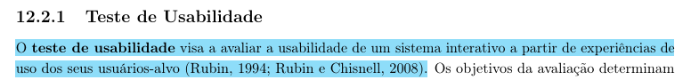
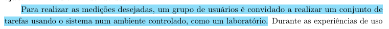
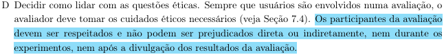

# Planejamento da Avaliação do Protótipo de Alta fidelidade
## Tabela de Contribuição

| Artefato(s) | Autor(es) |
| --- | --- |
| Página de Planejamento da Avaliação do Protótipo de Alta Fidelidade | [Philipe Amancio](https://github.com/Phill-Chill) |

## Introdução

Este documento apresenta o planejamento da avaliação do Protótipo de Alta Fidelidade desenvolvido para o Portal Sabin. A avaliação tem como objetivo verificar se as soluções de design interativas, estéticas e funcionais atendem às necessidades e expectativas dos usuários, além de identificar problemas de usabilidade avançados, inconsistências de navegação e oportunidades de refinamento antes do desenvolvimento (codificação) do sistema (BARBOSA; SILVA, 2021, p. 358)[PRINT] .

Para conduzir essa etapa, a equipe adotou o método de **Avaliação por Observação**, especificamente por meio da técnica de **Teste de Usabilidade com Protótipo de Alta Fidelidade**.

## Metodologia

O planejamento da avaliação será estruturado com base no framework DECIDE:

- **D:** determinar os objetivos da avaliação.
- **E:** explorar perguntas a serem respondidas com a avaliação.
- **C:** (choose) escolher os métodos de avaliação.
- **I:** identificar e gerir as questões práticas da avaliação.
- **D:** decidir como lidar com as questões éticas.
- **E:** (evaluate) avaliar, interpretar e apresentar os resultados.

---

## D - Objetivo da Avaliação

O objetivo desta avaliação é identificar **problemas de usabilidade** na interface quase final (alta fidelidade), verificando se a disposição visual, as interações, a hierarquia de informações e os fluxos permitem que os usuários concluam suas tarefas de forma eficaz, eficiente e satisfatória (BARBOSA; SILVA, 2021, p. 294)[PRINT] . Especificamente, a avaliação buscará:

- Verificar se a identidade visual, os ícones e os feedbacks do sistema (cores, estados de botões) são compreendidos adequadamente;
- Avaliar se a navegação interativa (cliques, rolagens, transições de tela) ocorre de forma fluida e sem quebra de expectativa;
- Validar se as correções aplicadas após o reprojeto do Protótipo de Papel foram bem-sucedidas;
- Coletar a percepção de satisfação e estética diretamente dos usuários.

## E - Perguntas Exploratórias

Essas perguntas operacionalizam a investigação e o julgamento de valor a serem realizados (BARBOSA; SILVA, 2021, p. 294)[PRINT] .

1. O usuário conseguiu concluir a tarefa proposta interagindo diretamente com o protótipo digital sem auxílio?
2. A identidade visual, os ícones e as cores ajudaram ou atrapalharam a identificação das ações?
3. O feedback visual do sistema (ex: botão clicado, carregamento, sucesso) foi claro para o usuário?
4. Os rótulos e elementos de navegação foram compreendidos intuitivamente?
5. Houve alguma etapa que o usuário tentou realizar de forma diferente da prevista nos links de navegação do protótipo?
6. O usuário conseguiu identificar onde estava no sistema a qualquer momento da navegação?
7. Alguma informação visual ou textual necessária para a conclusão da tarefa estava ausente ou difícil de encontrar?
8. O usuário expressou satisfação ou frustração com a estética ou com a resposta da interface?
9. Há alguma funcionalidade que o usuário esperava encontrar e não estava interativa/presente no protótipo?
10. O usuário conseguiu recuperar-se de eventuais erros de clique ou navegação sem auxílio?

## C - Escolha do Método

Para avaliar o Protótipo de Alta Fidelidade, a equipe optou pela técnica de **Avaliação por Observação** com **Teste de Usabilidade** (BARBOSA; SILVA, 2021, p. 294)[PRINT] . Nessa técnica, o participante interage de forma autônoma e direta com um protótipo digital navegável (desenvolvido em ferramentas como Figma), simulando o uso do software real(BARBOSA; SILVA, 2021, p. 301)[PRINT] .

Essa abordagem foi escolhida por permitir:

- **Interação realista:** O usuário controla o fluxo (mouse/toque), permitindo avaliar a verdadeira ergonomia e o design visual;
- **Observação precisa:** Identificação de cliques errados, áreas mortas na tela e tempo de hesitação;
- **Feedback estético:** Avaliação da interface com cores, tipografia e espaçamentos finais;
- **Simulação de contexto:** Maior imersão do usuário em comparação ao protótipo de baixa fidelidade.

---

## I - Identificar as Questões Práticas

Nesta etapa do framework DECIDE, são definidos os procedimentos organizacionais e os recursos necessários para a execução da avaliação (BARBOSA; SILVA, 2021, p. 294)[PRINT] . Os participantes serão selecionados com base nas características descritas no [Perfil de Usuário](../../requisitos/perfilDeUsuario.md).

As sessões serão realizadas na modalidade presencial, simulando um ambiente controlado para a execução das tarefas (BARBOSA; SILVA, 2021, p. 301).[PRINT] .

Durante as sessões, a equipe assumirá as seguintes responsabilidades:

* **Avaliador/Facilitador:** Responsável por apresentar a tarefa ao participante e conduzir a sessão. 
* **Anotador/Observador:** Responsável por documentar os erros, locais de cliques inválidos, momentos de hesitação e reações verbais/faciais.
* **Cinegrafista:** Responsável por garantir que a ferramenta de gravação de tela e áudio esteja funcionando corretamente mediante consentimento explícito.

Antes das sessões oficiais, será conduzido um **Teste Piloto**. O resultado do teste piloto **não será incluído no relatório final de resultados**.

### Teste Piloto

O teste piloto tem como objetivo verificar se o planejamento da avaliação está adequado, garantindo que o protótipo digital (links, botões, transições), o ambiente e os softwares de gravação de tela funcionem perfeitamente antes da execução com os participantes reais (BARBOSA; SILVA, 2021, p. 276).[PRINT] .

#### Objetivos do Teste Piloto

- Verificar se todas as conexões (links) do protótipo no Figma estão configuradas corretamente para o fluxo da tarefa;
- Garantir que não haja "telas sem saída" (*dead ends*) que quebrem a simulação;
- Testar o software de gravação de tela/áudio e o compartilhamento de tela (caso remoto);
- Calibrar o papel do anotador na identificação rápida de cliques errados na interface digital;
- Validar o tempo estimado para a realização da tarefa.

#### Metodologia do Teste Piloto

O teste piloto seguirá o mesmo procedimento das sessões oficiais, porém será conduzido com **um integrante da própria equipe** no papel de participante simulado. Eventuais falhas de lincagem no protótipo ou problemas técnicos serão corrigidos antes das sessões reais.

#### Cronograma do Teste Piloto

 Tabela TP - Cronograma do Teste Piloto 

| Avaliador | Participante (Membro da equipe) | Data | Horário | Local |
| :--- | :--- | :--- | :--- | :--- |
| [Seu Nome](Link) | A definir | A definir | A definir | A definir |

>Fonte: autoria própria
https://youtu.be/kHUpLIWTmyE
#### Gravação do Teste Piloto

[Link](https://youtu.be/kHUpLIWTmyE)

  <iframe width="560" height="315" src="https://www.youtube.com/embed/kHUpLIWTmyE" title="Teste Piloto - Protótipo de Alta Fidelidade" frameborder="0" allow="accelerometer; autoplay; clipboard-write; encrypted-media; gyroscope; picture-in-picture" allowfullscreen></iframe>

**Cronograma de Sessões**:  
O cronograma das sessões está detalhado na **Tabela I**:

  Tabela I - Cronograma de Sessões 

| Responsável pela Sessão | Participante | Data | Horário | Local de Realização |
| :--- | :--- | :--- | :--- | :--- |
| [Hugo Freitas Silva](https://github.com/HugoFreitass) |  Eduardo Lobo |  11/06/2026  | 12:00 - 12:10 | FCTE - Campus UnB Gama |
| [Philipe Amancio](https://github.com/Phill-Chill) | Pedro Herinque | 11/06/2026 | 12:20 - 12:20 | FCTE - Campus UnB Gama |
|  [Maria Laura Regis](https://github.com/Maria-Laura-Regis) | - | - | - | - |
|[Nathan]() | - | - | - | - |
|  [Ingrid Alves](https://github.com/alvesingrid) | - | - | - | - |

>Fonte: autoria própria

---

## D - Questões Éticas

Antes da realização das atividades, os participantes deverão concordar com o [Termo de Consentimento](../../requisitos/Aspectoseticos.md). Asseguramos que **os participantes da avaliação serão respeitados e não podem ser prejudicados direta ou indiretamente, nem durante os experimentos, nem após a divulgação dos resultados** (BARBOSA; SILVA, 2021, p. 294)[PRINT] . Todo o procedimento preservará o anonimato e a privacidade dos dados coletados.

## E - Avaliar, Interpretar e Apresentar os Resultados

Após a coleta, os dados serão interpretados para identificar problemas avançados de usabilidade, falhas no feedback visual e oportunidades de refinamento de UI (Interface de Usuário) (BARBOSA; SILVA, 2021, p. 294)[PRINT] .

Para garantir a padronização, a **estrutura do relatório do resultado da avaliação** deverá conter os seguintes tópicos, os quais serão melhor abordados no [planejamento do resultado](PlanejamentoDosResultados.md):

1. Os objetivos e o escopo da avaliação;
2. O método de avaliação empregado;
3. O número e o perfil dos avaliadores e dos participantes;
4. Um sumário dos dados coletados (tarefas executadas, cliques errados, hesitações);
5. A interpretação e análise dos dados;
6. Uma lista detalhada dos problemas encontrados;
7. O planejamento para a correção final do sistema antes do desenvolvimento.

## Agradecimentos à IA

Gostaríamos de registrar nossos agradecimentos ao modelo de Inteligência Artificial Generativa Gemini, desenvolvido pelo Google, pelo auxílio na estruturação, revisão gramatical e padronização da formatação em Markdown dos artefatos deste projeto. A ferramenta foi utilizada estritamente como suporte técnico e operacional para refinar a apresentação da documentação. Ressaltamos que todo o planejamento, execução das metodologias, análise crítica de dados e tomadas de decisão descritas neste documento são de autoria e responsabilidade exclusiva dos membros da equipe.

## Referências Bibliográficas

> BARBOSA, S. D. J. et al. Interação Humano-Computador e Experiência do Usuário. 1. ed. Rio de Janeiro: Autopublicação, 2021.

## Histórico de Versão

| Versão | Data | Descrição | Autores | Data Revisão | Descrição Revisão | Revisores |
| :---: | :---: | :--- | :--- | :---: | :--- | :--- |
| 1.0 | 06/06/2026 | Elaboração do Planejamento de Alta Fidelidade | [Philipe Amancio](https://github.com/Phill-Chill) | - | - | [Maria Laura Regis](https://github.com/Maria-Laura-Regis) |
| 1.1 | 16/06/2026 | Ajustes de caminhos quebrados| [Nathan Pontes Romão](https://github.com/nathanpromao) | - |  |  |