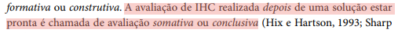
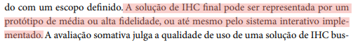

# Planejamento do Relato dos Resultados — Protótipo de Alta Fidelidade

## Tabela de Contribuição

| Artefato(s) | Autor(es) |
| --- | --- |
| Relato dos resultados da avaliação do protótipo de alta fidelidade da tarefa de agendamento de exame | [Hugo Freitas Silva](https://github.com/HugoFreitass) |

---

## 1. Introdução

Este documento tem como objetivo relatar os resultados da avaliação do Protótipo de Papel do Portal Sabin. O intuito é garantir que, após a coleta empírica de dados por meio do **Teste de Usabilidade** com **Protótipo de Alta Fidelidade**, todos os avaliadores da equipe sigam a mesma metodologia de consolidação e interpretação dos dados obtidos nas sessões (BARBOSA; SILVA, 2021, p. 279).[PRINT] .

Este artefato corresponde à etapa **"E": Avaliar (Evaluate), interpretar e apresentar os dados** do framework DECIDE (BARBOSA; SILVA, 2021, p. 280)[PRINT] , definindo como os dados serão avaliados, interpretados e apresentados.

### 1.1 Avaliação
A seguir estão as gravações das avaliações:

#### Avaliação Protótipo de Alta Fidelidade com o participante Daniel:

    <iframe width="560" height="315" src="https://www.youtube.com/embed/FWnmEVY7Nb8" title="Avaliação Protótipo de Alta Fidelidade Daniel" frameborder="0" allow="accelerometer; autoplay; clipboard-write; encrypted-media; gyroscope; picture-in-picture; web-share" referrerpolicy="strict-origin-when-cross-origin" allowfullscreen></iframe>

#### Avaliação Protótipo de Alta Fidelidade com o participante Eduardo:

    <iframe width="560" height="315" src="https://www.youtube.com/embed/Wc4pi1Bm8hk" title="Avaliação Protótipo de Alta Fidelidade Eduardo" frameborder="0" allow="accelerometer; autoplay; clipboard-write; encrypted-media; gyroscope; picture-in-picture; web-share" referrerpolicy="strict-origin-when-cross-origin" allowfullscreen></iframe>

#### Avaliação Protótipo de Alta Fidelidade com o participante Lucas:

    <iframe width="560" height="315" src="https://www.youtube.com/embed/dH8__vz5cGw" title="Avaliação Protótipo de Alta Fidelidade Lucas" frameborder="0" allow="accelerometer; autoplay; clipboard-write; encrypted-media; gyroscope; picture-in-picture; web-share" referrerpolicy="strict-origin-when-cross-origin" allowfullscreen></iframe>

---

## 2. Metodologia de Consolidação dos Dados

Os resultados serão consolidados por meio de uma **análise intersujeito** (BARBOSA; SILVA, 2021, p. 279).[PRINT] . Como o teste é focado na análise intersujeito, a equipe irá:

* Buscar **recorrências** no comportamento do usuário: observar como o participante age, evolui e reage ao longo da execução das diferentes tarefas propostas na interface digital.
* Identificar padrões individuais e coletivos: mapear erros consistentes de clique, pontos de hesitação repetidos e a curva de aprendizado do próprio participante durante a interação com o protótipo.
* Relacionar os resultados e as atitudes observadas com os objetivos definidos no [Planejamento da Avaliação](PlanejamentoAvaliacao.md).
* Evitar generalizações indevidas: reconhecer que os dados refletem as particularidades e o modelo mental de um único indivíduo, servindo como indícios fortes de problemas reais de usabilidade e interface, mas não como métricas estatísticas de uma população.
* **Atenção:** o resultado do Teste Piloto não será incluído no relato oficial da avaliação.

---

## 3. Tópicos do Relato de Resultados

Para garantir a padronização, todos os documentos de Relato de Resultados produzidos pela equipe seguem a seguinte estrutura:

## 3.1. Objetivos e Escopo da Avaliação

Esta é uma **avaliação somativa** com o principal objetivo de validar uma alternativa de design. (BARBOSA; SILVA, 2021, p. 294).[PRINT] .

---

## 3.2. Método de Avaliação Empregado

O Teste de Usabilidade com Protótipo de Alta Fidelidade foi conduzido, seguindo:

- O dispositivo e ambiente utilizados para a simulação: computador desktop presencial acessando o link do Figma;
- As estratégias de coleta de dados utilizadas:
  - Observação direta das ações do participante e interações com a UI (Interface de Usuário): [Site do Sabin]() e [Protótipo de Alta Fidelidade]() (BARBOSA; SILVA, 2021, p. 294).[PRINT] ;
  - Captura de tela e gravação da interação digital (screen recording);
  - Protocolo *Think Aloud* (verbalização dos pensamentos, se aplicado);
  - Registro audiovisual do rosto/comportamento da sessão (mediante consentimento);
  - Anotações do avaliador/anotador sobre cliques errados ou hesitações em componentes.

---

## 3.3. Perfil de Usuários e Avaliadores

### Participantes

| Participante | Perfil |
|------------|---------|
| Daniel Torquato | [Perfil de usuário 1 - Paciente do Sabin](../../../../requisitos/perfilDeUsuario.md) |
| Eduardo Lobo | [Perfil de usuário 1 - Paciente do Sabin](../../../../requisitos/perfilDeUsuario.md) |
| Lucas Andrade | [Perfil de usuário 1 - Paciente do Sabin](../../../../requisitos/perfilDeUsuario.md) |

### Avaliadores

| Avaliador | Papel |
|------------|---------|
| [Hugo Freitas Silva](https://github.com/HugoFreitass) | Facilitador |
| [Hugo Freitas Silva](https://github.com/HugoFreitass) | Anotador / Observador |
| [Philipe Amancio](https://github.com/Phill-Chill) | Cinegrafista / Gestor de Gravação |

### Relação com o Perfil de Usuário

Os participante selecionados apresentam características compatíveis com o [Perfil de usuário 1 - Paciente do Sabin](../../requisitos/perfilDeUsuario.md) do Portal Sabin, garantindo a validade externa dos resultados obtidos.

---

## 3.4. Tarefas Executadas e Sumário dos Dados

A **Tabela** detalha a decomposição do objetivo principal da avaliação em tarefas menores. Esses passos representam as ações sequenciais modeladas pela equipe para serem validadas com o usuário no sistema digital:

### Tabela - Decomposição do objetivo em tarefas

| ID | Tarefa Mapeada (Artefato) |
|----|---------|
| T1 | Iniciar o processo de agendamento |
| T2 | Buscar exame pelo nome |
| T3 | Selecionar exame correto |
| T4 | Selecionar unidade |
| T5 | Selecionar horário |
| T6 | Informar dados pessoais |
| T7 | Confirmar agendamento |

### Design Vigente (Portal Sabin Atual)

#### Sumário Quantitativo dos Dados

| Métrica | Resultado |
|----------|-----------|
| Número de participantes | 3 |
| Tarefas concluídas sem auxílio | 12 |
| Tarefas concluídas com auxílio | 9 |
| Tarefas não concluídas | 0 |
| Total de erros (cliques falhos/caminhos errados) | 9 |
| Pontos de hesitação identificados | 9 |
| Comentários relevantes registrados | 6 |

#### Dificuldades Observadas por Tarefa

| Tarefa | Dificuldade Observada |
|--------|-----------------------|
| T1 | Identificar qual opção inicia o processo de agendamento |
| T2 | Encontrar o exame sem utilizar nomenclatura técnica |
| T3 | Não houve dificuldades significativas |
| T4 | Identificar corretamente a opção de seleção de unidade |
| T5 | Não existe uma etapa clara para seleção de horário |
| T6 | Não houve dificuldades significativas |
| T7 | Alguns participantes não compreenderam imediatamente a ação necessária para concluir o fluxo |

#### Comentários Relevantes dos Participantes

| Participante | Comentário |
|-------------|------------|
| Eduardo Lobo | "A etapa de selecionar o agendamento de exames é muito confusa." |
| Eduardo Lobo | "A etapa de selecionar as unidades é confusa, não sabia qual opção selecionar." |
| Daniel Torquato | "Demorei para entender por onde começava o agendamento." |
| Daniel Torquato | "Achei estranho não conseguir escolher o horário." |
| Lucas Andrade | "O fluxo funciona, mas algumas opções não são muito claras." |
| Lucas Andrade | "Eu esperava um caminho mais direto para agendar o exame." |

---

### Design Alternativo (Protótipo de Alta Fidelidade)

#### Sumário Quantitativo dos Dados

| Métrica | Resultado |
|----------|-----------|
| Número de participantes | 3 |
| Tarefas concluídas sem auxílio | 19 |
| Tarefas concluídas com auxílio | 2 |
| Tarefas não concluídas | 0 |
| Total de erros (cliques falhos/caminhos errados) | 3 |
| Pontos de hesitação identificados | 2 |
| Comentários relevantes registrados | 6 |

#### Dificuldades Observadas por Tarefa

| Tarefa | Dificuldade Observada |
|--------|-----------------------|
| T1 | Pequena hesitação inicial para localizar o agendamento |
| T2 | Alguns usuários tentaram procurar o exame sem digitar o nome |
| T3 | Não houve dificuldades observadas |
| T4 | Persistiram dúvidas pontuais na escolha da unidade |
| T5 | Participantes sentiram falta da visualização da disponibilidade dos horários |
| T6 | Não houve dificuldades observadas |
| T7 | Não houve dificuldades observadas |

#### Comentários Relevantes dos Participantes

| Participante | Comentário |
|-------------|------------|
| Eduardo Lobo | "Agora ficou mais fácil entender onde devo clicar para agendar." |
| Eduardo Lobo | "As opções estão mais claras do que no site atual." |
| Daniel Torquato | "O fluxo ficou mais intuitivo." |
| Daniel Torquato | "O visual ajuda bastante a entender o que fazer."  |
| Lucas Andrade | "Senti falta de ver as disponibilidades de horário antes de selecionar um horário específico."|
| Lucas Andrade | "A navegação ficou mais direta e organizada." |

---

## 3.5. Relato da Interpretação e Análise dos Dados

### Design Vigente (Portal Sabin Atual)

#### Análise das Perguntas Exploratórias

| Pergunta Exploratória | Evidências Observadas | Conclusão |
|----------------------|----------------------|------------|
| O usuário concluiu a tarefa interagindo com o protótipo digital sem auxílio? | Houve necessidade de auxílio em etapas relacionadas ao início do agendamento e seleção da unidade. | Parcialmente respondida |
| A identidade visual, os ícones e as cores ajudaram na identificação das ações? | A identidade visual foi considerada adequada, porém os rótulos e opções disponíveis geraram dúvidas. | Parcialmente respondida |
| O feedback visual do sistema foi claro? | Os participantes compreenderam as transições de tela, mas relataram dificuldades para entender algumas decisões do fluxo. | Parcialmente respondida |
| Houve hesitação ou cliques errados? | Foram observadas hesitações frequentes e alguns caminhos incorretos durante a navegação. | Respondida |

#### Principais Achados

**Aspectos Positivos:**

- Processo de agendamento pode ser concluído após certo esforço para compreender o fluxo.

**Dificuldades Encontradas:**

- Dificuldade para localizar o início do processo de agendamento.
- Problemas de compreensão na seleção da unidade.
- Busca de exames dependente de nomenclaturas específicas.

**Quebras de Expectativa:**

- Usuários esperavam encontrar uma opção mais explícita para agendamento.
- Ausência da seleção de horário durante o fluxo.
- Algumas nomenclaturas não correspondiam ao modelo mental dos participantes.

---

### Design Alternativo (Protótipo de Alta Fidelidade)

#### Análise das Perguntas Exploratórias

| Pergunta Exploratória | Evidências Observadas | Conclusão |
|----------------------|----------------------|------------|
| O usuário concluiu a tarefa interagindo com o protótipo digital sem auxílio? | A maioria dos participantes concluiu o fluxo sem necessidade de intervenção. | Respondida |
| A identidade visual, os ícones e as cores ajudaram na identificação das ações? | Os participantes relataram maior facilidade para identificar opções e compreender a navegação. | Respondida |
| O feedback visual do sistema foi claro? | Os usuários compreenderam facilmente o avanço entre as etapas do processo. | Respondida |
| Houve hesitação ou cliques errados? | Houve poucas hesitações, concentradas principalmente na busca do exame e seleção da unidade. | Respondida |

#### Principais Achados

**Aspectos Positivos:**

- Melhor clareza dos rótulos e opções de navegação.
- Fluxo mais intuitivo e alinhado ao modelo mental dos usuários.
- Redução significativa de erros e pedidos de auxílio.

**Dificuldades Encontradas:**

- Busca de exames ainda pode ser melhorada com termos alternativos.
- Seleção da unidade continua sendo um ponto de atenção.

**Quebras de Expectativa:**

- Usuários continuam esperando uma etapa explícita de seleção de horário.
- Alguns participantes esperavam recursos adicionais de filtragem de exames.

---

## 3.6. Lista dos Problemas Encontrados

### Design Vigente (Portal Sabin Atual)

| ID | Descrição do Problema | Tarefa | Frequência | Severidade | Impacto | Possível Causa | Prioridade |
|----|----------------------|--------|------------|------------|---------|----------------|------------|
| P01 | Opção para iniciar o agendamento não é facilmente identificada | T1 | Frequente | Grande | Aumenta o tempo de execução e gera confusão | Nomenclatura pouco intuitiva | Alta |
| P02 | Dificuldade para compreender qual opção representa a seleção da unidade | T4 | Frequente | Grande | Gera erros de navegação e necessidade de auxílio | Organização da informação inadequada | Alta |
| P03 | Ausência de seleção explícita de horário | T5 | Frequente | Grande | Quebra de expectativa e sensação de fluxo incompleto | Limitação do fluxo atual | Alta |
| P04 | Busca de exames exige conhecimento técnico do nome do exame | T2 | Moderada | Pequeno | Dificulta a localização de exames específicos | Sistema de busca pouco flexível | Média |

---

### Design Alternativo (Protótipo de Alta Fidelidade)

| ID | Descrição do Problema | Tarefa | Frequência | Severidade | Impacto | Possível Causa | Prioridade |
|----|----------------------|--------|------------|------------|---------|----------------|------------|
| P01 | Busca de exames ainda depende parcialmente de nomenclaturas específicas | T2 | Ocasional | Pequeno | Aumenta o tempo de busca | Falta de sinônimos e termos populares | Média |
| P02 | Seleção de horário e data gera incerteza | T4 | Ocasional | Pequeno | Pequenas hesitações durante a navegação | Hierarquia visual insuficiente | Média |

---

## 3.7. Planejamento para o Reprojeto Final

Nesta seção deverão ser apresentadas propostas de melhoria (ajustes de UI, tipografia, cores, interatividade ou fluxos) com base nos problemas identificados durante a avaliação, visando a consolidação final do projeto antes de um eventual desenvolvimento (BARBOSA; SILVA, 2021, p. 279).[PRINT] .

### Recomendações de Melhoria

| Problema Relacionado | Proposta de Melhoria | Justificativa |
|---------------------|---------------------|--------------|
| P01 | Implementar busca inteligente com sugestões automáticas, sinônimos e termos populares para exames. | Permite que usuários encontrem exames mesmo sem conhecer a nomenclatura técnica utilizada pelo laboratório, reduzindo o tempo de busca e a taxa de erros. |
| P02 | Reorganizar a interface de seleção de data e horário, destacando visualmente a sequência das etapas e os elementos selecionáveis. | Uma hierarquia visual mais clara facilita a identificação das ações disponíveis, reduzindo hesitações e aumentando a confiança do usuário durante o agendamento. |

### Priorização das Alterações

| Prioridade | Alteração Proposta | Problema Relacionado |
|------------|-------------------|---------------------|
| Média | Implementar busca com sinônimos, sugestões automáticas e suporte a nomenclaturas populares dos exames. | P01 |
| Média | Melhorar a hierarquia visual da seleção de data e horário, destacando os elementos interativos e o progresso da tarefa. | P02 |

---

## Agradecimentos à IA

Gostaríamos de registrar nossos agradecimentos ao modelo de Inteligência Artificial Generativa Gemini, desenvolvido pelo Google, pelo auxílio na estruturação, revisão gramatical e padronização da formatação em Markdown dos artefatos deste projeto. A ferramenta foi utilizada estritamente como suporte técnico e operacional para refinar a apresentação da documentação. Ressaltamos que todo o planejamento, execução das metodologias, análise crítica de dados e tomadas de decisão descritas neste documento são de autoria e responsabilidade exclusiva dos membros da equipe.

---

## Referência Bibliográfica

> BARBOSA, S. D. J. et al. Interação Humano-Computador e Experiência do Usuário. 1. ed. Rio de Janeiro: Autopublicação, 2021.

---

## Histórico de Versão

| Versão | Data | Descrição | Autores | Data Revisão | Descrição Revisão | Revisores |
| :---: | :---: | :--- | :--- | :---: | :--- | :--- |
| 1.0 | 16/06/2026 | Adição do relato dos resultados da avaliação doprotótipo de alta fidelidade | [Hugo Freitas Silva](https://github.com/HugoFreitass)| 16/06/2026 | Revisão do relato no geral | [Philipe Amancio](https://github.com/Phill-Chill) |