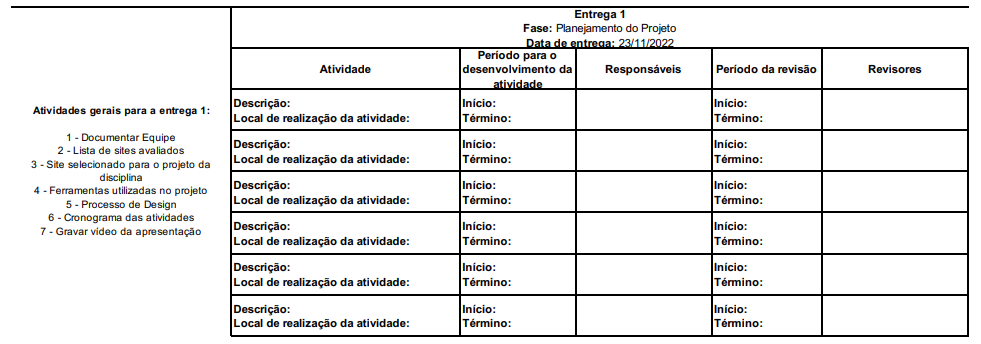

# Ferramentas

Os seguintes recursos foram escolhidos para auxiliar na realização e padronização do projeto:

### Reuniões

| Logo | Nome | Finalidade |
| :---: | :---: | --- |
|  | Discord | Plataforma principal para chamadas de voz e vídeo para alinhamento da equipe. |
|  | Teams   | Plataforma secundária para chamadas de voz e vídeo para alinhamento da equipe.|
|  | OBS Studio | Utilizado para a gravação de tela durante as reuniões de inspeção e alinhamento. |

### Comunicação

| Logo | Nome | Finalidade |
| :---: | :---: | --- |
|  | WhatsApp | Aplicativo utilizado para troca de mensagens rápidas e avisos urgentes. |

### Documentação

| Logo | Nome | Finalidade |
| :---: | :---: | --- |
|  | GitHub | Repositório utilizado para armazenar, organizar e versionar os artefatos produzidos no projeto. |
|  | Visual Studio Code | Ambiente de desenvolvimento (IDE) utilizado para a criação do GitHub Pages e redação da documentação em Markdown. |

### Planejamento e Avaliação 

| Imagem | Nome | Finalidade |
| :---: | :---: | --- |
|  | Livro: Interação Humano-Computador | **Base teórica principal:** BARBOSA, S. D. J. et al. Interação Humano-Computador e Experiência do Usuário. Rio de Janeiro: Autopublicação, 2021. |
|  | Formulário de Avaliação Heurística | **Ferramenta de coleta:** Formulário padronizado do artigo *Avaliação Heurística de Sítios na Web* (Maciel et al.) para registrar contexto, causa, efeito e severidade das falhas. |

### Padronização

| Imagem | Nome | Finalidade |
| :---: | :---: | --- |
|  | Manual ABNT (PUC Minas) | Consulta técnica para a padronização estética do documento, estruturação dos tópicos e formatação correta das referências bibliográficas. |

### Publicação da apresentação

| Imagem | Nome | Finalidade |
| :---: | :---: | --- |
|  | Youtube | Plataforma de vídeo em que ficará disponível a apresentação dos artefatos produzidos em cada fase.|

---

## Referências

[1] BARBOSA, S. D. J. et al. **Interação Humano-Computador e Experiência do Usuário**. 1. ed. Rio de Janeiro: Autopublicação, 2021.

[2] BRASIL. Ministério da Ciência, Tecnologia e Inovações. Modelo de Ata de Reunião. Brasília: MCTI, [202-?]. 1 arquivo PDF. Disponível em: <URL>. Acesso em: 10 abr. 2026

[3] MACIEL, C. et al. **Avaliação heurística de sítios na web**. Niterói: Instituto de Computação - Universidade Federal Fluminense (UFF), [2004?].

[4] PONTIFÍCIA UNIVERSIDADE CATÓLICA DE MINAS GERAIS. Sistema Integrado de Bibliotecas. **Orientações para elaboração de projetos de pesquisa, trabalhos acadêmicos, relatórios técnicos e/ou científicos e artigos científicos**: conforme a Associação Brasileira de Normas Técnicas (ABNT). Belo Horizonte: PUC Minas, 2025.
