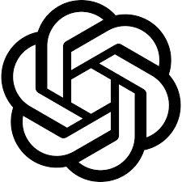
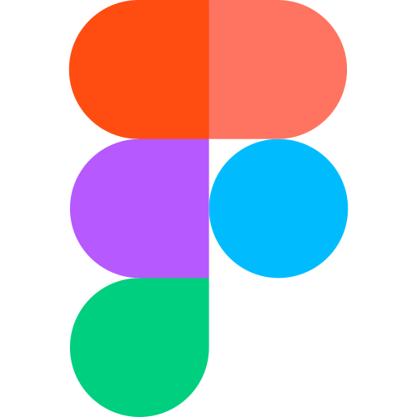

# Ferramentas

## Tabela de contribuição
|Artefato(s) | Autor(es)|
| --- | --- |
| Página de Ferramentas | [Hugo Freitas Silva](https://github.com/HugoFreitass) e [Philipe Amancio](https://github.com/Phill-Chill) |

## Introdução
Os recursos descritos a seguir, apresentados na Tabela I, foram selecionados pelo integrante Philipe Amâncio com base em projetos de outras disciplinas do curso de Engenharia de Software da UnB (Universidade de Brasília) e em trabalhos de IHC de semestres anteriores. O objetivo é auxiliar e padronizar as etapas de planejamento, execução e documentação da análise de Interação Humano-Computador (IHC), garantindo a consistência metodológica e a colaboração eficiente entre os membros da equipe durante o ciclo de vida do projeto.

### Reuniões

<b>Tabela I</b> -  Ferramentas

| Logo | Nome | Finalidade | Fase(s) de utilização|
| :---: | :---: | --- | ---|
| { width="100" } | Discord | Plataforma principal para chamadas de voz e vídeo para alinhamento da equipe. | Planejamento, Coleta dados(referentes a análise inicial da <a>lista de sites</a>), Interpretação, Consolidação e Relato dos Resultados da análise IHC e Processo de  design. |
| { width="100" } | Teams   | Plataforma secundária para chamadas de voz e vídeo para alinhamento da equipe.| Utilizado somente na primeira reunião da fase de plaenejamento.|
| { width="100" } | OBS Studio | Utilizado para a gravação de tela durante as reuniões de inspeção e alinhamento. | Utilizado em reuniões que envolvam decisões de projeto |
| { width="100" } | When2Meet | Utilizado para mapear os horários de disponibilidade dos integrantes do grupo | Utilizado no planejamento incial |

### Comunicação

| Logo | Nome | Finalidade | Fase(s) de utilização|
| :---: | :---: | ---| ---|
| { width="100" } | WhatsApp | Aplicativo utilizado para troca de mensagens rápidas e avisos urgentes. | Será usado durante todo o período de desenvolvimento desse projeto. |

### Inteligência Artificial Generativa
| Logo | Nome | Finalidade | Fase(s) de utilização|
| :---: | :---: | --- | ---|
| { width="100" } | ChatGPT | Aplicativo usado para resumos e melhoria de texto. | Será usado durante todo o período de desenvolvimento desse projeto. |
| { width="100" } | Gemini |  Aplicativo usado para resumos e melhoria de texto. | Será usado durante todo o período de desenvolvimento desse projeto. |

### Documentação

| Logo | Nome | Finalidade | Fase(s) de utilização|
| :---: | :---: | --- | ---|
| { width="100" } | GitHub | Repositório utilizado para armazenar, organizar e versionar os artefatos produzidos no projeto. | Será usado durante todo o período de desenvolvimento desse projeto. |
| { width="100" } | Visual Studio Code | Ambiente de desenvolvimento (IDE) utilizado para a criação do GitHub Pages e redação da documentação em Markdown. | Será usado durante todo o período de desenvolvimento desse projeto. |

### Personas

| Imagem | Nome | Finalidade | Fase(s) de utilização|
| :---: | :---: | --- | ---|
| { width="100" } | This Person Does Not Exist | Gerador de faces sintéticas utilizado para ilustrar o elenco de personas| Utilizado na atividade de análise de identificação de necessidades dos usuários e requisitos de IHC |

### Protótipos

| Imagem | Nome | Finalidade | Fase(s) de utilização|
| :---: | :---: | --- | ---|
| { width="90" } | Figma | Plataforma de construção de modelos gráficos |

### Publicação da apresentação

| Imagem | Nome | Finalidade | Fase(s) de utilização|
| :---: | :---: | --- | ---|
| { width="100" } | Youtube | Plataforma de vídeo em que ficará disponível a apresentação dos artefatos produzidos em cada fase.| Utilizado nos perídos de entregas |

---
> **Fonte:** elaboração própria

## Histórico de Versão
| Versão | Data | Descrição | Autores | Data Revisão | Descrição Revisão | Revisores |
| :---: | :---: | :--- | :--- | :---: | :--- | :--- |
| 1.0 | 11/04/2026 | Criação do documento | [Philipe Amancio](https://github.com/Phill-Chill) | 11/04/2026 | Revisão da estrutura inicial e do conteúdo base do documento de ferramentas | [Ingrid Alves](https://github.com/alvesingrid) |
| 1.1 | 22/04/2026 | Adição do historico de versão | [Ingrid Alves](https://github.com/alvesingrid) | 22/04/2026 | Checagem da tabela de versões e da ordem dos registros no documento de ferramentas | [Hugo Freitas Silva](https://github.com/HugoFreitass) |
| 1.2 | 24/04/2026 | Adequação da página ao feedback do professor | [Philipe Amancio](https://github.com/Phill-Chill) | - | Conferência dos ajustes do documento de ferramentas conforme o feedback recebido | - |
| 1.3 | 15/05/2026 | Adição da rastreabilidade dos autores dos artefatos | [Philipe Amancio](https://github.com/Phill-Chill) | 15/05/2026 | Validação dos links e créditos de autoria no documento de ferramentas | C |
| 1.4 | 07/06/2026 | Adição da ferramenta "Figma" e da foto da ferramenta "This Person Does Not Exist" | [Hugo Freitas Silva](https://github.com/HugoFreitass) | 07/06/2026 | Verificação geral das ferramentas descritas | [Philipe Amancio](https://github.com/Phill-Chill) |

