# Análise de Tarefas

## Introdução

Conforme destacado na **Imagem 1**, uma **análise de tarefas** é utilizada para se ter um entendimento sobre qual é o trabalho dos usuários, como eles o realizam e por quê. Nesse tipo de análise, o trabalho é definido em termos dos objetivos que os usuários querem ou precisam atingir em seu contexto (BARBOSA et al., 2021, p. 177)[PRINT] .

> *Legenda: Imagem 1 Fonte: (BARBOSA et al., 2021, p. 177).*

Além disso, como referenciado na **Imagem 2**, na área de Interação Humano-Computador (IHC), a análise de tarefas pode ser empregada em três atividades habituais do projeto: para a análise da situação atual (seja ela apoiada ou não por um sistema computacional), para o (re)design de um sistema computacional ou para a avaliação do resultado de uma intervenção que inclua a introdução de um (novo) sistema computacional. O texto ilustrado também ressalta que, quando o objetivo é avaliar um sistema computacional existente, a análise de tarefas pode ser bem concreta, descrevendo o comportamento do usuário de forma detalhada (BARBOSA et al., 2021, p. 178)[PRINT]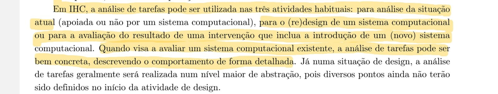 .

> *Legenda: Imagem 2 Fonte: (BARBOSA et al., 2021, p. 178).*

# Análise Hierárquica de Tarefas (HTA)

## Introdução

A Análise Hierárquica de Tarefas (HTA - *Hierarchical Task Analysis*) foi desenvolvida na década de 1960 para entender as competências e habilidades exibidas em tarefas complexas e não repetitivas, bem como para auxiliar na identificação de problemas de desempenho. Ela ajuda a relacionar o que as pessoas fazem (ou se recomenda que façam), por que o fazem, e quais as consequências caso não o façam corretamente. Diferente das abordagens de sua época, o método se baseia em psicologia funcional, e não comportamental (BARBOSA et al., 2021)[PRINT]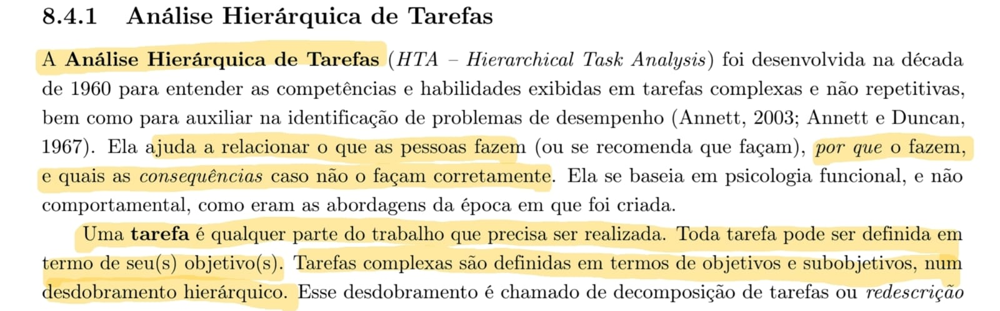 .

> *Legenda: Imagem 3 Fonte: (BARBOSA et al., 2021, p 178).*

Na HTA, uma **tarefa** é qualquer parte do trabalho que precisa ser realizada, e toda tarefa pode ser definida em termos de seu(s) objetivo(s). Tarefas complexas são definidas em termos de objetivos e subobjetivos, em um desdobramento hierárquico que é chamado de decomposição de tarefas ou redescrição. No nível mais baixo da hierarquia de objetivos, cada subobjetivo é alcançado por uma **operação**, que é considerada a unidade fundamental em HTA. Esses elementos são organizados em diagramas que demonstram as relações estruturais do plano, que podem ser do tipo sequencial (1>2), seleção (1/2) ou paralelo (1+2) (BARBOSA et al., 2021)[PRINT] .

> *Legenda: Imagem 4 Fonte: (BARBOSA et al., 2021, p 179).*

A aplicação prática do método resulta na construção de uma árvore visual de decomposição. O diagrama parte de um objetivo geral no topo (por exemplo, "0. Cadastrar projeto final") e ramifica-se para subobjetivos e operações numeradas, explicitando os planos de execução e o fluxo que o usuário deve percorrer para concluir o trabalho (BARBOSA et al., 2021)[PRINT] .

> *Legenda: Imagem 5 Fonte: (BARBOSA et al., 2021, p 181).*

# Análise de Tarefas: Método GOMS

## Introdução ao GOMS

Conforme destacado na **Imagem 5**, o GOMS é um método utilizado para descrever uma tarefa e o conhecimento do usuário sobre como realizá-la, estruturando-se em quatro componentes fundamentais: objetivos (*goals*), operadores (*operators*), métodos (*methods*) e regras de seleção (*selection rules*). Os **objetivos** representam exatamente o que o usuário deseja realizar utilizando o software, como, por exemplo, editar um texto. (BARBOSA et al., 2021)[PRINT] 

> *Legenda: imagem 5 Fonte: (BARBOSA et al., 2021, p 181).*

Detalhando esses componentes na **Imagem 6**, os **operadores** são descritos como primitivas internas (ações cognitivas) ou externas (ações concretas permitidas pelo software, como digitar no teclado ou clicar em um botão). Os **métodos** consistem em sequências bem conhecidas de subobjetivos e operadores que permitem atingir um objetivo maior. Quando existe mais de um método viável, aplicam-se as **regras de seleção**, que representam a tomada de decisão do usuário sobre qual caminho utilizar em uma determinada situação. (BARBOSA et al., 2021)[PRINT]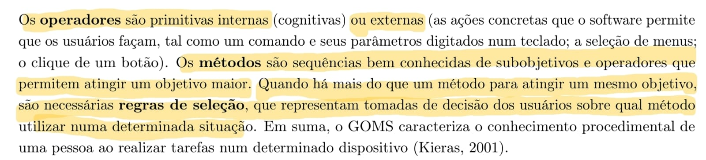 

> *Legenda: imagem 6 Fonte: (BARBOSA et al., 2021, p 182).*

A **Imagem 7** ressalta que, dentro da família de modelos baseados em GOMS, existem variações com diferentes níveis de complexidade e foco. Destacam-se as técnicas KLM (Card et al., 1983), CMN-GOMS (Card et al., 1983) e CPM-GOMS (John e Gray, 1995). (BARBOSA et al., 2021)[PRINT]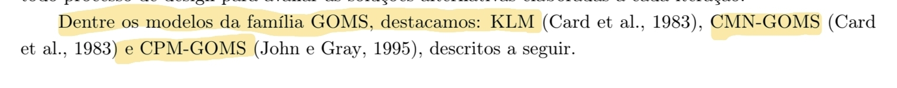 

> *Legenda: Imagem 7 Fonte: (BARBOSA et al., 2021, p 182).*

---

## KLM (Keystroke-Level Method)

De acordo com a **Imagem 8**, o KLM é a técnica mais simples da família GOMS e atua de forma limitada a um conjunto predefinido de operadores primitivos. Estes operadores incluem: **K** (pressionar tecla ou botão), **P** (apontar com o mouse), **H** (mover as mãos para o teclado ou dispositivo), **D** (desenhar um segmento de reta), **M** (preparação mental para realizar uma ação) e **R** (tempo de resposta do sistema onde o usuário deve esperar). (BARBOSA et al., 2021)[PRINT]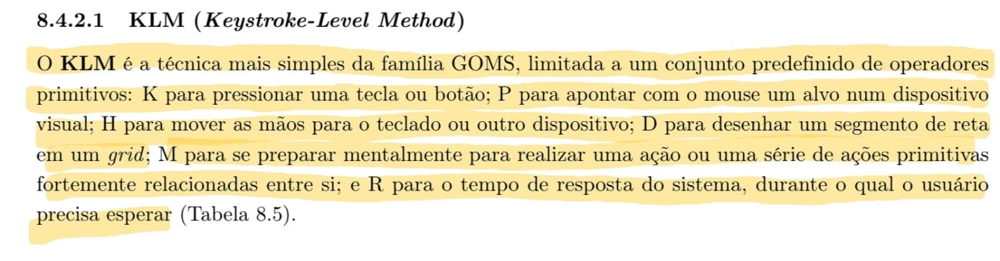 

> *Legenda: Imagem 8 Fonte: (BARBOSA et al., 2021, p 182).*

A **Imagem 5** ilustra a Tabela 8.5, que atribui durações médias (em segundos) para cada uma dessas operações do KLM. Por exemplo, a operação **K** (teclar) varia de 0,08s para um exímio digitador até 1,20s para alguém não familiarizado com o teclado, enquanto a preparação mental (**M**) consome em média 1,20s. (BARBOSA et al., 2021)[PRINT]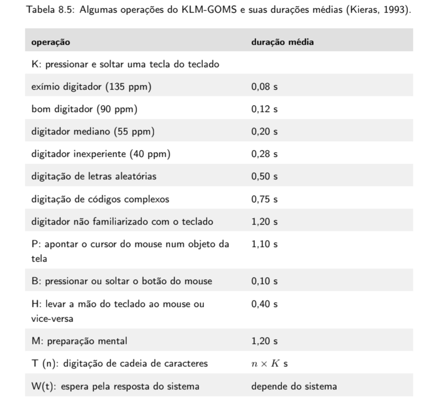 

> *Legenda: Imagem 9 Fonte: (BARBOSA et al., 2021, p 183).*

A aplicação prática desses valores pode ser observada na **Imagem 10**, que demonstra o cálculo total de tempo para a tarefa de "Salvar arquivo". A análise compara diferentes métodos: usar o menu "Arquivo > Salvar" (totalizando 4,60s), clicar no botão de salvar na barra de ferramentas (3,10s) ou usar as teclas de atalho Ctrl+S (1,60s). (BARBOSA et al., 2021)[PRINT]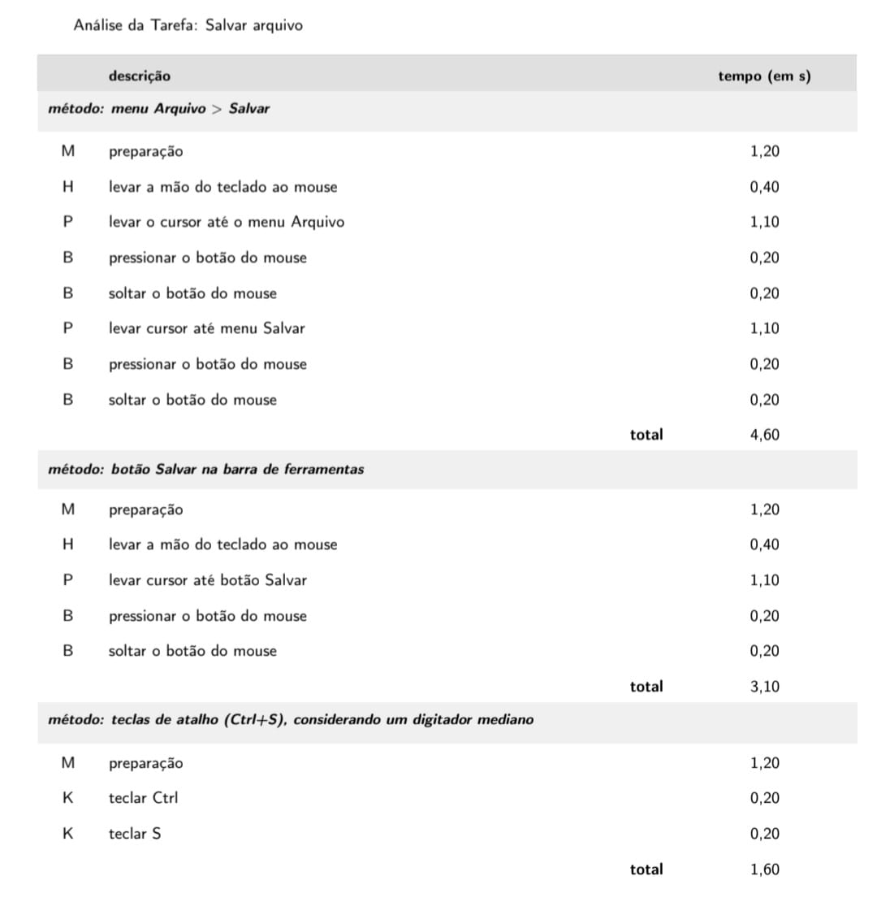 

> *Legenda: Imagem 10 Fonte: (BARBOSA et al., 2021, p 184).*

---

## CMN-GOMS

Como descrito na **Imagem 11**, o CMN-GOMS refere-se à proposta original do método GOMS. Neste modelo, exige-se uma hierarquia estrita de objetivos, onde os operadores são executados estritamente em ordem sequencial. Os métodos são documentados utilizando uma notação muito semelhante a um pseudocódigo computacional, incorporando submétodos e estruturas condicionais. (BARBOSA et al., 2021)[PRINT]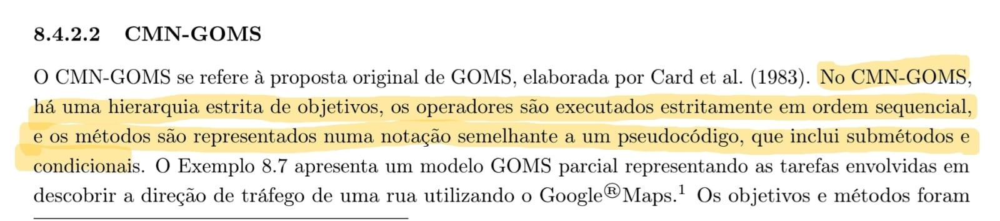 

> *Legenda: Imagem 11 Fonte: (BARBOSA et al., 2021, p 184).*

A **Imagem 12** apresenta o Exemplo 8.7, que demonstra um modelo CMN-GOMS sem detalhes para a tarefa de "descobrir a direção de tráfego de uma rua" no Google Maps. O objetivo principal (GOAL 0) é decomposto em subobjetivos (GOAL 1 e GOAL 2), oferecendo métodos alternativos de navegação que são condicionados por regras de seleção (SEL. RULE) baseadas no nível de conhecimento do usuário sobre o local. (BARBOSA et al., 2021)[PRINT] 

> *Legenda: Imagem 12 Fonte: (BARBOSA et al., 2021, p 185).*

Por fim, as **Imagens 13 e 14** expõem o Exemplo 8.8, que é o desdobramento aprofundado do modelo anterior. Este modelo detalhado expande os métodos até o nível mais granular das operações (OP.), como "deslocar o cursor do mouse" (OP. 1.A.A.1) ou "girar a roda do mouse para a frente" (OP. 1.A.A.2), mapeando de forma exaustiva todas as regras de seleção e passos físicos necessários para cumprir a meta no sistema. 
(BARBOSA et al., 2021)[PRINT]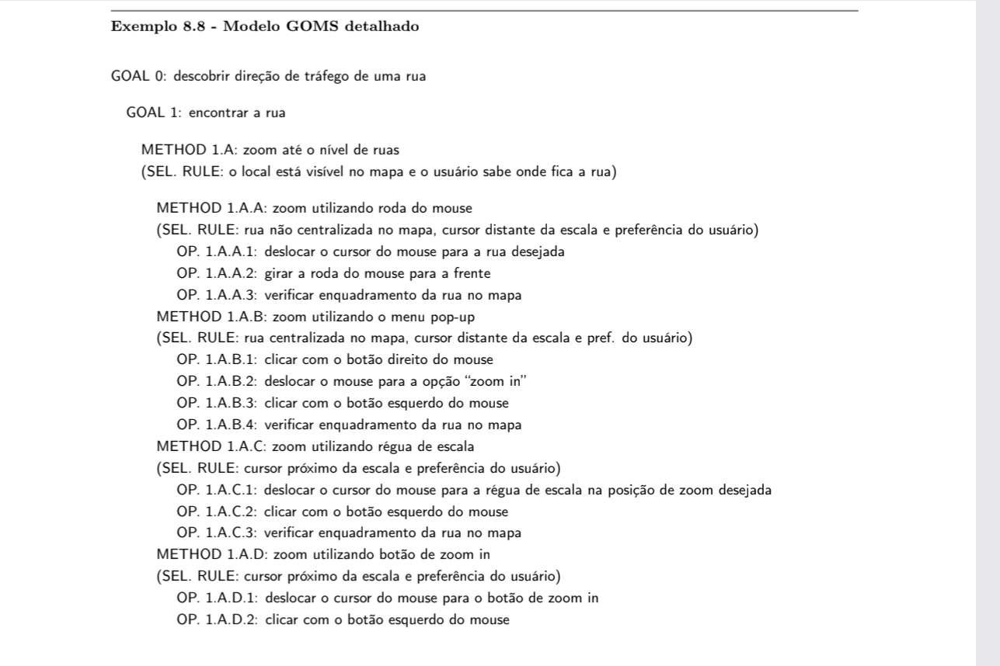 
(BARBOSA et al., 2021)[PRINT]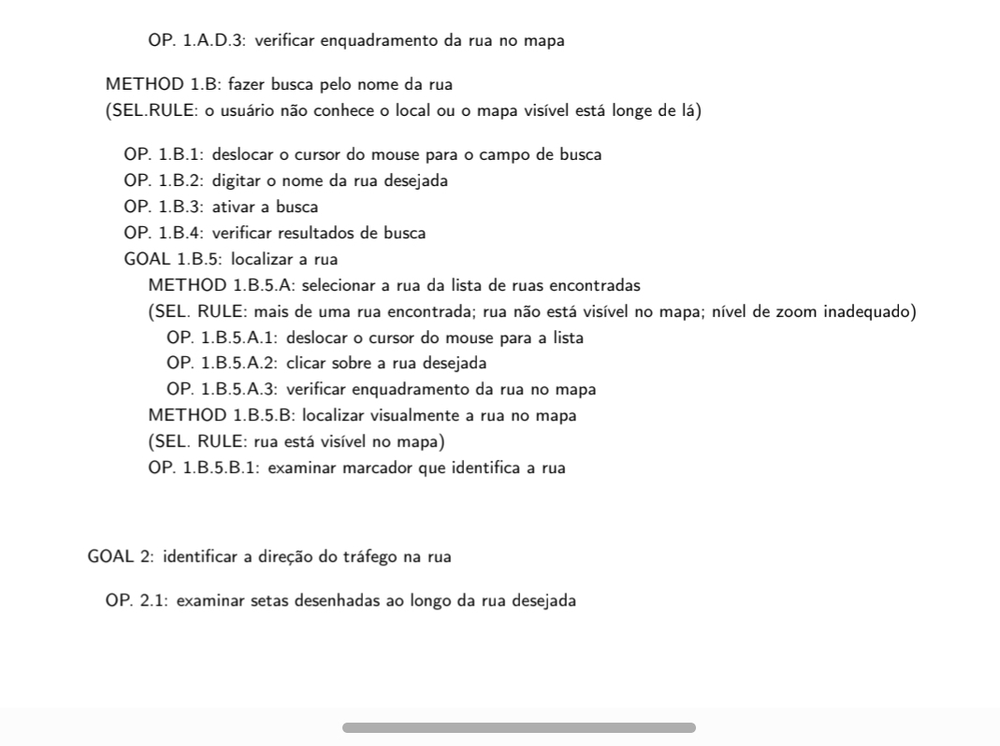 

> *Legenda: Imagens 13 e 14 Fonte: (BARBOSA et al., 2021, p 185).*

## CPM-GOMS

Conforme detalhado na **Imagem 15**, a sigla CPM-GOMS tem dupla origem: ela representa os operadores *cognitivos, perceptivos e motores*, e também faz referência à abordagem do *Critical Path Method* (técnica de análise do caminho crítico). Esta versão do GOMS baseia-se diretamente no processador humano de informações (MHP) e em seu modelo de estágios paralelos. Diferente das abordagens anteriores, o CPM-GOMS não pressupõe que os operadores sejam executados de forma estritamente sequencial; pelo contrário, atividades cognitivas, perceptivas e motoras podem ocorrer em paralelo, dependendo da natureza da tarefa. (BARBOSA et al., 2021)[PRINT]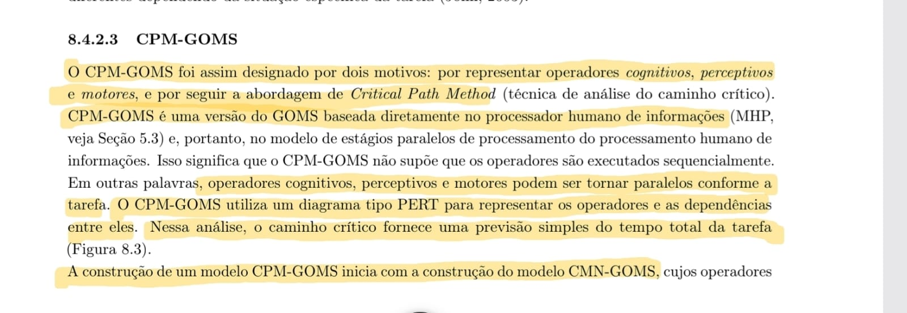 

> *Legenda: Imagem 15 Fonte: (BARBOSA et al., 2021, p 186).*

A **Imagem 12** apresenta a Figura 8.3, que ilustra como o CPM-GOMS utiliza um diagrama do tipo PERT para mapear visualmente os operadores e suas dependências. Neste diagrama, é possível observar linhas do tempo paralelas para diferentes recursos do processamento humano, como visão, cognição, mão direita, mão esquerda e movimento dos olhos. O "caminho crítico" traçado através dessas dependências fornece uma previsão simples do tempo total necessário para concluir a tarefa de interação. (BARBOSA et al., 2021)[PRINT] 

> *Legenda: Imagem 16 Fonte: (BARBOSA et al., 2021, p 187).*

Por fim, a **Imagem 17** complementa a explicação metodológica afirmando que a construção de um modelo CPM-GOMS se inicia a partir de um modelo CMN-GOMS prévio. Os operadores identificados inicialmente são então classificados de forma mais aprofundada nas categorias do MHP (cognitivos, perceptivos e motores). A cada um desses operadores é atribuída uma duração estimada. Somando-se esses valores ao longo do caminho crítico, calcula-se o tempo previsto de execução da tarefa, o que possibilita aos designers realizar análises qualitativas da relação entre os aspectos do design e o tempo de execução, além de simular soluções alternativas. (BARBOSA et al., 2021)[PRINT] 

> *Legenda: Imagem 17 Fonte: (BARBOSA et al., 2021, p 187).*

# Árvores de Tarefas Concorrentes (ConcurTaskTrees – CTT)

## Introdução ao CTT

Conforme destacado na **Imagem 18**, o modelo de árvores de tarefas concorrentes (ConcurTaskTrees – CTT) foi criado para auxiliar a avaliação e o design de IHC. Nesse modelo, existem quatro tipos de tarefas: *tarefas do usuário* (realizadas fora do sistema), *tarefas do sistema* (em que o sistema realiza um processamento sem interagir com o usuário), *tarefas interativas* (em que ocorrem os diálogos usuário–sistema) e *tarefas abstratas* (que não são tarefas em si, mas sim uma representação de uma composição de tarefas). Assim como na análise hierárquica, a leitura do modelo exige que, para considerar uma tarefa principal realizada, suas tarefas subordinadas devem ter sido realizadas (BARBOSA et al., 2021)[PRINT] .

> *Legenda: Imagem 18. Fonte: (BARBOSA et al., 2021, p 187).*

A **Imagem 19** ilustra a representação visual na notação CTT. A Figura 8.4a apresenta os ícones específicos para cada um dos quatro tipos de tarefas (usuário, sistema, interativa e abstrata). Já a Figura 8.4b demonstra a estrutura hierárquica clássica do modelo, conectando uma tarefa abstrata raiz (T1) às suas tarefas subordinadas (T2 e T3) (BARBOSA et al., 2021)[PRINT] .

> *Legenda: Imagem 19. Fonte: (BARBOSA et al., 2021, p 187).*

Além da hierarquia estrita, a **Imagem 20** demonstra que o CTT permite representar diversas relações lógicas e temporais entre as tarefas, aumentando consideravelmente a expressividade da notação. As principais relações descritas são: ativação (`>>`), ativação com passagem de informação (`[]>>`), escolha entre tarefas alternativas (`[]`), tarefas concorrentes (`|||`), tarefas concorrentes e comunicantes (`|[]|`), tarefas independentes (`|=|`), desativação (`[>`) e suspensão/retomada (`|>`) (BARBOSA et al., 2021)[PRINT]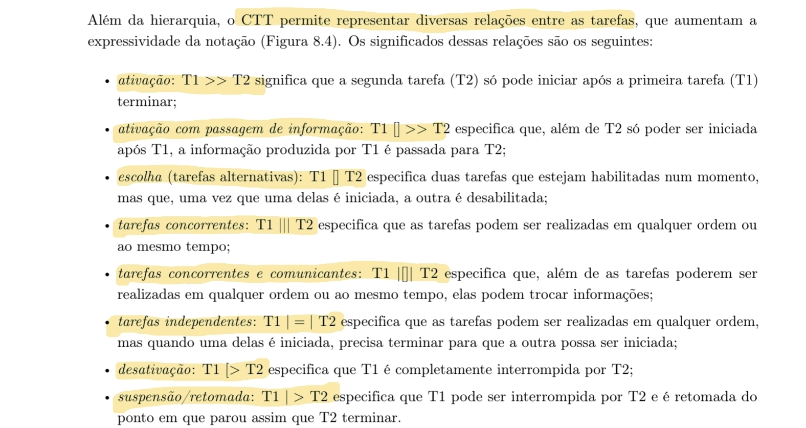 .

> *Legenda: Imagem 20. Fonte: (BARBOSA et al., 2021, p 188).*

Para facilitar o entendimento visual dessas conexões, a **Imagem 21** exibe a Figura 8.5, que mapeia graficamente cada uma das relações entre tarefas no CTT. Os símbolos textuais correspondentes a cada tipo de interação (como concorrência ou escolha) são posicionados nas linhas que unem os nós das tarefas (BARBOSA et al., 2021)[PRINT] .

> *Legenda: Imagem 21. Fonte: (BARBOSA et al., 2021, p 188).*

Por fim, a **Imagem 22** consolida todos esses conceitos por meio da Figura 8.6, apresentando um exemplo prático de um modelo de tarefas em CTT para o objetivo de "Agendar compromisso". O diagrama detalha como a tarefa abstrata no topo da hierarquia se decompõe em subtarefas específicas (como examinar compromissos, informar dados e gravar no sistema), interligando diferentes tipos de tarefas (usuário, interativa e de sistema) através das relações de ativação, passagem de informação e concorrência (BARBOSA et al., 2021)[PRINT] .

> *Legenda: Imagem 22. Fonte: (BARBOSA et al., 2021, p 189).*

---

## Referências

* **Fonte:** BARBOSA, S. D. J.; SILVA, B. S. da; SILVEIRA, M. S.; GASPARINI, I.; DARIN, T.; BARBOSA, G. D. J. *Interação Humano-Computador e Experiência do Usuário*. Rio de Janeiro: Autopublicação, 2021. (Capítulo 8).

---
## Histórico de Versão
| Versão | Data | Descrição | Autor | Revisor |
| :--- | :--- | :--- | :--- | :--- |
| 1.0 | 1/05/2026 | Criação do documento |[Maria Laura](https://github.com/Maria-Laura-Regis)|  |
---