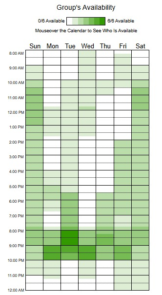

## Análise do Heatmap de Disponibilidade

O heatmap apresenta a disponibilidade dos integrantes do grupo ao longo da semana, com horários distribuídos entre 8h e 24h. A intensidade da cor verde indica maior número de pessoas disponíveis, enquanto tons mais claros ou ausência de cor representam baixa ou nenhuma disponibilidade.

Observa-se que:
- Os períodos noturnos, especialmente entre 19h e 22h, concentram maior disponibilidade.
- Durante a manhã e início da tarde, há menor consistência na presença dos participantes.
- Alguns dias da semana apresentam lacunas significativas, sugerindo dificuldade de alinhamento nesses períodos.

De forma geral, o melhor intervalo para agendamento de atividades em grupo está no período da noite, onde há maior convergência de disponibilidade, especialmente terça-feira entre 20h e 21h.

**Com base nisso definimos a reunião semanal fixa: Terça-feira 20h.**

