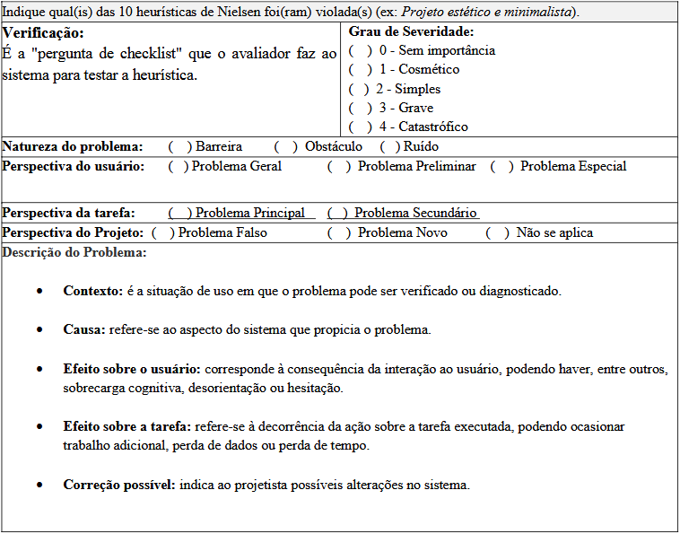

## Introdução
Uma avaliação de IHC (Interação Humano-Computador) é essencial para garantir a qualidade de um software, sendo útil para identificar problemas de interface e corrigi-los antes da entrega final. A avaliação de IHC parte das necessidades dos stakeholders e dos requisitos do projeto, ela atua na verificação e validação de uma interface, envolve aspectos técnicos e humanos, e deve ser abordada em três perspectivas: a de quem concebe a solução, de quem a utiliza e de quem a constrói. Por isso, é fundamental planejar uma avaliação que seja capaz de fornecer esta visão plurilateral e sociotécnica 

## Metodologia de avaliação
O planejamento da avaliação será estruturado com base no framework DECIDE, que define o processo de uma avaliação de IHC se baseando nos seguintes passos (BARBOSA et al., 2021): 

- D: determinar os objetivos da avaliação
- E:  explorar perguntas a serem respondidas com a avaliação.
- C: (choose) escolher os métodos de avaliação
- I: identificar e gerir as questões práticas da avaliação.
- D: decidir como lidar com as questões éticas
- E: (evaluate) avaliar, interpretar e apresentar os resultados

Ainda utilizamos o formulário apresentado no **Quadro I**, para padronização das análises.

Quadro - I Formulário de identificação de violações de heurísticas

Fonte: MACIEL et al. ([2004?], p. 13).

#### Definições para classificação de problemas

Para o preenchimento dos relatórios de inspeção, serão utilizadas as seguintes definições e critérios baseados em **Maciel et al. ([2004?])** e na escala de **Nielsen (1994 *apud* MACIEL et al., [2004?])**.

##### 1. Natureza do Problema
Determina a recorrência e o impacto no aprendizado do usuário.

| Classificação | Descrição |
| :--- | :--- |
| **Barreira** | Aspecto onde o usuário esbarra sucessivas vezes e não aprende a superá-lo. O erro persiste em futuras realizações da tarefa. |
| **Obstáculo** | Aspecto onde o usuário esbarra, mas aprende a superá-lo após o contato inicial. |
| **Ruído** | Aspecto que diminui o desempenho na tarefa e gera uma má impressão do sistema, sem necessariamente impedir a conclusão. |

##### 2. Perspectiva da Tarefa e do Usuário
Define o alcance do problema conforme o contexto de uso.

* **Perspectiva da Tarefa:**
    * **Principal:** Atrapalha tarefas frequentes ou de alta importância.
    * **Secundário:** Atrapalha tarefas pouco frequentes ou de baixa importância.
* **Perspectiva do Usuário:**
    * **Geral:** Afeta qualquer tipo de usuário.
    * **Preliminar:** Afeta usuários novatos ou intermediários.
    * **Especial:** Afeta usuários com necessidades especiais (acessibilidade).

##### 3. Perspectiva do Projeto (Categorias de Revisão)
> **Observação:** Estas categorias não devem ser preenchidas na primeira avaliação heurística.
* **Falso Problema:** Aspecto classificado como erro que, na realidade, não traz prejuízo ao usuário ou à tarefa.
* **Novo:** Problema que surgiu como consequência direta da correção de um erro anterior.

##### 4. Graus de Severidade
Utilizado para priorizar o esforço de correção do sistema.

| Grau | Classificação | Definição |
| :---: | :--- | :--- |
| **0** | **Sem Importância** | Não afeta a operação; não é necessariamente um problema de usabilidade. |
| **1** | **Cosmético** | Reparo de baixa prioridade, realizado apenas se houver tempo disponível. |
| **2** | **Simples** | Problema de baixa prioridade de correção. |
| **3** | **Grave** | Alta prioridade; deve ser reparado para evitar prejuízo à experiência. |
| **4** | **Catastrófico** | Impeditivo; deve ser reparado obrigatoriamente antes da disponibilização. |

#### Lista de heurísticas

Para a análise da interface, serão consideradas as dez heurísticas de usabilidade propostas por Nielsen (BARBOSA et al., 2021):

* **Visibilidade do estado do sistema:** O sistema deve sempre manter os usuários informados sobre o que está acontecendo através de feedback adequado e em tempo hábil.
* **Correspondência entre o sistema e o mundo real:** O sistema deve utilizar palavras, expressões e conceitos familiares ao usuário, evitando jargões técnicos. Deve-se seguir convenções do mundo real, apresentando informações em ordem lógica e natural.
* **Controle e liberdade do usuário:** Caso o usuário realize ações equivocadas, o sistema deve oferecer uma "saída de emergência" clara para abandonar o estado indesejado sem diálogos extensos. Deve permitir as funções de desfazer e refazer.
* **Consistência e padronização:** O usuário não deve ter dúvidas se palavras ou ações diferentes significam a mesma coisa. É necessário seguir as convenções da plataforma ou ambiente computacional.
* **Reconhecimento em vez de memorização:** Objetos, ações e opções devem estar visíveis. O usuário não deve precisar memorizar informações de uma parte da aplicação para usar em outra. Instruções de uso devem estar facilmente acessíveis.
* **Flexibilidade e eficiência de uso:** Aceleradores (atalhos) — muitas vezes imperceptíveis ao usuário novato — podem tornar a interação mais rápida para o experiente. O sistema deve permitir a customização de ações frequentes.
* **Projeto estético e minimalista:** As interfaces não devem conter informações irrelevantes ou raramente necessárias. Cada unidade extra de informação compete com as unidades importantes pela atenção do usuário.
* **Prevenção de erros:** Mais eficiente do que boas mensagens de erro é um projeto cuidadoso que evite que os problemas ocorram em primeiro lugar.
* **Ajuda aos usuários para reconhecerem, diagnosticarem e recuperarem-se de erros:** As mensagens de erro devem ser expressas em linguagem clara (sem códigos), indicar precisamente o problema e sugerir uma solução construtiva.
* **Ajuda e documentação:** Embora o ideal seja um sistema intuitivo, a documentação deve ser oferecida. Ela deve ser fácil de consultar, focada na tarefa, fornecer passos concretos e não ser excessivamente extensa.
___

## LISTA DE SITES AVALIADOS

#### Beto Carrero World <a href = "https://www.betocarrero.com.br/?grvclid=c0479bdd300dcb0&grv_iai=908065&gad_source=1&gad_campaignid=23327651929">(link de acesso)</a>

O site oficial do Beto Carrero World é uma plataforma de e-commerce voltada para a venda de passaportes, serviços de alimentação e opcionais de lazer. 

Durante a avaliação, foram identificadas falhas críticas na arquitetura de informação, como o agrupamento semântico incorreto de itens (ex: serviços de alimentação categorizados sob o rótulo de "Passaportes"). Além disso, o sistema apresenta inconsistências na visibilidade do estado, dificultando a distinção entre botões de navegação e botões de ação final. Essas violações de heurísticas elevam a carga cognitiva e podem induzir o usuário ao erro durante o fluxo de fechamento do pedido.

[ [Analise Detalhada](betoCarrero.md) realizada por Philipe Amâncio e Hugo Freitas. ]

----

#### Receita Federal do Brasil <a href = "https://servicos.receitafederal.gov.br/">(link de acesso)</a>

O portal da Receita Federal representa um ecossistema complexo de serviços governamentais, sendo um objeto de estudo crítico para a análise de IHC devido à sua natureza institucional e à diversidade de perfis atendidos, desde o contribuinte iniciante até o profissional autônomo.

A avaliação por inspeção revelou que, embora o sistema seja funcional, ele padece de uma "infoxicação" (excesso de informação), onde a falta de hierarquia visual e o ruído de conteúdos institucionais obscurecem as tarefas principais. Foram identificadas violações severas de usabilidade, especialmente no mecanismo de busca, que ignora a **Correspondência com o Mundo Real** ao utilizar termos estritamente burocráticos. A análise também destaca falhas na **Prevenção de Erros** em formulários e serviços digitais, onde a ausência de mensagens orientadas à solução gera obstáculos que impactam diretamente a eficácia da tarefa e a autonomia do cidadão.

[ [Analise Detalhada](ReceitaFederal.md) realizada por Hugo Freitas. ]

#### Laboratório Sabin <a href="https://www.sabin.com.br/">(link de acesso)</a>

O portal do Laboratório Sabin representa um ecossistema essencial de serviços de saúde digital, sendo um objeto de estudo crítico para a análise de IHC devido à sua importância operacional e à diversidade de perfis atendidos, que variam desde pacientes particulares com alta instrução tecnológica até idosos e familiares que priorizam a facilidade e a segurança na navegação.

A avaliação por inspeção revelou que, embora o sistema atenda ao seu propósito institucional, ele apresenta problemas moderados e graves de usabilidade que afetam a fluidez das tarefas diárias. Foram identificadas violações significativas no fluxo de agendamento de exames, que falha na **Correspondência entre o sistema e o mundo real** e na **Flexibilidade e eficiência de uso** devido a passos excessivos e termos confusos. A análise também destaca problemas na **Visibilidade do status do sistema** e no **Projeto estético e minimalista**, onde a mistura de conteúdos institucionais de marketing com serviços essenciais gera uma sobrecarga visual (ruído). Esses obstáculos dificultam o acesso rápido aos resultados e a localização de unidades, impactando diretamente a autonomia e a eficiência do usuário final.

[ [Análise Detalhada](sabin.md) realizada por Hugo. ]

## Referências

 BARBOSA, S. D. J. et al. **Interação Humano-Computador e Experiência do Usuário**. 1. ed. Rio de Janeiro: Autopublicação, 2021.

 MACIEL, C. et al. **Avaliação heurística de sítios na web**. Niterói: Instituto de Computação - Universidade Federal Fluminense (UFF), [2004?]. 

## Histórico de Versão

| Versão | Data | Descrição | Autor | Revisor |
| :--- | :--- | :--- | :--- | :--- |
| 1.0 | 11/04/2026 | Criação do documento | [Vitor Evangelista](https://github.com/SemC0ndicao) | [Ingrid Alves](https://github.com/alvesingrid) |
| 1.1 | 22/04/2026 | Adição do histórico de versão | [Ingrid Alves](https://github.com/alvesingrid) | [Hugo Freitas Silva](https://github.com/HugoFreitass) |
| 1.2 | 24/04/2026 | Adequação ao feedback do professor | [Philipe Amancio](https://github.com/Phill-Chill) |  |
| 1.3 | 01/05/2026 | Adição de avaliações | [Maria Laura](https://github.com/Maria-Laura-Regis) |  |