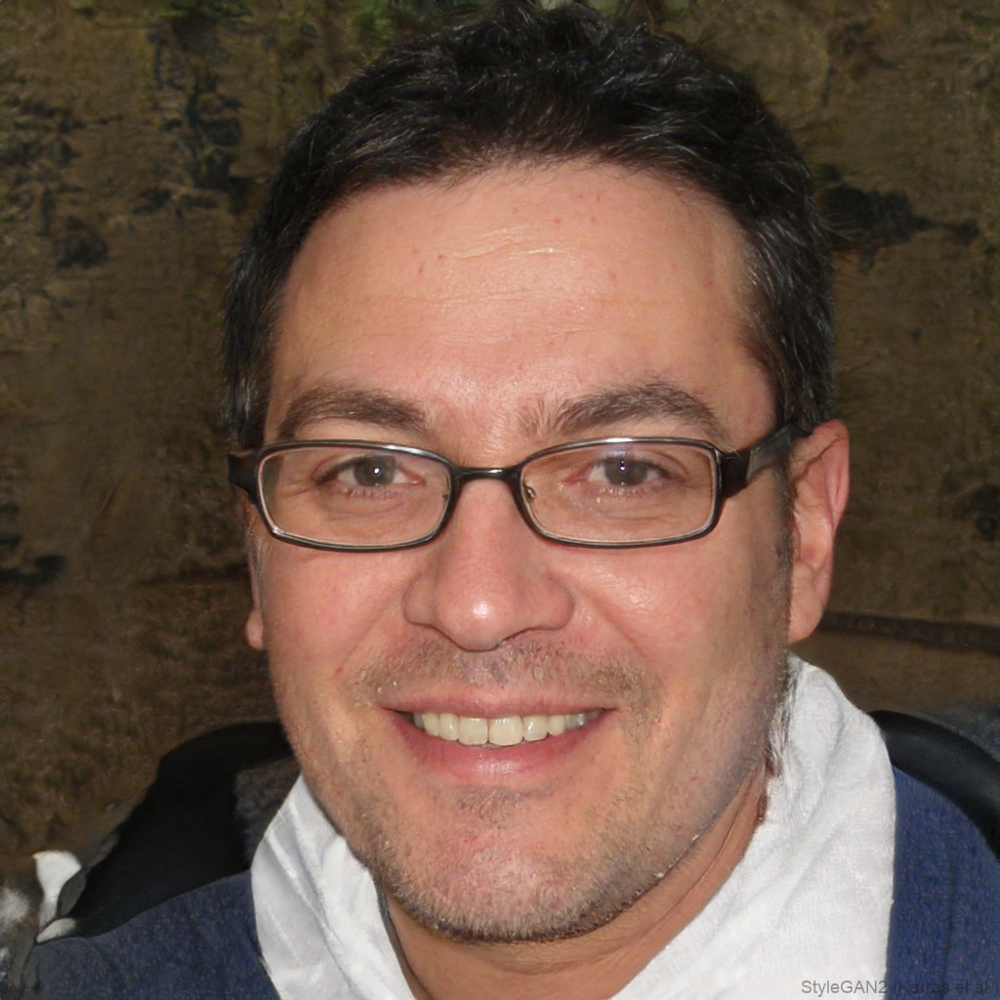

## Introdução

Uma **persona** é um personagem fictício e um arquétipo hipotético que representa um grupo de usuários reais, criada com o objetivo de descrever um usuário típico do sistema. Sua principal função é materializar o público-alvo durante as discussões de design, garantindo que toda a equipe técnica e de negócios mantenha o foco no mesmo alvo, evitando abstrações. Essas representações são construídas e definidas fundamentalmente por seus objetivos, que são lapidados por meio de refinamentos sucessivos durante a investigação do domínio do usuário (BARBOSA et al., 2021)[PRINT] .

A criação de personas serve para combater o problema do "usuário elástico", um termo genérico e impreciso que frequentemente resulta em sistemas confusos, que tratam a mesma pessoa ora como iniciante, ora como especialista, conforme a conveniência da programação. Tentar ampliar a funcionalidade de um produto para agradar a todos os pontos de vista costuma colocar obstáculos na jornada, interferindo no desempenho e arruinando a experiência. Por isso, em vez de criar um sistema genérico que se diz "amigável para o usuário", o design eficiente exige projetar para uma persona bem específica, garantindo que o sistema se adapte às necessidades dela, e não o contrário (BARBOSA et al., 2021)[PRINT] .

> Autor(es): Philipe Amâncio

## Persona: 

> ### Roberto (Médico Clínico Geral)

| Categoria | Detalhes do Perfil |
| :--- | :--- |
|**Foto**| {width="600"}|
| **Identidade** | **Nome:** Roberto   **Idade:** 36 anos   **Sexo:** Masculino   **Localização:** Brasília, DF   **Status Socioeconômico:** Classe Alta   **Status na Pesquisa:** Persona Primária |
| **Perfil Geral** | Médico clínico geral extremamente ocupado (atende 1 paciente a cada 20/30 min). Acessa o sistema durante a consulta, com o paciente à frente, para verificar exames e decidir a conduta médica de forma ágil e segura. |
| **Educação e Aprendizado** | **Formação:** Graduação em Medicina   **Nível de Leitura / Digital:** Alto / Alta facilidade   **Preferência de Aprendizado:** Explorar sozinho (Prático).   **Observação:** Exige sistemas intuitivos; delega o uso de manuais à secretária. |
| **Experiência Profissional** | **Cargo:** Clínico Geral (12 anos na área, 8 anos na clínica atual).   **Responsabilidades:** Diagnóstico, prescrição e acompanhamento de crônicos.   **Plano de Carreira:** Expandir pacientes particulares e focar em medicina preventiva. |
| **Relação com Tecnologia** | **Nível:** Médio a Alto (>10 anos de uso no trabalho).   **Dispositivos:** Smartphone, Notebook e Desktop de última geração.   **Sistemas:** Prontuário eletrônico, prescrição digital, WhatsApp.   **Conexão:** Wi-Fi de alta velocidade na clínica (não tem tempo para acionar suporte TI). |
| **Experiência com Sistemas** | **Uso Atual:** Acessa portais de laboratórios periodicamente ao longo do dia.   **Pontos Positivos:** Visualizadores DICOM rápidos direto no navegador.   **Frustrações:** Falta de responsividade celular, múltiplos cliques, reautenticação constante.   **Preferência:** Autenticação biométrica (FaceID) e botões de ação (ex: "Baixar Laudo") em destaque. |
| **Objetivos** | **Finais:** Acessar laudos 100% digitais, ver imagens em alta resolução e tomar decisões precisas.   **De Experiência:** Sentir-se ágil, moderno e sem estresse tecnológico (luta contra interface).   **De Vida:** Ser reconhecido como resolutivo e manter equilíbrio pessoal/profissional (não sair tarde do consultório por atrasos no sistema). |
| **Habilidades e Tarefas** | **Competências:** Interpretação clínica, patologia, radiologia e farmacologia (Autonomia Total).   **Tarefas Críticas:** Buscar pacientes por CPF/lista (Alta frequência) e analisar gráficos de evolução.   **Tarefas Secundárias:** Imprimir 2ª via de laudo. |
| **Relacionamentos** | **Interações:** Pacientes, especialistas e secretárias.   **Influência:** É um grande influenciador (Stakeholder indireto), pois indica aos pacientes o laboratório que possui o portal mais fácil para ele utilizar. |
| **Requisitos e Expectativas** | **Necessidades:** Acesso rápido, histórico do paciente, visualizador integrado e comparação lado a lado.   **Modelo Mental:** O sistema deve ser organizado na hierarquia *"Paciente > Histórico de Exames"* de carregamento instantâneo. |
| **Atitudes e Tolerância** | **Perfil:** Aberto a novas tecnologias, prefere simplicidade e controle avançado.   **Tolerância a falhas:** Baixíssima (Zero tolerância para inoperância comercial).   **Comportamento no Erro:** Impaciente. Se demorar, desiste e manda a secretária ligar para cobrar. |
| **Domínio e Vocabulário** | **Domínio do Tema:** Altíssimo (é a autoridade máxima na consulta).   **Idiomas:** Português nativo, Inglês técnico.   **Jargões:** CID-10, termos anatômicos, VHS, TGO, TGP. |
| **Citação Representativa** | *"Eu só preciso ver o resultado do hemograma e a imagem da ressonância agora. Se o sistema me pedir para trocar a senha ou preencher um formulário longo, eu perco o tempo da consulta."* |

> Autor(es): Philipe Amâncio

# Persona: 

> ### Márcia (Mãe e Gestora da Saúde Familiar)

| Categoria | Detalhes do Perfil |
| :--- | :--- |
|**Foto**| {width="600"}|
| **Identidade** | **Nome:** Márcia   **Idade:** 55 anos   **Sexo:** Feminino   **Localização:** Brasília, DF   **Status Socioeconômico:** Classe Média Alta   **Status na Pesquisa:** Persona Primária |
| **Perfil Geral** | Servidora pública e mãe. É a principal organizadora da rotina médica da casa. Acessa a plataforma do Sabin para agendar exames para si, para o marido e para os pais idosos, conferir coberturas de plano de saúde e baixar resultados para as consultas. |
| **Educação e Aprendizado** | **Formação:** Ensino Superior Completo   **Nível de Leitura / Digital:** Alto / Médio   **Preferência de Aprendizado:** Visual e prático.   **Observação:** Prefere ser guiada pelo sistema passo a passo, sem precisar deduzir o funcionamento da interface. |
| **Experiência Profissional** | **Cargo:** Servidora Pública (20+ anos de carreira).   **Responsabilidades:** Rotinas burocráticas e gestão administrativa.   **Plano de Carreira:** Manter a estabilidade até a aposentadoria e focar no bem-estar familiar. |
| **Relação com Tecnologia** | **Nível:** Intermediário (sabe usar o essencial muito bem).   **Dispositivos:** Smartphone (uso contínuo) e Notebook (uso focado).   **Sistemas:** WhatsApp, aplicativos bancários, redes sociais e portais de serviços públicos.   **Conexão:** Wi-Fi residencial e 4G/5G. |
| **Experiência com Sistemas** | **Uso Atual:** Acessa o Sabin periodicamente, em épocas de check-up da família.   **Pontos Positivos:** Confiança na marca e centralização do histórico.   **Frustrações:** Ter que fazer múltiplos logins para acessar laudos de dependentes diferentes e falta de clareza imediata sobre o tempo de jejum.   **Preferência:** Uma área "Família" unificada e agendamento prático via envio de foto da guia médica. |
| **Objetivos** | **Finais:** Marcar exames ou coletas domiciliares de forma ágil e sem erros no preparo.   **De Experiência:** Sentir-se no controle, resolvendo a saúde da família rapidamente pelo celular.   **De Vida:** Garantir a saúde preventiva de todos os seus entes queridos sem sacrificar seu pouco tempo livre. |
| **Habilidades e Tarefas** | **Competências:** Excelente capacidade de organização de agendas complexas.   **Tarefas Críticas:** Pré-agendamento de exames, verificação de preparo (jejum) e download de laudos em PDF.   **Tarefas Secundárias:** Pesquisar unidades do Sabin próximas e consultar vacinas disponíveis. |
| **Relacionamentos** | **Interações:** Familiares (marido, filhos, pais), médicos e atendentes.   **Influência:** É a principal tomadora de decisão (Stakeholder direto). Ela escolhe o laboratório com base na praticidade do agendamento e repassa as instruções para o restante da família. |
| **Requisitos e Expectativas** | **Necessidades:** Clareza nas informações de plano de saúde, instruções exatas de preparo em destaque e fácil transição entre perfis de dependentes.   **Modelo Mental:** O sistema deve seguir o fluxo: *"Envio a guia > Confirmo a unidade e horário > Recebo o preparo exato e o lembrete no WhatsApp"*. |
| **Atitudes e Tolerância** | **Perfil:** Prática, focada em conveniência e resolução de problemas.   **Tolerância a falhas:** Baixa (Não tem tempo a perder com travamentos).   **Comportamento no Erro:** Abandona o site imediatamente e procura o ícone do WhatsApp para resolver o agendamento com um atendente humano. |
| **Domínio e Vocabulário** | **Domínio do Tema:** Intermediário (entende a rotina de check-ups, mas não é da área da saúde).   **Idiomas:** Português nativo.   **Jargões:** Entende termos comuns, mas trava em siglas médicas complexas se não houver uma explicação breve. |
| **Citação Representativa** | *"Eu preciso marcar os exames de sangue da família toda para sábado de manhã. Se o aplicativo me deixar enviar a foto do pedido médico e me disser o jejum de cada um, já resolve a minha vida."* |

> Autor(es): Maria Laura Regis Cabral Dias

| Versão | Data | Descrição | Autor | Revisor |
| :--- | :--- | :--- | :--- | :--- |
| 1.0 | 1/05/2026 | Criação do documento e adição da persona "Roberto" |[Philipe Amancio](https://github.com/Phill-Chill)| Maria Laura |
| 1.1 | 1/05/2026 | Adição da persona "Marcia" |[Maria Laura Regis](https://github.com/Maria-Laura-Regis)|  |