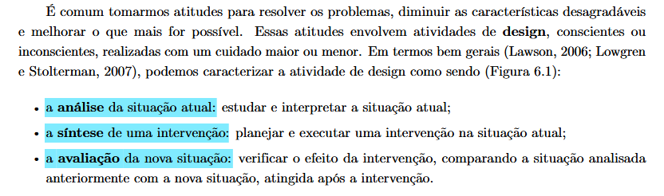
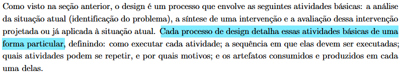
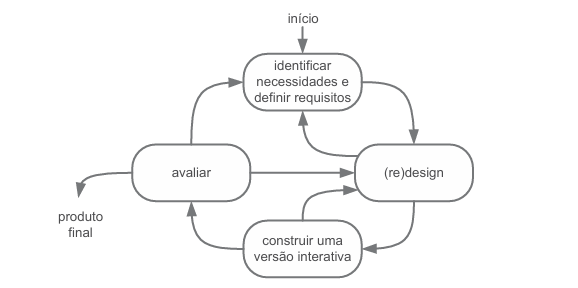
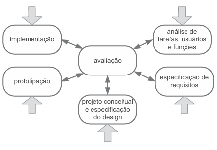
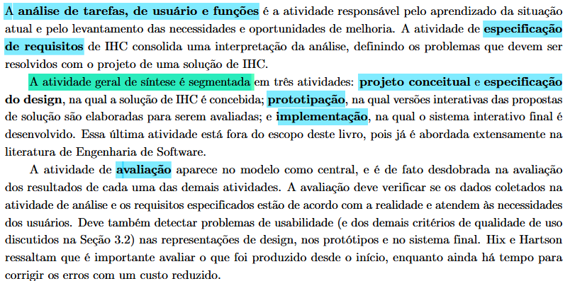
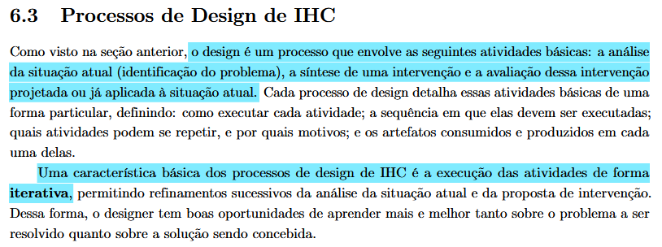
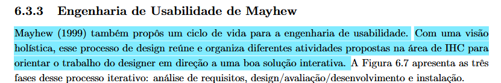
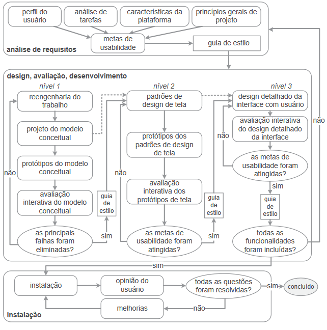
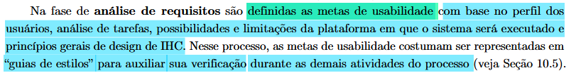

# Processo de Design

## Rastreabilidade
|Artefato(s) | Autore(s)|
| --- | --- |
| Processo de desgin| Maria Laura e Philipe |

## Introdução

Ao buscarmos maneiras de resolver problemas, diminuir características desagradáveis ou melhorar algo estamos exercendo atividades de design. Com isso pode-se entender que design é um processo que busca valorizar aspecto positivos em detrimento da redução dos negativos. Compreendido o que seria design, é possível separar em três atividades fundamentais (BARBOSA et al., 2021):

- <u>**Análise** da situação atual</u>: Identificação do problema e compreensão da situação atual.  
- <u>**Síntese** de uma intervenção</u>: Criação de uma intervenção (solução/design).  
- <u>**Avaliação** de uma nova situação</u>: Teste da intervenção projetada para verificar se ela resolve o problema.

> *Fonte:*  BARBOSA et al. (2021, p. 108) [PRINT] 

___

## Modelos de processo de design
   Cada processo de design particulariza a execução, a ordem, as iterações e os artefatos consumidos e produzidos em cada etapa (BARBOSA et al., 2021)[PRINT] . A seguir apresentaremos os modelos de processo de design abordados na obra de Barbosa et al.

### Modelo simples
Nessa especificação de processo de design basicamente é centrado no usuário, sendo que a atividade de síntese é separada em desing(ou redisign) conceitual e na construção de uma versão interativa que simula o conportamente da solução para avaliçã e posteriormente o produto ser entregue ou retornar ao inicio do processo que está ilustrado na **Figura I** (BARBOSA et al., 2021).

 Figura I - Modelo simples de processo de design de IHC

> *Fonte:* BARBOSA et al. (2021, p. 114)

### Ciclo de vida em estrela
Aqui o processo é dividido em seis atividades, conforme representado na **Figura II**.

 Figura II - Ciclo de vida em estrela.

> *Fonte:* BARBOSA et al. (2021, p. 115)

Sobre cada atividade:

-  **Análise de tarefas, de usuário e funções** - aprendizado da situação atual e levantamento das necessidades e oportunidades de melhoria;
- **Especificação de requisitos** - interpretação da análise, definindo os problemas a serem resolvidos pela solução de IHC desenvolvida;

<fieldset markdown = "1"><legend> Atividade geral de síntese </legend>

- **Projeto conceitual e especificação do design** - etapa que a solução IHC é definida;
- **Prototipação** - versões interativas da solução são elaborasa para avaliação;
- **Implementação** - momento que o sistema é desenvolvido;

</fieldset>

- **Avaliação** - deve detectar problemas de usabilidade em representações de design, protótipos e no sistema final. Além da sua utilização desde o inicio do projeto ser de suma importânica.

> *Fonte:*  BARBOSA et al. (2021, p. 115) [PRINT]  

Nesta proposta, cabe ao designer definir o ponto de partida do ciclo, baseando-se nos artefatos disponíveis. Entretanto, sendo necessário após finalizado a atividade ela passe pela avaliação antes de dar inicio na subsequente.

De acordo com o livro Interação Humano-Computador e Experiência de Usuário, de Simone D. J. Barbosa, o design de Interação Humano-Computador (IHC) não é uma tarefa linear e única, mas sim um processo iterativo composto por três atividades fundamentais, como mostra a Figura 1:

- *Análise:* Identificação do problema e compreensão da situação atual.  
- *Síntese:* Criação de uma intervenção (solução/design).  
- *Avaliação:* Teste da intervenção projetada para verificar se ela resolve o problema.

> *Fonte:*  BARBOSA et al. (2021, p. 112) [PRINT]  

---

### Ciclo de vida para a engenharia de usuabilidade de Mayhew

O ciclo de vida proposto por Mayhew oferece uma visão holística para a engenharia de usabilidade, reunindo e organizando diversas atividades da área de IHC para orientar o designer na criação de soluções interativas eficazes. Este processo é essencial para garantir que o desenvolvimento de um sistema siga uma direção clara e tecnicamente estruturada em direção a uma boa solução de design (BARBOSA et al., 2021)[PRINT] .

A seguir serão abordades cada fase e suas respectivas atividade. E as relações entre as fases está representada na **Figura III**.

 Figura III - Processo de design de Mayhew

> *Fonte:* Barbosa et al. (2021, p. 120)

#### 1. Análise de Requisitos

Nessa fase são definidas as metas de usabilidade com base em:

- O perfil do usuário
- Análise de tarefas  
- Possibilidades e limitações da plataforma em que o sistema será executado 
- Princípios gerais de  design de IHC

que geralmente geram como saída os "guias de estilos" para auxiliar sua verficação durante as demais atividades do processo (BARBOSA et al., 2021)[PRINT] .

#### 2. Design, Avaliação e Desenvolvimento

Sendo a continuação da fase anterior, nessa é o processo de concepção da solução para atingir as metas de usubilidades. Pode-se separa essa etapa em três níveis:

- *Nível 1 (Conceitual):* Foca no modelo mental e na estrutura, não na estética.  
- *Nível 2 (Padrões de Tela):* Estabelece a consistência visual a partir disso construir protótipos de média fiedelidade, além de avalia-los.  
- *Nível 3 (Design Detalhado):* A interface final é produzida e testada exaustivamente.  

#### 3. Instalação e Feedback

O processo não termina na entrega. Existe uma etapa de coleta de opinião do usuário após um certo perído de uso, para melhorias contínuas ou, até mesmo, como indicativo de obsolecência do sistema.

---

## Por que escolhemos o Ciclo de Vida de Mayhew?

A escolha do Ciclo de Vida da Engenharia de Usabilidade de Mayhew (1999) justifica-se pela sua visão holística e pelo seu alto nível de detalhamento estrutural. Diferente de modelos mais simplificados, o processo de Mayhew reúne e organiza sistematicamente as diversas atividades da área de IHC, orientando o trabalho da nossa equipe de forma clara em direção a uma solução interativa de alta qualidade  (BARBOSA et al., 2021)[PRINT]  

---

## Referência

 BARBOSA, S. D. J. et al. **Interação Humano-Computador e Experiência do Usuário**. 1. ed. Rio de Janeiro: Autopublicação, 2021.
___

## Histórico de Versão
| Versão | Data | Descrição | Autores | Data Revisão | Descrição Revisão | Revisores |
| :---: | :---: | :--- | :--- | :---: | :--- | :--- |
| 1.0 | 11/04/2026 | Criação do documento | [Maria Laura Regis](https://github.com/Maria-Laura-Regis) | 11/04/2026 | Revisão da estrutura inicial e do conteúdo base do processo de design | [Ingrid Alves](https://github.com/alvesingrid) |
| 1.1 | 22/04/2026 | Adição do historico de versão | [Ingrid Alves](https://github.com/alvesingrid) | 22/04/2026 | Checagem da tabela de versões e da ordem dos registros no processo de design | [Hugo Freitas Silva](https://github.com/HugoFreitass) |
| 1.2 | 11/04/2026 | Adequação ao feedback do professor | [Maria Laura Regis](https://github.com/Maria-Laura-Regis) / [Philipe Amancio](https://github.com/Phill-Chill) | 11/04/2026 | Conferência dos ajustes do processo de design conforme o feedback recebido | [Hugo Freitas Silva](https://github.com/HugoFreitass) |
| 1.3 | 15/05/2026 | Adição da rastreabilidade dos autores dos artefatos | [Philipe Amancio](https://github.com/Phill-Chill) | 15/05/2026 | Validação dos links e créditos de autoria no processo de design | [Maria Laura Regis](https://github.com/Maria-Laura-Regis) |