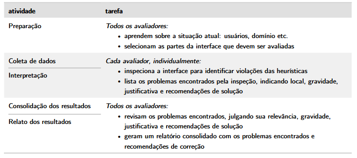

## Introdução

A seguinte avaliação por inspeção tem como objetivo identificar problemas na interação e interface no site da Sabin, além de ser adequado para ser objeto de estudo para o presente projeto de planejamento e execução da análise da Interação Humano-Computador.

 

## Planejamento

Vamos utilizar a avaliação de heurísticas para identificação de possíveis violações heurísticas, dividida em cinco atividades: Planejamento, Coleta de dados, Interpretação, Consolidação e Relato dos resultados — conforme descrito na **Figura I**. Este método foi escolhido devido à demanda de análises de uma lista de sites, dado seu baixo custo e velocidade de execução (BARBOSA et al., 2021).

Figura - I Descrição das atividades da avaliação heurística 

Fonte: BARBOSA et al. (2021).

 

### Perfil de Usuário

Com base nos serviços oferecidos pelo site (agendamento de exames, resultados online, unidades, convênios e atendimento), foram definidos os seguintes perfis de usuário:

 

| Característica                    | Perfil 01: Paciente Particular                     | Perfil 02: Idoso / Familiar Responsável | Perfil 03: Empresa / Profissional de Saúde          |
| :-------------------------------- | :------------------------------------------------- | :-------------------------------------- | :-------------------------------------------------- |
| **Faixa Etária**                  | 20 a 60 anos                                       | 50+ anos ou familiar adulto             | 25 a 55 anos                                        |
| **Grau de Instrução Tecnológica** | Médio a Alto                                       | Baixo a Médio                           | Médio a Alto                                        |
| **Aparelhos Utilizados**          | Smartphone e notebook                              | Smartphone e desktop                    | Desktop e notebook                                  |
| **Frequência de Uso do Site**     | Esporádica ou periódica                            | Baixa                                   | Média                                               |
| **Objetivos Principais**          | Agendar exames, ver resultados, consultar unidades | Marcar exames e obter instruções        | Buscar serviços corporativos e informações técnicas |
| **Motivação**                     | Rapidez e praticidade                              | Facilidade e segurança                  | Eficiência operacional                              |

 

Com base nesses dados, definimos as funcionalidades que apresentam problemas ao usuário durante a realização de suas atividades e que serão analisadas:

* Agendamento de exames
* Consulta de resultados
* Localização de unidades
* Navegação e organização do conteúdo

---

## Coleta de dados e Interpretação

#### Agendamento de Exames

<fieldset markdown="1">

<legend><b>Relatório de Avaliação Heurística</b></legend>

**Heurística(s) violada(s):** <u>Correspondência entre sistema e mundo real | Flexibilidade e eficiência de uso</u>
**ID do Problema:** <u>#1</u>

| Item                       | Descrição / Opções                                                                                               |
| :------------------------- | :--------------------------------------------------------------------------------------------------------------- |
| **Verificação**            | O processo de agendamento apresenta etapas claras e linguagem compreensível?                                     |
| **Grau de Severidade**     | [ ] 0 - Sem importância   [ ] 1 - Cosmético   [ ] 2 - Simples   [x] 3 - Grave   [ ] 4 - Catastrófico |
| **Natureza do problema**   | [ ] Barreira     [x] Obstáculo     [ ] Ruído                                                                     |
| **Perspectiva do usuário** | [x] Problema Geral     [ ] Problema Preliminar     [ ] Problema Especial                                         |
| **Perspectiva da tarefa**  | [x] Problema Principal     [ ] Problema Secundário                                                               |
| **Perspectiva do Projeto** | [ ] Problema Falso     [ ] Problema Novo     [x] Não se aplica                                                   |

---

#### Detalhamento do Problema

* **Contexto:** Usuário tenta marcar exame rapidamente pela página principal.
* **Causa:** Muitos passos e termos confusos sobre exames e convênios.
* **Efeito sobre o usuário:** Dúvida sobre qual opção selecionar.
* **Efeito sobre a tarefa:** Lentidão ou abandono do agendamento.
* **Correção possível:** Simplificar fluxo, exibir progresso e usar linguagem mais direta.

</fieldset>

---

#### Consulta de Resultados

<fieldset markdown="1">

<legend><b>Relatório de Avaliação Heurística</b></legend>

**Heurística(s) violada(s):** <u>Visibilidade do status do sistema | Controle e liberdade do usuário</u>
**ID do Problema:** <u>#2</u>

| Item                       | Descrição / Opções                                                                                               |
| :------------------------- | :--------------------------------------------------------------------------------------------------------------- |
| **Verificação**            | O usuário entende claramente como acessar seus resultados e o andamento da ação?                                 |
| **Grau de Severidade**     | [ ] 0 - Sem importância   [ ] 1 - Cosmético   [x] 2 - Simples   [ ] 3 - Grave   [ ] 4 - Catastrófico |
| **Natureza do problema**   | [ ] Barreira     [ ] Obstáculo     [x] Ruído                                                                     |
| **Perspectiva do usuário** | [x] Problema Geral     [ ] Problema Preliminar     [ ] Problema Especial                                         |
| **Perspectiva da tarefa**  | [x] Problema Principal     [ ] Problema Secundário                                                               |
| **Perspectiva do Projeto** | [ ] Problema Falso     [ ] Problema Novo     [x] Não se aplica                                                   |

---

#### Detalhamento do Problema

* **Contexto:** Usuário acessa a área de resultados pelo celular.
* **Causa:** Links de acesso e autenticação podem não estar imediatamente destacados.
* **Efeito sobre o usuário:** Insegurança se entrou na área correta.
* **Efeito sobre a tarefa:** Mais tentativas até localizar o resultado.
* **Correção possível:** Destacar botão principal e feedback claro de carregamento/login.

</fieldset>

---

#### Localização de Unidades

<fieldset markdown="1">

<legend><b>Relatório de Avaliação Heurística</b></legend>

**Heurística(s) violada(s):** <u>Reconhecimento em vez de memorização | Ajuda e documentação</u>
**ID do Problema:** <u>#3</u>

| Item                       | Descrição / Opções                                                                                               |
| :------------------------- | :--------------------------------------------------------------------------------------------------------------- |
| **Verificação**            | Encontrar unidades próximas é simples e intuitivo?                                                               |
| **Grau de Severidade**     | [ ] 0 - Sem importância   [ ] 1 - Cosmético   [x] 2 - Simples   [ ] 3 - Grave   [ ] 4 - Catastrófico |
| **Natureza do problema**   | [ ] Barreira     [ ] Obstáculo     [x] Ruído                                                                     |
| **Perspectiva do usuário** | [x] Problema Geral     [ ] Problema Preliminar     [ ] Problema Especial                                         |
| **Perspectiva da tarefa**  | [ ] Problema Principal     [x] Problema Secundário                                                               |
| **Perspectiva do Projeto** | [ ] Problema Falso     [ ] Problema Novo     [x] Não se aplica                                                   |

---

#### Detalhamento do Problema

* **Contexto:** Usuário procura a unidade mais próxima com atendimento específico.
* **Causa:** Filtros e informações podem exigir múltiplos cliques.
* **Efeito sobre o usuário:** Esforço desnecessário para comparar opções.
* **Efeito sobre a tarefa:** Atraso para decidir onde ir.
* **Correção possível:** Melhorar filtros por bairro, serviço e horário.

</fieldset>

---

#### Navegação e Organização do Conteúdo

<fieldset markdown="1">

<legend><b>Relatório de Avaliação Heurística</b></legend>

**Heurística(s) violada(s):** <u>Projeto estético e minimalista | Consistência e padronização</u>
**ID do Problema:** <u>#4</u>

| Item                       | Descrição / Opções                                                                                               |
| :------------------------- | :--------------------------------------------------------------------------------------------------------------- |
| **Verificação**            | A página inicial prioriza ações importantes e mantém organização clara?                                          |
| **Grau de Severidade**     | [ ] 0 - Sem importância   [ ] 1 - Cosmético   [x] 2 - Simples   [ ] 3 - Grave   [ ] 4 - Catastrófico |
| **Natureza do problema**   | [ ] Barreira     [ ] Obstáculo     [x] Ruído                                                                     |
| **Perspectiva do usuário** | [x] Problema Geral     [ ] Problema Preliminar     [ ] Problema Especial                                         |
| **Perspectiva da tarefa**  | [ ] Problema Principal     [x] Problema Secundário                                                               |
| **Perspectiva do Projeto** | [ ] Problema Falso     [ ] Problema Novo     [x] Não se aplica                                                   |

---

#### Detalhamento do Problema

* **Contexto:** Primeiro acesso ao site.
* **Causa:** Mistura entre conteúdo institucional, marketing e serviços operacionais.
* **Efeito sobre o usuário:** Sobrecarga visual.
* **Efeito sobre a tarefa:** Dificuldade para localizar ações principais.
* **Correção possível:** Separar áreas institucionais das áreas de serviço e destacar atalhos essenciais.

</fieldset>

---

## Consolidação e Relato dos Resultados

A avaliação heurística do site da Sabin identificou problemas moderados de usabilidade relacionados principalmente à encontrabilidade de serviços, clareza do fluxo de agendamento e organização das informações.

Os principais impactos recaem sobre usuários que acessam o sistema de forma esporádica, especialmente pacientes que desejam rapidez para marcar exames ou consultar resultados. Também há atenção necessária para públicos com menor familiaridade digital, como idosos e familiares responsáveis.

As heurísticas mais afetadas foram **visibilidade do status do sistema**, **projeto estético e minimalista**, **correspondência com o mundo real** e **flexibilidade de uso**.

Quanto à severidade, predominam problemas simples e graves, sem indícios de falhas catastróficas. Ainda assim, os obstáculos reduzem eficiência e podem gerar abandono de tarefas importantes.

Recomenda-se priorizar:

* Simplificação do fluxo de agendamento
* Destaque visual para resultados e unidades
* Melhor hierarquia da página inicial
* Linguagem mais acessível ao público geral
* Melhorias em filtros e feedback do sistema

Conclui-se que o site atende seu propósito institucional e operacional, porém ajustes de usabilidade podem elevar significativamente a experiência do usuário.

---

## Histórico de versões

|    Data    | Versão |       Descrição       | Autores | Data Revisão |        Descrição Revisão        | Revisores |
| :--------: | :----: | :-------------------: | :-----: | :----------: | :-----------------------------: | :-------: |
| 28/04/2026 |   1.0  | Realização da análise |   Hugo  |  28/04/2026  | Revisão de conteúdo e estrutura |     -     |

---

## Referências

BARBOSA, S. D. J. et al. **Interação Humano-Computador e Experiência do Usuário**. 1. ed. Rio de Janeiro: Autopublicação, 2021.

MACIEL, C. et al. **Avaliação heurística de sítios na web**. Niterói: Instituto de Computação - Universidade Federal Fluminense (UFF), [2004?].
