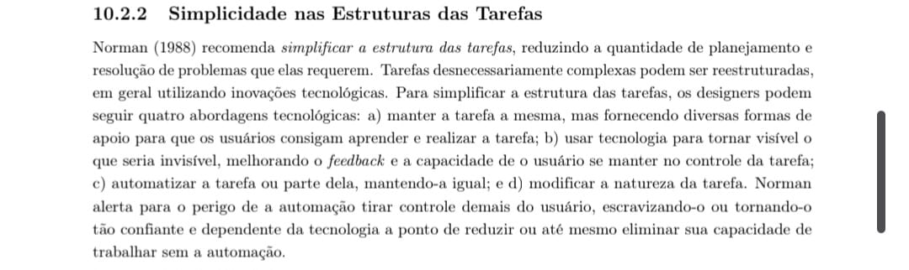
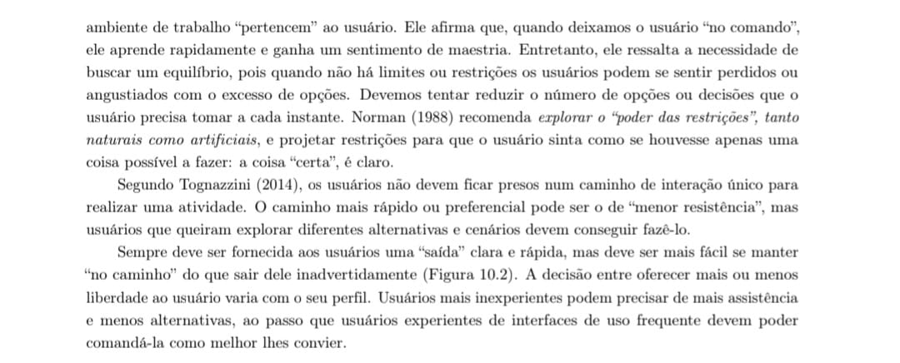
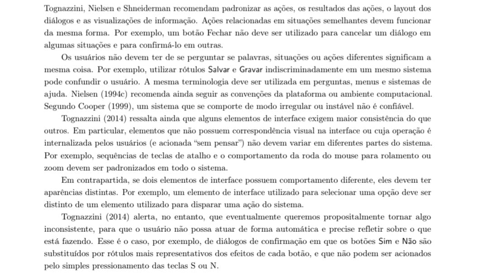
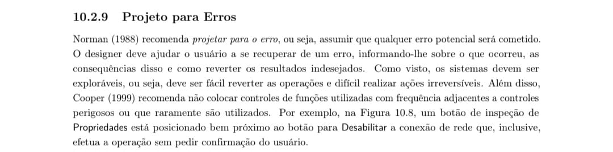

# Princípios e Diretrizes Gerais do Projeto

## 10. Características da Plataforma para o Projeto

O projeto do portal do Laboratório Sabin será desenvolvido considerando as seguintes características de plataforma:

* **Plataforma Alvo:** Aplicação Web Responsiva (acessível via navegadores em Desktop, Tablets e Smartphones).
* **Restrições e Contexto de Uso:** O sistema deve considerar o contexto de mobilidade e a possível carga emocional/ansiedade do usuário (buscando resultados médicos ou agendamentos urgentes). Portanto, a interface exige tempos de resposta rápidos, alta legibilidade em telas pequenas e fluxos de navegação que minimizem o uso de dados móveis e a digitação excessiva em teclados virtuais.

---

## 11. Princípios Gerais do Projeto

Os princípios e diretrizes de projeto são fundamentais para guiar o design de Interação Humano-Computador. Como introduzido na literatura, princípios costumam representar objetivos gerais e de alto nível que auxiliam o design, embora não substituam a análise cuidadosa do problema e dos usuários (BARBOSA; SILVA, 2010, p. 237)[PRINT] . 

Segundo Norman (1988), o modelo conceitual projetado deve facilitar a determinação das ações possíveis, tornar visíveis os resultados e avaliar o estado corrente do sistema de forma natural (BARBOSA; SILVA, 2010, p. 238)[PRINT] .

**Referência Bibliográfica:**
BARBOSA, Simone Diniz Junqueira; SILVA, Bruno Santana da. *Interação Humano-Computador*. 1. ed. Rio de Janeiro: Elsevier, 2010.

**Autor:** Maria Laura Dias.

Os princípios gerais de projeto são fundamentais para guiar o design de Interação Humano-Computador, auxiliando o usuário a compreender o sistema rapidamente. Segundo Norman (1988), o modelo conceitual projetado deve facilitar a determinação das ações possíveis, tornar visíveis os resultados e avaliar o estado corrente do sistema de forma natural (BARBOSA; SILVA, 2010, p. 238)[PRINT] .

**Referência Bibliográfica:**
BARBOSA, Simone Diniz Junqueira; SILVA, Bruno Santana da. *Interação Humano-Computador*. 1. ed. Rio de Janeiro: Elsevier, 2010.

**Autor:** Maria Laura Dias.

---

## 12. Tópicos dos Princípios Gerais do Projeto

Com base na literatura, o projeto adota os seguintes princípios para fundamentar as decisões de design da interface:

### 1. Correspondência com as expectativas dos usuários
Devemos explorar mapeamentos naturais e certificar-nos de que o usuário consegue determinar a relação entre suas intenções e as ações possíveis. A interface deve projetar a comunicação utilizando o idioma do usuário, com palavras e conceitos que lhe são familiares (BARBOSA; SILVA, 2010, p. 238-239)[PRINT] .

**Aplicação no portal do Sabin:**
O portal apresenta resultados parcialmente satisfatórios neste princípio. Os rótulos das seções principais — "Resultado de Exames", "Agendamentos", "Nossas Unidades" — utilizam linguagem direta e familiar ao contexto médico-laboratorial, o que facilita a correspondência entre as intenções do usuário e as ações disponíveis. No entanto, o acesso aos resultados de exames exige um "protocolo de atendimento" — credencial entregue ao paciente apenas no balcão da unidade física. Para um usuário que acessa o site pela primeira vez sem esse protocolo em mãos, a interface não deixa claro de imediato que esse dado é necessário, gerando frustração. A terminologia "protocolo de atendimento" também pode não ser imediatamente compreensível para todos os perfis de usuário, distanciando-se da linguagem natural esperada.

### 2. Simplicidade nas estruturas das tarefas
É necessário simplificar a estrutura das tarefas, reduzindo a quantidade de planejamento e resolução de problemas que elas requerem, utilizando a tecnologia para apoiar a aprendizagem e manter o usuário no controle (BARBOSA; SILVA, 2010, p. 239)[PRINT] .

**Aplicação no portal do Sabin:**
A tarefa de acessar resultados de exames apresenta complexidade desnecessária. O fluxo exige que o usuário: (1) localize a opção correta no menu; (2) seja redirecionado para um subdomínio diferente (laudos.sabin.com.br); e (3) insira credenciais que só recebe presencialmente. Esse redirecionamento para um domínio distinto quebra a continuidade da navegação e pode causar desconfiança no usuário. O serviço de pré-cadastro digital representa uma tentativa positiva de simplificação: o usuário preenche dados antecipadamente e chega à unidade com um voucher, evitando etapas presenciais demoradas. Ainda assim, o formulário poderia ser mais guiado, com indicações passo a passo, reduzindo a carga cognitiva de quem o utiliza pela primeira vez.

### 3. Equilíbrio entre controle e liberdade do usuário
O ambiente de trabalho "pertence" ao usuário. Devemos reduzir o número de opções e decisões a cada instante para evitar angústia, mas garantir "saídas de emergência" claras (como botões de cancelar ou voltar) para que o usuário navegue sem medo de cometer erros irreversíveis (BARBOSA; SILVA, 2010, p. 240-241)[PRINT] .

**Aplicação no portal do Sabin:**
O portal apresenta uma sobrecarga de opções na página inicial: serviços na loja virtual, banners promocionais, múltiplas categorias de exames, agendamentos, convênios, blog e outras funcionalidades são exibidos simultaneamente. Esse excesso de informação pode causar paralisia de decisão, especialmente em usuários que chegam ao site em contexto de urgência ou ansiedade — perfil comum entre os visitantes do portal. Por outro lado, o menu de navegação principal é fixo e acessível em todas as páginas, o que garante ao usuário sempre uma "saída" clara para as seções principais. A melhoria necessária seria uma hierarquização mais clara das informações, priorizando as tarefas mais frequentes — consultar resultado e agendar exame — em detrimento de conteúdo promocional.

### 4. Consistência e padronização; promoção da eficiência do usuário
Ações relacionadas em situações semelhantes devem funcionar da mesma forma para facilitar o aprendizado. Além disso, o sistema deve focar na economia de tempo do usuário, mantendo-o produtivamente ocupado, fornecendo atalhos e aceleradores para usuários experientes (BARBOSA; SILVA, 2010, p. 242-243)[PRINT] .

**Aplicação no portal do Sabin:**
Uma inconsistência relevante é o redirecionamento do usuário ao subdomínio `laudos.sabin.com.br` ao acessar resultados de exames. Esse portal de laudos apresenta identidade visual e estrutura diferentes da página principal, desorientando o usuário e podendo gerar a percepção de que ele saiu do ambiente seguro do Sabin. Quanto à eficiência, o portal disponibiliza um aplicativo móvel (Android e iOS) que permite acesso mais ágil a resultados e agendamentos — um acelerador útil para usuários recorrentes. No entanto, o site em si não oferece atalhos evidentes para tarefas frequentes sem que o usuário precise percorrer o menu completo a cada visita.

### 5. Antecipação das necessidades do usuário
O software deve prever o que o usuário quer e precisa, fornecendo as ferramentas necessárias para cada passo do processo antes mesmo que o usuário precise buscá-las, assumindo uma postura proativa na interação (BARBOSA; SILVA, 2010, p. 243-244)[PRINT] .

**Aplicação no portal do Sabin:**
O Sabin demonstra esforços neste princípio com funcionalidades como a página de "Preparo de Exames", que antecipa a necessidade do paciente de saber como se preparar antes da coleta. As notificações enviadas por e-mail e telefone sobre a liberação de resultados e o andamento do pré-cadastro também representam uma postura proativa bem-sucedida. No entanto, ao acessar o portal, o usuário que aguarda um resultado não encontra um caminho imediato e destacado para essa tarefa — que é a ação mais provável e urgente para grande parte dos visitantes. Uma melhoria seria exibir, como destaque principal da página inicial, o acesso a "Resultados de Exames" e "Agendamentos", com os campos de autenticação já visíveis sem redirecionamentos.

### 6. Visibilidade e reconhecimento
O designer deve tornar as coisas visíveis, encurtando os golfos de execução e avaliação. O sistema não deve exigir que o usuário memorize informações de uma tela para a outra; as opções devem estar prontamente disponíveis para reconhecimento visual (BARBOSA; SILVA, 2010, p. 244-245)[PRINT] .

**Aplicação no portal do Sabin:**
O portal apresenta uma violação clara deste princípio no fluxo de acesso a resultados: o usuário precisa memorizar — ou ter em mãos — o número do protocolo de atendimento, fornecido somente de forma física no momento da coleta. Caso o perca, o site não oferece um caminho de recuperação visível e intuitivo; a orientação disponível é buscar o balcão da unidade, negando a proposta do serviço digital. Como ponto positivo, o sistema de busca por unidades exibe um mapa interativo com as localizações — um exemplo de visibilidade adequada, pois o usuário reconhece a unidade mais próxima sem precisar memorizar endereços.

### 7. Conteúdo relevante e expressão adequada
A interface deve seguir a máxima da quantidade ("menos é mais"), onde os diálogos não devem conter informações irrelevantes ou raramente necessárias. Mensagens devem ser concisas e a apresentação gráfica deve garantir legibilidade (BARBOSA; SILVA, 2010, p. 246-247)[PRINT] .

**Aplicação no portal do Sabin:**
A página inicial do Sabin concentra grande volume de conteúdo promocional — banners de vacinas, loja virtual, campanhas de saúde — que compete visualmente com as tarefas primárias do usuário. Para um paciente que acessa o site exclusivamente para consultar um resultado ou agendar um exame, esse excesso de conteúdo constitui ruído visual que aumenta o tempo de tarefa e a carga cognitiva, contrariando a máxima da quantidade descrita por Barbosa e Silva (2010). Avisos de segurança importantes, como o alerta sobre golpistas que usam indevidamente o nome do Sabin, estão presentes no portal, demonstrando preocupação com conteúdo relevante para a proteção do usuário. Contudo, esses avisos poderiam ser mais destacados visualmente, dado seu caráter crítico.

### 8. Projeto para erros
O designer deve assumir que qualquer erro potencial será cometido e, em primeiro lugar, tentar evitar que eles ocorram. Caso ocorram, o sistema deve ajudar o usuário a se recuperar facilmente, tornando ações perigosas reversíveis e oferecendo mensagens de erro expressas em linguagem simples e construtiva, sem códigos indecifráveis (BARBOSA; SILVA, 2010, p. 247)[PRINT] .

**Aplicação no portal do Sabin:**
O portal apresenta lacunas neste princípio. O fluxo de recuperação de protocolo perdido — situação de erro bastante comum — não é suficientemente visível ou guiado. A orientação disponível direciona o usuário ao WhatsApp ou ao balcão físico, o que representa uma quebra do fluxo digital e aumenta o esforço necessário para se recuperar do erro. Como ponto positivo, o formulário de pré-cadastro inclui instruções de preenchimento nos campos, contribuindo para a prevenção de erros antes que ocorram. A oferta de múltiplos canais de suporte (telefone, WhatsApp e FAQ) também representa uma rede de segurança para o usuário em situação de dificuldade, embora o acesso a esses canais pudesse ser mais imediato e contextualizado dentro do próprio fluxo de tarefas.

---
## Histórico de Versão

| Versão | Data | Descrição | Autor | Revisor |
| :--- | :--- | :--- | :--- | :--- |
| 1.0 | 09/05/2026 | Criação do documento |[Maria Laura Regis](https://github.com/Maria-Laura-Regis)| [Philipe Amencio](https://github.com/Philipe-Chill) |
---

## Referência Bibliográfica:
BARBOSA, Simone Diniz Junqueira; SILVA, Bruno Santana da. *Interação Humano-Computador*. 1. ed. Rio de Janeiro: Elsevier, 2010.

**Autor:** Maria Laura Dias.