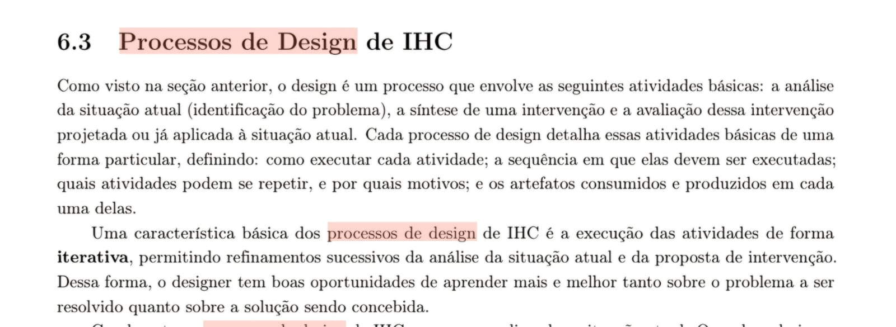
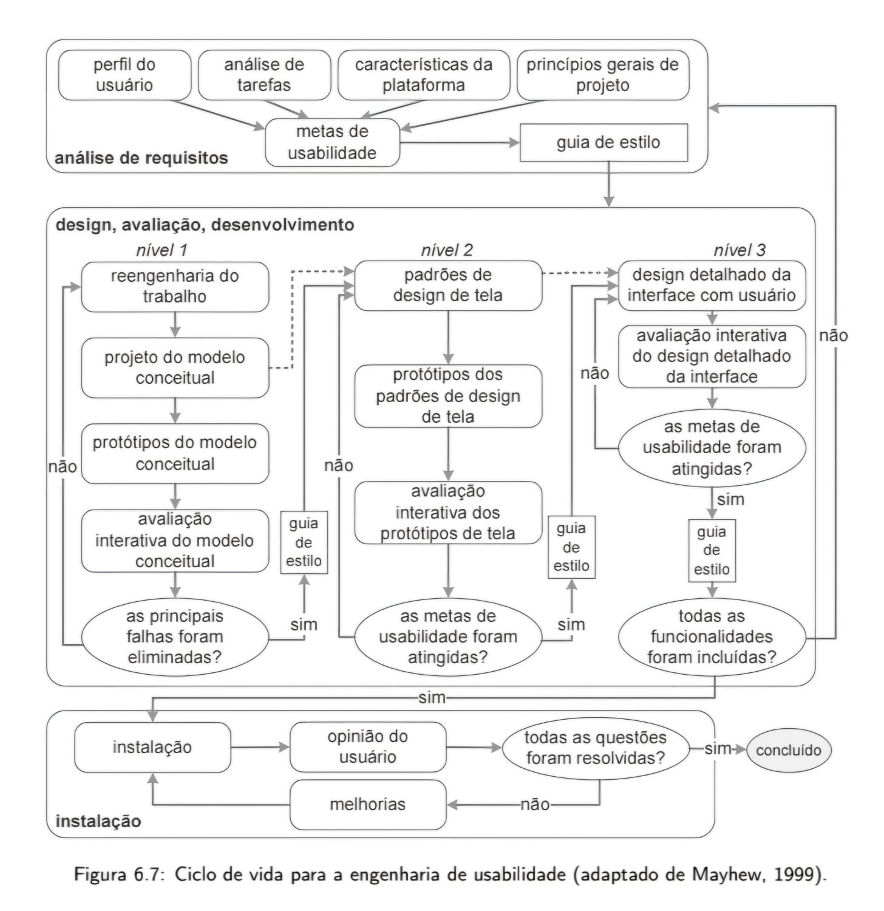

# Processo de Design

De acordo com o livro Interação Humano-Computador e Experiência de Usuário, de Simone D. J. Barbosa, o design de Interação Humano-Computador (IHC) não é uma tarefa linear e única, mas sim um processo iterativo composto por três atividades fundamentais, como mostra a Figura 1:

- *Análise:* Identificação do problema e compreensão da situação atual.  
- *Síntese:* Criação de uma intervenção (solução/design).  
- *Avaliação:* Teste da intervenção projetada para verificar se ela resolve o problema.

Figura 1 - Processos de design

> *Fonte:* Barbosa et al. (2021, p. 107)

---

## Por que a Iteração é Importante?

O processo deve permitir "refinamentos sucessivos". Isso significa que, ao avaliar uma solução e encontrar falhas, o designer retorna à fase de análise ou síntese. Esse ciclo permite que a equipe aprenda mais sobre o problema à medida que desenvolve a solução.

---

# O Processo de Design de Mayhew

Figura 2 - Processo de design de Mayhew

> *Fonte:* Barbosa et al. (2021, p. 120)

O Ciclo de Vida de Mayhew (Figura 6.7) é uma escolha robusta para projetos que exigem alto rigor técnico e foco na experiência do usuário. Ele se divide em três fases principais:

## 1. Análise de Requisitos

Diferente de processos simplistas, Mayhew começa com uma base sólida. Ela exige:

- Definir o perfil do usuário  
- Realizar análise de tarefas  
- Estabelecer metas de usabilidade quantificáveis  

Tudo isso antes de desenhar qualquer tela.

## 2. Design, Avaliação e Desenvolvimento

A grande força deste modelo é a organização em níveis de complexidade crescente:

- *Nível 1 (Conceitual):* Foca no modelo mental e na estrutura, não na estética.  
- *Nível 2 (Padrões de Tela):* Estabelece a consistência visual através de guias de estilo.  
- *Nível 3 (Design Detalhado):* A interface final é produzida e testada exaustivamente.  

## 3. Instalação e Feedback

O processo não termina na entrega. Existe uma etapa de opinião do usuário após a instalação para garantir melhorias contínuas.

---

## Por que escolhemos o Ciclo de Vida de Mayhew?

- *Redução de Riscos:*  
  Por ser dividido em três níveis, o erro é detectado cedo. Se o modelo conceitual (Nível 1) falhar na avaliação, você corrige antes de gastar tempo com o design detalhado (Nível 3).

- *Foco em Metas:*  
  O modelo de Mayhew é orientado por resultados. Em cada etapa, há uma pergunta decisiva. Se a resposta for "não", o fluxo obriga o retorno para o refinamento.

- *Rastreabilidade:*  
  Ele oferece um guia claro de quais artefatos são produzidos em cada fase (como o guia de estilo e os protótipos), garantindo que a equipe de desenvolvimento saiba exatamente o que implementar.

- *Alinhamento com a Teoria de IHC:*  
  Ele executa perfeitamente a natureza iterativa mencionada anteriormente, permitindo que o designer aprenda com cada ciclo de avaliação.

---

# Referência

Barbosa, S. D. J.; Silva, B. S. da; Silveira, M. S.; Gasparini, I.; Darin, T.; Barbosa, G. D. J. (2021).  
Interação Humano-Computador e Experiência do Usuário.  
Autopublicação. ISBN: 978-65-00-19677-1.