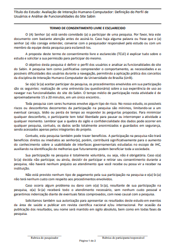
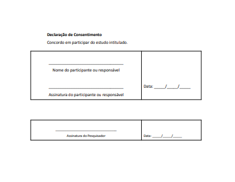

# Aspectos Éticos

## Introdução
Ao realizar qualquer tipo de pesquisa que envolva pessoas, é fundamental que sejam levados em conta os aspectos éticos envolvidos no processo. Isso é crucial para garantir a proteção dos direitos e da dignidade dos participantes envolvidos na pesquisa, seja de forma direta ou indireta.

É de responsabilidade da equipe de design proteger o bem-estar físico e psicológico dos participantes de qualquer estudo, pesquisa ou análise realizada (Johnson, 2008). No Brasil, a Resolução No 466/2012 do Conselho Nacional de Saúde regulamenta as pesquisas científicas envolvendo pessoas, em qualquer área do conhecimento 
(BARBOSA et al., 2021, p. 140)[PRINT] .

Em 2016 foi promulgada a resolução 510/2016, que regulamenta a pesquisa em Ciências Humanas e Sociais, mais próxima do que o trabalho que costumamos realizar em IHC.
Com base nesses princípios éticos e na literatura (Johnson, 2008; Courage e Baxter, 2005; Sharp et al., 2019), podemos sugerir diversas diretrizes para as pesquisas e avaliações de IHC, descritas a seguir:

- O pesquisador deve explicar os **objetivos da pesquisa** aos participantes e dizer exatamente como deverá ser a participação deles.
- O pesquisador deve garantir aos participantes a **confidencialidade** e a **privacidade** dos dados brutos coletados.
- Ao divulgar os resultados da avaliação, o avaliador deve garantir o **anonimato** dos participantes, a preservação das suas imagens e a utilização cuidadosa das informações coletadas.
(BARBOSA et al., 2021, p. 141)[PRINT] .

- É necessário obter **permissão** para gravar a voz ou imagem de qualquer pessoa, antes de começar a gravação
- A participação na pesquisa deve ocorrer apenas com o **consentimento livre e esclarecido** dos participantes
- Essas informações devem ser comunicadas ao participante durante o processo de recrutamento e depois reiteradas no início da atividade através de um **termo de consentimento**.
- O **conforto** dos participantes deve ser cuidadosamente considerado.
(BARBOSA et al., 2021, p. 141)[PRINT] .

- O participante tem o **direito e a liberdade de se recusar a participar** ou retirar seu consentimento e abandonar o estudo em qualquer fase da pesquisa, sem ser penalizado por isso.
(BARBOSA et al., 2021, p. 142)[PRINT] .

## Principios

Apesar de essa resolução não se aplicar à execução de métodos de avaliação com objetivos técnicos, suas recomendações são muito úteis para orientar os avaliadores no cuidado ético durante seu trabalho. Segundo essa resolução,esses cuidados envolvem considerar os seguintes princípios:
(BARBOSA et al., 2021, p. 140)[PRINT] .

- **Princípio da autonomia:** que envolve o consentimento livre e esclarecido dos indivíduos e a proteção a grupos vulneráveis e aos legalmente incapazes com intuito de respeitar sua dignidade, autonomia e defendê-los em sua vulnerabilidade.

- **princípio da beneficência:** que envolve a ponderação entre riscos e benefícios, tanto atuais como potenciais, individuais ou coletivos, comprometendo-se com o máximo de benefícios e o mínimo de danos e riscos.

- **Princípio da não maleficência:** que envolve a garantia de evitar danos previsíveis relacionados à pesquisa, tanto os imediatos quanto os tardios.

- **Princípio da justiça e equidade:** relacionado à relevância social da pesquisa, com vantagens significativas para os participantes da pesquisa e minimização do ônus para os participantes vulneráveis, o que garante a igual consideração dos interesses envolvidos, não perdendo o sentido de sua destinação sócio-humanitária.

## Termo de consentimento do grupo
O seguinte modelo de termo de consentimento foi utilizado pelo grupo:

Imagem I - Termo de consentimento 

Fonte: autoria própria.

 

Imagem II - Área de assinatura 

Fonte: autoria própria.

 

## Referência bibliográfica

BARBOSA, S. D. J. et al. Interação Humano-Computador e Experiência do Usuário. 1. ed. Rio de Janeiro: Autopublicação, 2021.

## Histórico de Versão
| Versão | Data | Descrição | Autor | Revisor |
| :--- | :--- | :--- | :--- | :--- |
| 1.0 | 3/05/2026 | Criação do documento e abordagens das ferramentas selecionadas |[Nathan Pontes Romão](https://github.com/nathanpromao)/[Ingrid Alves](https://github.com/alvesingrid)| [Hugo Freitas Silva](https://github.com/HugoFreitass) |