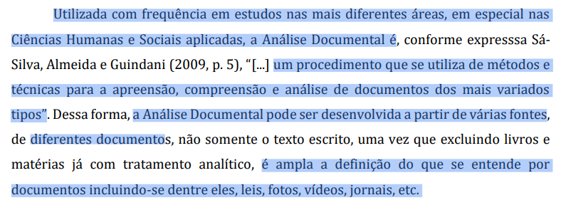

## Tabela de contribuição
| Artefato(s) | Autor(es) |
| --- | --- |
| Página de Planejamento do Relato dos Resultados da Análise de Tarefas | [Hugo Freitas Silva](https://github.com/HugoFreitass) |

## Introdução

A análise documental realizada sobre o ecossistema digital do Sabin teve como objetivo identificar características do perfil de usuário responsável pela administração e operação dos sistemas institucionais. A investigação concentrou-se em documentos públicos relacionados à privacidade de dados, governança digital, serviços corporativos e informações institucionais disponibilizadas pelo grupo (LIMA JUNIOR et al., 2021, p. 37).[PRINT] 

A leitura dos documentos evidencia que parte significativa dos serviços digitais do Sabin depende da gestão contínua de informações cadastrais, controle de acessos, integração entre sistemas e monitoramento de processos internos. Essas atividades pressupõem a existência de profissionais responsáveis pela administração da plataforma, manutenção dos serviços e suporte aos diferentes públicos atendidos pela organização.

### Restrições e Responsabilidades do Usuário

Os documentos analisados indicam que a operação dos sistemas envolve tratamento de dados pessoais e sensíveis, exigindo conformidade com requisitos legais e políticas de segurança da informação. Dessa forma, o administrador do sistema atua sob restrições relacionadas ao controle de acesso, proteção de dados, rastreabilidade das operações e cumprimento de normas institucionais e regulatórias.

Além disso, a necessidade de garantir disponibilidade, integridade e confidencialidade das informações sugere que esse usuário possui permissões diferenciadas em relação aos demais perfis do sistema, sendo responsável pela configuração de parâmetros, gerenciamento de usuários e supervisão do funcionamento dos serviços digitais.

### Vocabulário e Jargão Utilizados

A documentação institucional utiliza termos técnicos relacionados à tecnologia da informação, proteção de dados e gestão corporativa. Entre os conceitos recorrentes encontram-se autenticação, controle de acesso, tratamento de dados pessoais, integração de sistemas, monitoramento, auditoria e conformidade regulatória.

A presença desse vocabulário sugere que o perfil analisado possui familiaridade com linguagem técnica e administrativa, sendo capaz de interpretar procedimentos operacionais, políticas de privacidade e documentos relacionados à governança da informação.

### Complexidade das Tarefas

As atividades atribuídas ao administrador apresentam grau de complexidade elevado, uma vez que envolvem múltiplos processos e diferentes áreas organizacionais. Entre as principais tarefas identificadas destacam-se:

- Gerenciamento de usuários e permissões de acesso;
- Configuração e manutenção de sistemas corporativos;
- Monitoramento de serviços e tratamento de incidentes;
- Acompanhamento de integrações entre plataformas;
- Geração de relatórios e auditorias operacionais;
- Garantia de conformidade com políticas internas e legislação aplicável.

Essas tarefas exigem conhecimento técnico especializado, capacidade analítica e familiaridade com ferramentas corporativas utilizadas na gestão dos serviços digitais da organização.

### Perfil de Usuário Resultante

Com base nos achados documentais, é possível inferir que o sistema pressupõe um usuário com elevada competência técnica e ampla familiaridade com processos organizacionais. Trata-se de um profissional que utiliza os sistemas de forma intensiva, desempenhando funções relacionadas à administração tecnológica e ao suporte operacional.

As evidências indicam o seguinte perfil:

| Dimensão | Perfil Pressuposto pelo Sistema |
|-----------|--------------------------------|
| Formação | Ensino superior em Tecnologia da Informação, Sistemas de Informação, Engenharia de Software ou áreas correlatas |
| Letramento Digital | Alto; domínio de sistemas corporativos, ferramentas administrativas e conceitos de segurança da informação |
| Conhecimento do Domínio | Elevado conhecimento sobre processos internos, gestão de usuários e infraestrutura digital |
| Frequência de Uso | Diária e contínua |
| Responsabilidades | Administração de acessos, monitoramento operacional, manutenção de sistemas e suporte institucional |
| Capacidade Técnica | Interpretação de documentação técnica, relatórios operacionais e políticas corporativas |
| Motivação Principal | Garantir estabilidade, segurança, disponibilidade e eficiência dos serviços digitais |
| Contexto de Uso | Ambiente corporativo com acesso a sistemas internos e ferramentas administrativas |

Os resultados apontam que o sistema foi concebido para um usuário especializado, com autonomia para tomar decisões operacionais e conhecimento suficiente para compreender requisitos técnicos e regulatórios. Diferentemente dos usuários finais da plataforma, o administrador atua diretamente na sustentação dos serviços digitais, sendo responsável por assegurar o funcionamento adequado da infraestrutura tecnológica que suporta as atividades do Grupo Sabin.

O perfil identificado está descrito no perfil 2 na página de [perfis de usuário](../requisitos/perfilDeUsuario.md).

### Fontes Documentais

- SABIN. Política de Privacidade e Proteção de Dados. Disponível em: <https://www.sabin.com.br/privacidade>. Acesso em: maio 2026.
- SABIN. Portal Institucional. Disponível em: <https://www.sabin.com.br>. Acesso em: maio 2026.
- Documentação institucional e informações corporativas disponibilizadas nos canais digitais do Grupo Sabin.

## Agradecimentos à IA

Gostaríamos de registrar nossos agradecimentos ao modelo de Inteligência Artificial Generativa Gemini, desenvolvido pelo Google, pelo auxílio na estruturação, revisão gramatical e padronização da formatação em Markdown dos artefatos deste projeto. A ferramenta foi utilizada estritamente como suporte técnico e operacional para refinar a apresentação da documentação. Ressaltamos que todo o planejamento, execução das metodologias, análise crítica de dados e tomadas de decisão descritas neste documento são de autoria e responsabilidade exclusiva dos membros da equipe.

___

## Referência Bibliográfica

> LIMA JUNIOR, Eduardo Brandão; OLIVEIRA, Guilherme Saramago de; SANTOS, Adriana Cristina Omena dos; SCHNEKENBERG, Guilherme Fernando. Análise documental como percurso metodológico na pesquisa qualitativa. Cadernos da FUCAMP, Monte Carmelo, v. 20, n. 44, p. 36–51, 2021. Disponível em: https://revistas.fucamp.edu.br/index.php/cadernos/article/download/2356/1451. Acesso em: 23 maio 2026.

---

## Histórico de Versão

| Versão | Data | Descrição | Autores | Data Revisão | Descrição Revisão | Revisores |
| :---: | :---: | :--- | :--- | :---: | :--- | :--- |
| 1.0 | 23/05/2026 | Criação do documento | [Hugo Freitas Silva](https://github.com/HugoFreitass) | 24/05/2026 | - | [Philipe Amâncio](https://github.com/Phill-Chill) |
| 1.1 | 16/06/2026 | Adição da seção de agradecimentos da IA| [Nathan Pontes Romão](https://github.com/nathanpromao) | - |  |  |