# Análise de Tarefas

## Introdução

Uma **análise de tarefas** é utilizada para se ter um entendimento sobre qual é o trabalho dos usuários, como eles o realizam e por quê. Nesse tipo de análise, o trabalho é definido em termos dos objetivos que os usuários querem ou precisam atingir em seu contexto <span class="hover-image">(BARBOSA et al., 2021, p. 177)<sup class="Print">[PRINT]</sup>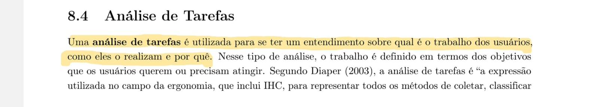 </span>.


Na área de Interação Humano-Computador (IHC), a análise de tarefas pode ser empregada em três atividades habituais do projeto: para a análise da situação atual (seja ela apoiada ou não por um sistema computacional), para o (re)design de um sistema computacional ou para a avaliação do resultado de uma intervenção que inclua a introdução de um (novo) sistema computacional. O texto ilustrado também ressalta que, quando o objetivo é avaliar um sistema computacional existente, a análise de tarefas pode ser bem concreta, descrevendo o comportamento do usuário de forma detalhada <span class="hover-image">(BARBOSA et al., 2021, p. 178)<sup class="Print">[PRINT]</sup> </span>.


# Análise Hierárquica de Tarefas (HTA)

## Introdução

A Análise Hierárquica de Tarefas (HTA - *Hierarchical Task Analysis*) foi desenvolvida na década de 1960 para entender as competências e habilidades exibidas em tarefas complexas e não repetitivas, bem como para auxiliar na identificação de problemas de desempenho. Ela ajuda a relacionar o que as pessoas fazem (ou se recomenda que façam), por que o fazem, e quais as consequências caso não o façam corretamente. Diferente das abordagens de sua época, o método se baseia em psicologia funcional, e não comportamental <span class="hover-image">(BARBOSA et al., 2021)<sup class="Print">[PRINT]</sup> </span>.


Na HTA, uma **tarefa** é qualquer parte do trabalho que precisa ser realizada, e toda tarefa pode ser definida em termos de seu(s) objetivo(s). Tarefas complexas são definidas em termos de objetivos e subobjetivos, em um desdobramento hierárquico que é chamado de decomposição de tarefas ou redescrição. No nível mais baixo da hierarquia de objetivos, cada subobjetivo é alcançado por uma **operação**, que é considerada a unidade fundamental em HTA. Esses elementos são organizados em diagramas que demonstram as relações estruturais do plano, que podem ser do tipo sequencial (1>2), seleção (1/2) ou paralelo (1+2) <span class="hover-image">(BARBOSA et al., 2021)<sup class="Print">[PRINT]</sup>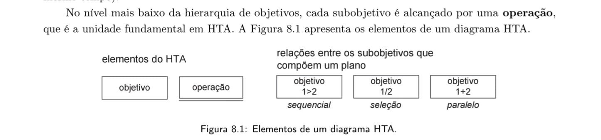 </span>.


A aplicação prática do método resulta na construção de uma árvore visual de decomposição. O diagrama parte de um objetivo geral no topo (por exemplo, "0. Cadastrar projeto final") e ramifica-se para subobjetivos e operações numeradas, explicitando os planos de execução e o fluxo que o usuário deve percorrer para concluir o trabalho <span class="hover-image">(BARBOSA et al., 2021)<sup class="Print">[PRINT]</sup> </span>.


# Análise de Tarefas: Método GOMS

## Introdução ao GOMS

O GOMS é um método utilizado para descrever uma tarefa e o conhecimento do usuário sobre como realizá-la, estruturando-se em quatro componentes fundamentais: objetivos (*goals*), operadores (*operators*), métodos (*methods*) e regras de seleção (*selection rules*). Os **objetivos** representam exatamente o que o usuário deseja realizar utilizando o software, como, por exemplo, editar um texto. <span class="hover-image">(BARBOSA et al., 2021)<sup class="Print">[PRINT]</sup>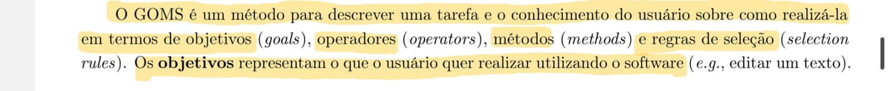 </span>


 Os **operadores** são descritos como primitivas internas (ações cognitivas) ou externas (ações concretas permitidas pelo software, como digitar no teclado ou clicar em um botão). Os **métodos** consistem em sequências bem conhecidas de subobjetivos e operadores que permitem atingir um objetivo maior. Quando existe mais de um método viável, aplicam-se as **regras de seleção**, que representam a tomada de decisão do usuário sobre qual caminho utilizar em uma determinada situação. <span class="hover-image">(BARBOSA et al., 2021)<sup class="Print">[PRINT]</sup> </span>


Dentro da família de modelos baseados em GOMS, existem variações com diferentes níveis de complexidade e foco. Destacam-se as técnicas KLM (Card et al., 1983), CMN-GOMS (Card et al., 1983) e CPM-GOMS (John e Gray, 1995). <span class="hover-image">(BARBOSA et al., 2021)<sup class="Print">[PRINT]</sup> </span>


---

## KLM (Keystroke-Level Method)

O KLM é a técnica mais simples da família GOMS e atua de forma limitada a um conjunto predefinido de operadores primitivos. Estes operadores incluem: **K** (pressionar tecla ou botão), **P** (apontar com o mouse), **H** (mover as mãos para o teclado ou dispositivo), **D** (desenhar um segmento de reta), **M** (preparação mental para realizar uma ação) e **R** (tempo de resposta do sistema onde o usuário deve esperar). <span class="hover-image">(BARBOSA et al., 2021)<sup class="Print">[PRINT]</sup> </span>


Que atribui durações médias (em segundos) para cada uma dessas operações do KLM. Por exemplo, a operação **K** (teclar) varia de 0,08s para um exímio digitador até 1,20s para alguém não familiarizado com o teclado, enquanto a preparação mental (**M**) consome em média 1,20s. <span class="hover-image">(BARBOSA et al., 2021)<sup class="Print">[PRINT]</sup> </span>


A aplicação prática desses valores pode ser observada na **Tabela I**, que demonstra o cálculo total de tempo para a tarefa de "Salvar arquivo". A análise compara diferentes métodos: usar o menu "Arquivo > Salvar" (totalizando 4,60s), clicar no botão de salvar na barra de ferramentas (3,10s) ou usar as teclas de atalho Ctrl+S (1,60s).

<center> Tabela I - Tabela com dados de tempo na execução da funcionalidade de salvar arquivo. </center> 


> Fonte: BARBOSA et al. (2021, p.198)

---

## CMN-GOMS

O CMN-GOMS refere-se à proposta original do método GOMS. Neste modelo, exige-se uma hierarquia estrita de objetivos, onde os operadores são executados estritamente em ordem sequencial. Os métodos são documentados utilizando uma notação muito semelhante a um pseudocódigo computacional, incorporando submétodos e estruturas condicionais. <span class="hover-image">(BARBOSA et al., 2021)<sup class="Print">[PRINT]</sup> </span>


...agem 12** apresenta o Exemplo 8.7, que demonstra um modelo CMN-GOMS sem detalhes para a tarefa de "descobrir a direção de tráfego de uma rua" no Google Maps. O objetivo principal (GOAL 0) é decomposto em subobjetivos (GOAL 1 e GOAL 2), oferecendo métodos alternativos de navegação que são condicionados por regras de seleção (SEL. RULE) baseadas no nível de conhecimento do usuário sobre o local. <span class="hover-image">(BARBOSA et al., 2021)<sup class="Print">[PRINT]</sup> </span>


 Este modelo detalhado expande os métodos até o nível mais granular das operações (OP.), como "deslocar o cursor do mouse" (OP. 1.A.A.1) ou "girar a roda do mouse para a frente" (OP. 1.A.A.2), mapeando de forma exaustiva todas as regras de seleção e passos físicos necessários para cumprir a meta no sistema. 
<span class="hover-image">(BARBOSA et al., 2021)<sup class="Print">[PRINT]</sup> </span>.
<span class="hover-image">(BARBOSA et al., 2021)<sup class="Print">[PRINT]</sup> </span>


## CPM-GOMS

A sigla CPM-GOMS tem dupla origem: ela representa os operadores *cognitivos, perceptivos e motores*, e também faz referência à abordagem do *Critical Path Method* (técnica de análise do caminho crítico). Esta versão do GOMS baseia-se diretamente no processador humano de informações (MHP) e em seu modelo de estágios paralelos. Diferente das abordagens anteriores, o CPM-GOMS não pressupõe que os operadores sejam executados de forma estritamente sequencial; pelo contrário, atividades cognitivas, perceptivas e motoras podem ocorrer em paralelo, dependendo da natureza da tarefa. <span class="hover-image">(BARBOSA et al., 2021)<sup class="Print">[PRINT]</sup> </span>


O CPM-GOMS utiliza um diagrama do tipo PERT para mapear visualmente os operadores e suas dependências. Neste diagrama, é possível observar linhas do tempo paralelas para diferentes recursos do processamento humano, como visão, cognição, mão direita, mão esquerda e movimento dos olhos. O "caminho crítico" traçado através dessas dependências fornece uma previsão simples do tempo total necessário para concluir a tarefa de interação. <span class="hover-image">(BARBOSA et al., 2021)<sup class="Print">[PRINT]</sup>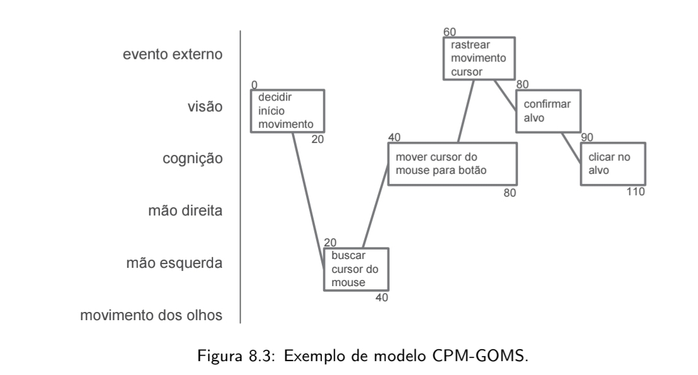 </span>


Por fim, a construção de um modelo CPM-GOMS se inicia a partir de um modelo CMN-GOMS prévio. Os operadores identificados inicialmente são então classificados de forma mais aprofundada nas categorias do MHP (cognitivos, perceptivos e motores). A cada um desses operadores é atribuída uma duração estimada. Somando-se esses valores ao longo do caminho crítico, calcula-se o tempo previsto de execução da tarefa, o que possibilita aos designers realizar análises qualitativas da relação entre os aspectos do design e o tempo de execução, além de simular soluções alternativas. <span class="hover-image">(BARBOSA et al., 2021)<sup class="Print">[PRINT]</sup>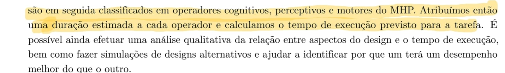 </span>


# Árvores de Tarefas Concorrentes (ConcurTaskTrees – CTT)

## Introdução ao CTT

 O modelo de árvores de tarefas concorrentes (ConcurTaskTrees – CTT) foi criado para auxiliar a avaliação e o design de IHC. Nesse modelo, existem quatro tipos de tarefas: *tarefas do usuário* (realizadas fora do sistema), *tarefas do sistema* (em que o sistema realiza um processamento sem interagir com o usuário), *tarefas interativas* (em que ocorrem os diálogos usuário–sistema) e *tarefas abstratas* (que não são tarefas em si, mas sim uma representação de uma composição de tarefas). Assim como na análise hierárquica, a leitura do modelo exige que, para considerar uma tarefa principal realizada, suas tarefas subordinadas devem ter sido realizadas <span class="hover-image">(BARBOSA et al., 2021)<sup class="Print">[PRINT]</sup>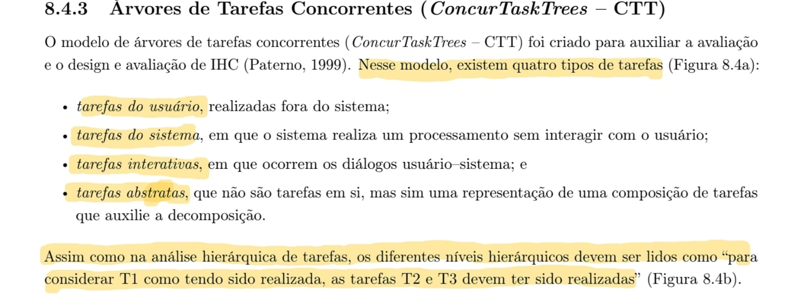 </span>.


A representação visual na notação CTT apresenta os ícones específicos para cada um dos quatro tipos de tarefas (usuário, sistema, interativa e abstrata), que podem ser representadas por uma estrutura hierárquica clássica do modelo, conectando uma tarefa abstrata raiz (T1) às suas tarefas subordinadas (T2 e T3) <span class="hover-image">(BARBOSA et al., 2021)<sup class="Print">[PRINT]</sup>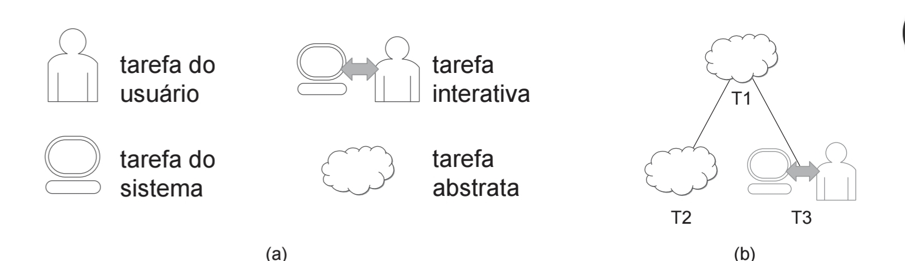 </span>.


Além da hierarquia estrita, o CTT permite representar diversas relações lógicas e temporais entre as tarefas, aumentando consideravelmente a expressividade da notação. As principais relações descritas são: ativação (`>>`), ativação com passagem de informação (`[]>>`), escolha entre tarefas alternativas (`[]`), tarefas concorrentes (`|||`), tarefas concorrentes e comunicantes (`|[]|`), tarefas independentes (`|=|`), desativação (`[>`) e suspensão/retomada (`|>`) <span class="hover-image">(BARBOSA et al., 2021)<sup class="Print">[PRINT]</sup> </span>.


Para facilitar o entendimento visual dessas conexões a **Figura 1** mapeia graficamente cada uma das relações entre tarefas no CTT. Os símbolos textuais correspondentes a cada tipo de interação (como concorrência ou escolha) são posicionados nas linhas que unem os nós das tarefas.

<center> Figura I - Exemplos de diagrama CTT </center>

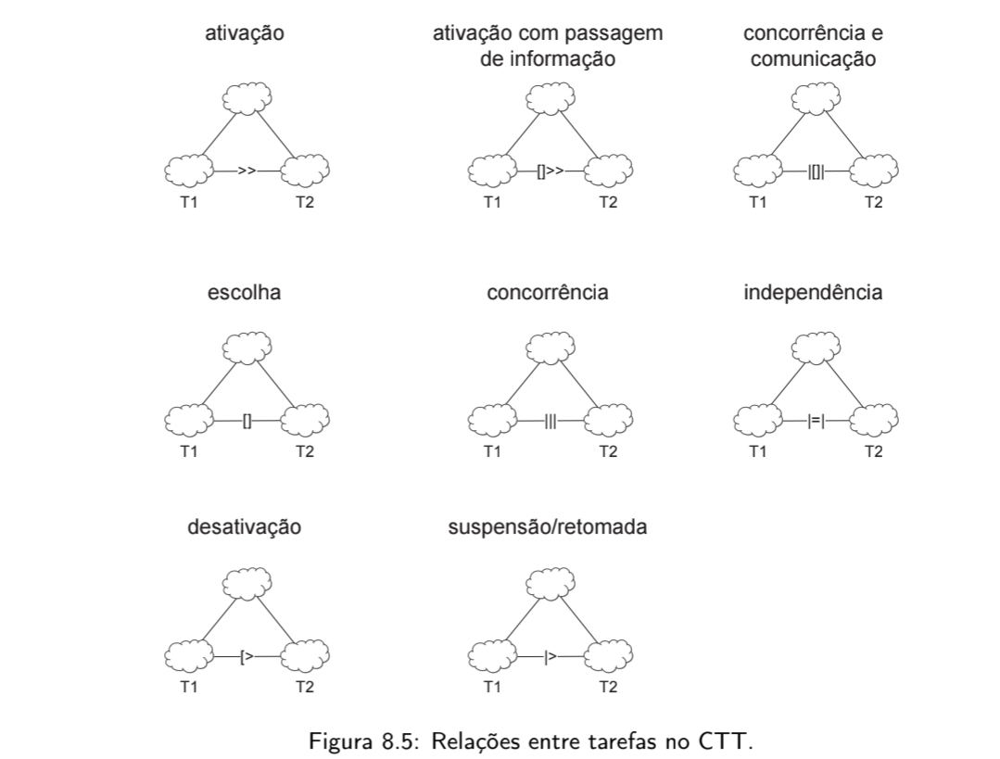

> Fonte: BARBOSA et al. (2021, p.202) 

Por fim, a **Imagem 22** consolida todos esses conceitos por meio da Figura 8.6, apresentando um exemplo prático de um modelo de tarefas em CTT para o objetivo de "Agendar compromisso". O diagrama detalha como a tarefa abstrata no topo da hierarquia se decompõe em subtarefas específicas (como examinar compromissos, informar dados e gravar no sistema), interligando diferentes tipos de tarefas (usuário, interativa e de sistema) através das relações de ativação, passagem de informação e concorrência <span class="hover-image">(BARBOSA et al., 2021)<sup class="Print">[PRINT]</sup>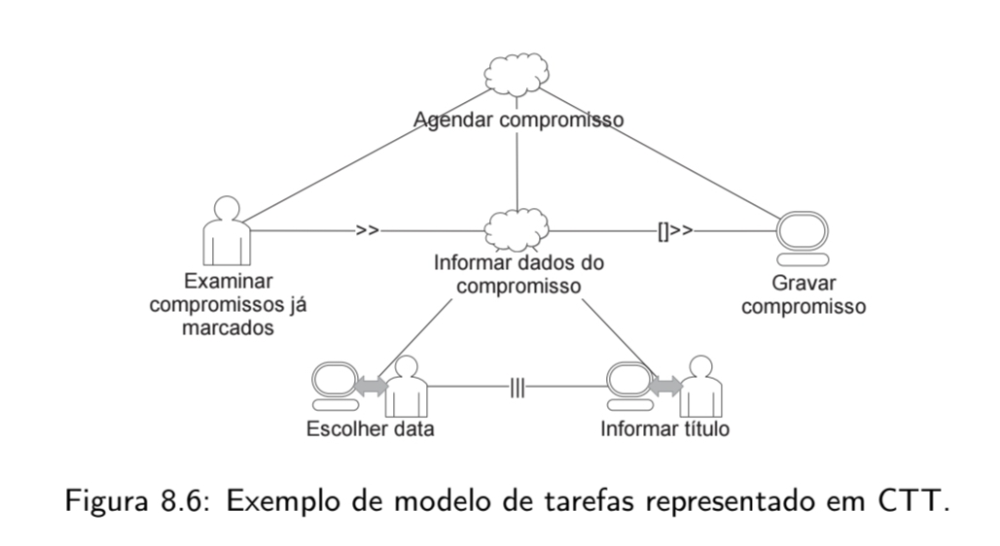 </span>.


---

## Análise de Tarefas Realizadas

# 1. Pré-agendamento de exames via envio de guias médicas

Esta análise avalia a funcionalidade de **pré-agendamento de exames via envio de guias médicas** no portal do Sabin. No cenário mapeado, a usuária (Márcia) tenta utilizar o fluxo automatizado do site enviando fotos dos pedidos médicos. O sistema identifica os exames, mas fornece uma instrução genérica exigindo 12 horas de jejum. 

Como o paciente (seu marido) faz uso de medicação contínua para hipertensão logo ao acordar, Márcia tenta utilizar o botão de "Dúvidas Frequentes" para verificar se a medicação quebra o jejum. Ao se deparar com um manual em PDF longo e sem ferramenta de busca, ela se sente insegura, abandona o processo automatizado e recorre ao ícone do WhatsApp para finalizar o agendamento com um atendente humano, garantindo que o preparo seja feito corretamente.

Abaixo, a decomposição dessa interação utilizando os métodos de Árvores de Tarefas Concorrentes (CTT) e GOMS (KLM).

---

## 1.1 Árvores de Tarefas Concorrentes (ConcurTaskTrees - CTT)

A notação CTT a seguir demonstra a decomposição hierárquica do cenário. O processo ilustra a interrupção (desativação `[>`) do fluxo principal automatizado devido à falha de suporte da interface, forçando a usuária a migrar para um fluxo alternativo de atendimento.

**Legenda de Tarefas:** 
☁️ Abstrata | 👤 Usuário | 🖥️ Sistema | 🖱️ Interativa
**Legenda de Relações:** 
`>>` (Ativação) | `[]>>` (Ativação com passagem de informação) | `[>` (Desativação)

*   **0. Agendar exames com dúvida crítica** ☁️
    *   **1. Tentar agendamento automatizado** ☁️ `[>` **2. Buscar atendimento humano (WhatsApp)** ☁️
        *   **1.1.** Acessar funcionalidade de envio de pedido 🖱️ `>>`
        *   **1.2.** Tirar fotos das guias médicas 🖱️ `[]>>`
        *   **1.3.** Processar imagens e identificar exames 🖥️ `[]>>`
        *   **1.4.** Exibir aviso genérico de preparo (12h de jejum) 🖥️ `>>`
        *   **1.5.** Avaliar instruções e constatar conflito com medicação 👤 `>>`
        *   **1.6.** Esclarecer dúvida de preparo ☁️
            *   **1.6.1.** Clicar no botão "Dúvidas Frequentes" 🖱️ `>>`
            *   **1.6.2.** Carregar e exibir manual em PDF 🖥️ `>>`
            *   **1.6.3.** Tentar localizar termo "hipertensão" no documento 👤 `>>`
            *   **1.6.4.** Constatar impossibilidade de busca e abandonar fluxo 🖱️
    *   **2. Buscar atendimento humano (WhatsApp)** ☁️
        *   **2.1.** Retornar à tela inicial do aplicativo/site 🖱️ `>>`
        *   **2.2.** Clicar no ícone de atendimento via WhatsApp 🖱️ `>>`
        *   **2.3.** Enviar fotos das guias e relatar dúvida ao atendente 🖱️

---

## 1.2 GOMS: Keystroke-Level Method (KLM)

A análise KLM abaixo quantifica o tempo despendido pela usuária no cenário, adaptando os operadores primitivos (Point, Click) para a interação via tela de toque (Smartphone). 

**Operadores utilizados:**
*   **M** (Preparação mental): 1,20 s
*   **P** (Apontar para o elemento na tela): 1,10 s
*   **K** (Tocar/Clicar no botão ou tela): 0,20 s
*   **W(t)** (Tempo de espera de resposta do sistema): Estimado

### Análise da Tarefa: Tentar agendar exame e migrar para WhatsApp

| operação | descrição | tempo (em s) |
| :--- | :--- | :--- |
| **método:** fluxo automatizado (falha) | | |
| M | preparação (decidir iniciar agendamento) | 1,20 |
| P | levar o dedo até o botão de envio de guia | 1,10 |
| K | tocar no botão | 0,20 |
| M | preparação (posicionar câmera sobre as guias) | 1,20 |
| P | levar o dedo até o disparador da câmera | 1,10 |
| K | tocar para capturar e enviar foto | 0,20 |
| W(t) | espera pela leitura da IA (estimativa) | 3,00 |
| M | preparação (ler o preparo de 12h e lembrar do remédio) | 1,20 |
| P | levar o dedo até o botão "Dúvidas Frequentes" | 1,10 |
| K | tocar no botão | 0,20 |
| W(t) | espera pelo carregamento do PDF (estimativa) | 2,00 |
| M | preparação (rolar o PDF, perceber que é longo e frustrar-se)| 1,20 |
| P | levar o dedo até o botão de fechar/voltar | 1,10 |
| K | tocar no botão | 0,20 |
| **método:** recuperação via atendimento humano | | |
| M | preparação (decidir abandonar e usar o WhatsApp) | 1,20 |
| P | levar o dedo até o ícone de Início/Home | 1,10 |
| K | tocar no botão | 0,20 |
| M | preparação (localizar o ícone flutuante do WhatsApp) | 1,20 |
| P | levar o dedo até o ícone do WhatsApp | 1,10 |
| K | tocar no botão para abrir o chat | 0,20 |
| | **tempo total estimado do cenário** | **19,80** |

**Observação Analítica:** A tarefa de pré-agendamento deveria ser um fluxo rápido de inserção de dados. No entanto, devido à falha de suporte informacional (PDF não pesquisável), a usuária gasta quase 20 segundos apenas para realizar tentativas frustradas e ser obrigada a iniciar um segundo fluxo (WhatsApp), o que sobrecarrega tanto o tempo da usuária quanto os recursos de atendimento humano do laboratório.


## 2.Visualizar Imagem DICOM

A HTA foi utilizada para mapear a decomposição do objetivo principal (Analisar Imagem DICOM) em subobjetivos. O foco desta análise é identificar a sequência necessária para o sucesso da tarefa e explicitar os problemas e recomendações associados a cada etapa, utilizando o critério de probabilidade e custo de falha para propor soluções preventivas.

#### 1.2 Diagrama Hierárquico (Estrutura Lógica) da análise Hierárquica de Tarefas (HTA):

```text
0. Analisar exame de imagem (DICOM) [Plano: 1 > 2] (Sequencial)
├── 1. Localizar o exame do paciente [Plano: 1 / 2] (Seleção)
│   ├── 1.1 Pesquisar pelo nome do paciente
│   └── 1.2 Buscar na lista de exames recentes
└── 2. Operar o visualizador DICOM [Plano: 1 > 2] (Sequencial)
    ├── 2.1 Ativar visualizador (carregar plugin/imagem)
    └── 2.2 Manipular a imagem [Plano: 1 + 2 + 3] (Paralelo)
        ├── 2.2.1 Ajustar brilho/contraste (janelamento)
        ├── 2.2.2 Aplicar zoom
        └── 2.2.3 Realizar medições na lesão
```


### Tabela HTA

| Objetivo / Operação | Plano | Input | Ação | Feedback | Problemas e Recomendações |
|---|---|---|---|---|---|
| 0. Analisar exame de imagem (DICOM) | 1 > 2 | Médico autenticado no portal e com necessidade de avaliar o exame. | Localizar o exame do paciente e operar o visualizador DICOM. | Exame visualizado com qualidade suficiente para análise diagnóstica. | Se houver falha no carregamento, o sistema deve oferecer alternativa de contingência. |
| 1. Localizar o exame do paciente | 1 / 2 | Dados do paciente ou histórico recente disponível. | Pesquisar pelo nome do paciente ou consultar a lista de exames recentes. | Exame correto localizado no sistema. | Recomenda-se incluir filtros por data, modalidade e tipo de exame. |
| 2. Operar o visualizador DICOM | 1 > 2 | Exame selecionado no sistema. | Ativar o visualizador e, em seguida, manipular a imagem. | Imagem exibida e disponível para inspeção clínica. | Recomenda-se visualizador nativo no navegador e carregamento mais robusto. |
| 2.2 Manipular a imagem | 1 + 2 + 3 | Imagem carregada no visualizador. | Ajustar brilho/contraste, aplicar zoom e realizar medições conforme necessário. | Imagem adequada para interpretação e análise da lesão. | Recomenda-se manter ferramentas principais sempre visíveis e com ícones padronizados. |

---

## 2.2.Árvore de Tarefas Concorrentes (CTT)

A Árvore de Tarefas Concorrentes (*Concurrence Task Trees* - CTT), desenvolvida por Fabio Paternò, é um modelo de análise que avança a estruturação clássica da HTA. Enquanto a HTA foca na decomposição hierárquica baseada em objetivos e no custo de falhas, o CTT destaca-se por representar visualmente e formalmente as **relações temporais e lógicas** entre as tarefas, além de classificar explicitamente a alocação de responsabilidades (se a ação é feita pelo usuário, pelo sistema ou pela interação de ambos).

A utilização do CTT justifica-se na avaliação de funcionalidades complexas e dinâmicas, como o visualizador de imagens DICOM. A análise de exames médicos pelos profissionais de saúde raramente ocorre de forma linear ou rígida. O médico frequentemente realiza ações simultâneas e intercaladas, como aplicar *zoom* enquanto movimenta a imagem, ou iniciar a medição de uma lesão e suspendê-la temporariamente para ajustar o janelamento de contraste. O CTT permite mapear essa flexibilidade de forma estruturada assim como apresentado na figura I.

Figura II - Diagrama em Árvore de Tarefas Concorrentes (CTT)

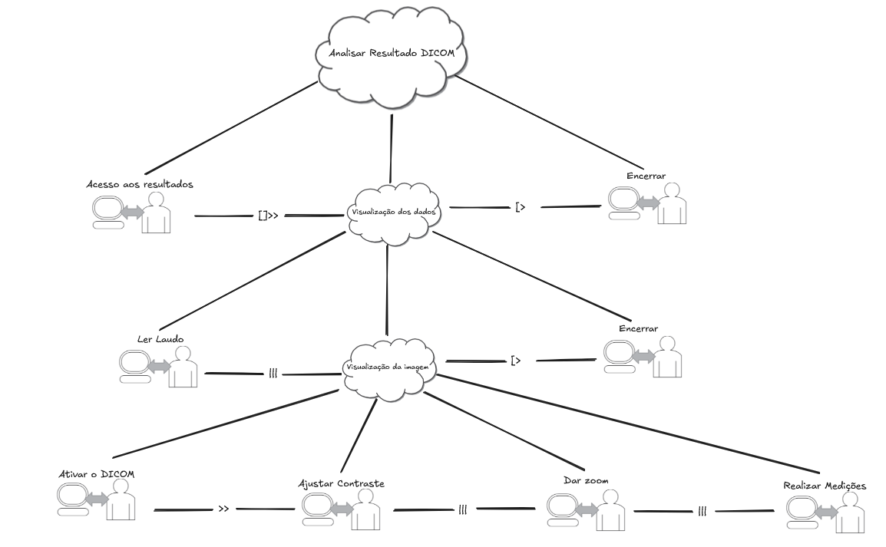

> Fonte: autoria própria.


# Análise GOMS — Agendamento de Exame no Site Sabin

## Introdução

A técnica **GOMS (Goals, Operators, Methods, Selection Rules)** é utilizada para modelar o comportamento de usuários experientes durante a execução de tarefas em sistemas computacionais. Diferente da HTA, que foca na decomposição hierárquica de objetivos, o GOMS descreve o **conhecimento procedimental**, ou seja, como o usuário realiza a tarefa passo a passo, assumindo que ele já domina o sistema e não comete erros.

Essa abordagem permite analisar a **eficiência da interação**, identificar gargalos e até estimar o tempo de execução de tarefas por meio do modelo **KLM (Keystroke-Level Model)**.

---

## 1. Goals (Objetivos)

- **G0:** Agendar exame laboratorial online  
- **G1:** Acessar o site do Sabin  
- **G2:** Iniciar processo de agendamento  
- **G3:** Selecionar exame  
- **G4:** Escolher unidade e horário  
- **G5:** Informar dados pessoais  
- **G6:** Confirmar agendamento  

---

## 2. Operators (Operadores)

### Operadores físicos (externos)
- **K:** pressionar tecla  
- **P:** apontar cursor  
- **B:** clicar (pressionar/soltar botão do mouse)  
- **H:** mover mão entre dispositivos  

### Operadores cognitivos
- **M:** preparação mental  

### Sistema
- **R:** tempo de resposta do sistema  

---

## 3. Methods (Métodos)

### Método principal (fluxo padrão via interface web)


1. Acessar site:
   M → H → K → K → R

2. Iniciar agendamento:
   M → P → B → R

3. Selecionar exame:
   M → K → K → P → B → R

4. Escolher unidade e horário:
   M → P → B → P → B → R

5. Informar dados pessoais:
   M → K → K → K → R

6. Confirmar agendamento:
   M → P → B → R


---

## 4. Selection Rules (Regras de Seleção)

- Se o usuário souber o nome do exame → usar **busca direta**  
- Caso contrário → navegar por categorias/listas  
- Se houver dados previamente salvos → usar **autopreenchimento**  
- Caso contrário → preencher manualmente  
- Se houver múltiplos horários → escolher o mais conveniente  

---

## 5. Tabela GOMS

| Goal | Método | Operadores | Observação |
|------|--------|------------|------------|
| G1: Acessar site | Abrir navegador + acessar URL | M, H, K, K, R | Pode ser automatizado (favoritos) |
| G2: Iniciar agendamento | Clicar na funcionalidade | M, P, B, R | Depende da visibilidade do botão |
| G3: Selecionar exame | Buscar e selecionar | M, K, K, P, B, R | Sensível à qualidade da busca |
| G4: Escolher unidade/horário | Seleção sequencial | M, P, B, P, B, R | Pode gerar carga cognitiva |
| G5: Informar dados | Preencher formulário | M, K, K, K, R | Propenso a erros |
| G6: Confirmar | Revisar e confirmar | M, P, B, R | Feedback crítico |

---

## 6. Análise KLM (Estimativa de Tempo)

Considerando um usuário mediano:

| Etapa | Sequência | Tempo (s) |
|------|----------|----------|
| Acessar site | M + K + K + R | ~1,6 + R |
| Iniciar agendamento | M + P + B + R | ~2,4 + R |
| Selecionar exame | M + 2K + P + B + R | ~2,8 + R |
| Escolher unidade/horário | M + P + B + P + B + R | ~3,6 + R |
| Informar dados | M + 3K + R | ~1,8 + R |
| Confirmar | M + P + B + R | ~2,4 + R |

**Tempo total estimado:** ~14–16 segundos + tempo de resposta do sistema

---

## 7. Interpretação

A análise evidencia que:

- O fluxo é **linear e previsível** para usuários experientes  
- As etapas mais custosas são:
  - **Seleção de exame (G3)**  
  - **Escolha de unidade/horário (G4)**  
- A etapa mais crítica em termos de erro é:
  - **Entrada de dados (G5)**  

---

## 8. Insights de Design

- **Reduzir número de cliques (P, B)**  
- **Diminuir carga cognitiva (M)** com melhor organização da interface  
- **Implementar autofill** para dados pessoais  
- **Melhorar mecanismo de busca** de exames  
- **Exibir disponibilidade de forma clara** para unidade/horário  

---

## 9. Conclusão

A análise GOMS permite entender o desempenho de usuários experientes no sistema de agendamento do Sabin, evidenciando oportunidades claras de otimização.

Enquanto a HTA estrutura o problema em termos de objetivos, o GOMS mostra **como esses objetivos são operacionalizados**, permitindo avaliar eficiência, consistência e qualidade da interação.

Essa abordagem é particularmente útil para orientar melhorias que reduzam tempo de execução, esforço cognitivo e probabilidade de erro.


## Análise Hierárquica de Tarefas (HTA) — Agendamento de Exame no Site Sabin

A **Análise Hierárquica de Tarefas (HTA — Hierarchical Task Analysis)** é uma técnica amplamente utilizada em Interação Humano-Computador (IHC) para compreender como os usuários realizam atividades em sistemas complexos. Em vez de focar apenas nas ações, a HTA parte dos **objetivos dos usuários**, decompondo-os em **subobjetivos e operações**, organizados por meio de um plano que define a ordem e a relação entre essas tarefas.

Essa abordagem permite identificar **pontos críticos de interação**, **possíveis erros** e **oportunidades de melhoria no design**, sendo especialmente útil na avaliação e no redesenho de sistemas interativos.

Neste contexto, a seguir é apresentada uma HTA para o processo de **agendamento de exames laboratoriais no site do Sabin**, modelando as etapas necessárias para que o usuário atinja seu objetivo principal.


A funcionalidade analisada está apresentada na **Figura III**:

Figura III - Funcionalidade de agendamento de exame em diagrama HTA.

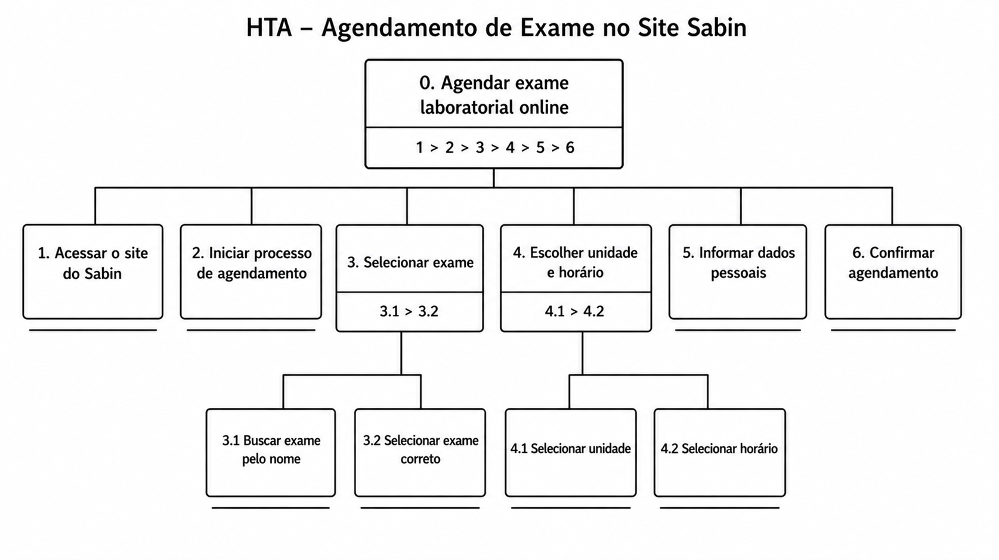

> Fonte: autoria própria

### **0. Agendar exame laboratorial online**

**Plano geral:**  
`1 > 2 > 3 > 4 > 5 > 6`  
As etapas devem ser executadas de forma **sequencial**, até a confirmação do agendamento.

---

## Decomposição Hierárquica

### **1. Acessar o site do Sabin**
Primeira etapa do fluxo, onde o usuário entra no sistema.

- **Input:** acesso a um navegador/dispositivo  
- **Ação:** abrir o site  
- **Feedback esperado:** página inicial carregada corretamente  

---

### **2. Iniciar processo de agendamento**
O usuário localiza a funcionalidade de agendamento.

- **Ação:** acessar a opção de agendamento  
- **Feedback:** interface de busca de exames exibida  

---

### **3. Selecionar exame**  
**Plano:** `3.1 > 3.2`

#### **3.1 Buscar exame pelo nome**
- **Ação:** digitar o nome do exame  
- **Feedback:** lista de exames disponíveis  

#### **3.2 Selecionar exame correto**
- **Ação:** escolher o exame desejado  
- **Feedback:** exame selecionado  

---

### **4. Escolher unidade e horário**  
**Plano:** `4.1 > 4.2`

#### **4.1 Selecionar unidade**
- **Ação:** escolher a unidade/laboratório  
- **Feedback:** unidade selecionada  

#### **4.2 Selecionar horário**
- **Ação:** escolher data e horário disponíveis  
- **Feedback:** horário definido  

---

### **5. Informar dados pessoais**
Etapa de preenchimento ou validação dos dados do usuário.

- **Ação:** inserir ou confirmar dados pessoais  
- **Feedback:** dados validados pelo sistema  

---

### **6. Confirmar agendamento**
Etapa final do processo.

- **Ação:** revisar informações e confirmar  
- **Feedback:** confirmação do agendamento  

---

## Interpretação da Análise

A HTA evidencia que o processo é:

- **Sequencial**, sem ramificações no fluxo principal  
- Dependente de decisões intermediárias (etapas 3 e 4)  
- Estruturado com **dependência entre tarefas**

---

## Pontos Críticos (Visão de IHC)

- **Busca de exames:** pode gerar ambiguidade  
- **Escolha de unidade/horário:** depende de boa visualização  
- **Entrada de dados:** propensa a erros  
- **Confirmação:** requer feedback claro  

---

## Conclusão

A HTA permite compreender o processo de agendamento como um fluxo orientado a objetivos, facilitando a identificação de problemas de usabilidade e apoiando melhorias no design do sistema. Etapas que envolvem decisão e entrada de dados devem receber maior atenção para garantir eficiência, eficácia e satisfação do usuário.


## Referência bibliográfica

BARBOSA, S. D. J. et al. Interação Humano-Computador e Experiência do Usuário. 1. ed. Rio de Janeiro: Autopublicação, 2021.

---
## Histórico de Versão
| Versão | Data | Descrição | Autor | Revisor |
| :--- | :--- | :--- | :--- | :--- |
| 1.0 | 1/05/2026 | Criação do documento |[Maria Laura](https://github.com/Maria-Laura-Regis)| [Hugo Freitas Silva](https://github.com/HugoFreitass) |
---