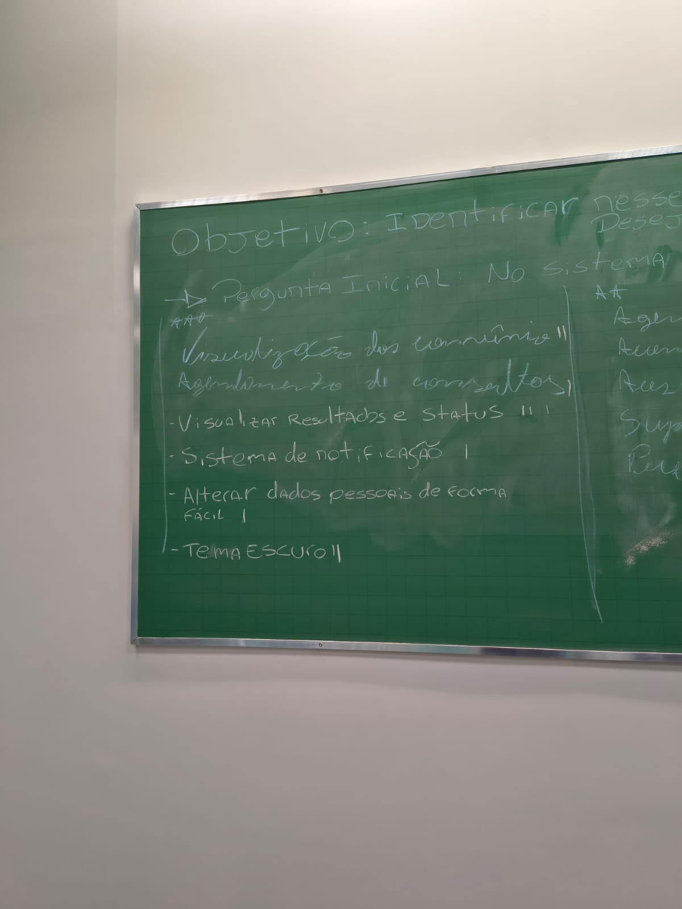

## Brainstorming com Diagrama de Afinidade

**Objetivo:** Levantar as reais necessidades dos usuários para o novo portal Sabin, focando na visão de um "sistema ideal" para remover limitações técnicas e focar no valor da experiência.

**Equipe Facilitadora (Papéis):**

*   **Moderador:** Conduz a sessão, faz as perguntas norteadoras e **parafraseia** as ideias dos usuários para garantir o entendimento técnico.
*   **Secretário:** Anota e enumera apenas as ideias que já foram validadas e parafraseadas pelo moderador.
*   **Cinegrafista:** Grava áudio e vídeo de toda a sessão para análise de contexto posterior.

**Fluxo da Dinâmica:**

1. **Ideação (Divergência):** A sessão começa com uma pergunta norteadora (ex: *"Quais recursos um site ideal deve ter?"*). Os participantes anotam suas ideias, explicam o "porquê" delas, e o moderador as parafraseia em voz alta.
2. **Organização (Convergência):** Quando as ideias se esgotam, aplica-se o **Diagrama de Afinidade**. As anotações viram *post-its* em um quadro, e os próprios usuários as agrupam por semelhança ou contexto funcional.
3. **Priorização (Votação):** Os participantes recebem "votos" (de 1 a 3 asteriscos) para marcar nos *post-its* que consideram mais importantes.

**Entrega Final:** O resultado é um escopo claro e priorizado, entregando à equipe de design uma lista das funcionalidades consideradas críticas e mais urgentes pelos próprios usuários.

# Análise de Resultados: Brainstorming

**Objetivo:** Levantar as reais necessidades dos usuários para o novo portal Sabin, focando na visão de um "sistema ideal" para remover limitações técnicas e focar no valor da experiência.

**Metodologia de Classificação:**
Durante a dinâmica, os participantes elencaram as funcionalidades e o escopo foi definido com base em dois critérios visuais anotados no quadro:

1. **Priorização (Asteriscos):** O que as pessoas julgaram ser mais crítico/difícil.

    - `***` : O mais importante
    - `**` : O segundo mais importante
    - `*` : O terceiro mais difícil / importante

2. **Frequência (Traços `|`):** Representa quantas vezes a mesma funcionalidade foi citada por participantes diferentes durante a sessão, indicando o quão comum é aquela necessidade no grupo.

### Registros da Sessão

Abaixo estão as imagens da lousa utilizada durante a dinâmica, contendo todas as anotações, os asteriscos de prioridade e os traços de frequência:

Imagem I - Levantamento de requisitos pelo Brainstoming

Fonte: autoria própria.

 

Imagem II - Levantamento de requisitos pelo Brainstoming

Fonte: autoria própria.

 

Imagem III - Levantamento de requisitos pelo Brainstoming

Fonte: autoria própria.

 

---

## Ranking de Priorização (Por Importância)

Abaixo está o resultado direto da dinâmica, refletindo a ordem exata de prioridade definida pelos usuários na lousa através dos asteriscos:

### `***` O Mais Importante
**Visualização dos convênios**
* **Análise:** Ter a clareza imediata sobre quais planos de saúde são aceitos foi classificado como o critério número um. Esta é a principal barreira de entrada para o paciente no laboratório; sem essa garantia visual logo de início, o usuário não prossegue com o uso do portal.

### `**` O Segundo Mais Importante
**Agendamento presencial**
* **Análise:** A capacidade de marcar e garantir o atendimento físico por meio do digital ocupou o segundo lugar na prioridade. Isso reflete a forte necessidade dos usuários de evitar filas, esperas desnecessárias e otimizar o tempo de permanência na unidade física do Sabin.

### `*` O Terceiro Mais Difícil / Importante
**Visualização em PDF dos exames e Mapeamento/disponibilidade de unidades**
* **Análise:** O acesso claro ao laudo final (documento em PDF) e a facilidade de encontrar laboratórios abertos/disponíveis completam o top 3 da dinâmica. São funcionalidades de altíssimo valor para o paciente, mas que foram reconhecidas com um grau de complexidade/dificuldade maior para serem executadas com perfeição e integração em tempo real.

---

## Frequência de Menções (Backlog)

Além do Top 3 de importância, o secretário da sessão utilizou traços (`|`) para marcar toda vez que uma funcionalidade era citada novamente por uma pessoa diferente. Isso ajuda a mapear quais dores e desejos são mais universais entre o público:

**Alta Frequência (Citadas 3 vezes por pessoas diferentes):**
* Visualizar Resultados e status (saber exatamente em qual etapa o exame está).

**Média Frequência (Citadas 2 vezes por pessoas diferentes):**
* Suporte (canal de ajuda).
* Pré-triagem (agilizar o processo antes de ir à unidade).
* Tema Escuro (conforto visual).

**Baixa Frequência (Citadas 1 vez extra):**
* Acompanhamento de resultados.
* Acesso do exame do usuário diretamente pelo médico.
* Agendamento de consultas.
* Sistema de notificação.
* Alterar dados pessoais de forma FÁCIL.

**Ideias Únicas (Citadas apenas inicialmente, sem repetições registradas):**
* Contato com especialista e fórum de dúvidas.
* Integração entre dispositivos.
* Integração com calendários com lembretes.
* Informação clara sobre os preparativos dos exames.

---

| Versão | Data | Descrição | Autor | Revisor |
| :--- | :--- | :--- | :--- | :--- |
| 1.0 | 1/05/2026 | Criação do documento |[Philipe Amancio](https://github.com/Phill-Chill)|  |