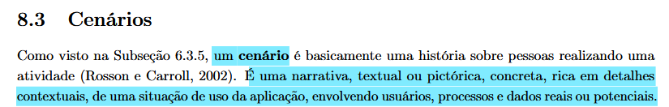
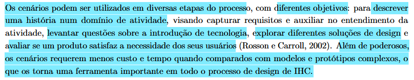
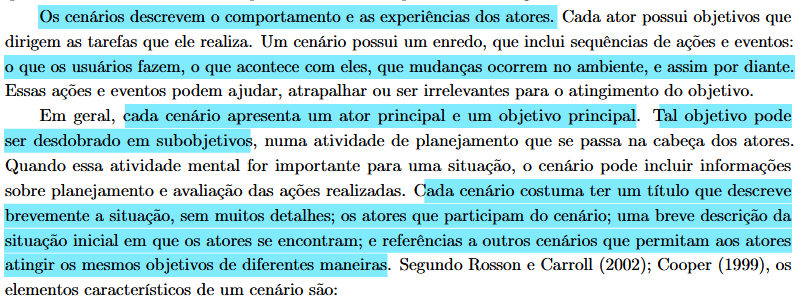
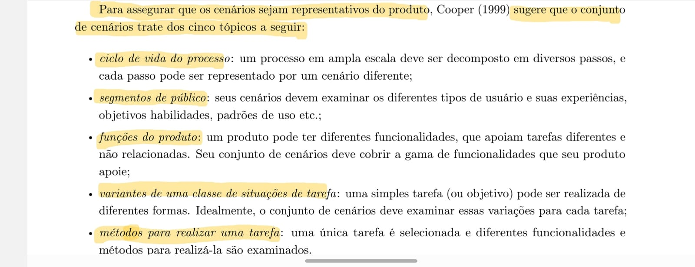

## Tabela de contribuição
|Artefato(s) | Autor(es)|
| --- | --- |
| Página de Elenco de Personas | Philipe |
| [Cenário: Acesso ao resultado com visualizadores de imagem (DICOM)](#dicom) | Philipe |
| [Cenário: Agendamento de exames com dúvidas críticas de preparo](#agendamento)  | Maria Laura |
| [Cenário: Cadastro de exame laboratorial com informação incompleta no sistema](#cadastro)| Hugo |
| [Cenário: Acompanhamento de resultados e download de laudos durante o pré-natal](#acompanhamento) | Ingrid |
| [Cenário: Consulta de Resultados com Urgência](#consulta)| Thaiza |

## Introdução

Um **cenário** é, essencialmente, uma narrativa sobre pessoas realizando uma atividade. Seja construído em formato textual ou pictórico, trata-se de uma descrição concreta e rica em detalhes contextuais sobre uma situação de uso do sistema, envolvendo os usuários, os processos e os dados reais ou potenciais (BARBOSA et al., 2021)[PRINT]  

No processo de design de Interação Humano-Computador (IHC), os cenários são ferramentas estratégicas e versáteis. Por exigirem menos tempo e custo quando comparados à construção de modelos e protótipos complexos, eles podem ser aplicados em diversas etapas do projeto. Seus objetivos variam desde a captura de requisitos e o entendimento do domínio da atividade, até o levantamento de questões sobre a introdução de novas tecnologias, a exploração de diferentes soluções de design e a avaliação final de satisfação das necessidades do usuário (BARBOSA et al., 2021)[PRINT] .

A estrutura de um cenário é focada no comportamento e na experiência. Ele sempre apresenta um ator principal movido por um objetivo claro. A partir dessa motivação, constrói-se um enredo detalhando a sequência de ações e eventos: o que o usuário faz, o que acontece no ambiente e como o sistema responde — fatores que podem ajudar, atrapalhar ou ser irrelevantes para a conclusão da tarefa. Quando a carga cognitiva for relevante para a situação, a narrativa também deve expor a atividade mental do ator, ilustrando como ele planeja e avalia as ações realizadas durante a jornada (BARBOSA et al., 2021)[PRINT]  

Para assegurar que o conjunto de cenários seja verdadeiramente representativo do produto, Cooper (1999) sugere que a modelagem aborde cinco tópicos principais: o ciclo de vida do processo, decompondo atividades amplas em passos representados individualmente; os segmentos de público, analisando a diversidade de experiências, objetivos e habilidades dos usuários; as funções do produto, cobrindo o suporte à gama de tarefas contempladas pelo sistema; as variantes de situações de tarefa, explorando as diferentes formas de se atingir um mesmo objetivo; e os métodos para realizar uma tarefa, examinando como as funcionalidades podem ser operadas de diferentes maneiras (BARBOSA et al., 2021, p. 176)[PRINT] .

## Cenários criados:

# Cenário 01: Acesso ao resultado com visualizadores de imagem (DICOM) {#dicom}

**Ator:** Jorge

Jorge, 32 anos, realizou uma ressonância magnética do ombro direito no laboratório Sabin após semanas de dor. Faltando alguns dias para sua consulta de retorno, ele está em casa quando recebe uma notificação informando que seus resultados já estão disponíveis no portal.

Curioso e com vontade de se preparar para a consulta, Jorge acessa o portal do Sabin pelo computador. Ao localizar o exame, ele abre primeiramente o laudo em PDF, mas se depara com termos técnicos complexos e jargões médicos incompreensíveis para um leigo. Para tentar compreender o quadro, ele copia o texto do laudo e o envia para uma ferramenta de Inteligência Artificial, pedindo um resumo em linguagem simples.

A IA traduz o jargão de forma didática, explicando que ele possui uma inflamação na região superior do ombro, e descreve onde ele pode tentar identificar o problema visualmente. Motivado pela explicação, Jorge volta ao portal do Sabin e clica para abrir o visualizador de imagens (DICOM). A ferramenta web carrega fluidamente no navegador.

Acompanhando mentalmente a explicação da IA, ele utiliza as ferramentas do portal para explorar a imagem: primeiro, aciona o recurso de Contraste para realçar a diferença entre o osso e o tecido muscular; em seguida, utiliza a ferramenta de Zoom na área superior do ombro, conseguindo identificar exatamente a região inflamada descrita no resumo.

Jorge encerra a visualização e fecha o sistema. Em vez de ansiedade, ele agora sente segurança por ter compreendido o próprio corpo. Ele comparece à consulta de retorno com dúvidas mais objetivas, acompanhando perfeitamente a explicação do seu médico e o encaminhamento para a fisioterapia.

---

# Cenário 02: Pré-agendamento de exames com dúvidas críticas de preparo {#agendamento}

**Atores:** Márcia (Mãe e Gestora da saúde familiar), Atendente Humano (Sabin)

Na noite de quinta-feira, Márcia, servidora pública de 55 anos que centraliza e gerencia a rotina médica de toda a sua casa, acessa o site do Sabin com o objetivo de marcar exames de sangue preventivos para ela e para o seu marido. Devido à rotina intensa de trabalho de ambos durante a semana, ela precisa garantir que a coleta seja agendada para o sábado de manhã logo no primeiro horário. Com as guias médicas impressas sobre a mesa, Márcia inicia o processo de pré-agendamento utilizando a câmera do celular para enviar as fotos dos pedidos médicos diretamente pela funcionalidade do site. 

O sistema processa as imagens com sucesso e identifica os exames corretamente, mas exibe um aviso genérico de preparo informando que todos os procedimentos listados exigem 12 horas de jejum absoluto. Márcia sabe que seu marido utiliza uma medicação contínua para hipertensão que deve ser ingerida obrigatoriamente logo ao acordar, com água. Preocupada se a medicação quebra o jejum ou se ele deve suspender o remédio, ela tenta buscar orientações específicas clicando no botão de "Dúvidas Frequentes" na tela de preparo. O aplicativo, no entanto, a redireciona para um longo manual em PDF genérico e não pesquisável, tornando exaustivo localizar a informação específica sobre "hipertensão". Insegura com a falta de clareza da interface e temendo que o marido perca a viagem no sábado por realizar o preparo de forma incorreta, Márcia abandona o fluxo automatizado. Ela retorna à tela inicial e clica no ícone de atendimento via WhatsApp, optando por enviar as fotos das guias para um atendente humano a fim de confirmar as restrições exatas e concluir a marcação sem margem para erros.

---

# Cenário 03: Cadastro de exame laboratorial com informação incompleta no sistema {#cadastro}

**Atores:** Mariana Alves Souza (paciente), sistema do site Sabin

Após um dia de trabalho, Mariana Alves Souza decide agendar um exame laboratorial solicitado pelo seu médico. Buscando praticidade, ela acessa o site do Sabin pelo smartphone, em casa, no período da noite. Seu objetivo é resolver rapidamente o agendamento sem precisar ligar ou ir presencialmente até uma unidade.
Ao entrar no site, Mariana procura a opção de agendamento e inicia o processo. Ela encontra o campo para busca de exames e digita o nome presente no pedido médico. No entanto, o sistema apresenta diversas opções com nomes técnicos semelhantes, o que gera dúvida sobre qual selecionar. Após alguma tentativa e comparação, ela escolhe o exame que acredita ser o correto e avança.
Em seguida, Mariana precisa selecionar a unidade e o horário. Ela escolhe uma unidade próxima de sua casa, mas percebe que há pouca clareza sobre os horários disponíveis e sobre possíveis restrições, como necessidade de jejum. Ainda assim, seleciona um horário compatível com sua rotina e continua o processo.
Ao preencher seus dados pessoais, Mariana percebe que algumas informações são solicitadas novamente, mesmo já tendo utilizado o sistema anteriormente. Isso gera uma pequena frustração, mas ela prossegue para não perder tempo.
Na etapa final, antes de confirmar o agendamento, Mariana sente insegurança por não ter visto claramente as instruções de preparo do exame. Ela hesita por alguns segundos, pois sabe que um erro nessa etapa pode comprometer o exame. Ainda assim, decide concluir o agendamento.
Após confirmar, o sistema exibe uma mensagem de sucesso, mas com poucas informações adicionais. Mariana espera receber um e-mail ou mensagem com os detalhes completos e instruções, pois isso é essencial para garantir que ela compareça corretamente preparada.
No dia seguinte, ao revisar a confirmação, Mariana percebe que precisa confirmar se o exame exige jejum, o que poderia ter sido apresentado de forma mais clara durante o processo. Apesar de ter conseguido concluir o objetivo principal — agendar o exame — a experiência gerou pequenas incertezas e pontos de atrito.
Análise do cenário
Nesse cenário, observam-se alguns pontos críticos que podem impactar a experiência do usuário:

- dificuldade na identificação correta do exame devido a nomenclaturas técnicas;
- falta de clareza nas instruções de preparo durante o fluxo de agendamento;
- repetição desnecessária no preenchimento de dados pessoais;
- ausência de feedback completo e detalhado após a confirmação;
- insegurança do usuário quanto à execução correta do processo.

Esses aspectos indicam oportunidades de melhoria na interface e no fluxo do sistema, especialmente no suporte à tomada de decisão do usuário e na redução de erros com impacto direto na realização do exame.

---

# Cenário 04: Acompanhamento de resultados e download de laudos durante o pré-natal {#acompanhamento}

**Atores:** Camila Fernandes (Paciente Frequente / Gestante), sistema do site Sabin

Camila, uma professora de 29 anos grávida de 24 semanas, está no intervalo de suas aulas e sente-se ansiosa para conferir o resultado do exame de Curva Glicêmica que realizou no dia anterior no laboratório Sabin. A médica obstetra solicitou urgência, pois os níveis de glicose no sangue ditam as próximas etapas de sua dieta e suplementação. Sabendo que o prazo de entrega era para aquela tarde, Camila acessa o portal do Sabin através do navegador do seu smartphone.

Desejando um acesso rápido e direto, ela opta por fazer o "Login por Token (SMS)" inserindo apenas o seu CPF, pois evita digitar senhas complexas no celular enquanto está caminhando pelos corredores da escola. Após receber o código por SMS e inseri-lo, o sistema a direciona para a página inicial logada. Imediatamente, seu objetivo principal é encontrar o status do exame atual, mas ela precisa rolar a tela buscando a aba de "Resultados". 

Ao localizar o exame pela data de ontem, ela clica no *card* correspondente, sentindo alívio ao ver a *tag* "Liberado". O próximo passo é enviar o documento para sua médica. Camila clica no botão "Baixar PDF". No entanto, em vez de gerar um arquivo único consolidado com todas as coletas da curva glicêmica, o sistema abre uma nova tela exigindo que ela faça o download de três arquivos PDF separados, um para cada intervalo de coleta (jejum, 1 hora e 2 horas). 

Apesar de conseguir completar sua tarefa principal (acessar os resultados), o processo gera atrito e uma carga de trabalho desnecessária. Camila tem que baixar os três arquivos, abrir a galeria/arquivos do celular, selecionar os três documentos e compartilhá-los via WhatsApp com a obstetra, escrevendo uma mensagem explicando qual arquivo é qual. Essa experiência fragmentada a deixa levemente frustrada com a falta de consolidação da interface, embora ela aprecie a rapidez com que a notificação inicial do resultado foi disponibilizada.

**Análise do cenário**

Nesse cenário, observam-se os seguintes pontos críticos:

- **Eficiência de login:** O uso de token SMS agiliza muito o acesso em dispositivos móveis.
- **Visibilidade de status:** O uso de *tags* visuais ("Liberado", "Em análise") atende à necessidade da paciente ansiosa, mas a informação de resultados recentes deveria estar na primeira dobra da tela.
- **Fragmentação de arquivos:** A necessidade de baixar múltiplos PDFs para exames seriados gera trabalho adicional e confuso para o usuário no momento do compartilhamento.

---

# Cenário 05: Consulta de Resultados com Urgência {#consulta}

**Atores:** Agnes Santos (16 anos, acompanhante digital dos avós).

Agnes está em casa em uma tarde de terça-feira. Seu avô tem uma consulta médica de retorno muito importante marcada para amanhã de manhã. A data e hora limite para a entrega dos resultados do laboratório Sabin era hoje às 14h. Já são 14h15 e o avô de Agnes está ansioso, sugerindo que eles peguem um ônibus ou Uber para ir até a unidade física cobrar o papel, pois ele tem medo de chegar na consulta sem os exames. Para evitar o desgaste físico do avô, Agnes assume a responsabilidade de resolver o problema digitalmente. Agnes pega seu smartphone e abre o navegador direto no site do Sabin. Como ela prefere explorar por conta própria e ignora textos longos, ela escaneia a tela inicial buscando imediatamente o botão de "Resultados de Exames". Na tela de login, ela insere rapidamente o protocolo e a senha impressos no comprovante do avô. O sistema apresenta um rastreador visual simples (ex: Coletado > Em Análise > Liberado).

Se houver atraso: A interface informa proativamente que o exame está em fase final de validação médica e oferece um botão de contato via WhatsApp. Isso evita que ela fique sem respostas e decida ir presencialmente.

Se estiver pronto: O status aparece em verde como "Liberado", junto a um botão evidente de "Baixar PDF".

**Análise do cenário**

O cenário é muito bem-sucedido em equilibrar o objetivo de negócio (reduzir o fluxo de atendimento presencial e desafogar as clínicas) com o objetivo de vida da usuária (garantir o bem-estar e a saúde do avô sem estresse).

- **Visibilidade do Status do Sistema(Heurística de Nielsen):** O uso de um rastreador visual (Coletado > Em Análise > Liberado) é o ponto mais forte do cenário. Como o modelo mental da Agnes exige resultados em tempo real e ela tem uma frustração crônica com atrasos, expor em qual etapa o processo se encontra reduz a carga cognitiva e a ansiedade.
- **Controle do Usuário e Prevenção de Erros:** A funcionalidade de "transbordo" proativo para o WhatsApp em caso de atraso na validação médica é uma excelente estratégia de contenção. Ela previne o abandono do fluxo digital (a viagem física ao laboratório) e entrega o controle da situação de volta à usuária.
- **Design Estético e Minimalista:** Sabendo que a persona "não gosta de ler instruções longas", a decisão de omitir textos institucionais e ir direto para o botão "Baixar PDF" na hierarquia da informação atende perfeitamente à sua necessidade de agilidade.
___

## Agradecimentos à IA

Gostaríamos de registrar nossos agradecimentos ao modelo de Inteligência Artificial Generativa Gemini, desenvolvido pelo Google, pelo auxílio na estruturação, revisão gramatical e padronização da formatação em Markdown dos artefatos deste projeto. A ferramenta foi utilizada estritamente como suporte técnico e operacional para refinar a apresentação da documentação. Ressaltamos que todo o planejamento, execução das metodologias, análise crítica de dados e tomadas de decisão descritas neste documento são de autoria e responsabilidade exclusiva dos membros da equipe.
___

## Referência Bibliográfica

> BARBOSA, S. D. J. et al. Interação Humano-Computador e Experiência do Usuário. 1. ed. Rio de Janeiro: Autopublicação, 2021.

____

## Histórico de Versão

| Versão | Data | Descrição | Autores | Data Revisão | Descrição Revisão | Revisores |
| :---: | :---: | :--- | :--- | :---: | :--- | :--- |
| 1.0 | 01/05/2026 | Criação do documento e adição do cenário 01 | [Philipe Amancio](https://github.com/Phill-Chill) | 01/05/2026 | Revisão do cenário 01 e da estrutura inicial do documento de cenários | [Maria Laura Regis](https://github.com/Maria-Laura-Regis) |
| 1.1 | 01/05/2026 | Adição do cenário 2 | [Maria Laura Regis](https://github.com/Maria-Laura-Regis) | 01/05/2026 | Conferência da integração do cenário 2 ao conjunto de cenários já criado | [Hugo Freitas Silva](https://github.com/HugoFreitass) |
| 1.2 | 01/05/2026 | Adição do cenário 3 | [Maria Laura Regis](https://github.com/Maria-Laura-Regis) | 01/05/2026 | Validação do cenário 3 e da continuidade com os cenários anteriores | [Hugo Freitas Silva](https://github.com/HugoFreitass) |
| 1.3 | 04/05/2026 | Adição do cenário 4 | [Ingrid Alves](https://github.com/alvesingrid) | - | Checagem do cenário 4 e da padronização da descrição de uso | - |
| 1.4 | 04/05/2026 | Adição do cenário 5 | [Thaiza Romualdo da Silva](https://github.com/ThaizaWeert) | - | Revisão do cenário 5 e da consistência com o elenco de situações mapeadas | - |
| 1.5 | 15/05/2026 | Adição da rastreabilidade dos autores dos artefatos | [Philipe Amancio](https://github.com/Phill-Chill) | 15/05/2026 | Conferência dos vínculos de autoria adicionados aos cenários | [Hugo Freitas Silva](https://github.com/HugoFreitass) |

