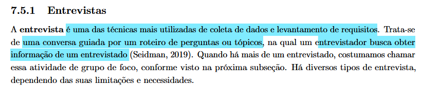
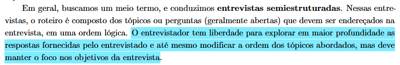
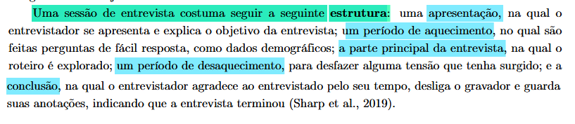

## Entrevistas Semiestruturadas

A entrevista é a técnica escolhida para coletar dados qualitativos profundos sobre os perfis de usuários do portal Sabin. Diferente de questionários puramente quantitativos, esta abordagem nos permite compreender o contexto demográfico, o nível de letramento digital, e, principalmente, as dores e expectativas reais durante a jornada de uso de serviços de saúde digitais (BARBOSA et al., 2021)[PRINT] .

### Estrutura e Formato da Entrevista

Optamos pelo formato de **Entrevista Semiestruturada**, com duração estimada de 20 a 30 minutos. Esse modelo foi escolhido por fornecer um roteiro padronizado que garante a consistência da coleta entre diferentes participantes, ao mesmo tempo em que dá ao entrevistador a liberdade de fazer perguntas de aprofundamento (follow-up) sempre que o usuário mencionar uma dificuldade ou comportamento interessante (BARBOSA et al., 2021)[PRINT] .

O roteiro projetado para esta coleta segue uma progressão lógica, baseada na estrutura apresentada por  Barbosa et al. (2021, p. 145)[PRINT] :
Optamos pelo formato de **Entrevista Semiestruturada**, com duração estimada de 20 a 30 minutos. Esse modelo foi escolhido por fornecer um roteiro padronizado que garante a consistência da coleta entre diferentes participantes, ao mesmo tempo em que dá ao entrevistador a liberdade de fazer perguntas de aprofundamento (follow-up) sempre que o usuário mencionar uma dificuldade ou comportamento interessante (BARBOSA et al., 2021)[PRINT] .

O roteiro projetado para esta coleta segue uma progressão lógica, baseada na estrutura apresnetada por  Barbosa et al. (2021, p. 145)[PRINT] :

5.  **Uso de Serviços de Saúde Digitais:** Explora o modelo mental do usuário com plataformas concorrentes ou similares (outros laboratórios, convênios). Busca identificar padrões de sucesso ("o que funciona bem") e atritos comuns ("o que gera frustração") no setor.
6.  **Experiência com o Site do Sabin:** O núcleo da entrevista. Foca na experiência direta com o produto alvo, investigando objetivos passados, facilidades encontradas e, de forma crítica, momentos de dúvida, erro ou desistência na interface atual.
7. **Desaquecimento:** Fase para reduzir eventuais tensões acumuladas durante os relatos.
8. **Conclusão:** Encerramento, agradecimentos e desligamento dos registros.

### Tipos de Perguntas Utilizadas

O roteiro intercala dois tipos fundamentais de perguntas para otimizar o tempo e a qualidade da informação:

*   **Perguntas Fechadas e de Filtragem:** Usadas para dados demográficos ou para direcionar o fluxo da entrevista. Exemplo: *"Você já utilizou o site do Sabin?"*. A partir da resposta (sim/não), o entrevistador navega para o bloco de perguntas apropriado.
*   **Perguntas Abertas:** Usadas nas seções de exploração da experiência, permitindo que o usuário descreva as situações com suas próprias palavras. Exemplos: *"Quando acessou o site, o que buscava fazer?"* ou *"Houve algum momento de dúvida, erro ou desistência? Conte como aconteceu."*

### Análise dos Resultados

O entrevistado atua como profissional da área de saúde, possui nível superior (graduação) e encontra-se dentro da faixa etária estipulada para a pesquisa. Inserido em uma rotina de trabalho de alta demanda, o uso constante de sistemas laboratoriais — acessados majoritariamente através dos desktops da empresa — é essencial para o gerenciamento dos dados e suporte direto às suas consultas. Durante a entrevista, ele relatou que, de maneira geral, os portais desse nicho poderiam ser mais bem adaptados ao modelo mental e às necessidades dos profissionais de saúde, priorizando a eficiência operacional. Como forte oportunidade de melhoria para o sistema, o usuário levantou a ideia de que a plataforma não apenas exiba os dados brutos, mas já forneça uma pré-avaliação ou destaque visual das alterações nos exames de sangue, com o objetivo de agilizar a tomada de decisão e a precisão do diagnóstico clínico.

| Versão | Data | Descrição | Autor | Revisor |
| :--- | :--- | :--- | :--- | :--- |
| 1.0 | 1/05/2026 | Criação do documento |[Philipe Amancio](https://github.com/Phill-Chill)|  |