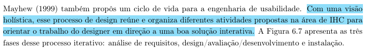
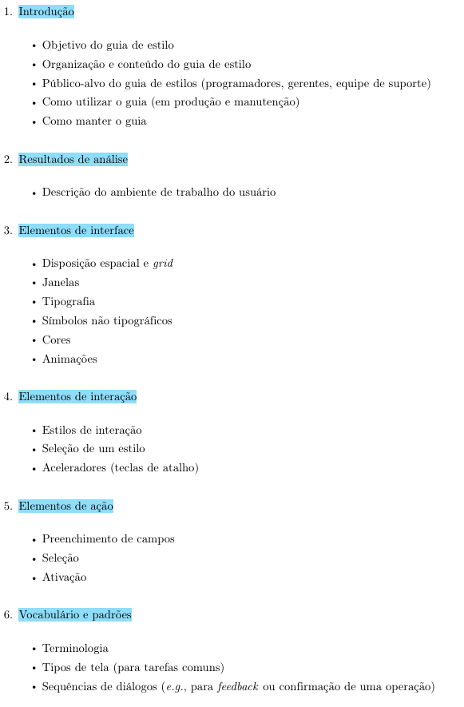

# Guia de estilo

## Rastreabilidade
|Artefato(s) | Autore(s)|
| --- | --- |
| Página de Guia de Estilo| Hugo e Philipe |

## Introdução

O guia de estilo servirá para comunicar as principais decisões de design entre os membros da equipe de design e também com a equipe de desenvolvimento, de modo que elas sejam efetivamente implementadas no produto final. BARBOSA et al. (2021) [PRINT] .

## Organização e conteúdo do guia de estilo

O presente guia de estilo estará organizado em  BARBOSA et al. (2021) [PRINT] .:

* Resultado de análise;
    * Descrição do ambiente de trabalho do usuário;
* Elementos de interface;
    * Disposição espacial e grid;
    * Janelas;
    * Tipografia;
    * Símbolos não tipográficos;
    * Cores;
    * Animações.
* Elementos de interação;
    * Estilos de interação;
    * Seleção de um estilo;
    * Aceleradores (teclas de atalho).
* Elementos de ação;
    * Preenchimento de campos;
    * Seleção;
    * Ativação.
* Vocabulário e padrões.
    * Terminologia;
    * Tipos de tela (para tarefas comuns);
    * Sequência de diálogos.

## Resultado da análise 

No sistema analisado, o ambiente do usuário envolve o acesso por dispositivos móveis ou desktop, em contextos de uso que podem variar entre casa, trabalho e deslocamento. Nessas situações, o uso pode ocorrer com diferentes níveis de atenção, tempo disponível e estabilidade de conexão. O acesso por celular tende a ocorrer em momentos de mobilidade, enquanto o acesso por desktop costuma ocorrer em ambientes mais estáveis, como residência ou local de trabalho. Essas diferenças afetam a forma de interação, o tempo de resposta esperado e a quantidade de informações que podem ser exibidas simultaneamente.

## Público-alvo do guia de estilos
O guia de estilo é uma ferramenta de comunicação, que deve ser acessível a todos os envolvidos no desenvolvimento do produto. Neste projeto, os envolvidos serão:

* a própria equipe do projeto de IHC (Hugo, Maria Laura, Philipe, Thaiza, Nathan e Ingrid);

* a equipe de design, desenvolvimento e gerência do Sabin.

Este guia servirá como estudo de caso para os integrantes da equipe deste projeto e, para o Sabin, ficará disponível o processo e o resultado desse estudo, que poderá servir de apoio ao trabalho e à criatividade para futuras manutenções.

## Como manter o guia

O guia deve refletir o estado atual da perspectiva de design, portanto deve ser mantido atualizado com as decisões de design. Assim, é importante que haja um ou mais responsáveis pela revisão do guia, para verificar e validar se o conteúdo está correto e se a comunicação está adequada para todos os envolvidos.

## Elementos de interação
O site do Sabin adota um estilo de interação centrado na navegação por páginas e na realização de tarefas por meio de formulários e botões de ação. Esse estilo oferece as seguintes funcionalidades: busca por unidades, consulta de convênio, compra ou agendamento de exames e vacinas, e consulta de resultados.

<iframe style="border: 1px solid rgba(0, 0, 0, 0.1);" width="800" height="450" src="https://embed.figma.com/design/ezlwZaEb9QSiTcKfxfsbeT/Guia-de-estilo-sabin?node-id=0-1&embed-host=share" allowfullscreen></iframe>

#### Localização e consulta de unidades
Na funcionalidade de localização e consulta de unidades, observam-se elementos de interação voltados à identificação visual das unidades, à busca por localização e à exibição de informações complementares para apoio à navegação do usuário. Esses elementos contribuem para a orientação espacial e para o acesso rápido às informações necessárias durante a interação
#### Protótipo no Figma

<iframe style="border: 1px solid rgba(0, 0, 0, 0.1);" width="800" height="450" src="https://embed.figma.com/design/eBJfjwhkyzDXePxLt2XvYF/Untitled?embed-host=share" allowfullscreen></iframe>

#### Compra de vacinas e exames
Na funcionalidade de compra de vacinas e exames, os elementos de interação foram agrupados de acordo com as ações de filtragem, seleção e compra de serviços. A interface apresenta recursos que permitem ao usuário filtrar categorias de serviço, visualizar itens disponíveis e realizar a ação de compra de forma direta

#### Protótipo no Figma

<iframe style="border: 1px solid rgba(0, 0, 0, 0.1);" width="800" height="450" src="https://embed.figma.com/design/5HcrKhgUrdhy6FgT5Qf54n/Untitled?node-id=0-1&embed-host=share" allowfullscreen></iframe>

#### Agendamento de vacina ou exame

Na funcionalidade de agendamento, o principal elemento de interação identificado corresponde à seleção do serviço desejado, seguida do redirecionamento do usuário para o formulário de preenchimento. Desse modo, a interface atua como ponto de entrada para o fluxo de agendamento, conectando a escolha inicial do serviço à etapa seguinte do processo

#### Protótipo no Figma

<iframe style="border: 1px solid rgba(0, 0, 0, 0.1);" width="800" height="450" src="https://embed.figma.com/design/ke8M4RfWtYYt7ewAJn0a3X/Untitled?node-id=0-1&embed-host=share" allowfullscreen></iframe>

### Seleção de estilo
Nesta seção, analisa-se o estilo de interação adotado na interface com base nos elementos e fluxos implementados no sistema. A proposta não é sugerir uma nova solução, mas descrever as escolhas de design presentes no produto.

A interface analisada adota um estilo baseado em menus, formulários, busca e cartões, com uso de botões como elementos de ação. A navegação ocorre por seleção e por interação visual direta. A disposição dos elementos varia entre as telas conforme o redirecionamento no fluxo do sistema.

### Aceleradores
Não foram identificados aceleradores na interface analisada. As interações observadas são realizadas por meio dos elementos visuais da interface, sem indicação de atalhos de teclado ou comandos rápidos equivalentes.

## Elementos de ação

### Preenchimento de campos

A interface apresenta campos de entrada em que o usuário insere informações textuais ou numéricas. Esses campos são utilizados em situações como cadastro, pesquisa e preenchimento de dados necessários para o prosseguimento do fluxo.

Em alguns trechos da interface, o preenchimento ocorre em formulários com campos específicos para dados pessoais, informações de contato ou critérios de busca. A interação depende da digitação direta do conteúdo pelo usuário.

### Seleção

A interface apresenta elementos de seleção para escolha entre opções disponíveis. Esses elementos aparecem em menus, listas, cartões e outros componentes que exigem a escolha de um item entre alternativas.

A seleção também ocorre quando o usuário escolhe categorias, tipos de serviço ou opções de filtragem. O resultado da seleção define o próximo estado da navegação ou a próxima etapa do fluxo.

### Ativação

A interface apresenta elementos de ativação que disparam ações após o acionamento pelo usuário. Entre esses elementos estão botões, links e controles que executam comandos como avançar, confirmar, enviar, salvar ou acessar outra tela.

A ativação ocorre por clique ou toque sobre o elemento correspondente. Em alguns casos, a ação leva a um novo redirecionamento dentro da própria interface.

## Vocabulário e Padrões

### Terminologia

O site do Grupo Sabin utiliza uma linguagem relativamente acessível ao público geral, principalmente nas áreas voltadas para pacientes, como agendamento de exames, consulta de resultados e busca de unidades. Entretanto, observa-se pouca padronização terminológica entre algumas páginas e serviços.

Em determinados contextos, funcionalidades semelhantes recebem nomes diferentes, o que pode gerar inconsistência na experiência do usuário. Além disso, há diferenças no estilo textual entre áreas institucionais, páginas de serviços e seções de atendimento, indicando ausência de um padrão rígido de comunicação.

Apesar disso, o sistema procura utilizar:

- verbos de ação em botões e menus;
- linguagem cordial e institucional;
- termos comuns da área da saúde;
- mensagens relativamente simples para tarefas principais.

### Tipos de Tela

O site apresenta diferentes modelos de páginas, porém sem uma uniformidade visual plenamente consolidada. Algumas telas possuem organização moderna e limpa, enquanto outras apresentam estruturas mais densas visualmente, com diferenças perceptíveis em:

- espaçamento;
- alinhamento;
- tamanho de elementos;
- estilo dos componentes;
- organização de conteúdo.

Os principais tipos de tela identificados incluem:

- página inicial;
- páginas institucionais;
- telas de agendamento;
- área de resultados;
- páginas de serviços e exames;
- busca de unidades.

Embora exista uma tentativa de manter identidade visual da marca, nota-se que diferentes seções parecem ter sido desenvolvidas em momentos distintos ou com padrões diferentes de interface.

### Sequências de Diálogo

Os fluxos de interação seguem padrões básicos de navegação e feedback, porém sem grande consistência entre todas as áreas do sistema. Algumas operações apresentam:

- mensagens claras de confirmação;
- validação de campos;
- feedback visual durante carregamento.

Entretanto, em outras partes do site:

- os retornos visuais são discretos;
- há diferenças no comportamento de formulários;
- certos fluxos exigem mais etapas do que o necessário;
- algumas mensagens possuem pouca padronização textual.

Isso pode impactar a previsibilidade da interação e aumentar a carga cognitiva do usuário em tarefas específicas.

### Consistência de Navegação

Embora o site mantenha elementos recorrentes como menu principal e identidade visual da marca, a consistência geral da navegação não é totalmente uniforme. Existem diferenças perceptíveis entre páginas em relação a:

- organização dos menus;
- estrutura de conteúdo;
- comportamento responsivo;
- disposição de componentes;
- hierarquia visual.

Como consequência, a experiência do usuário pode variar dependendo da seção acessada. Isso sugere que o site ainda possui oportunidades de melhoria relacionadas à padronização de interface e consolidação de um guia de estilo mais rígido.
___

## Referência Bibliográfica

> BARBOSA, S. D. J. et al. **Interação Humano-Computador e Experiência do Usuário**. 1. ed. Rio de Janeiro: Autopublicação, 2021.

___
## Histórico de Versões
| Versão | Data | Descrição | Autores | Data Revisão | Descrição Revisão | Revisores |
| :---: | :---: | :--- | :--- | :---: | :--- | :--- |
| 1.0 | 10/05/2026 | Criação do documento | [Philipe Amancio](https://github.com/Phill-Chill) | 10/05/2026 | Revisão da estrutura inicial e do conteúdo base do guia de estilo | [Hugo Freitas Silva](https://github.com/HugoFreitass) |
| 1.1 | 11/05/2026 | Adição da seção de Vocabulário e padrões e do guia de estilo no figma | [Hugo Freitas Silva](https://github.com/HugoFreitass) | 11/05/2026 | Validação da seção de vocabulário, padrões visuais e vínculo com o guia no Figma | [Philipe Amancio](https://github.com/Phill-Chill) |
| 1.2 | 15/05/2026 | Adição da rastreabilidade dos autores dos artefatos | [Philipe Amancio](https://github.com/Phill-Chill) | 15/05/2026 | Validação dos links e créditos de autoria no guia de estilo | [Hugo Freitas Silva](https://github.com/HugoFreitass) |

