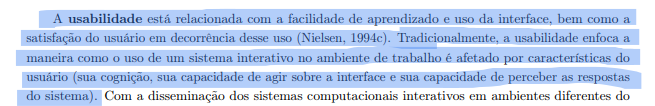
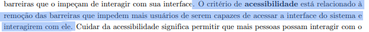
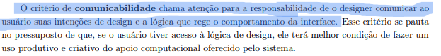
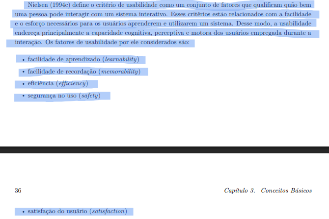
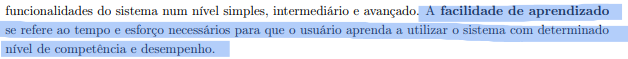
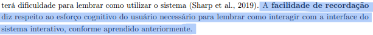
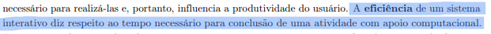
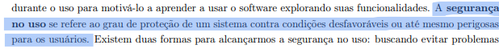
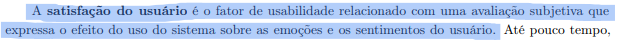

# Metas de Usabilidade do Projeto: Grupo Sabin

## Tabela de contribuição
|Artefato(s) | Autor(es)|
| --- | --- |
| Página de Metas de Usabilidade do Projeto | Thaiza e Nathan |

## Introdução
A **usabilidade** está relacionada com a facilidade de aprendizado e uso da interface, bem como a satisfação do usuário em decorrência desse uso. Tradicionalmente, a usabilidade enfoca a maneira como o uso de um sistema interativo no ambiente de trabalho é afetado por características do usuário (sua cognição, sua capacidade de agir sobre a  interface e sua capacidade de perceber as respostas do sistema). (BARBOSA; SILVA, 2021, p. 35)[PRINT] . 

O critério de **acessibilidade** está relacionado à remoção das barreiras que impedem mais usuários de serem capazes de acessar a interface do sistema e interagirem com ele. (BARBOSA; SILVA, 2021, p. 35)[PRINT] .

O critério de **comunicabilidade** chama atenção para a responsabilidade de o designer comunicar ao usuário suas intenções de design e a lógica que rege o comportamento da interface. (BARBOSA; SILVA, 2021, p. 35)[PRINT] .

## Critério de usabilidade
Segundo Nielsen (1994 apud BARBOSA; SILVA, 2021, p. 35), o critério de usabilidade é definido como um conjunto de fatores que qualificam quão bem uma pessoa pode interagir com um sistema interativo. Esses critérios estão relacionados com a facilidade e o esforço necessários para os usuários aprenderem e utilizarem um sistema. Desse modo, a usabilidade endereça principalmente a capacidade cognitiva, perceptiva e motora dos usuários empregada durante a interação. Os fatores de usabilidade por ele considerados são (BARBOSA; SILVA, 2021, p. 35-36)[PRINT] .:

- **Facilidade de aprendizado:** Se refere ao tempo e esforço necessários para que o usuário aprenda a utilizar o sistema com determinado
nível de competência e desempenho (BARBOSA; SILVA, 2021, p. 36)[PRINT] .

- **Facilidade de recordação:** Diz respeito ao esforço cognitivo do usuário necessário para lembrar como interagir com a interface do sistema interativo. (BARBOSA; SILVA, 2021, p. 36)[PRINT] .

- **Eficiencia:** Diz respeito ao tempo necessário para conclusão de uma atividade com apoio computacional. (BARBOSA; SILVA, 2021, p. 36)[PRINT] .

- **Segurança no uso:** Se refere ao grau de proteção de um sistema contra condições desfavoráveis ou até mesmo perigosas para os usuários. (BARBOSA; SILVA, 2021, p. 37)[PRINT] .

- **Satisfação do usuario:** É o fator de usabilidade relacionado com uma avaliação subjetiva que expressa o efeito do uso do sistema sobre as emoções e os sentimentos do usuário. (BARBOSA; SILVA, 2021, p. 36)[PRINT] .

## Aplicação para o projeto

### Metas a serem alcançadas
Com base nos requisitos extraídos das técnicas de elicitação (entrevistas, brainstorming, questionários), aliados às restrições mapeadas nas [Características da Plataforma](caracteristicasDaPlataforma.md) e às diretrizes estipuladas nos [Princípios Gerais de Projeto](principios.md), o reprojeto do portal Sabin priorizará as seguintes metas de usabilidade:

- **Segurança no uso (Safety):** A proteção do usuário é a meta crítica do sistema. Conforme mapeado nas [Características da Plataforma](caracteristicasDaPlataforma.md#ancora-seguranca), o portal lida com dados de saúde altamente sensíveis e laudos médicos. Para garantir essa meta, a interface aplicará o princípio de [Projeto para Erros](principios.md#8-projeto-para-erros), assegurando que fluxos críticos (como a recuperação de um protocolo perdido) sejam resolvidos no próprio ambiente digital, sem quebras de fluxo que exijam deslocamento físico, e evitando ações destrutivas irreversíveis.

- **Eficiência:** O sistema deve permitir a conclusão de tarefas de forma rápida e direta. Do ponto de vista tecnológico ([Características da Plataforma](caracteristicasDaPlataforma.md#req-restri)), o acesso pode ocorrer via conexões móveis mais lentas. Portanto, a arquitetura visual adotará o princípio do [Conteúdo Relevante](principios.md#conteudo-relevante), removendo ruídos visuais e encurtando os caminhos de navegação para diminuir a carga cognitiva do paciente.

- **Facilidade de aprendizado (Learnability):** Visando atender pacientes em situações de urgência ou com baixo letramento digital, o sistema deve ser compreensível no primeiro acesso. Para isso, aplicaremos o princípio da [Correspondência com as Expectativas](principios.md#correspondencia-expect), traduzindo os atuais jargões médico-laboratoriais por termos familiares ao usuário comum, garantindo que as instruções de preparo de exames sejam compreendidas sem esforço extra.

- **Facilidade de recordação (Memorability):** Para pacientes que acessam o portal esporadicamente, a navegação deve ser dedutível. Sustentados pelo princípio de [Consistência e Padronização](principios.md#conssistencia-pad), o reprojeto evitará a desorientação causada atualmente por redirecionamentos para subdomínios com identidades visuais distintas, garantindo que o usuário sinta que permanece no mesmo ambiente durante toda a jornada.

- **Satisfação do usuário:** Como consequência do cumprimento das metas anteriores, o sistema busca mitigar a frustração atual com a falta de clareza nos status de exames. O fornecimento de feedbacks claros e um modelo conceitual transparente reduzirão a taxa de abandono do portal, gerando uma percepção positiva do serviço digital do laboratório.

___

## Referência Bibliográfica

>BARBOSA, S. D. J. et al. Interação Humano-Computador e Experiência do Usuário. 1. ed. Rio de Janeiro: Autopublicação, 2021.

___

## Histórico de Versão

| Versão | Data | Descrição | Autores | Data Revisão | Descrição Revisão | Revisores |
| :---: | :---: | :--- | :--- | :---: | :--- | :--- |
| 1.0 | 11/05/2026 | Criação do documento | [Nathan Pontes Romão](https://github.com/nathanpromao) | - | Revisão da estrutura inicial e do conteúdo base das metas de usabilidade | - |
| 1.1 | 11/05/2026 | Adicionando texto | [Thaiza Romualdo da Silva](https://github.com/ThaizaWeert) | - | Revisão do texto acrescentado às metas de usabilidade | - |
| 1.2 | 12/05/2026 | Ajustes nas referências | [Nathan Pontes Romão](https://github.com/nathanpromao) | - | Conferência das referências e da formatação bibliográfica das metas de usabilidade | - |
| 1.3 | 15/05/2026 | Adição da rastreabilidade dos autores dos artefatos | [Philipe Amancio](https://github.com/Phill-Chill) | 15/05/2026 | Validação dos links e créditos de autoria nas metas de usabilidade | [Nathan Pontes Romão](https://github.com/nathanpromao) |
| 1.4 | 23/05/2026 | Ajustes das metas de usabilidade | [Nathan Pontes Romão](https://github.com/nathanpromao) | - |  |  |

