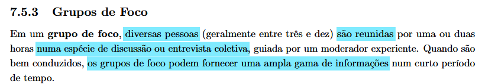
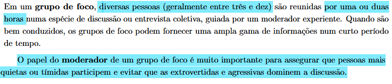
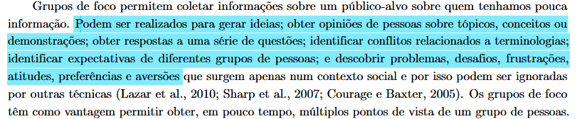
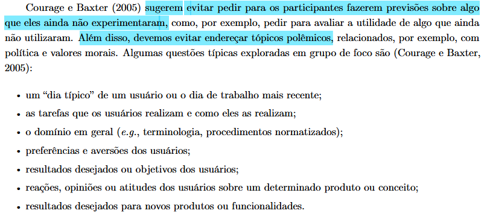

## Introdução

A **coleta de dados** é uma etapa fundamental para validar as suposições feitas na modelagem dos usuários. Embora o trabalho comece com a definição teórica do público-alvo, basear o design de interação apenas nessa percepção preliminar representa um risco elevado. Para garantir a precisão dos requisitos, é necessário ir a campo e conduzir estudos que capturem as reais necessidades, dores e expectativas das pessoas.

Para atingir esse objetivo, adota-se uma estratégia de triangulação combinando diferentes ferramentas metodológicas. Utilizam-se as **entrevistas semiestruturadas** para um aprofundamento individual, os **grupos de foco** para revelar problemas por meio da dinâmica social, o **brainstorming** para gerar e priorizar ideias do sistema ideal, e os **questionários** para validar estatisticamente os achados. Esse cruzamento de métodos qualitativos e quantitativos assegura soluções embasadas em dados reais e não em impressões equivocadas da equipe.

## Entrevistas Semiestruturadas

A entrevista é a técnica escolhida para coletar dados qualitativos profundos sobre os perfis de usuários do portal Sabin. Diferente de questionários puramente quantitativos, esta abordagem nos permite compreender o contexto demográfico, o nível de letramento digital, e, principalmente, as dores e expectativas reais durante a jornada de uso de serviços de saúde digitais (BARBOSA et al., 2021)[PRINT] .

### Estrutura e Formato da Entrevista

Optamos pelo formato de **Entrevista Semiestruturada**, com duração estimada de 20 a 30 minutos. Esse modelo foi escolhido por fornecer um roteiro padronizado que garante a consistência da coleta entre diferentes participantes, ao mesmo tempo em que dá ao entrevistador a liberdade de fazer perguntas de aprofundamento (follow-up) sempre que o usuário mencionar uma dificuldade ou comportamento interessante (BARBOSA et al., 2021)[PRINT] .

O roteiro projetado para esta coleta segue uma progressão lógica, baseada na estrutura apresnetada por  Barbosa et al. (2021, p. 145)[PRINT] :
Optamos pelo formato de **Entrevista Semiestruturada**, com duração estimada de 20 a 30 minutos. Esse modelo foi escolhido por fornecer um roteiro padronizado que garante a consistência da coleta entre diferentes participantes, ao mesmo tempo em que dá ao entrevistador a liberdade de fazer perguntas de aprofundamento (follow-up) sempre que o usuário mencionar uma dificuldade ou comportamento interessante (BARBOSA et al., 2021)[PRINT] .

O roteiro projetado para esta coleta segue uma progressão lógica, baseada na estrutura apresnetada por  Barbosa et al. (2021, p. 145)[PRINT] :
5.  **Uso de Serviços de Saúde Digitais:** Explora o modelo mental do usuário com plataformas concorrentes ou similares (outros laboratórios, convênios). Busca identificar padrões de sucesso ("o que funciona bem") e atritos comuns ("o que gera frustração") no setor.
6.  **Experiência com o Site do Sabin:** O núcleo da entrevista. Foca na experiência direta com o produto alvo, investigando objetivos passados, facilidades encontradas e, de forma crítica, momentos de dúvida, erro ou desistência na interface atual.
7. **Desaquecimento:** Fase para reduzir eventuais tensões acumuladas durante os relatos.
8. **Conclusão:** Encerramento, agradecimentos e desligamento dos registros.

### Tipos de Perguntas Utilizadas

O roteiro intercala dois tipos fundamentais de perguntas para otimizar o tempo e a qualidade da informação:

*   **Perguntas Fechadas e de Filtragem:** Usadas para dados demográficos ou para direcionar o fluxo da entrevista. Exemplo: *"Você já utilizou o site do Sabin?"*. A partir da resposta (sim/não), o entrevistador navega para o bloco de perguntas apropriado.
*   **Perguntas Abertas:** Usadas nas seções de exploração da experiência, permitindo que o usuário descreva as situações com suas próprias palavras. Exemplos: *"Quando acessou o site, o que buscava fazer?"* ou *"Houve algum momento de dúvida, erro ou desistência? Conte como aconteceu."*

### Análise dos Resultados

Os dados coletados através deste roteiro gerarão uma integração rica de perspectivas. A análise das entrevistas seguirá duas abordagens:

1.  **Análise Intraparticipante:** Avaliação das **48 perguntas** de um único usuário para identificar se a fluência tecnológica declarada condiz com as facilidades ou dificuldades relatadas durante a navegação e o enfrentamento de erros.
2.  **Análise Interparticipante:** Comparação cruzada entre todos os entrevistados para identificar tendências centrais e as dores mais críticas compartilhadas pelos diferentes perfis de usuários do Sabin.

## Grupos de Foco

O Grupo de Foco é uma técnica qualitativa baseada na dinâmica social. Diferente das entrevistas individuais, essa abordagem consiste em uma entrevista coletiva e interativa. Seu grande diferencial é a capacidade de revelar problemas, desafios, frustrações e preferências que frequentemente só emergem através da troca de experiências em um contexto social (BARBOSA et al., 2021)[PRINT] .

### Estrutura da Sessão
De acordo com (BARBOSA et al., 2021)[PRINT] , a estrutura da sessão segue os seguites aspectos:

*   **Participantes:** A sessão reúne de 3 a 10 pessoas simultaneamente, permitindo coletar múltiplos pontos de vista de forma rápida.
*   **Duração:** O encontro deve ser planejado para durar entre 1 e 2 horas.
*   **O Papel do Moderador:** Sua função é fundamental para equilibrar a participação, assegurando que pessoas tímidas ou mais quietas consigam expressar suas opiniões, ao mesmo tempo em que impede que perfis mais extrovertidos ou agressivos dominem a discussão.

### Objetivos e Aplicação

A aplicação dos Grupos de Foco no contexto de serviços como o portal Sabin visa (BARBOSA et al., 2021)[PRINT] :

*   Gerar novas ideias e coletar opiniões conjuntas sobre conceitos.
*   Identificar conflitos de terminologia (ex: validar se os termos médicos e nomes de exames usados no site são compreendidos pelos pacientes).
*   Mapear as expectativas de diferentes grupos de pessoas de uma só vez.

### Diretrizes de Condução e Tópicos

Para manter o foco e a produtividade, o moderador deve **evitar** pedir que os participantes façam previsões de utilidade sobre sistemas que ainda não experimentaram, bem como evitar tópicos polêmicos (BARBOSA et al., 2021)[PRINT] . 

A discussão coletiva deve ser guiada por tópicos concretos, tais como:

1.  **Contextualização:** Como é um "dia típico" ou a rotina de trabalho/vida mais recente do usuário.
2.  **Tarefas reais:** Quais atividades eles realizam para cuidar da saúde (ex: buscar resultados, agendar) e exatamente *como* as realizam hoje.
3.  **Mapeamento de Domínio:** O nível de entendimento sobre o domínio de análises clínicas e procedimentos laboratoriais.
4.  **Sentimentos:** Preferências claras e aversões contundentes em relação a serviços digitais.
5.  **Reações a propostas:** Opiniões e atitudes sobre ideias de novos produtos ou funcionalidades desejadas para o sistema.

### Materiais de Apoio (Protótipos)

Para evitar que a discussão se torne puramente abstrata, é altamente recomendável introduzir materiais concretos no ambiente do Grupo de Foco. Apresentar protótipos de tela do novo portal Sabin permite que o grupo tenha um alvo bem definido para suas críticas e opiniões. Além da discussão livre, o moderador pode pedir que o grupo realize pequenas tarefas no protótipo e relate coletivamente a experiência.

## Histórico de Versão
| Versão | Data | Descrição | Autor | Revisor |
| :--- | :--- | :--- | :--- | :--- |
| 1.0 | 1/05/2026 | Criação do documento e abordagens das ferramentas selecionadas |[Philipe Amancio](https://github.com/Phill-Chill)|  |

## Referência bibliográfica

BARBOSA, S. D. J. et al. Interação Humano-Computador e Experiência do Usuário. 1. ed. Rio de Janeiro: Autopublicação, 2021.