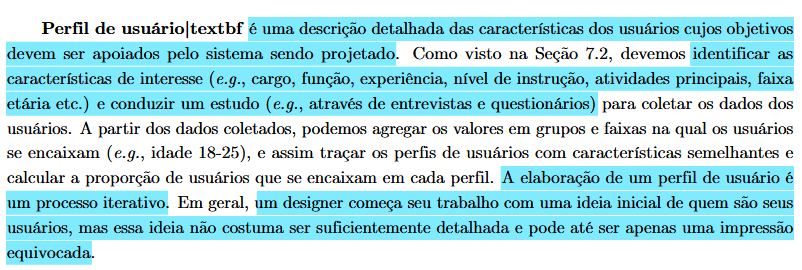

# Perfil de Usuário

## Tabela de contribuição
|Artefato(s) | Autor(es)|
| --- | --- |
| Página de Perfil de Usuário | Philipe e Hugo |

## Introdução 

O **perfil de usuário** é uma descrição detalhada das características das pessoas cujos objetivos devem ser apoiados pelo sistema que está sendo projetado. A elaboração desse perfil é um processo iterativo: embora o trabalho geralmente comece com uma ideia inicial de quem é o público-alvo, essa percepção preliminar não costuma ser suficientemente detalhada e pode até consistir em uma impressão equivocada.

Para garantir a precisão, é necessário identificar características de interesse (como cargo, função, experiência, nível de instrução, atividades principais e faixa etária) e conduzir estudos para coletar dados reais do público (BARBOSA et al., 2021)[PRINT] .

## Perfil de Usuário (iterado)

Com base nos resultados da avalição dos dados coletados pelo ferramentas de Brainstoring, Entrevista e Grupo de foco, foram definidos os seguintes perfis de usuário:

 

| Característica | Perfil 01: Paciente | Perfil 02: [Administrador do Sistema Sabin](../requisitos/analiseDeDocumentos.md) | Perfil 03: Funcionário do Sabin |
|---|---|---|---|
| **Tipo de Usuário** | Pessoa física que utiliza os serviços laboratoriais e diagnósticos do Sabin para uso pessoal | Colaborador interno responsável pela administração, configuração e monitoramento dos sistemas digitais do Sabin | Representante empresarial, RH, gestor de benefícios ou profissional de saúde parceiro |
| **Faixa Etária** | 20 a 60 anos | 25 a 55 anos | 25 a 55 anos |
| **Sexo** | Diversificado | Diversificado | Diversificado |
| **Status Socioeconômico** | Classe média e média alta, com acesso regular à internet e serviços privados de saúde | Classe média a alta, com acesso constante a equipamentos corporativos e recursos tecnológicos | Médio a alto, vinculado a organizações privadas ou clínicas |
| **Escolaridade** | Ensino médio completo a superior completo | Ensino superior completo em áreas de TI, Sistemas de Informação, Engenharia de Software ou áreas correlatas | Superior completo, técnico ou pós-graduação |
| **Alfabetismo / Leitura** | Boa compreensão textual, lê instruções e resultados digitais com facilidade | Alta capacidade de leitura técnica, documentação de sistemas e procedimentos operacionais | Alta capacidade de leitura técnica, interpreta contratos, relatórios e instruções |
| **Área de Formação** | Diversas áreas | Tecnologia da Informação, Engenharia, Análise de Sistemas ou áreas correlatas | Administração, RH, enfermagem, medicina, gestão ou áreas correlatas |
| **Experiência com Tecnologia** | Média a alta; usa apps bancários, e-commerce e serviços digitais | Alta; utiliza sistemas corporativos, bancos de dados, painéis administrativos e ferramentas de monitoramento | Média a alta; utiliza sistemas corporativos, ERPs, portais e ferramentas online |
| **Dispositivos Utilizados** | Smartphone principal, notebook ocasionalmente | Desktop e notebook corporativos, podendo utilizar dispositivos móveis para monitoramento | Desktop e notebook principalmente |
| **Tecnologia Disponível** | Internet móvel ou residencial, telas modernas e boa conectividade | Infraestrutura corporativa, acesso a sistemas internos, VPNs e ferramentas administrativas | Equipamentos corporativos, internet estável e múltiplos navegadores |
| **Experiência com Sites Semelhantes** | Já utilizou portais de laboratórios, convênios ou clínicas | Ampla experiência com painéis administrativos, sistemas de gestão e plataformas corporativas | Experiência com portais empresariais e fornecedores de saúde |
| **Cargo / Função Atual** | Não aplicável ao contexto principal | Administrador de Sistemas, Analista de TI, Supervisor de Operações Digitais ou cargo equivalente | Analista de RH, gestor, médico, secretário(a), parceiro comercial |
| **Tempo no Cargo / Empresa** | Não aplicável | Variável, geralmente com experiência prévia em gestão de sistemas e suporte operacional | De iniciante a experiente, geralmente inserido em rotina administrativa |
| **Responsabilidades** | Marcar exames, consultar resultados, localizar unidades | Gerenciar usuários, permissões, configurações, integrações e disponibilidade dos sistemas | Contratar serviços, gerir saúde ocupacional, solicitar suporte ou parcerias |
| **Informações sobre a Empresa** | Não aplicável | Conhece a estrutura organizacional, processos internos e políticas de segurança do Sabin | Empresas pequenas, médias ou grandes; clínicas, hospitais ou corporações |
| **Frequência de Uso** | Esporádica ou periódica | Diária e intensiva | Média a alta |
| **Objetivos Principais** | Agendamento rápido, acesso a resultados, praticidade | Garantir funcionamento contínuo, segurança, integridade dos dados e suporte aos usuários | Eficiência operacional, relacionamento institucional e agilidade de atendimento |
| **Tarefas Primárias** | Agendar exames, baixar laudos, verificar preparo, buscar unidades | Gerenciar acessos, monitorar sistemas, configurar parâmetros, auditar operações e atender chamados | Solicitar propostas, acessar serviços corporativos, obter informações técnicas |
| **Tarefas Secundárias** | Atualizar cadastro, consultar convênios | Produzir relatórios, realizar manutenção preventiva, capacitar usuários e documentar processos | Contato comercial, suporte, negociação |
| **Gravidade dos Erros** | Perda de horário, exame remarcado, preparo incorreto | Muito alta: indisponibilidade de serviços, falhas de segurança, perda de dados ou impacto operacional | Impacto operacional, retrabalho, atrasos administrativos |
| **Motivação** | Rapidez, autonomia e conveniência | Estabilidade operacional, segurança da informação e eficiência administrativa | Produtividade, redução de tempo e qualidade no serviço |
| **Atitudes e Valores** | Aceita novas soluções digitais se forem intuitivas | Valoriza confiabilidade, controle, rastreabilidade e conformidade com normas e políticas internas | Valoriza eficiência, confiabilidade e integração |
| **Treinamento Necessário** | Baixo; aprende explorando a interface | Médio a alto; requer capacitação técnica sobre sistemas, processos e políticas de segurança | Baixo a médio; prefere interfaces objetivas |
| **Conhecimento do Domínio** | Básico sobre exames e saúde preventiva | Alto conhecimento dos processos internos, sistemas corporativos e fluxos operacionais | Médio a alto sobre processos de saúde e atendimento |
| **Idiomas / Jargões** | Português; termos básicos de saúde | Português; familiaridade com terminologia técnica de TI, segurança da informação e gestão de sistemas | Português; familiaridade com termos corporativos e clínicos |

 

___

## Referência bibliográfica

> BARBOSA, S. D. J. et al. Interação Humano-Computador e Experiência do Usuário. 1. ed. Rio de Janeiro: Autopublicação, 2021.
___
## Histórico de Versão
| Versão | Data | Descrição | Autores | Data Revisão | Descrição Revisão | Revisores |
| :---: | :---: | :--- | :--- | :---: | :--- | :--- |
| 1.0 | 1/05/2026 | Criação do documento | [Philipe Amancio](https://github.com/Phill-Chill) | 1/05/2026 | Revisão da estrutura inicial e do conteúdo base do perfil de usuário | [Hugo Freitas Silva](https://github.com/HugoFreitass) |
| 1.1 | 15/05/2026 | Adição da rastreabilidade dos autores dos artefatos | [Philipe Amancio](https://github.com/Phill-Chill) | 15/05/2026 | Validação dos links e créditos de autoria no perfil de usuário | [Maria Laura Regis](https://github.com/Maria-Laura-Regis) |
