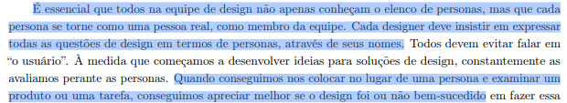

# Elenco de Personas

## Tabela de contribuição
|Artefato(s) | Autor(es)|
| --- | --- |
| Página de elenco de personas | Philipe |
| [Persona: Roberto](#roberto) | Philipe |
| [Persona: Márcia](#marcia)  | Maria Laura |
| [Persona: Ayla](#ayla)| Nathan |
| [Persona: Mariana](#mariana) | Hugo |
| [Persona: Camila](#camila)| Ingrid |
| [Persona: Agnes](#agnes)| Thaiza |

## Introdução

Uma **persona** é um personagem fictício e um arquétipo hipotético que representa um grupo de usuários reais, criada com o objetivo de descrever um usuário típico do sistema. Sua principal função é materializar o público-alvo durante as discussões de design, garantindo que toda a equipe técnica e de negócios mantenha o foco no mesmo alvo, evitando abstrações. Essas representações são construídas e definidas fundamentalmente por seus objetivos, que são lapidados por meio de refinamentos sucessivos durante a investigação do domínio do usuário (BARBOSA et al., 2021).[PRINT] .

A criação de personas serve para combater o problema do "usuário elástico", um termo genérico e impreciso que frequentemente resulta em sistemas confusos, que tratam a mesma pessoa ora como iniciante, ora como especialista, conforme a conveniência da programação. Tentar ampliar a funcionalidade de um produto para agradar a todos os pontos de vista costuma colocar obstáculos na jornada, interferindo no desempenho e arruinando a experiência. Por isso, em vez de criar um sistema genérico que se diz "amigável para o usuário", o design eficiente exige projetar para uma persona bem específica, garantindo que o sistema se adapte às necessidades dela, e não o contrário (BARBOSA et al., 2021).[PRINT] .

Na técnica de eleco de personas, é essencial que os integrantes da equipe de design garantam que cada persona se torne como uma pessoa real, como mebro da equipe. Cada integrante deve expressar as questões de design em termos de personas, usando seus nomes. Fazendo isso é possível avaliar melhor se uma solução de design foi ou não bem sucedida (BARBOSA et al., 2021).[PRINT] .

## Persona 1: 

> ### Jorge (Paciente) {#jorge}
> Elaborada por: Philipe Amâncio

| Categoria | Detalhes do Perfil |
| :--- | :--- |
|**Foto**| {width="600"}|
| **Identidade** | **Nome:** Jorge   **Idade:** 32 anos   **Sexo:** Masculino   **Localização:** Brasília, DF   **Status Socioeconômico:** Classe Média Alta   **Status na Pesquisa:** Persona Primária |
| **Perfil Geral** | Paciente proativo e investigativo. Não gosta de esperar passivamente pelo médico para saber o que tem de errado com seu corpo. Busca acessar resultados antecipadamente e utiliza a tecnologia para se preparar para as consultas. |
| **Educação e Aprendizado** | **Formação:** Ensino Superior Completo   **Nível de Leitura / Digital:** Alto / Alta facilidade   **Preferência de Aprendizado:** Curioso, pesquisa no Google, assiste a vídeos explicativos e usa ferramentas de IA generativa para tirar dúvidas. |
| **Experiência Profissional** | **Cargo:** Administrador / Analista de Sistemas.   **Responsabilidades:** Trabalho de escritório, passa grande parte do dia no computador.   **Plano de Saúde:** Utiliza plano de saúde corporativo para consultas e exames de imagem. |
| **Relação com Tecnologia** | **Nível:** Alto.   **Dispositivos:** Smartphone moderno e Notebook pessoal.   **Sistemas:** Aplicativos de banco, portais de saúde, ChatGPT (ou similares).   **Conexão:** Wi-Fi em casa e 4G/5G constante. |
| **Experiência com Sistemas** | **Uso Atual:** Acessa portais de laboratórios esporadicamente, apenas quando recebe a notificação de que um exame está pronto.   **Pontos Positivos:** Interfaces limpas que carregam direto no navegador web.   **Frustrações:** Laudos 100% técnicos sem explicação para leigos, exigência de baixar plugins ou arquivos em formato `.zip` pesados.   **Preferência:** Fluxos intuitivos e sem barreiras tecnológicas. |
| **Objetivos** | **Finais:** Visualizar seu laudo e suas imagens DICOM para entender sua dor antes da consulta médica de retorno.   **De Experiência:** Sentir-se no controle da própria saúde, utilizando ferramentas web para investigar seu próprio exame.   **De Vida:** Tratar a dor no ombro, recuperar sua qualidade de vida e ter diálogos produtivos com seus médicos. |
| **Habilidades e Tarefas** | **Competências:** Navegação web avançada, uso de IAs para simplificar textos complexos.   **Tarefas Críticas:** Acessar o exame via link de notificação e abrir o visualizador de imagens.   **Tarefas Secundárias:** Fazer download do PDF para levar impresso (se necessário) ou compartilhar o link com o médico. |
| **Relacionamentos** | **Interações:** Atendentes de laboratório e Médicos.   **Influência:** Consumidor final. Tem o poder de escolher o laboratório onde fará o exame baseado na qualidade do aplicativo e na facilidade de acesso aos resultados online. |
| **Requisitos e Expectativas** | **Necessidades:** Notificações em tempo real, acesso rápido sem precisar caçar a senha antiga, visualizador de imagens que funcione no clique, sem instalações adicionais.   **Modelo Mental:** "Receber Notificação > Clicar > Ler o Laudo > Abrir a Imagem > Entender o problema". |
| **Atitudes e Tolerância** | **Perfil:** Quer resolver sozinho.   **Tolerância a falhas:** Média. Se o sistema der erro, tenta atualizar a página. Se continuar não funcionando, desiste e aguarda o dia da consulta.   **Comportamento no Erro:** Fica ansioso e frustrado por ter a informação bloqueada. |
| **Domínio e Vocabulário** | **Domínio do Tema Médico:** Leigo.   **Idiomas:** Português nativo.   **Jargões:** Não domina. Precisa que a Inteligência Artificial traduza termos como "tendinopatia" ou "espaço subacromial" para linguagem cotidiana. |
| **Citação Representativa** | *"Quero entender exatamente o problema e como a solução irá recolver"* |

## Persona 2: 

> ### Márcia (Mãe e Gestora da Saúde Familiar) {#marcia}
> Elaborada por: Maria Laura

| Categoria | Detalhes do Perfil |
| :--- | :--- |
|**Foto**| {width="600"}|
| **Identidade** | **Nome:** Márcia   **Idade:** 55 anos   **Sexo:** Feminino   **Localização:** Brasília, DF   **Status Socioeconômico:** Classe Média Alta   **Status na Pesquisa:** Persona Primária |
| **Perfil Geral** | Servidora pública e mãe. É a principal organizadora da rotina médica da casa. Acessa a plataforma do Sabin para agendar exames para si, para o marido e para os pais idosos, conferir coberturas de plano de saúde e baixar resultados para as consultas. |
| **Educação e Aprendizado** | **Formação:** Ensino Superior Completo   **Nível de Leitura / Digital:** Alto / Médio   **Preferência de Aprendizado:** Visual e prático.   **Observação:** Prefere ser guiada pelo sistema passo a passo, sem precisar deduzir o funcionamento da interface. |
| **Experiência Profissional** | **Cargo:** Servidora Pública (20+ anos de carreira).   **Responsabilidades:** Rotinas burocráticas e gestão administrativa.   **Plano de Carreira:** Manter a estabilidade até a aposentadoria e focar no bem-estar familiar. |
| **Relação com Tecnologia** | **Nível:** Intermediário (sabe usar o essencial muito bem).   **Dispositivos:** Smartphone (uso contínuo) e Notebook (uso focado).   **Sistemas:** WhatsApp, aplicativos bancários, redes sociais e portais de serviços públicos.   **Conexão:** Wi-Fi residencial e 4G/5G. |
| **Experiência com Sistemas** | **Uso Atual:** Acessa o Sabin periodicamente, em épocas de check-up da família.   **Pontos Positivos:** Confiança na marca e centralização do histórico.   **Frustrações:** Ter que fazer múltiplos logins para acessar laudos de dependentes diferentes e falta de clareza imediata sobre o tempo de jejum.   **Preferência:** Uma área "Família" unificada e agendamento prático via envio de foto da guia médica. |
| **Objetivos** | **Finais:** Marcar exames ou coletas domiciliares de forma ágil e sem erros no preparo.   **De Experiência:** Sentir-se no controle, resolvendo a saúde da família rapidamente pelo celular.   **De Vida:** Garantir a saúde preventiva de todos os seus entes queridos sem sacrificar seu pouco tempo livre. |
| **Habilidades e Tarefas** | **Competências:** Excelente capacidade de organização de agendas complexas.   **Tarefas Críticas:** Pré-agendamento de exames, verificação de preparo (jejum) e download de laudos em PDF.   **Tarefas Secundárias:** Pesquisar unidades do Sabin próximas e consultar vacinas disponíveis. |
| **Relacionamentos** | **Interações:** Familiares (marido, filhos, pais), médicos e atendentes.   **Influência:** É a principal tomadora de decisão (Stakeholder direto). Ela escolhe o laboratório com base na praticidade do agendamento e repassa as instruções para o restante da família. |
| **Requisitos e Expectativas** | **Necessidades:** Clareza nas informações de plano de saúde, instruções exatas de preparo em destaque e fácil transição entre perfis de dependentes.   **Modelo Mental:** O sistema deve seguir o fluxo: *"Envio a guia > Confirmo a unidade e horário > Recebo o preparo exato e o lembrete no WhatsApp"*. |
| **Atitudes e Tolerância** | **Perfil:** Prática, focada em conveniência e resolução de problemas.   **Tolerância a falhas:** Baixa (Não tem tempo a perder com travamentos).   **Comportamento no Erro:** Abandona o site imediatamente e procura o ícone do WhatsApp para resolver o agendamento com um atendente humano. |
| **Domínio e Vocabulário** | **Domínio do Tema:** Intermediário (entende a rotina de check-ups, mas não é da área da saúde).   **Idiomas:** Português nativo.   **Jargões:** Entende termos comuns, mas trava em siglas médicas complexas se não houver uma explicação breve. |
| **Citação Representativa** | *"Eu preciso marcar os exames de sangue da família toda para sábado de manhã. Se o aplicativo me deixar enviar a foto do pedido médico e me disser o jejum de cada um, já resolve a minha vida."* |

## Persona 3: 

> ### Ayla (Estudante de direito e estágiaria) {#ayla}
> Elaborada por: Nathan Pontes

| Categoria | Detalhes do Perfil |
| :--- | :--- |
|**Foto**| {width="600"}|
| **Identidade** | **Nome:** Ayla   **Idade:** 28 anos   **Sexo:** Feminino   **Localização:** Brasília, DF   **Status Socioeconômico:** Classe Média   **Status na Pesquisa:** Persona Primária |
| **Perfil Geral** | Estudante de direito com um estágio na área, utiliza a plataforma do Sabin para agendar exames para si mesma e baixar os resultados, utilizando somente conforme a própria nescessidade. |
| **Educação e Aprendizado** | **Formação:** Ensino médio completo e cursando direito   **Nível de Leitura / Digital:** Alto   **Preferência de Aprendizado:** Visual e intuitivo.   **Observação:** Prefere sistemas intuitivos e faceis de navegar, com exploração de interface simplificada. |
| **Experiência Profissional** | **Cargo:** Estudante(penultimo semestre de direito) e estagiária.   **Responsabilidades:** Rotinas de estudo e estágio .   **Plano de Carreira:** Finalizar sua graduação e conseguir um emprego na área. |
| **Relação com Tecnologia** | **Nível:** Médio a alto (usa com frequência tanto no cotidiano quanto para estudo).   **Dispositivos:** Smartphone e notebook.   **Sistemas:** Whatsapp, redes sociais, plataformas de estudo, aplicativos bancários.   **Conexão:** Wi-Fi residencial e 4G/5G. |
| **Experiência com Sistemas** | **Uso Atual:** Acessa o portal do Sabin para marcar exames para si quando necessário.   **Pontos Positivos:** Variedade de exames e resultados no proprio site.   **Frustrações:** Tempo de resposta do site, Jornada exaustiva para marcar os exames (muitos cliques).   **Preferência:** Agendamento mais prático e mais clareza sobre a disponibilidade de exames. |
| **Objetivos** | **Finais:** Agendar exames e acessar fácilmente os resultados.   **De Experiência:** Sentir-se no controle sobre os horarios de seus exames e evitar frustrações por remarcações ou perda de horários .   **De Vida:** Garantir sua saúde preventiva evitando perdas de tempo extensas ou estresse desnecessário |
| **Habilidades e Tarefas** | **Competências:** Organização de horários e aprendizado de sistemas simples.   **Tarefas Críticas:** Agendamento de exames, baixar laudos, preparos para o exame, buscar unidades.   **Tarefas Secundárias:** Consultar convênios |
| **Relacionamentos** | **Interações:** Médicos e atendentes.   **Influência:** É a principal organizadora dos prórpios exames (stakeholder direto). Escolhe unidades e agendamento com base em sua própria disponibilidade. |
| **Requisitos e Expectativas** | **Necessidades:** Clareza no preparo para os exames e facilidade no acesso e download de resultados.   **Modelo Mental:** O sistema deve seguir o fluxo: *Escolha do exame > Marcação e confirmação da unidade > Lembrete do exame por email ou Whatsapp. |
| **Atitudes e Tolerância** | **Perfil:** Prefere simplicidade e praticidade, mas aceita novas soluções se forem intuitivas.   **Tolerância a falhas:** Mediana (A pesar de ter algum tempo, prefere não gastar muito dele com informações incompletas ou travamentos).   **Comportamento no Erro:** Frustração, se demorar muito com algum agendamento ou preparação específico, prefere recorrer ao atendimento humano. |
| **Domínio e Vocabulário** | **Domínio do Tema:** Mediano (Sabe o básico sobre saúde preventiva e exames).   **Idiomas:** Português nativo.   **Jargões:** Termos básicos de saúde. |
| **Citação Representativa** | *"Preciso marcar meu hemograma pra esse fim de semana, espero que o site tenha as informações sobre o jejum."* |

## Persona 4:

> ### Mariana Alves Souza (Paciente Particular / Analista) {#mariana}
> Elaborada por: Hugo Freitas

| Categoria | Detalhes do Perfil |
| :--- | :--- |
|**Foto**| {width="600"}|
| **Identidade** | **Nome:** Mariana Alves Souza   **Idade:** 34 anos   **Sexo:** Feminino   **Localização:** Brasília, DF   **Status Socioeconômico:** Classe Média   **Status na Pesquisa:** Persona Primária |
| **Perfil Geral** | Profissional ativa que valoriza praticidade no dia a dia. Trabalha em horário comercial e possui uma rotina corrida, conciliando trabalho, cuidados com a saúde e compromissos pessoais. Utiliza frequentemente serviços digitais para otimizar seu tempo. |
| **Educação e Aprendizado** | **Formação:** Ensino Superior Completo em Administração   **Nível de Leitura / Digital:** Alto / Alto   **Preferência de Aprendizado:** Aprende explorando as interfaces por conta própria.   **Observação:** Não gosta de ler instruções longas; prefere conteúdos objetivos e interfaces intuitivas. |
| **Experiência Profissional** | **Cargo:** Analista Administrativa (6 anos na função; experiência anterior como assistente).   **Responsabilidades:** Organização de processos internos, uso de sistemas corporativos e controle de documentos.   **Plano de Carreira:** Crescimento para cargos de coordenação. |
| **Relação com Tecnologia** | **Nível:** Médio a Alto.   **Dispositivos:** Smartphone (dispositivo principal) e Notebook (trabalho e uso pessoal).   **Sistemas:** Uso diário de aplicativos bancários, e-commerce e sistemas corporativos.   **Preferência:** Exige interfaces rápidas e diretas. |
| **Experiência com Sistemas** | **Uso Atual:** Acessa sites de laboratórios e convênios periodicamente para agendamento de exames e consulta de resultados.   **Pontos Positivos:** Consegue resolver problemas simples sozinha.   **Frustrações:** Dificuldade para encontrar informações, interfaces confusas e lentidão no processo de agendamento. |
| **Objetivos** | **Finais:** Agendar exames de forma rápida, acessar resultados sem complicação e encontrar unidades próximas.   **De Experiência:** Sentir que está no controle da situação, não perder tempo e não cometer erros durante o uso.   **De Vida:** Manter a saúde em dia e ter uma rotina organizada e eficiente. |
| **Habilidades e Tarefas** | **Competências:** Boa familiaridade com sistemas digitais e alta autonomia de resolução básica.   **Tarefas Críticas:** Agendar exames online (baixa frequência, mas alta importância) e consultar resultados (média frequência).   **Tarefas Secundárias:** Buscar instruções de preparo (eventual). |
| **Relacionamentos** | **Interações:** Atendentes de laboratório (apenas quando estritamente necessário) e profissionais de saúde.   **Influência:** Pode atuar como facilitadora, auxiliando familiares menos experientes com tecnologia a realizarem seus agendamentos. |
| **Requisitos e Expectativas** | **Necessidades:** Interface simples e direta, processo de agendamento ágil e informações claras sobre o preparo de exames.   **Modelo Mental:** Acredita fortemente que tarefas simples devem ser concluídas em poucos passos, exigindo organização e intuição do sistema. |
| **Atitudes e Tolerância** | **Perfil:** Aberta a novas tecnologias (desde que sejam fáceis de usar), valoriza eficiência e evita sistemas complicados.   **Tolerância a falhas:** Baixa.   **Comportamento no Erro:** O impacto percebido do erro é muito alto (medo de perder o horário do exame ou fazer o preparo incorreto). Por isso, espera sempre uma confirmação clara das ações realizadas na tela. |
| **Domínio e Vocabulário** | **Domínio do Tema:** Básico a intermediário (conhece sua saúde, mas não os jargões).   **Idiomas:** Português fluente.   **Jargões:** Compreende termos básicos de saúde, mas não possui familiaridade com linguagem técnica avançada. |
| **Citação Representativa** | *"Quero resolver tudo rápido, sem precisar ficar procurando informação."* |

## Persona 5:

> ### Camila Fernandes (Paciente Frequente / Gestante) {#camila}
> Elaborada por: Ingrid Alves

| Categoria | Detalhes do Perfil |
| :--- | :--- |
| **Foto** | {width="600"} |
| **Identidade** | **Nome:** Camila Fernandes   **Idade:** 29 anos   **Sexo:** Feminino   **Localização:** Valparaíso de Goiás, GO (Trabalha em Brasília, DF)   **Status Socioeconômico:** Classe Média   **Status na Pesquisa:** Persona Primária |
| **Perfil Geral** | Professora do ensino fundamental, atualmente grávida do primeiro filho (24 semanas). Devido ao pré-natal, sua rotina de idas ao laboratório passou de anual para mensal. É muito organizada, mas a gravidez a deixou mais ansiosa com prazos e resultados. |
| **Educação e Aprendizado** | **Formação:** Ensino Superior Completo em Pedagogia   **Nível de Leitura / Digital:** Alto / Alto   **Preferência de Aprendizado:** Gosta de interfaces explicativas, mas que vão direto ao ponto. Lê notificações e dicas curtas.   **Observação:** Prefere sistemas que a avisem proativamente (por SMS ou e-mail) do que ter que ficar "caçando" a informação. |
| **Experiência Profissional** | **Cargo:** Professora de Ensino Fundamental.   **Responsabilidades:** Planejamento de aulas, correção de atividades e reuniões pedagógicas.   **Plano de Carreira:** Focar na estabilidade atual para poder se dedicar à maternidade nos próximos meses. |
| **Relação com Tecnologia** | **Nível:** Alto.   **Dispositivos:** Smartphone (dispositivo principal, sempre em mãos) e Notebook.   **Sistemas:** Usa redes sociais, aplicativos de acompanhamento de gravidez, agenda digital e apps de banco.   **Preferência:** Aplicativos responsivos que funcionem perfeitamente no celular, já que passa muito tempo em pé ou longe do computador. |
| **Experiência com Sistemas** | **Uso Atual:** Acessa o site do laboratório várias vezes na mesma semana quando faz exames importantes (como ultrassom morfológico ou curva glicêmica).   **Pontos Positivos:** Tem facilidade para navegar, filtrar exames por data e baixar PDFs.   **Frustrações:** Fica muito frustrada quando o sistema diz que o exame "está em análise" além do prazo ou quando precisa baixar 5 PDFs separados em vez de um laudo único. |
| **Objetivos** | **Finais:** Visualizar resultados parciais de exames assim que são liberados e enviar os laudos consolidados para a sua obstetra.   **De Experiência:** Quer um acesso rápido, com indicadores visuais claros (como tags de "Liberado" ou "Em processamento").   **De Vida:** Garantir que a saúde do bebê e a sua estejam perfeitas, sem estresse desnecessário com burocracia. |
| **Habilidades e Tarefas** | **Competências:** Navegação fluida em abas, download e compartilhamento de arquivos em nuvem ou mensageiros.   **Tarefas Críticas:** Acompanhar status de exames (ansiedade pelo resultado) e baixar laudos.   **Tarefas Secundárias:** Agendar exames específicos que exigem autorização do convênio. |
| **Relacionamentos** | **Interações:** Obstetra (contato frequente via WhatsApp para tirar dúvidas dos laudos) e recepção do laboratório.   **Influência:** Participa de grupos de gestantes no WhatsApp e costuma recomendar laboratórios que oferecem um bom aplicativo/site. |
| **Requisitos e Expectativas** | **Necessidades:** Clareza no status do exame (se já saiu ou quando vai sair) e facilidade para baixar tudo de uma vez.   **Modelo Mental:** Se o laboratório prometeu o resultado para as 16h, ela fará login às 15h50 esperando que já esteja disponível na tela inicial. |
| **Atitudes e Tolerância** | **Perfil:** Engajada e atenta aos detalhes, porém impaciente com lentidão.   **Tolerância a falhas:** Média para erros do sistema (tenta recarregar a página), mas baixíssima para falta de transparência na informação.   **Comportamento no Erro:** Se o laudo não carrega, ela imediatamente procura o chat de atendimento ou liga na central, pois teme que haja algo errado com o exame em si. |
| **Domínio e Vocabulário** | **Domínio do Tema:** Intermediário (aprendeu muitos termos médicos recentemente por causa da gravidez).   **Idiomas:** Português fluente.   **Jargões:** Já entende termos como "Toxoplasmose", "TSH", "Glicemia de jejum", mas ainda prefere ver a conclusão do laudo de forma clara. |
| **Citação Representativa** | *"Eu atualizo a página do laboratório o dia inteiro só para ver se o resultado do exame do meu bebê já saiu."* |

## Persona 6: 

> ### Agnes (Estudante e Neta de Pacientes Frenquentes) {#agnes}
> Elaborada por: Thaiza Romualdo 

| Categoria | Detalhes do Perfil |
| :--- | :--- |
|**Foto**| {width="600"}|
| **Identidade** | **Nome:** Agnes Santos   **Idade:** 16 anos   **Sexo:** Feminino   **Localização:** Brasília, DF   **Status Socioeconômico:** Classe Baixa/Média   **Status na Pesquisa:** Persona Primária |
| **Perfil Geral** | Estudante de Ensino Médio, realiza cusos externos e atualmente mora com os avós que frequenta clinicas e hospitais sendo acompanhante deles. |
| **Educação e Aprendizado** | **Formação:** Ensino Médio Incompleto   **Nível de Leitura / Digital:** Basico   **Preferência de Aprendizado:** Aprende explorando as interfaces por conta própria.   **Observação:** Não gosta de ler instruções longas e sistemas lentos. |
| **Experiência Profissional** | **Cargo:** Estudante e realiza Curso de Informatica Basica.   **Responsabilidades:** Auxilia em documentos, exames e consultas dos avós quando necessário.   **Plano de Carreira:** Até o momento sem planos. |
| **Relação com Tecnologia** | **Nível:** Médio (usa com frequência tanto no cotidiano quanto para estudo).   **Dispositivos:** Smartphone (Pessoal) e Notebook (Para estudo).   **Sistemas:** Uso diário de aplicativos de Rede Sociais frequentes e para Bancos, Laboratorios, Convênios uso moderadamente.    **Conexão:** Wi-Fi residencial e 4G/5G. |
| **Experiência com Sistemas** | **Uso Atual:** Acessa sites de laboratórios e convênios para consultar resultados de exame e verificar preparatótrio.   **Pontos Positivos:** Adaptação com uso desses sistemas.   **Frustrações:** Os acessos são realizados para os avós pois os mesmo não conseguem realizar tarefas simples na internet. Agnes é responsavel em pegar os resultados de exames porem o sistema tem atraso de resultados o que faz os avós preferirem ir ao presencial agendar e pegar resultados.   **Preferência:** Simples, Pratico e Direto.|
| **Objetivos** | **Finais:** Acessar aos resultados dos exames assim que estiverem prontos e ser informada sobre o status dele no sistema como data limite hora e se necessario realizar novamente uma nova coleta.   **De Experiência:** Sentir que o laboratorio e o sistemas estão em trabalhando em conjunto para  uma entrega rápida, segura e confiavel com o paciente.   **De Vida:** Priorizar a saude dos Avós pra caso seja necessario um tratamento mais rapido a denpeder dos exames. |
| **Habilidades e Tarefas** | **Competências:** Boa familiaridade com sistemas digitais e alta autonomia de resolução básica.   **Tarefas Críticas:** Agendar exames online (baixa frequência) e consultar resultados (alta frequência).   **Tarefas Secundárias:** Buscar instruções de preparo (eventual) |
| **Relacionamentos** | **Interações:** Médicos, Enfermeiros e Atendentes.   **Influência:** É a principal organizadora dos exames dos avós (stakeholder indireto). |
| **Requisitos e Expectativas** | **Necessidades:** Agilidade na disponibilidade de resultado de examese na importação deles para o sistema.   **Modelo Mental:** Resultados serem apresentados em tempo real ao sistema do laboratório. |
| **Atitudes e Tolerância** | **Perfil:** Prefere praticidade e agilidade, mas aceita soluções.   **Tolerância a falhas:** Mediana.   **Comportamento no Erro:** Frustração, se demorar muito com algum resultado ou preparação específico, prefere recorrer ao atendimento humano. |
| **Domínio e Vocabulário** | **Domínio do Tema:** Simples (Sabe o básico sobre saúde e exames).   **Idiomas:** Português nativo.   **Jargões:** Termos básicos de saúde. |
| **Citação Representativa** | *"Os resultados dos meus exames ainda não estar disponivel, mesmo estando na data e hora prevista."* |

___

## Referência Bibliográfica

> BARBOSA, S. D. J. et al. Interação Humano-Computador e Experiência do Usuário. 1. ed. Rio de Janeiro: Autopublicação, 2021.

___

## Histórico de Versão
| Versão | Data | Descrição | Autores | Data Revisão | Descrição Revisão | Revisores |
| :---: | :---: | :--- | :--- | :---: | :--- | :--- |
| 1.0 | 01/05/2026 | Criação do documento e adição da persona "Roberto" | [Philipe Amancio](https://github.com/Phill-Chill) | 01/05/2026 | Conferência da estrutura da persona Roberto e dos campos iniciais do elenco | [Maria Laura Regis](https://github.com/Maria-Laura-Regis) |
| 1.1 | 01/05/2026 | Adição da persona "Marcia" e "Mariana" | [Maria Laura Regis](https://github.com/Maria-Laura-Regis) | 01/05/2026 | Validação da inclusão das personas Marcia e Mariana no conjunto existente | [Hugo Freitas Silva](https://github.com/HugoFreitass) |
| 1.2 | 02/05/2026 | Adição da persona "Ayla" | [Nathan Pontes Romão](https://github.com/nathanpromao) | 02/05/2026 | Revisão da nova persona Ayla e da consistência com o modelo das demais personas | [Hugo Freitas Silva](https://github.com/HugoFreitass) |
| 1.3 | 04/05/2026 | Adição da persona "Camila" | [Ingrid Alves](https://github.com/alvesingrid) | 04/05/2026 | Checagem da persona Camila e da padronização com o elenco anterior | [Hugo Freitas Silva](https://github.com/HugoFreitass) |
| 1.4 | 04/05/2026 | Adição da persona "Agnes" | [Thaiza Romualdo da Silva](https://github.com/ThaizaWeert) | 04/05/2026 | Verificação da persona Agnes e da coerência dos atributos documentados | [Philipe Amancio](https://github.com/Phill-Chill) |
| 1.5 | 06/05/2026 | Adição dos autores de cada persona e modificações na introdução | [Hugo Freitas Silva](https://github.com/HugoFreitass) | 06/05/2026 | Conferência dos créditos por persona e dos ajustes realizados na introdução | [Philipe Amancio](https://github.com/Phill-Chill) |
| 1.6 | 15/05/2026 | Adição da rastreabilidade dos autores dos artefatos | [Philipe Amancio](https://github.com/Phill-Chill) | 15/05/2026 | Validação da rastreabilidade dos autores vinculada às personas | [Maria Laura Regis](https://github.com/Maria-Laura-Regis) |

