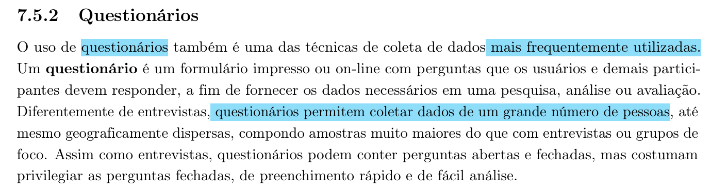
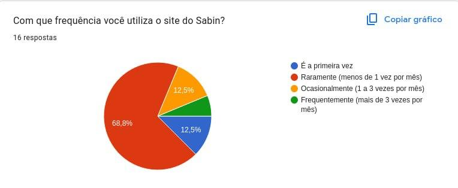
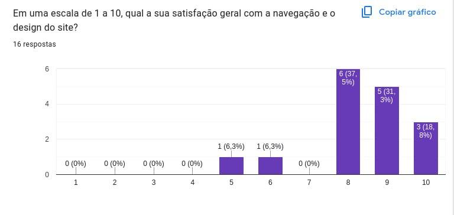
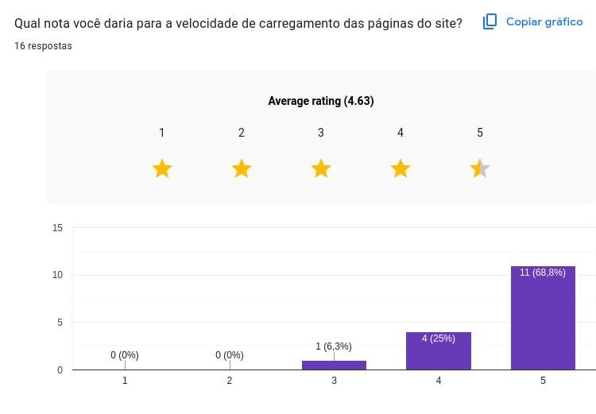
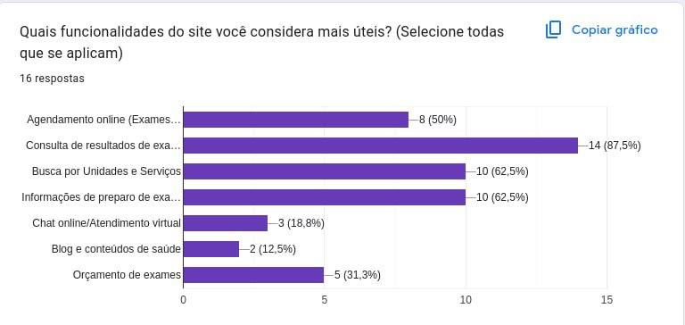
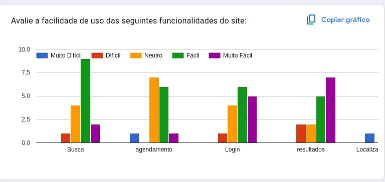
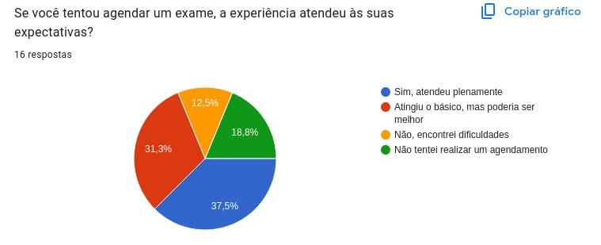
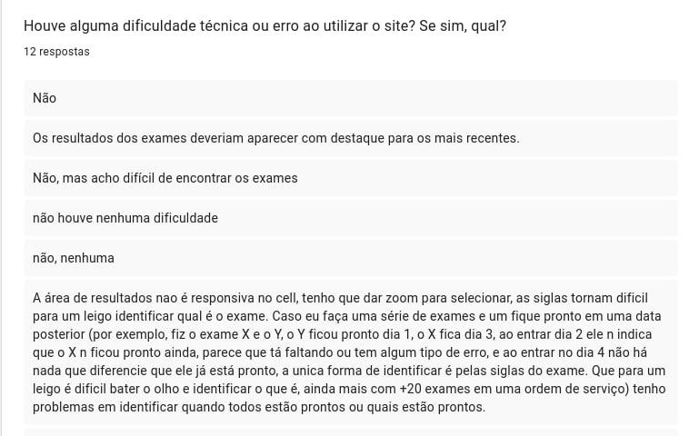
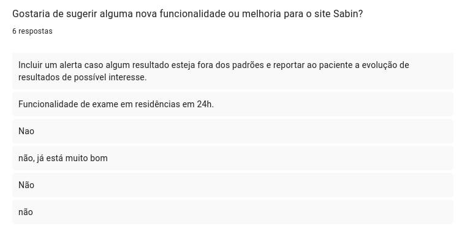

# Questionário

## Introdução
O questionário é uma técnica de levantamento de dados amplamente utilizada na área de Interação Humano-Computador para coletar informações autorrelatadas de uma amostra abrangente de usuários. Ele se destaca por permitir a coleta de dados de pessoas geograficamente dispersas e de forma assíncrona. Enquanto métodos qualitativos (como entrevistas e brainstorming) são excelentes para descobrir "o que" e "por que" os usuários pensam de determinada forma, o questionário é a ferramenta ideal para responder "quantos" pensam assim, ajudando a validar estatisticamente as hipóteses levantadas nas fases iniciais da pesquisa (BARBOSA et al., 2021)[PRINT] ..

**Equipe de Pesquisa (Papéis):**

*   **Elaborador/Pesquisador:** Define os objetivos centrais, escolhe o tipo de perguntas (abertas, múltiplas escolhas, escalas Likert) e redige os enunciados garantindo neutralidade para não induzir respostas.

*   **Analista de Dados:** Responsável por tabular as respostas recolhidas, gerar gráficos e cruzar dados quantitativos com os achados qualitativos das entrevistas.

**Fluxo da Dinâmica (Passo a Passo):**

1. **Planejamento e Estruturação:** A equipe define as informações específicas que precisam ser descobertas e levantadas junto ao público-alvo.
2. **Distribuição e Coleta:** Divulgação do questionário aos usuários (via link, e-mail ou redes sociais). A primeira etapa deve ser introduzida pelo **Termo de Consetimento para Participação em Pesquisa**.
3. **Análise:** Após atingir a amostra desejada, a equipe encerra a coleta, compila os resultados fechados em gráficos e categoriza as respostas abertas (se houver) para encontrar tendências.

## Análise dos Resultados do Questionário

## Introdução

O presente documento apresenta a consolidação e análise dos dados coletados por meio de um questionário online aplicado aos usuários do portal Sabin. O objetivo desta pesquisa quantitativa e qualitativa foi compreender o perfil de acesso, as principais motivações de uso, o nível de satisfação geral e os pontos de atrito enfrentados pelos pacientes durante a navegação. Com uma amostra de 16 respondentes, os resultados fornecem *insights* valiosos para guiar as decisões de design e priorizar as melhorias de usabilidade e acessibilidade do sistema.

---

### 1. Perfil de Uso e Motivação

Para entender o contexto de acesso dos usuários, investigamos a frequência com que visitam o site e o principal motivador dessa ação.

> *Legenda: Gráfico sobre a frequência de utilização do site do Sabin.*

> *Legenda: Gráfico ilustrando o principal motivo da visita ao site.*

*   A base de respondentes é composta por 16 pessoas.
*   A grande maioria dos usuários (68,8%) acessa o site raramente, com uma frequência menor do que uma vez por mês.
*   O principal motivo de visita ao portal é a consulta de resultados de exames, o que representa 37,5% do público.
*   O agendamento de exames e consultas, bem como a pesquisa por exames e serviços, aparecem logo em seguida como motivação, empatados com 18,8% das respostas cada.

---

### 2. Satisfação e Desempenho Técnico

A percepção de qualidade técnica e visual do sistema foi avaliada por meio de notas para a velocidade de carregamento e o design geral.

> *Legenda: Avaliação da satisfação geral com a navegação e o design (escala de 1 a 10).*

> *Legenda: Avaliação da velocidade de carregamento das páginas.*

*   A satisfação geral com a navegação e o design do site é bastante alta, com a maioria dos respondentes avaliando a experiência com notas 8 (37,5%), 9 (31,3%) e 10 (18,8%).
*   Apenas duas pessoas deram notas medianas (5 e 6) para a navegação e o design.
*   A velocidade de carregamento das páginas foi muito elogiada, atingindo uma nota média de 4,63 de 5 estrelas.
*   A grande maioria dos participantes (68,8%) classificou a velocidade de carregamento com a nota máxima de 5 estrelas.

---

### 3. Usabilidade e Funcionalidades

Nesta seção, avaliamos quais ferramentas os usuários consideram mais úteis e o nível de facilidade (ou dificuldade) em utilizá-las.

> *Legenda: Gráfico indicando quais funcionalidades os usuários consideram mais úteis.*

> *Legenda: Avaliação do nível de facilidade de uso por funcionalidade específica.*

> *Legenda: Avaliação sobre o atendimento das expectativas no agendamento de exames.*

*   A consulta de resultados de exames é esmagadoramente considerada a funcionalidade mais útil do site, sendo apontada por 87,5% dos participantes.
*   A busca por unidades e serviços e as informações de preparo de exames dividem o segundo lugar em utilidade, ambas citadas por 62,5% dos respondentes.
*   No quesito facilidade de uso, as áreas de Login e de Visualização de Resultados receberam avaliações predominantemente positivas, concentrando-se entre "Fácil" e "Muito Fácil".
*   A funcionalidade de Agendamento, no entanto, gerou opiniões mais divididas, com uma forte concentração na avaliação "Neutro" e apontamentos pontuais de dificuldade.
*   Ao avaliar especificamente a experiência de agendar um exame, 37,5% dos usuários disseram que a expectativa foi atendida plenamente.
*   Apesar disso, há espaço para otimização no agendamento: 31,3% afirmaram que o fluxo atinge o básico, mas poderia ser melhor, e 12,5% relataram ter encontrado dificuldades no processo.

---

### 4. Dificuldades Relatadas (Pontos de Atrito)

Através de perguntas abertas, mapeamos os obstáculos reais que quebram a fluidez da experiência do usuário.

> *Legenda: Respostas abertas sobre dificuldades técnicas ou erros ao utilizar o site.*

*   A maioria absoluta dos usuários informou não ter enfrentado dificuldades técnicas ou erros sistêmicos.
*   Contudo, um problema grave de responsividade foi apontado na área de resultados acessada via celular, onde um usuário relatou a necessidade de dar zoom na tela para conseguir selecionar os itens.
*   O uso de linguagem excessivamente técnica (siglas médicas) foi criticado por dificultar a identificação dos exames por pessoas leigas.
*   Há uma deficiência no fornecimento de *feedback* do sistema em relação aos prazos: usuários relatam dificuldade em saber quais exames de uma lista já estão prontos quando os prazos de entrega são diferentes.
*   A organização visual também foi alvo de críticas, com solicitações para que os exames sejam mais fáceis de encontrar no painel e que os laudos mais recentes ganhem maior destaque na interface.

---

### 5. Sugestões de Melhoria

Por fim, os próprios usuários indicaram oportunidades de inovação e melhoria para a plataforma.

> *Legenda: Respostas abertas com sugestões de novas funcionalidades ou melhorias.*

*   Um usuário sugeriu a implementação de alertas automáticos caso o resultado de um exame apresente alterações fora dos padrões normais.
*   Foi recomendada a criação de um recurso que reporte ao paciente a evolução do seu histórico de resultados ao longo do tempo.
*   Houve também o pedido pela inclusão de uma funcionalidade que permita agendar a realização de exames em residência dentro de um prazo de 24 horas.

| Versão | Data | Descrição | Autor | Revisor |
| :--- | :--- | :--- | :--- | :--- |
| 1.0 | 1/05/2026 | Criação do documento |[Philipe Amancio](https://github.com/Phill-Chill)| [Hugo Freitas Silva](https://github.com/HugoFreitass) |

## Referência bibliográfica

BARBOSA, S. D. J. et al. Interação Humano-Computador e Experiência do Usuário. 1. ed. Rio de Janeiro: Autopublicação, 2021.