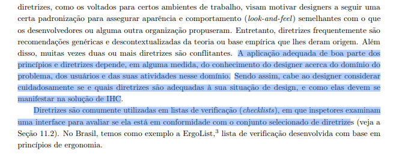
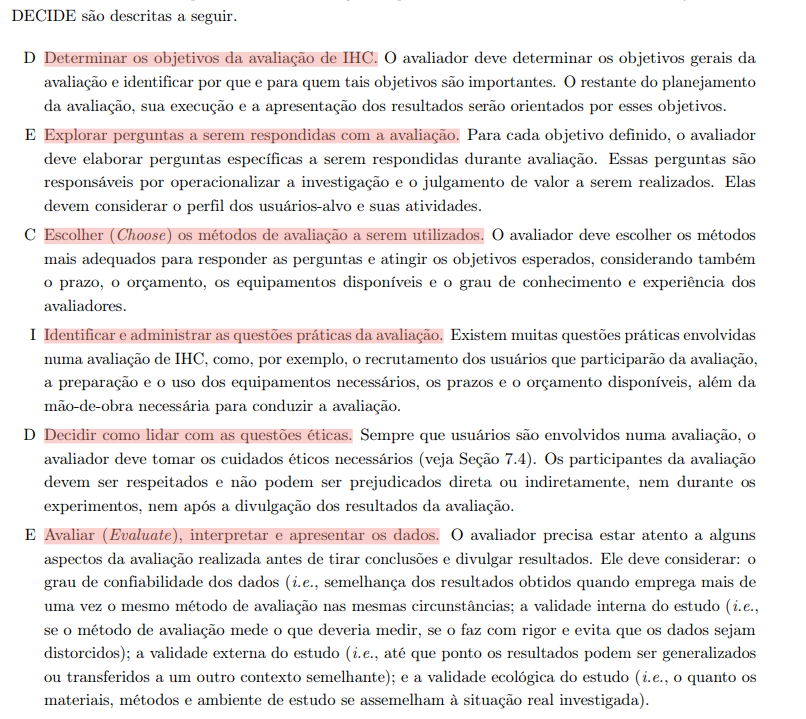
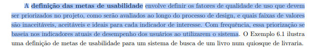
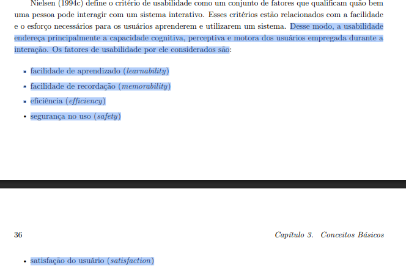
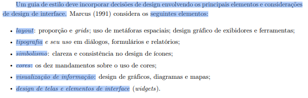

# Lista de Verificação da Entrega 3

## Introdução

Este documento contém itens de verificação sobre a entrega 03.

**Fase:** Análise de Requisitos (Princípios Gerais de Projeto, Metas de Usabilidade, Guia de Estilo, Características da Plataforma)

## Tabela de contribuição

|Artefato(s) | Autor(es)|
| --- | --- |
| Lista de verificação sobre a entrega 03 | [Hugo Freitas Silva](https://github.com/HugoFreitass), [Ingrid Alves](https://github.com/alvesingrid), [Maria Laura Regis](https://github.com/Maria-Laura-Regis), [Nathan Pontes](https://github.com/nathanpromao) e [Philipe Amancio](https://github.com/Phill-Chill) |

## Lista de Verificação

### Itens do desenvolvimento do projeto

Tabela 1 - Itens de desenvolvimento do projeto

| Nº | Pergunta | Autor do item | Fonte do Item | Aplicável ao grupo a ser inspecionado |
|----|----------|---------------|---------------|---------------------------------------|
| 1 | O histórico de versão padronizado? | André Barros de Sales (Professor) | Plano de Ensino | Aplicável |
| 2 | O(s) autor(es) e o(s) revisor(es) para cada artefato? | André Barros de Sales (Professor) | Plano de Ensino | Aplicável |
| 3 | Referências bibliográficas e/ou bibliografia em todos os artefatos? | André Barros de Sales (Professor) | Plano de Ensino | Aplicável |
| 4 | As tabelas e imagens possuem legenda e fonte e elas chamadas dentro do texto? | André Barros de Sales (Professor) | Plano de Ensino | Aplicável |
| 5 | Um texto fazendo uma introdução dos artefatos? | André Barros de Sales (Professor) | Plano de Ensino | Aplicável |
| 6 | O cronograma executado com quem realizou cada artefato/atividade com as datas de início e fim da construção/realização do artefato/atividade. | André Barros de Sales (Professor) | Plano de Ensino | Aplicável |
| 7 | Ata(s) da(s) reuniões (com data, horário de início e do final, participantes, objetivo, atividades definidas etc). | André Barros de Sales (Professor) | Plano de Ensino | Aplicável |
| 8 | A gravação da reunião do grupo. | André Barros de Sales (Professor) | Plano de Ensino | Aplicável |
| 9 | Vídeo de apresentação na categoria "não listado" no youtube? | André Barros de Sales (Professor) | Plano de Ensino | Aplicável |
| 10 | Tabela de contribuição no início do artefato com o nome de todos os integrantes com a contribuição de cada integrante com hiperligação atividade e da gravação, se houver. | André Barros de Sales (Professor) | Plano de Ensino | Aplicável |
| 11 | A seção de agradecimentos apresentando o uso de Inteligência Artificial (IA) Generativa no artefato. | André Barros de Sales (Professor) | Plano de Ensino | Aplicável |

> Fonte: autoria própria

---

### Características da Plataforma

Tabela 2 - Itens das Características da Plataforma

| Nº | Pergunta | Autor do item | Fonte do Item | Aplicável ao grupo a ser inspecionado |
|----|----------|---------------|---------------|---------------------------------------|
| 1 | As características da plataforma para o projeto foram claramente definidas e documentadas? | André Barros de Sales (Professor) | Plano de Ensino | Aplicável |

> Fonte: autoria própria

---

### Princípios Gerais de Projeto

Tabela 3 - Itens dos Princípios Gerais de Projeto

| Nº | Pergunta | Autor do item | Fonte do Item | Aplicável ao grupo a ser inspecionado |
|----|----------|---------------|---------------|---------------------------------------|
| 1 | Os Princípios Gerais de Projeto que serão utilizados foram definidos? O artefato inclui a referência bibliográfica da fonte e a foto do texto original explicando esses princípios? | André Barros de Sales (Professor) | Plano de Ensino | Aplicável |
| 2 | Os Princípios Gerais contemplam todos os 8 tópicos exigidos (expectativas, simplicidade, controle/liberdade, consistência, antecipação, visibilidade, conteúdo e prevenção de erros)? O documento apresenta referência bibliográfica e foto do texto explicando esses tópicos? | André Barros de Sales (Professor) | Plano de Ensino | Aplicável |
| 3 | O grupo identificou e justificou claramente quais princípios gerais de projeto foram seguidos ou violados na interface avaliada?  (BARBOSA et al., 2021, p. 238) [PRINT]  | [Maria Laura Regis](https://github.com/Maria-Laura-Regis) | Barbosa *et al.* (2021, p. 238) | Aplicável |
| 4 | Existe uma justificativa fundamentada na literatura para a escolha ou relevância de cada princípio no contexto do sistema analisado?  (BARBOSA et al., 2021, p. 280) [PRINT]  | [Ingrid Alves](https://github.com/alvesingrid) | Barbosa *et al.* (2021, p. 280) | Aplicável |

> Fonte: autoria própria

---

### Metas de Usabilidade

Tabela 4 - Itens das Metas de Usabilidade

| Nº | Pergunta | Autor do item | Fonte do Item | Aplicável ao grupo a ser inspecionado |
|----|----------|---------------|---------------|---------------------------------------|
| 1 | As metas de usabilidade que devem ser alcançadas (ou os objetivos da avaliação de IHC) estão bem definidas? Inclui referência bibliográfica e foto do texto base? | André Barros de Sales (Professor) | Plano de Ensino | Aplicável |
| 2 | A equipe justificou adequadamente a razão para a seleção dessas metas de usabilidade específicas? | André Barros de Sales (Professor) | Plano de Ensino | Aplicável |
| 3 | O documento de Metas de Usabilidade define quantitativamente as faixas de valores (inaceitáveis, aceitáveis e ideais) para cada indicador de qualidade priorizado no projeto?  (BARBOSA et al., 2021, p. 117) [PRINT]  | [Philipe Amancio](https://github.com/Phill-Chill) | Barbosa *et al.* (2021, p. 117) | Aplicável |
| 4 | As metas de usabilidade tratam dos fatores de usabilidade de Nielsen: facilidade de aprendizado, facilidade de recordação, eficiência, segurança de uso e satisfação do usuário?  (BARBOSA et al., 2021, p. 35-36) [PRINT]  | [Nathan Pontes Romão](https://github.com/nathanpromao) | Barbosa *et al.* (2021, p. 35-36) | Aplicável |

> Fonte: autoria própria

---

### Guia de Estilo

Tabela 5 - Itens do Guia de Estilo

| Nº | Pergunta | Autor do item | Fonte do Item | Aplicável ao grupo a ser inspecionado |
|----|----------|---------------|---------------|---------------------------------------|
| 1 | O Guia de Estilo do projeto foi construído? O artefato contém referência bibliográfica da fonte e foto do texto acadêmico explicando o que é um Guia de Estilo? | André Barros de Sales (Professor) | Plano de Ensino | Aplicável |
| 2 | O Guia de Estilo segue rigorosamente a estrutura de 6 partes (1. Introdução, 2. Resultados de análise, 3. Elementos de interface, 4. Elementos de interação, 5. Elementos de ação, 6. Vocabulário e padrões)? Inclui referência e foto do texto original sobre essa estrutura? | André Barros de Sales (Professor) | Plano de Ensino | Aplicável |
| 3 | As definições estabelecidas no Guia de Estilo correspondem de fato à realidade visual e interativa do site que está sendo avaliado? | André Barros de Sales (Professor) | Plano de Ensino | Aplicável |
| 4 | O guia de estilo trata sobre todos os tópicos: layout, tipografia, simbolismo, cores, visualização de informação, design de telas e elementos de interface?  (BARBOSA et al., 2021, p. 257) [PRINT]  | [Hugo Freitas Silva](https://github.com/HugoFreitass) | Barbosa *et al.* (2021, p. 257) | Aplicável |

> Fonte: autoria própria

---

## Totalização

| Avaliação | Quantidade |
|-----------|-----------|
| Aplicáveis | 24 |
| Não Aplicáveis | 0 |
| **Total** | **24** |

## Histórico de Versão

| Versão | Data | Descrição | Autores | Data Revisão | Descrição Revisão | Revisores |
| :---: | :---: | :--- | :--- | :---: | :--- | :--- |
| 1.0 | 23/06/2026 | Criação do documento com listas separadas por artefato | [Ingrid Alves](https://github.com/alvesingrid) | - | - | - |
