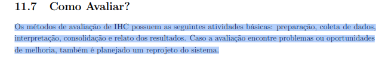

# Lista de Verificação da Entrega 4

## Introdução

Este documento contém itens de verificação sobre a entrega 04. 

**Fase:** Avaliação e Desenvolvimento (Relato dos Resultados da Análise de Tarefas e Storyboard, Planejamento da Avaliação do Protótipo de Papel e Planejamento do Relato dos Resultados)

## Tabela de contribuição

|Artefato(s) | Autor(es)|
| --- | --- |
| Lista de verificação sobre a entrega 05 | [Hugo Freitas Silva](https://github.com/HugoFreitass), [Ingrid Alves](https://github.com/alvesingrid), [Maria Laura Regis](https://github.com/Maria-Laura-Regis), [Nathan Pontes](https://github.com/nathanpromao) e [Philipe Amancio](https://github.com/Phill-Chill) |

## Lista de Verificação

### Itens do desenvolvimento do projeto

Tabela 1 - Itens de desenvolvimento do projeto

| Nº |  Pergunta | Autor do item | Fonte do Item | Aplicável ao grupo a ser inspecionado |
|----|----------|---------------|---------------|---------------------------------------|
| 1 |  O histórico de versão padronizado? | André Barros de Sales (Professor) | Plano de Ensino | Aplicável |
| 2 |  O(s) autor(es) e o(s) revisor(es) para cada artefato? | André Barros de Sales (Professor) | Plano de Ensino | Aplicável |
| 3 | Referências bibliográficas e/ou bibliografia em todos os artefatos? | André Barros de Sales (Professor) | Plano de Ensino | Aplicável |
| 4 | As tabelas e imagens possuem legenda e fonte e elas chamadas dentro do texto? | André Barros de Sales (Professor) | Plano de Ensino | Aplicável |
| 5 |  Um texto fazendo uma introdução dos artefatos? | André Barros de Sales (Professor) | Plano de Ensino | Aplicável |
| 6 |  O cronograma executado com quem realizou cada artefato/atividade com as datas de início e fim da construção/realização do artefato/atividade. | André Barros de Sales (Professor) | Plano de Ensino | Aplicável |
| 7 | Ata(s) da(s) reuniões (com data, horário de início e do final, participantes, objetivo, atividades definidas etc). | André Barros de Sales (Professor) | Plano de Ensino | Aplicável |
| 8 | A gravação da reunião do grupo. | André Barros de Sales (Professor) | Plano de Ensino | Aplicável |
| 9 | Vídeo de apresentação na categoria "não listado" no youtube? | André Barros de Sales (Professor) | Plano de Ensino | Aplicável |
| 10 | Tabela de contribuição no início do artefato com o nome de todos os integrantes com a contribuição de cada integrante com hiperligação atividade e da gravação, se houver. | André Barros de Sales (Professor) | Plano de Ensino | Aplicável |
| 11 |  A seção de agradecimentos apresentando o uso de Inteligência Artificial (IA) Generativa no artefato. | André Barros de Sales (Professor) | Plano de Ensino | Aplicável |
> Fonte: autoria própria

### Itens do planejamento da avaliação da analise de tarefas

Tabela 2 - Itens do planejamento da avaliação da analise de tarefas

| Nº |  Pergunta | Autor do item | Fonte do Item | Aplicável ao grupo a ser inspecionado |
|----|----------|---------------|---------------|---------------------------------------|
| 1 | O planejamento da avaliação segue o Framework DECIDE? |  André Barros de Sales (Professor) |Plano de ensino| Aplicável |
| 2 | Descreve o(s) objetivo(s) da avaliação? (apropriação de tecnologia pelos usuários; ideias e alternativas de design; conformidade com um padrão; e/ou problemas na interação e na interface na fase do modelo conceitual) |  André Barros de Sales (Professor) |Plano de ensino|Aplicável |
| 3 | Os métodos de avaliação a serem utilizados? Adicionar referência bibliográfica da fonte e foto do texto da referência explicando os métodos de avaliação. |  André Barros de Sales (Professor) |Plano de ensino| Aplicável |
| 4 |  As questões práticas da avaliação (sobre o recrutamento dos usuários que participarão da avaliação (onde e o perfil), quantos usuários participarão da avaliação e a razão dessa quantidade, presencial real ou remota; a preparação e o uso dos equipamentos necessários, os prazos; o orçamento; recursos de mão-de-obra necessária para conduzir a avaliação)? |  André Barros de Sales (Professor) |Plano de ensino| Aplicável |
| 5 |  As questões éticas (se os participantes da avaliação devem ser respeitados e não podem ser prejudicados direta ou indiretamente, nem durante os experimentos, nem após a divulgação dos resultados da avaliação.) |  André Barros de Sales (Professor) |Plano de ensino| Aplicável |
| 6 | Um cronograma (data e horário) e local para realização da avaliação do StoryBoard e da Análise das Tarefas? | André Barros de Sales (Professor) | Plano de ensino| Sim |
| 7 | Quantidade de storyboards é igual à quantidade de integrantes do grupo? | André Barros de Sales (Professor) | Plano de ensino| Aplicável |
| 8 | Resultado do teste piloto não será apresentado no resultado da avaliação | André Barros de Sales (Professor) | Plano de ensino| Aplicável |
| 9 |  Os itens que o avaliador deve realizar/anotar durante a avaliação (listar os problemas encontrados, priorizar a correção dos problemas não resolvidos)? | André Barros de Sales (Professor) | Plano de ensino| Aplicável |
| 10 |  O planejamento da avaliação da análise de tarefas considera todas as tarefas analisadas anteriormente pelo grupo? | Hugo Freitas | Barbosa *et al.* (2021)[LINK] | Aplicável |
| 11 | Nos planejamentos, foram definidas as perguntas exploratórias com base no framework DECIDE? | Philipe Amâncio |  (BARBOSA et al., 2021, p. 280) [PRINT]   | Aplicável |
| 12 |  Os planejamentos da avaliação de análise de tarefas possuem um roteiro bem definido e padronizado de entrevista? | Nathan Pontes Romão |  (BARBOSA et al., 2021, p. 273) [PRINT]   | Aplicável |
| 13 | O planejamento da avaliação apresenta um modelo de Termo de Consentimento Livre e Esclarecido (TCLE) que garanta formalmente ao participante o anonimato, o sigilo dos dados, o direito de desistência a qualquer momento e a permissão para gravação de voz/imagem? | Ingrid Alves |  (BARBOSA et al., 2021, p. 141) [PRINT]   | Aplicável |
> Fonte: autoria própria

### Itens do planejamento do relato dos resultados da análise de tarefa

Tabela 3 - Itens do planejamento do relato dos resultados da análise de tarefa

| Nº |  Pergunta | Autor do item | Fonte do Item | Aplicável ao grupo a ser inspecionado |
|----|----------|---------------|---------------|---------------------------------------|
| 1 |  A estrutura do relatório do resultado da avaliação (os objetivos da avaliação; uma breve descrição do método de prototipação em papel; o número e o perfil de avaliadores e dos participantes; as tarefas executadas pelos participantes; lista de problemas encontrados etc.)|  André Barros de Sales (Professor) | Plano de ensino| Aplicável |
| 2 |  No planejamento do relato dos resultados, a identificação de problema planeja identificar para cada problema: local onde ocorreu; descrição e justificativa; discussão, indicando os fatores de usabilidade prejudicados; sugestões de solução. | Maria Laura Regis  | Barbosa *et al.* (2021)[LINK] | Aplicável |
> Fonte: autoria própria

### Itens do storyboard

Tabela 4 - Itens do Storyboard

| Nº |  Pergunta | Autor do item | Fonte do Item | Aplicável ao grupo a ser inspecionado |
|----|----------|---------------|---------------|---------------------------------------|
| 1 |  Cada desenho do StoryBoard está relacionado a uma especificação do artefato da Análise de Tarefas? | André Barros de Sales (Professor) | Plano de ensino| Aplicável |
| 2 | Quantidade de storyboards é igual à quantidade de integrantes do grupo? |  André Barros de Sales (Professor) | Plano de ensino| Aplicável |
| 3 | O Storyboard apresenta de forma clara o Cenário, ilustrando visualmente as pessoas envolvidas, o ambiente físico onde a ação ocorre e a tarefa que está sendo realizada? |  Philipe Amâncio | Barbosa *et al.* (2021)[LINK] | Aplicável |
> Fonte: autoria própria

## Totalização

| Avaliação | Quantidade |
|-----------|-----------|
|  Aplicáveis | 29 |
|  Não Aplicáveis | 0 |
| **Total** | **29** |

## Histórico de Versão
| Versão | Data | Descrição | Autores | Data Revisão | Descrição Revisão | Revisores |
| :---: | :---: | :--- | :--- | :---: | :--- | :--- |
| 1.0 | 23/06/2026 | Criação do documento | [Nathan Pontes Romão](https://github.com/nathanpromao) | - |  |  |