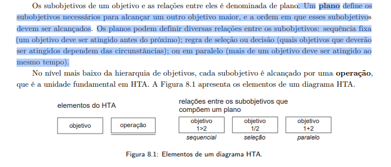
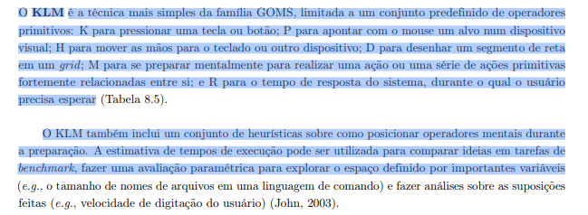
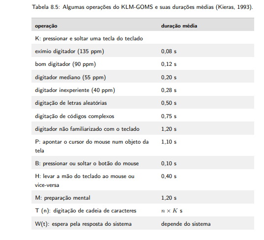

# Lista de verificação da Entrega 2 do grupo 1

### Link da reunião de verificação: [Video](https://youtu.be/I-vq7Q_5CT4)

**Fase:** Análise de Requisitos (Perfil do usuário, Aspectos Éticos de Pesquisas Envolvendo Pessoas e Análise de tarefas)

| Nº | Categoria | Pergunta | Resposta | Observações | Autor do item |
|----|-----------|----------|----------|-------------|---------------|
| 1 | **Itens do Desenvolvimento do projeto** |O GitHub Pages possui todos os  11 itens de Desenvolvimento do projeto [PRINT]   devidamente preenchidos e atualizados? | Incompleto | Não tem cronograma executável, não tem os componentes do cronograma, atas encontram-se completas, possuem autores porém faltam revisores, referências da entrega 1 estão ok, falta introdução nas tecnicas de elicitação, não tem video de apresentação, não tem tabela de contribuição. | André Barros de Sales (Professor) |
| 2 | **Item do conteúdo da disciplina** | Cada integrante da equipe elaborou ao menos 1 item de conteúdo da disciplina com referência bibliográfica da fonte e foto do texto da referência? | Sim | - | André Barros de Sales (Professor) |
| 3 | **Item do conteúdo da disciplina** | O perfil do usuário é definido por mais de uma forma (técnica de elicitação e/ou ferramenta)? | Sim | - | André Barros de Sales (Professor) |
| 4 | **Item do conteúdo da disciplina** | O perfil do usuário possui os atributos de um perfil? (Ex: dados demográficos, experiência no cargo, informações sobre a empresa, educação, facilidade com textos complexos, etc). | Incompleto | Não possuem dados demográficos, experiência no cargo e informações sobre a empresa. O usuario secundario fugiu do padrão. | André Barros de Sales (Professor) |
| 5 | **Item do conteúdo da disciplina** | Aspectos Éticos: O Termo de Consentimento Livre e Esclarecido (TCLE) foi devidamente apresentado e anexado nas pesquisas envolvendo pessoas? | Sim | - | André Barros de Sales (Professor) |
| 6 | **Item do conteúdo da disciplina** | Os 4 princípios (da autonomia, da beneficência, princípio da não maleficência e da justiça e equidade)? Adicionar referência bibliográfica da fonte e foto do texto da referência explicando aspectos éticos. | Não | Faltam a explicação dos Aspectos Eticos e referência bibliográfica. | André Barros de Sales (Professor) |
| 7 | **Item do conteúdo da disciplina** | O termo de consentimento livre e esclarecido dos participantes? Adicionar referência bibliográfica da fonte e foto do texto da referência explicando o TCLE. | Incompleto | Faltam a explicação dos Termo de Consentimento e referência bibliográfica. | André Barros de Sales (Professor) |
| 8 | **Item do conteúdo da disciplina** | Foram utilizadas no mínimo duas técnicas para coletar dados e levantar os requisitos dos usuários (quanto mais melhor)? Adicionar referência bibliográfica da fonte e foto do texto da referência explicando as técnicas para coletar dados. | Sim | - | André Barros de Sales (Professor) |
| 9 | **Item do conteúdo da disciplina** | Os Cenários? Adicionar referência bibliográfica da fonte e foto do texto da referência explicando os cenários. | Sim | - | André Barros de Sales (Professor) |
| 10 | **Item do conteúdo da disciplina** | Possui a Análise de tarefas? (Deve incluir referência bibliográfica da fonte, foto do texto da referência explicando a análise de tarefas e o nome do Autor). | Incompleto | Não possui refêrencia bibliográfica da fonte e nem imagem. | André Barros de Sales (Professor) |
| 11 | **Item do conteúdo da disciplina** | A Análise de tarefas? Adicionar referência bibliográfica da fonte e foto do texto da referência explicando a análise de tarefas. | Sim | - | André Barros de Sales (Professor) |
| 12 | **Item do conteúdo da disciplina** | Há uma atividade para cada integrante do grupo modelizada em ao menos duas técnicas para especificar as tarefas? (Ex: HTA com diagrama/legenda/tabela; e GOMS/KLM/CTT. Deve incluir ref. bibliográfica, foto do texto e Autor). | Sim | - | André Barros de Sales (Professor) |
| 13 | **Item do conteúdo da disciplina** | Uma atividade para cada integrante do grupos que deve estar modelizado em ao menos duas técnicas para especificar as tarefas? Adicionar referência bibliográfica da fonte e foto do texto da referência explicando as técnicas análise de tarefas. | Sim | - | André Barros de Sales (Professor) |
| 14 | **Item do conteúdo da disciplina** | Utilizaram alguma técnica para especificar as tarefas? | Sim | - | André Barros de Sales (Professor) |
| 15 | **Item do conteúdo da disciplina** | Utilizaram alguma técnica para especificar as tarefas? | Sim | - | André Barros de Sales (Professor) |
| 16 | **Item do conteúdo da disciplina** | Personas: Os dados levantados para o Perfil do Usuário foram sintetizados de forma clara em Personas, com objetivos e motivações definidas? | Incompleto | Faltam motivações. | A definir |
| 17 | **Item do conteúdo da disciplina** | Os diagramas da Análise Hierárquica de Tarefas (HTA) possuem os "planos" descritos de forma lógica (ex: 1 > 2 > 3), garantindo a sequência correta da operação?  (BARBOSA et al., 2021, p. 179) [PRINT]  | Incompleto | Os primeiros dois HTA's encontram-se sem operadores.| Hugo |
| 18 | **Item do conteúdo da disciplina** | Nas modelagens preditivas, os operadores (K, P, M, etc.) e os cálculos de tempo em segundos foram detalhados passo a passo para o cenário avaliado?  (BARBOSA et al., 2021, p. 181) [PRINT]    (BARBOSA et al., 2021, p. 183) [PRINT]   | Sim | - | Maria Laura |
| 19 | **Item do Desenvolvimento do projeto** | Rastreabilidade: As tarefas escolhidas para a modelagem correspondem diretamente às necessidades, dores ou ações principais mapeadas no Perfil do Usuário?  | Sim | - | Philipe |
| 20 | **Item do Desenvolvimento do projeto** | Apresentação Visual: A formatação visual do GitHub Pages do grupo facilita a leitura dos diagramas e a rápida identificação do autor responsável por cada modelagem? | Incompleto | Dois métodos de analise de tarefas não seguem a padronização de autores abaixo. | Nathan|
| 21 | **Item do conteúdo da disciplina** | Considera aspectos Éticos de Pesquisas Envolvendo Pessoas? Adicionar referência bibliográfica da fonte e foto do texto da referência explicando aspectos éticos.  (BARBOSA et al., 2021, p. 117) [PRINT]   | Não | Faltam a explicação dos aspectos éticos e referência bibliográfica. | Ingrid |
