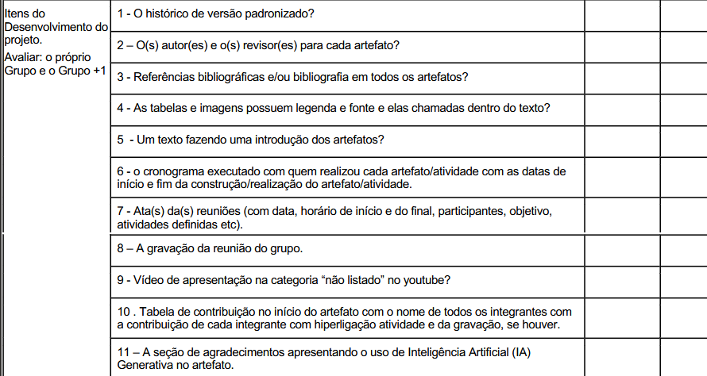

# Lista de verificação da Entrega 3 do grupo 01

### Link da reunião de verificação: [Video](https://youtu.be/I-vq7Q_5CT4)
**Fase:** Análise de Requisitos (Princípios Gerais de Projeto, Metas de usabilidade, Guia de Estilo)

| Nº | Categoria | Pergunta | Resposta | Observações | Autor do item |
|----|-----------|----------|----------|-------------|-----------------------------|
| 1 | Entrega 3 | O GitHub Pages possui todos os  11 itens de Desenvolvimento do projeto [PRINT]   devidamente preenchidos e atualizados? | Incompleto | Falta os revisores, uso de citação sem a referência bibliográfica (em características de plataforma e guia de estilo), usaram apenas bibliografia, alguns prints do livro estão quebrados, nem todas as figuras estão citadas no texto, existem imagens que usam "Referência" abaixo da imagem, ao invés de "Fonte", existem artefatos com a seção de conclusão presente e vazia, não existe o cronograma realizado, não possui ata/reunião da entrega 3, não possui vídeo da entrega, não possui agradecimentos de IA para cada artefato | André Barros de Sales (Professor) |
| 2 | Entrega 3 | As características da plataforma para o projeto foram claramente definidas e documentadas? | Sim | - | André Barros de Sales (Professor) |
| 3 | Entrega 3 | Os Princípios Gerais de Projeto que serão utilizados foram definidos? O artefato inclui a referência bibliográfica da fonte e a foto do texto original explicando esses princípios? | Incompleto | Faltam as fotos do texto original, além disso há uma citação de referência aput, na seção 1, sem a devida referência/especificação | André Barros de Sales (Professor) |
| 4 | Entrega 3 | Os Princípios Gerais contemplam todos os 8 tópicos exigidos (expectativas, simplicidade, controle/liberdade, consistência, antecipação, visibilidade, conteúdo e prevenção de erros)? O documento apresenta referência bibliográfica e foto do texto explicando esses tópicos? | Incompleto | Falta simplicidade, controle/liberdade e conteúdo | André Barros de Sales (Professor) |
| 5 | Entrega 3 | As metas de usabilidade que devem ser alcançadas (ou os objetivos da avaliação de IHC) estão bem definidas? Inclui referência bibliográfica e foto do texto base? | Incompleto | Falta citação e foto do texto em algumas seções | André Barros de Sales (Professor) |
| 6 | Entrega 3 | A equipe justificou adequadamente a razão para a seleção dessas metas de usabilidade específicas? | Incompleto | Explicam as metas em cada seção, mas não justificam explicitamente a escolha delas | André Barros de Sales (Professor) |
| 7 | Entrega 3 | O Guia de Estilo do projeto foi construído? O artefato contém referência bibliográfica da fonte e foto do texto acadêmico explicando o que é um Guia de Estilo? | Incompleto | Não há referência, apenas bibliografia | André Barros de Sales (Professor) |
| 8 | Entrega 3 | O Guia de Estilo segue rigorosamente a estrutura de 6 partes (1. Introdução, 2. Resultados de análise, 3. Elementos de interface, 4. Elementos de interação, 5. Elementos de ação, 6. Vocabulário e padrões)? Inclui referência e foto do texto original sobre essa estrutura? | Incompleto | Faltam elementos de interação e resultados da análise, também faltam referência e foto do texto original | André Barros de Sales (Professor) |
| 9 | Entrega 3 | As definições estabelecidas no Guia de Estilo correspondem de fato à realidade visual e interativa do site que está sendo avaliado? | Incompleto | Não há representação visual do guia de estilo, o que torna inviável verificar cada característica do site | André Barros de Sales (Professor) |
| 10 | Entrega 3 | o grupo identificou e justificou claramente quais princípios gerais de projeto  foram seguidos ou violados na interface avaliada?| Sim | Sugestão: colocar de forma mais explícita se segue/viola o princípio| Maria Laura Regis|
| 11 | Eentrega 3 | O documento de Metas de Usabilidade define quantitativamente as faixas de valores (inaceitáveis, aceitáveis e ideais) para cada indicador de qualidade priorizado no projeto? | Sim | -| Philipe Amâncio |
| 12 | Entrega 3 | O guia de estilo trata sobre todos os tópicos:  layout, tipografia, simbolismo, cores, visualização de informação, design de telas e elementos de interface? | Incompleto | Falta design de telas e visualização da interface | Hugo Freitas |
| 13 | Entrega 3 | Existe uma justificativa fundamentada na literatura para a escolha ou relevância de cada princípio no contexto do sistema analisado? | Incompleto | Não possui para todos | Ingrid Alves |
| 14 | Eentrega 3 | As metas de usabilidade tratam dos fatores de usabilidade de Nielsen: facilidade de aprendizado , facilidade de recordação , eficiência , segurança de uso  e satisfação do usuário?  | Sim | - | Nathan |